# Cloud Computing

## What is cloud computing?

Cloud computing is a model that allows users to access computing services, such as storage, servers, and software, remotely over the internet. Users can request and access these services on-demand, and scale up or down without needing to invest in physical hardware.

Cloud computing is a popular choice for businesses and individuals because it can help with:

* Cost savings: Users don't need to purchase and maintain equipment, or build data centers.

* Data mobility: Users can access their data from any device with an internet connection.

* Business continuity: Cloud computing can help with disaster recovery.

* Speed and agility: Developers can quickly provision resources and test new ideas.

* Environmental sustainability: Cloud computing can help promote environmental sustainability by maximizing resource utilization.

There are several types of cloud computing, including:

* **Public cloud**

A cloud service provider, such as AWS or Microsoft Azure, delivers computing resources over the internet.

* **Private cloud**

Computing resources are dedicated exclusively to an organization, and can be hosted by a cloud provider or located on-site.

* **Hybrid cloud**

A combination of private and public clouds, where sensitive services are kept in the private cloud and publicly-accessible services are kept in the public cloud.

Cloud computing relies on virtualization, which is the use of special software to abstract IT infrastructure. This allows cloud providers to make maximum use of their data center resources.

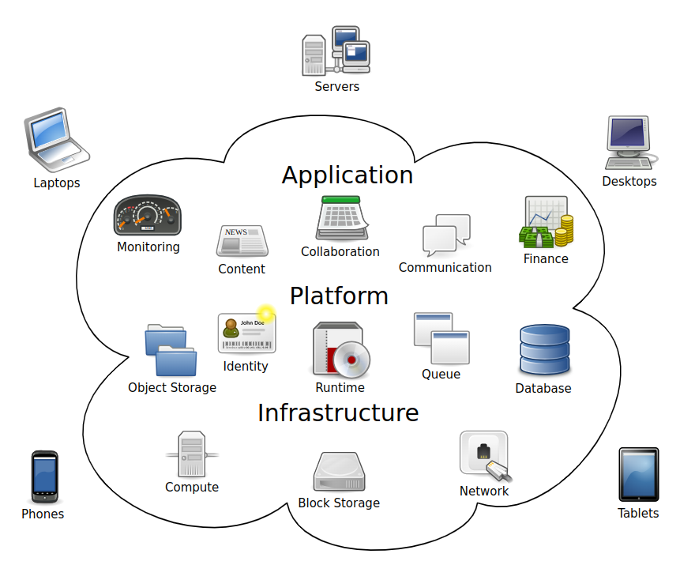

## History

**1960s**

The history of cloud computing extends back to the 1960s, with the initial concepts of time-sharing becoming popularized via remote job entry (RJE). The "data center" model, where users submitted jobs to operators to run on mainframes, was predominantly used during this era. This was a time of exploration and experimentation with ways to make large-scale computing power available to more users through time-sharing, optimizing the infrastructure, platform, and applications, and increasing efficiency for end users.

**1990s**

The "cloud" metaphor for virtualized services dates to 1994, when it was used by `General Magic` for the universe of "places" that mobile agents in the Telescript environment could "go". The metaphor is credited to `David Hoffman`, a General Magic communications specialist, based on its long-standing use in networking and telecom. The expression cloud computing became more widely known in 1996 when `Compaq Computer Corporation` drew up a business plan for future computing and the Internet. The company's ambition was to supercharge sales with "cloud computing-enabled applications". The business plan foresaw that online consumer file storage would likely be commercially successful. As a result, Compaq decided to sell server hardware to internet service providers.

**2000s**

In the 2000s, the application of cloud computing began to take shape with the establishment of `Amazon Web Services (AWS)` in 2002, which allowed developers to build applications independently. In 2006 Amazon Simple Storage Service, known as Amazon S3, and the `Amazon Elastic Compute Cloud (EC2)` were released. In 2008 NASA's development of the first open-source software for deploying private and hybrid clouds.

* 2010, Microsoft launched Microsoft Azure, and Rackspace Hosting and,

* NASA initiated an open-source cloud-software project, OpenStack.

* IBM introduced the IBM SmartCloud framework in 2011, and,

* Oracle announced the Oracle Cloud in 2012. 

& In December 2019, Amazon launched AWS Outposts, a service that extends AWS infrastructure, services, APIs, and tools to customer data centers, co-location spaces, or on-premises facilities.

## Challenges and limitations

* **Security**

Cloud users entrust their sensitive data to third-party providers, who may not have adequate measures to protect it from unauthorized access, breaches, or leaks. Cloud users also face compliance risks if they have to adhere to certain regulations or standards regarding data protection, such as GDPR or HIPAA.

* **Cloud migration challenges**

* **Cloud cost overruns**

* **Service Level Agreements**

Typically, cloud providers' Service Level Agreements (SLAs) do not encompass all forms of service interruptions. Exclusions typically include planned maintenance, downtime resulting from external factors such as network issues, human errors, like misconfigurations, natural disasters, force majeure events, or security breaches. Typically, customers bear the responsibility of monitoring SLA compliance and must file claims for any unmet SLAs within a designated timeframe.

* **Leaky abstractions**

Cloud computing abstractions aim to simplify resource management, but leaky abstractions can expose underlying complexities. These variations in abstraction quality depend on the cloud vendor, service and architecture. Mitigating leaky abstractions requires users to understand the implementation details and limitations of the cloud services they utilize.

* **Service lock-in within the same vendor**

Service lock-in within the same vendor occurs when a customer becomes dependent on specific services within a cloud vendor, making it challenging to switch to alternative services within the same vendor when their needs change.

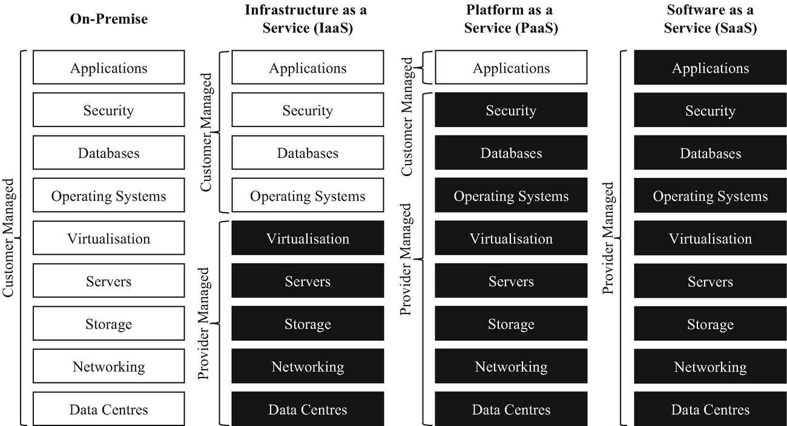

The `National Institute of Standards and Technolog`y recognized three cloud service models in 2011: Infrastructure as a Service (IaaS), Platform as a Service (PaaS), and Software as a Service (SaaS). The `International Organization for Standardization` (ISO) later identified additional models in 2023, including "Network as a Service", "Communications as a Service", "Compute as a Service", and "Data Storage as a Service".

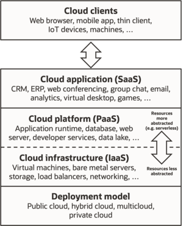

**Software as a service (SaaS)**

The NIST's definition of cloud computing defines Software as a Service as:

The capability provided to the consumer is to use the provider's applications running on a cloud infrastructure. The applications are accessible from various client devices through either a thin client interface, such as a web browser (e.g., web-based email), or a program interface. The consumer does not manage or control the underlying cloud infrastructure including network, servers, operating systems, storage, or even individual application capabilities, with the possible exception of limited user-specific application configuration settings.

In the software as a service (SaaS) model, users gain access to `application software` and `databases`. Cloud providers manage the infrastructure and platforms that run the applications. SaaS is sometimes referred to as "on-demand software" and is usually priced on a pay-per-use basis or using a subscription fee. In the SaaS model, cloud providers install and operate application software in the cloud and cloud users access the software from cloud clients. Cloud users do not manage the cloud infrastructure and platform where the application runs. This eliminates the need to install and run the application on the cloud user's own computers, which simplifies maintenance and support. Cloud applications differ from other applications in their scalability—which can be achieved by cloning tasks onto multiple virtual machines at run-time to meet changing work demand. `Load balancers` distribute the work over the set of virtual machines. This process is transparent to the cloud user, who sees only a single access-point. To accommodate a large number of cloud users, cloud applications can be multitenant, meaning that any machine may serve more than one cloud-user organization.

The pricing model for SaaS applications is typically a monthly or yearly flat fee per user, so prices become scalable and adjustable if users are added or removed at any point. It may also be free. Proponents claim that SaaS gives a business the potential to reduce IT operational costs by outsourcing hardware and software maintenance and support to the cloud provider. This enables the business to reallocate IT operations costs away from hardware/software spending and from personnel expenses, towards meeting other goals. In addition, with applications hosted centrally, updates can be released without the need for users to install new software. One drawback of SaaS comes with storing the users' data on the cloud provider's server. As a result,[citation needed] there could be unauthorized access to the data. Examples of applications offered as SaaS are games and productivity software like Google Docs and Office Online. SaaS applications may be integrated with cloud storage or File hosting services, which is the case with Google Docs being integrated with Google Drive, and Office Online being integrated with OneDrive.

**Platform as a service (PaaS)**

The NIST's definition of cloud computing defines Platform as a Service as:

The capability provided to the consumer is to deploy onto the cloud infrastructure consumer-created or acquired applications created using `programming languages`, `libraries`, `services`, and `tools` supported by the provider. The consumer does not manage or control the underlying cloud infrastructure including network, servers, operating systems, or storage, but has control over the deployed applications and possibly configuration settings for the application-hosting environment.

PaaS vendors offer a development environment to application developers. The provider typically develops toolkit and standards for development and channels for distribution and payment. In the PaaS models, cloud providers deliver a computing platform, typically including an operating system, programming-language execution environment, database, and the web server. Application developers develop and run their software on a cloud platform instead of directly buying and managing the underlying hardware and software layers. With some PaaS, the underlying computer and storage resources scale automatically to match application demand so that the cloud user does not have to allocate resources manually.

Some integration and data management providers also use specialized applications of PaaS as delivery models for data. Examples include iPaaS (Integration Platform as a Service) and dPaaS (Data Platform as a Service). iPaaS enables customers to develop, execute and govern integration flows. Under the iPaaS integration model, customers drive the development and deployment of integrations without installing or managing any hardware or middleware.dPaaS delivers integration—and data-management—products as a fully managed service. Under the dPaaS model, the PaaS provider, not the customer, manages the development and execution of programs by building data applications for the customer. dPaaS users access data through data-visualization tools.

**Infrastructure as a service (IaaS)**

Infrastructure as a service (IaaS) refers to online services that provide high-level APIs used to abstract various low-level details of underlying network infrastructure like physical computing resources, location, data partitioning, scaling, security, backup, etc. A hypervisor runs the virtual machines as guests. Pools of hypervisors within the cloud operational system can support large numbers of virtual machines and the ability to scale services up and down according to customers' varying requirements. Linux containers run in isolated partitions of a single Linux kernel running directly on the physical hardware. Linux cgroups and namespaces are the underlying Linux kernel technologies used to isolate, secure and manage the containers. The use of containers offers higher performance than virtualization because there is no hypervisor overhead. IaaS clouds often offer additional resources such as a virtual-machine disk-image library, raw block storage, file or object storage, firewalls, load balancers, IP addresses, virtual local area networks (VLANs), and software bundles.

>Further information: CloudBioLinux

The NIST's definition of cloud computing describes IaaS as "where the consumer is able to deploy and run arbitrary software, which can include operating systems and applications. The consumer does not manage or control the underlying cloud infrastructure but has control over operating systems, storage, and deployed applications; and possibly limited control of select networking components (e.g., host firewalls)."

IaaS-cloud providers supply these resources on-demand from their large pools of equipment installed in data centers. For wide-area connectivity, customers can use either the Internet or carrier clouds (dedicated virtual private networks). To deploy their applications, cloud users install operating-system images and their application software on the cloud infrastructure. In this model, the cloud user patches and maintains the operating systems and the application software. Cloud providers typically bill IaaS services on a utility computing basis: cost reflects the number of resources allocated and consumed.

## Cloud Market Shares

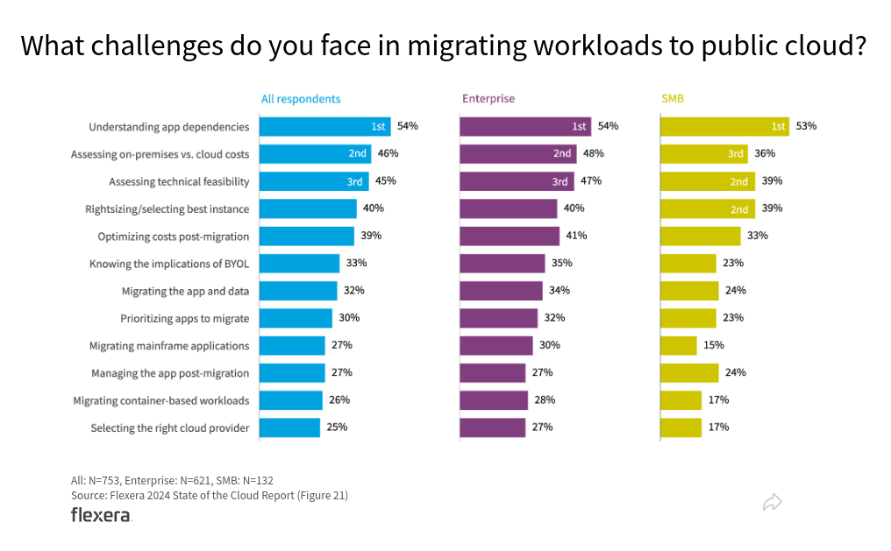

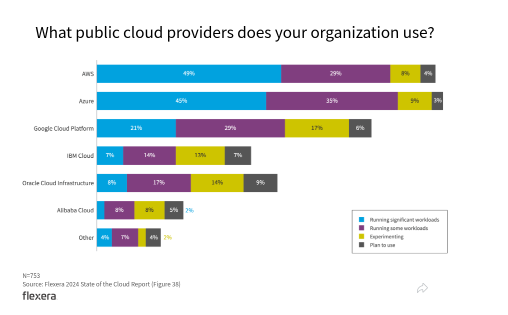

## Main Cloud Service Providers

* AWS (amazon)
* GCP (google)
* Azure (microsoft)

### AWS (Amazon Web Services)

**AWS Products**

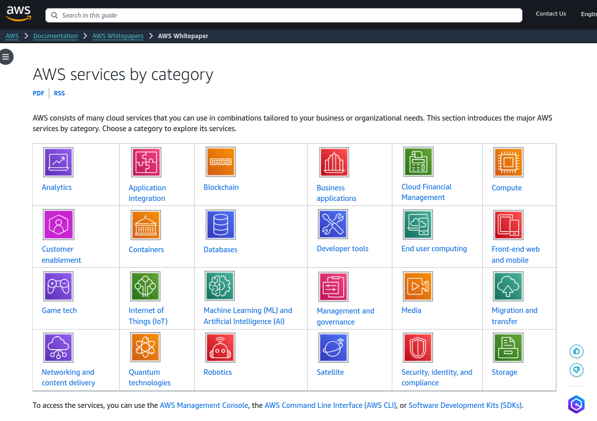

[AWS products overview](https://docs.aws.amazon.com/whitepapers/latest/aws-overview/amazon-web-services-cloud-platform.html)

**AWS Compute**

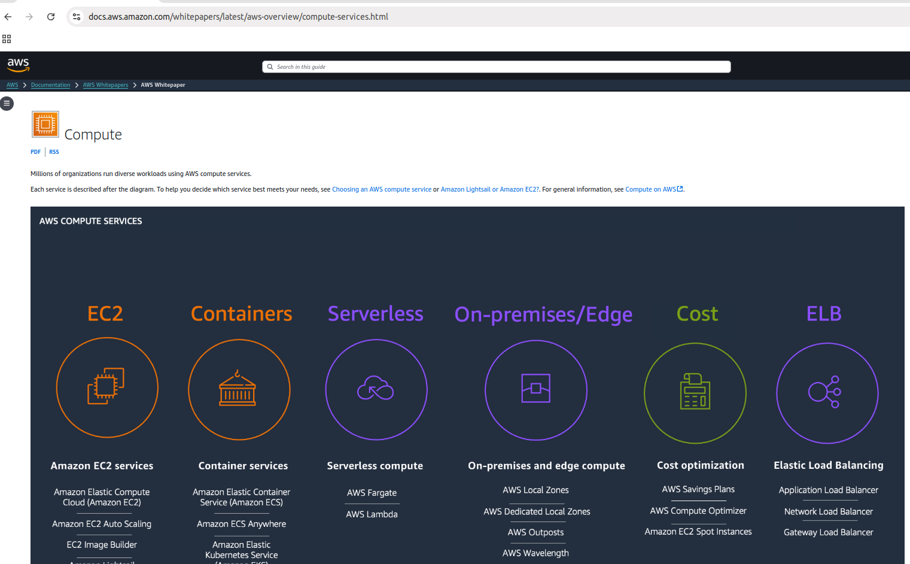

>Hint: If you would like to start learning, you should create an AWS account, and start from the following topics,

**AWS Database (RDS service)**

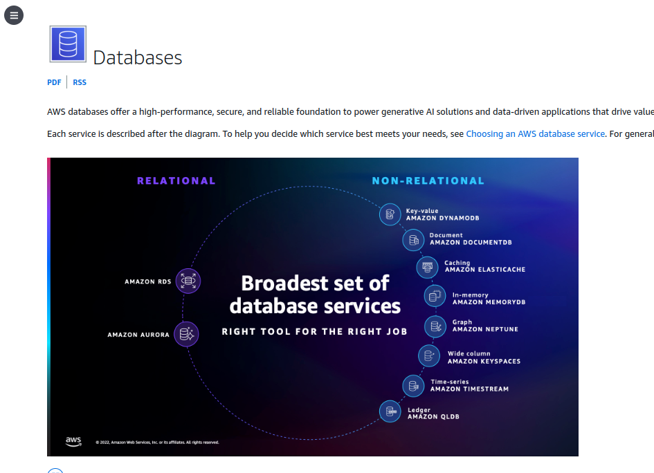

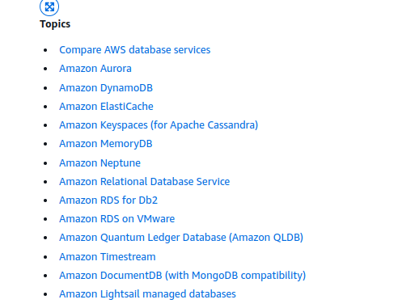

[AWS RDS] (https://docs.aws.amazon.com/whitepapers/latest/aws-overview/database.html)

**Become AWS Certified**

The tyeps of certs,

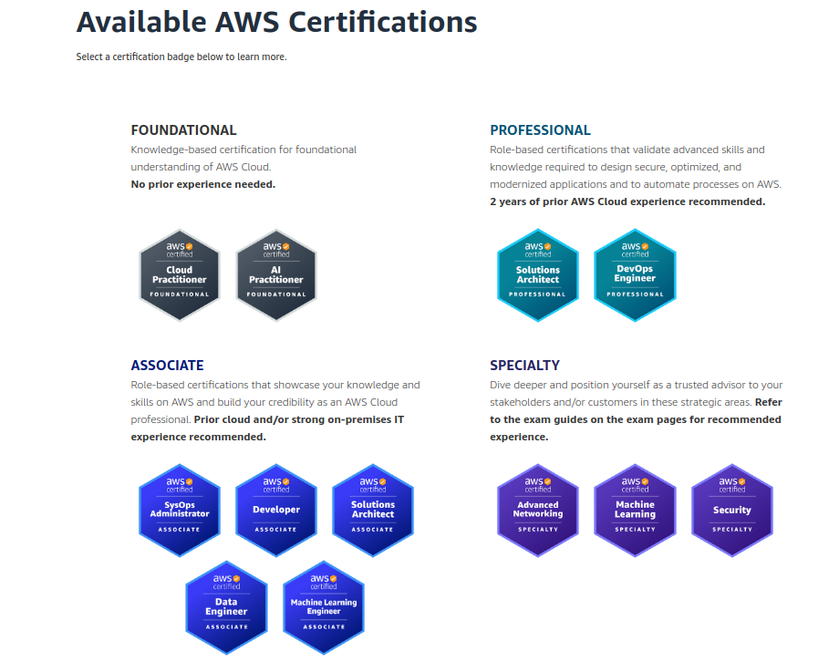

>Hint: If you should start with AWS, and GCP certs, but I would start with AWS first. You could directly go for professional and specialty.

[AWS Certification](https://aws.amazon.com/certification/?gclid=Cj0KCQiAvP-6BhDyARIsAJ3uv7YeD90ruTbzEddNHeMmP5uWqwz2qHxQ9hp4OTUtOO6-Jy-Zfmw2YmoaAjT4EALw_wcB&trk=1d3789b7-cdfb-4b92-a125-75424f21eaaf&sc_channel=ps&ef_id=Cj0KCQiAvP-6BhDyARIsAJ3uv7YeD90ruTbzEddNHeMmP5uWqwz2qHxQ9hp4OTUtOO6-Jy-Zfmw2YmoaAjT4EALw_wcB:G:s&s_kwcid=AL!4422!3!616960529276!e!!g!!aws%20certifications!11120345480!105898020221)

## GCP (Google Cloud Platform)

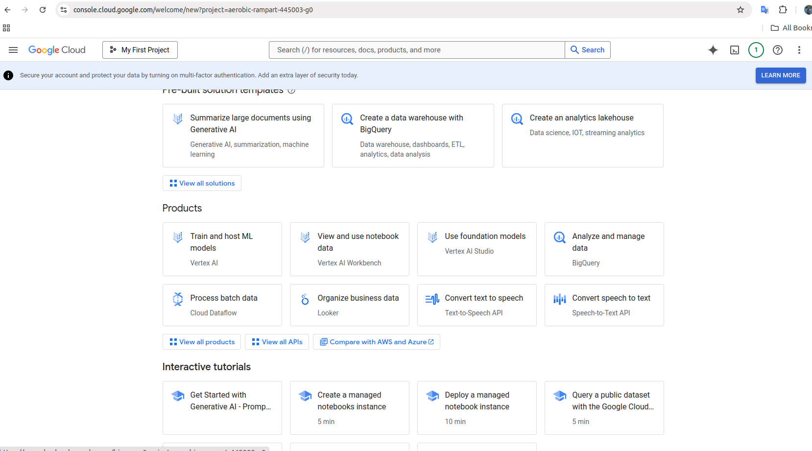

GCP is a self-contained platform with abundant training tutorials,

More systematic tutorials,

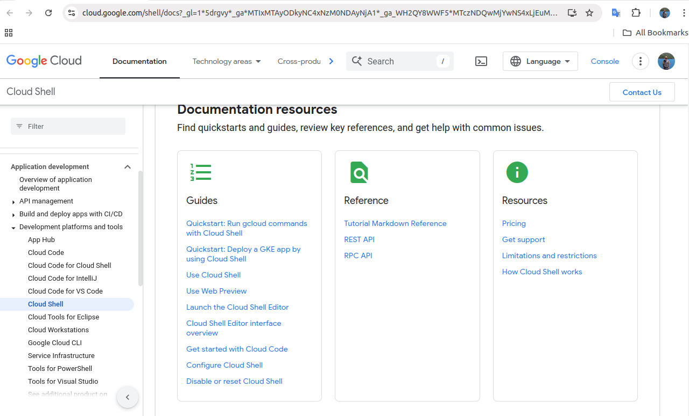

AI backed tools,

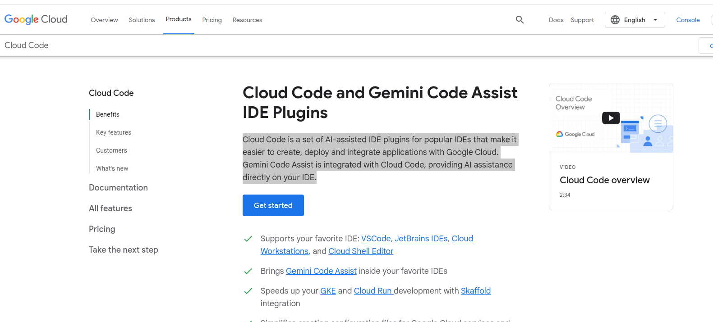

**Google Kubernetes Engine (GKE) cluster.**

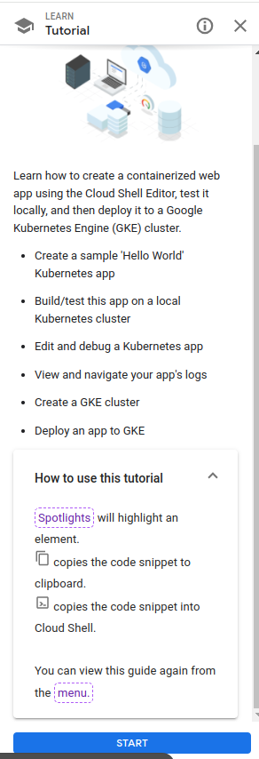

**GCP Certifications**

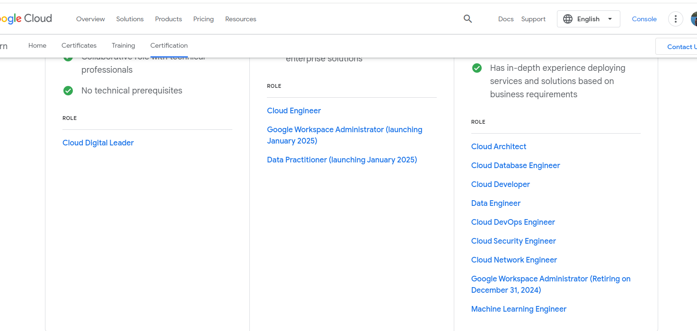

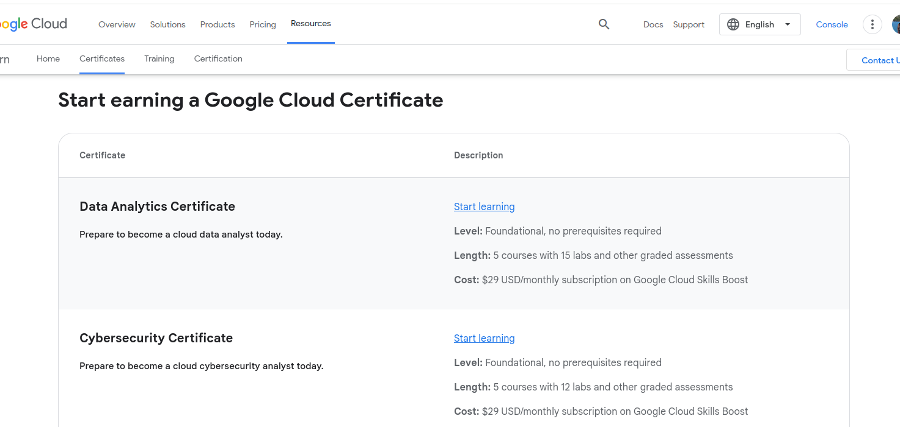

[GCP Traiing and Certifications](https://cloud.google.com/learn/certification/?hl=en#why-get-google-cloud-certified)

## Microsoft Azure

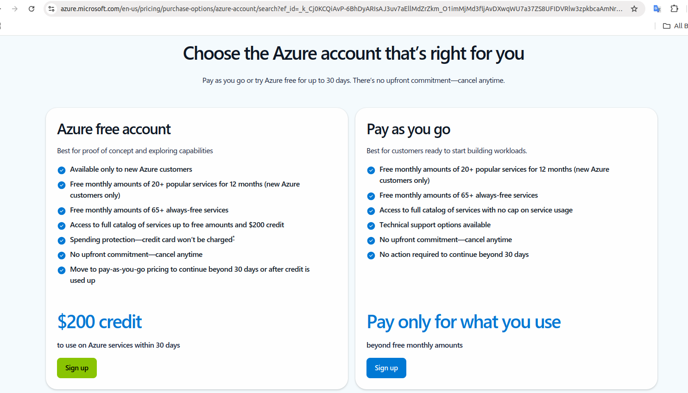

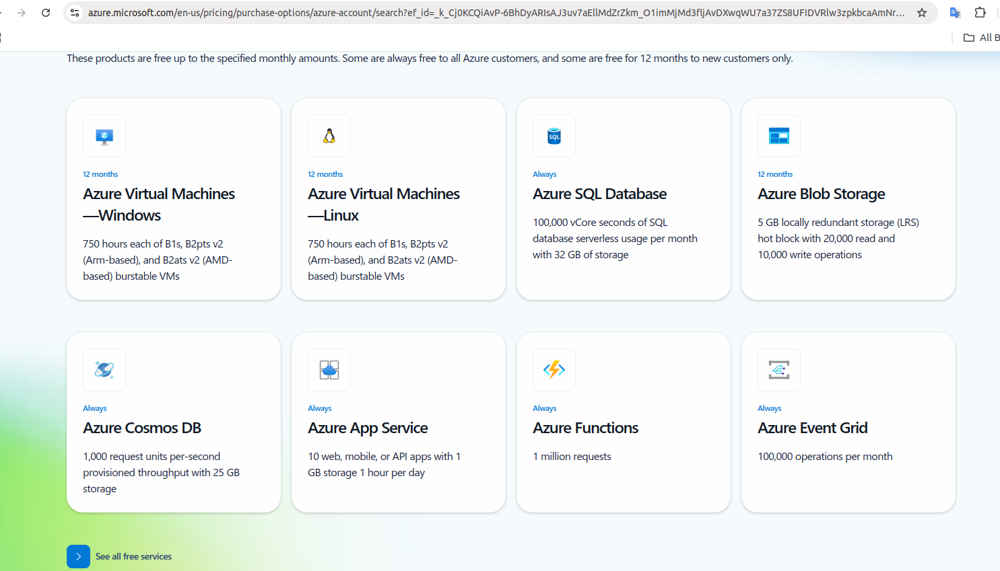

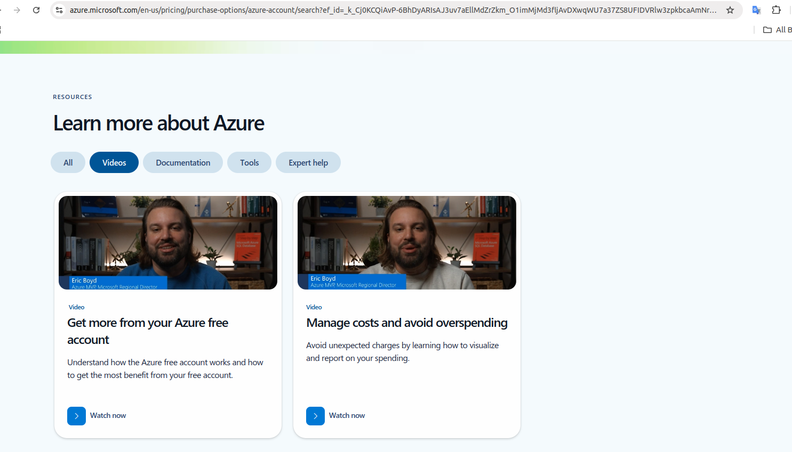

## Ref

- https://en.wikipedia.org/wiki/Cloud_computing

- https://info.flexera.com/CM-REPORT-State-of-the-Cloud?utm_source=google&utm_medium=PPC&utm_content=finops_cloud_computing&lead_source=PPC&cq_cmp=21430958132&cq_term=cloud%20computing%20services&cq_plac=&cq_net=g&cq_plt=gp&gad_source=1&gclid=Cj0KCQiAvP-6BhDyARIsAJ3uv7ZMgkS7alBPXcBJ7KPWbh0m-HoXRFA79er3WOmPOtsEIrDDMQB3LRsaAnDVEALw_wcB