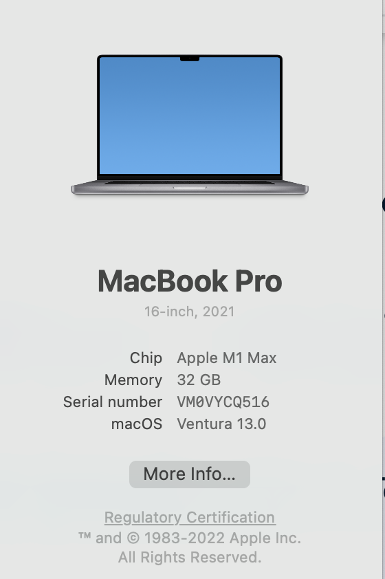
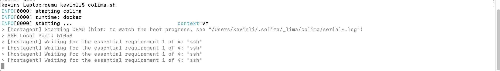
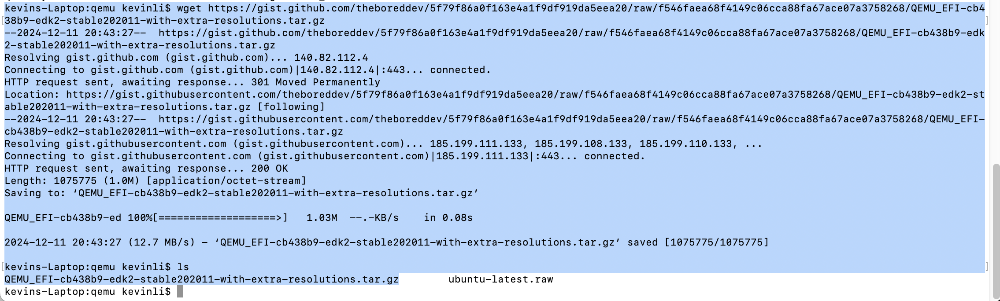

# CPU Virtualization Basics

CPU virtualization emphasizes performance and runs directly on the processor whenever possible. The underlying physical resources are used whenever possible and the virtualization layer runs instructions only as needed to make virtual machines operate as if they were running directly on a physical machine.

CPU virtualization is not the same thing as emulation. ESXi does not use emulation to run virtual CPUs. With emulation, all operations are run in software by an emulator. A software emulator allows programs to run on a computer system other than the one for which they were originally written. The emulator does this by emulating, or reproducing, the original computer’s behavior by accepting the same data or inputs and achieving the same results. Emulation provides portability and runs software designed for one platform across several platforms.

When CPU resources are overcommitted, the ESXi host time-slices the physical processors across all virtual machines so each virtual machine runs as if it has its specified number of virtual processors. When an ESXi host runs multiple virtual machines, it allocates to each virtual machine a share of the physical resources. With the default resource allocation settings, all virtual machines associated with the same host receive an equal share of CPU per virtual CPU. This means that a single-processor virtual machines is assigned only half of the resources of a dual-processor virtual machine.

* Software-Based CPU Virtualization

With software-based CPU virtualization, the guest application code runs directly on the processor, while the guest privileged code is translated and the translated code runs on the processor.

The translated code is slightly larger and usually runs more slowly than the native version. As a result, guest applications, which have a small privileged code component, run with speeds very close to native. Applications with a significant privileged code component, such as system calls, traps, or page table updates can run slower in the virtualized environment.

* Hardware-Assisted CPU Virtualization

Certain processors provide hardware assistance for CPU virtualization.

When using this assistance, the guest can use a separate mode of execution called guest mode. The guest code, whether application code or privileged code, runs in the guest mode. On certain events, the processor exits out of guest mode and enters root mode. The hypervisor executes in the root mode, determines the reason for the exit, takes any required actions, and restarts the guest in guest mode.

When you use hardware assistance for virtualization, there is no need to translate the code. As a result, system calls or trap-intensive workloads run very close to native speed. Some workloads, such as those involving updates to page tables, lead to a large number of exits from guest mode to root mode. Depending on the number of such exits and total time spent in exits, hardware-assisted CPU virtualization can speed up execution significantly.

* Virtualization and Processor-Specific Behavior

Although VMware software virtualizes the CPU, the virtual machine detects the specific model of the processor on which it is running.

Processor models might differ in the CPU features they offer, and applications running in the virtual machine can make use of these features. Therefore, it is not possible to use vMotion® to migrate virtual machines between systems running on processors with different feature sets. You can avoid this restriction, in some cases, by using Enhanced vMotion Compatibility (EVC) with processors that support this feature. See the vCenter Server and Host Management documentation for more information.

* Performance Implications of CPU Virtualization

CPU virtualization adds varying amounts of overhead depending on the workload and the type of virtualization used.

An application is CPU-bound if it spends most of its time executing instructions rather than waiting for external events such as user interaction, device input, or data retrieval. For such applications, the CPU virtualization overhead includes the additional instructions that must be executed. This overhead takes CPU processing time that the application itself can use. CPU virtualization overhead usually translates into a reduction in overall performance.

For applications that are not CPU-bound, CPU virtualization likely translates into an increase in CPU use. If spare CPU capacity is available to absorb the overhead, it can still deliver comparable performance in terms of overall throughput.

ESXi supports up to 128 virtual processors (CPUs) for each virtual machine.

## QEMU

QEMU (Quick Emulator) is a free and open source emulator that uses dynamic binary translation to emulate the processor of a computer. It provides a variety of hardware and device models for the virtual machine, enabling it to run different guest operating systems. QEMU can be used in conjunction with a Kernel-based Virtual Machine (KVM) to emulate hardware at near-native speeds. Additionally, it supports user-level processes, allowing applications compiled for one processor architecture to run on another.

QEMU supports the emulation of x86, ARM, PowerPC, RISC-V, and other architectures.

**Licensing**

QEMU is free software developed by Fabrice Bellard. Different components of QEMU are licensed under the GNU General Public License (GPL), BSD license, GNU Lesser General Public License (LGPL), or other GPL-compatible licenses.

**Operating modes**

QEMU has multiple operating modes:

* User-mode emulation. In the user emulation mode, QEMU runs single Linux or Darwin/macOS programs that were compiled for a different instruction set. System calls are thunked for endianness and for 32/64 bit mismatches. Fast cross-compilation and cross-debugging are the main targets for user-mode emulation.

* System emulation. In the system emulation mode, QEMU emulates a full computer system, including peripherals. It can be used to provide virtual hosting of several virtual computers on a single computer. QEMU can boot many guest operating systems, including Linux, Solaris, Microsoft Windows, DOS, and BSD; it supports emulating several instruction sets, including x86, x86-64, MIPS, ARMv7, ARMv8, PowerPC, RISC-V, SPARC, ETRAX CRIS and MicroBlaze.

* Hypervisor support. In the hypervisor support mode, QEMU either acts as a Virtual Machine Manager (VMM) or as a device emulation back-end for virtual machines running under a hypervisor. The most common is Linux's KVM but the project supports a number of hypervisors including Xen, Apple's HVF, Windows' WHPX, and NetBSD's NVMM.


## Colima - Container runtimes on macOS (and Linux) with minimal setup

https://github.com/abiosoft/colima

In M chip apple, you will need to run colima first, because a lot of softwares are not working with M chip Mac, but intel Mac seems to be fine.



```shell
#!/bin/bash
colima start --arch x86_64 --memory 4
```



## Lab1 - Install Qemu and explore it

https://www.qemu.org/download/

If you haven't already, install the QEMU package on your system. 

* Install QEMU

If you haven't already, install the QEMU package on your system. 

* For Mac,

`brew install qemu`

* For Windows,

https://www.qemu.org/download#:~:text=QEMU%20can%20be%20installed%20from,for%20it%2C%20whatever%20comes%20first.

* Download Ubuntu ISO:

Go to the Ubuntu website and download the desired version of Ubuntu as an ISO file. 

* Create an Empty Image

```shell
kevins-Laptop:~ kevinli$ mkdir qemu 
kevins-Laptop:~ kevinli$ qemu-img create -f raw  ~/qemu/ubuntu-latest.raw 40G
Formatting '/Users/kevinli/qemu/ubuntu-latest.raw', fmt=raw size=42949672960
kevins-Laptop:qemu kevinli$ ls -al
total 32
drwxr-xr-x   3 kevinli  staff           96 Dec 11 20:38 .
drwxr-x---+ 91 kevinli  staff         2912 Dec 11 20:38 ..
-rw-r--r--   1 kevinli  staff  42949672960 Dec 11 20:38 ubuntu-latest.raw
```

* Download pre-built EDK2 UEFI image for QEMU

`wget https://gist.github.com/theboreddev/5f79f86a0f163e4a1f9df919da5eea20/raw/f546faea68f4149c06cca88fa67ace07a3758268/QEMU_EFI-cb438b9-edk2-stable202011-with-extra-resolutions.tar.gz`

Move the tar.gz file to the ~/qemu,

`mv ~/Downloads/QEMU_EFI-*.tar.gz ~/qemu`

unarchive it,

`tar xzvf QEMU_EFI-*.tar.gz`



and you will see something like these,

```shell
kevins-Laptop:qemu kevinli$ ls
QEMU_EFI-cb438b9-edk2-stable202011-with-extra-resolutions.tar.gz	ubuntu-latest.raw
kevins-Laptop:qemu kevinli$ tar zxvf QEMU_EFI-cb438b9-edk2-stable202011-with-extra-resolutions.tar.gz 
x ./QEMU_EFI.fd
x ./QEMU_VARS.fd
```

* Create Ubuntu linux image with QEMU

```shell
qemu-system-aarch64 \
   -monitor stdio \
   -M virt,highmem=off \
   -accel hvf \
   -cpu host \
   -smp 4 \
   -m 3000 \
   -bios QEMU_EFI.fd \
   -device virtio-gpu-pci \
   -display default,show-cursor=on \
   -device qemu-xhci \
   -device usb-kbd \
   -device usb-tablet \
   -device intel-hda \
   -device hda-duplex \
   -drive file=ubuntu-latest.raw,format=raw,if=virtio,cache=writethrough \
   -cdrom /Users/kevinli/Downloads/ubuntu-24.04.1-live-server-amd64.iso
   ```

Once we execute the above commands, you can see something like the following,


* Start Ubuntu on QEMU

```shell
qemu-system-aarch64 \
   -monitor stdio \
   -M virt,highmem=off \
   -accel hvf \
   -cpu host \
   -smp 4 \
   -m 3000 \
   -bios QEMU_EFI.fd \
   -device virtio-gpu-pci \
   -display default,show-cursor=on \
   -device qemu-xhci \
   -device usb-kbd \
   -device usb-tablet \
   -device intel-hda \
   -device hda-duplex \
   -drive file=ubuntu-latest.raw,format=raw,if=virtio,cache=writethrough
   ````

#### Ref

- https://ubuntu.com/server/docs/virtualisation-with-qemu

- https://www.makeuseof.com/install-ubuntu-virtual-machine-with-qemu/

- https://theboreddev.com/run-ubuntu-on-mac-using-qemu/

## Lab2 - Colima

>Hint: Only avail in linux, mac. So you would need a virtual machien linux to install it.

https://github.com/abiosoft/colima

### Ref

- https://docs.vmware.com/en/VMware-vSphere/7.0/com.vmware.vsphere.resmgmt.doc/GUID-DFFA3A31-9EDD-4FD6-B65C-86E18644373E.html

- https://www.qemu.org/

- https://github.com/qemu/qemu

- https://en.wikipedia.org/wiki/QEMU