# Quantum Computer

* Quantum vs Classic Computer

Both uses chips and logic gates,

Classic computer relies on 0,1 for state, either 0 or 1. While quantum can have both used at the same time.

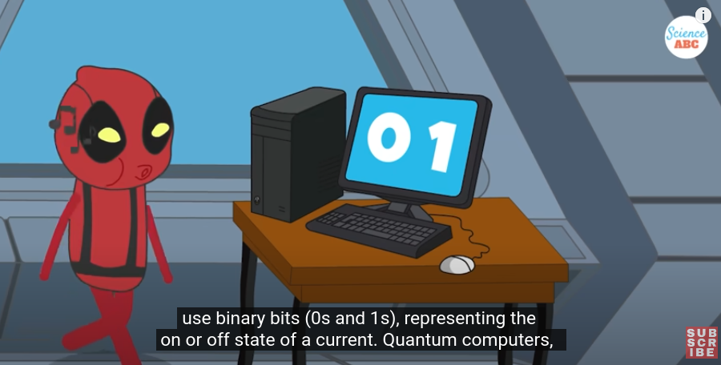

* Quibits

* Superposition

How this superposition is working?

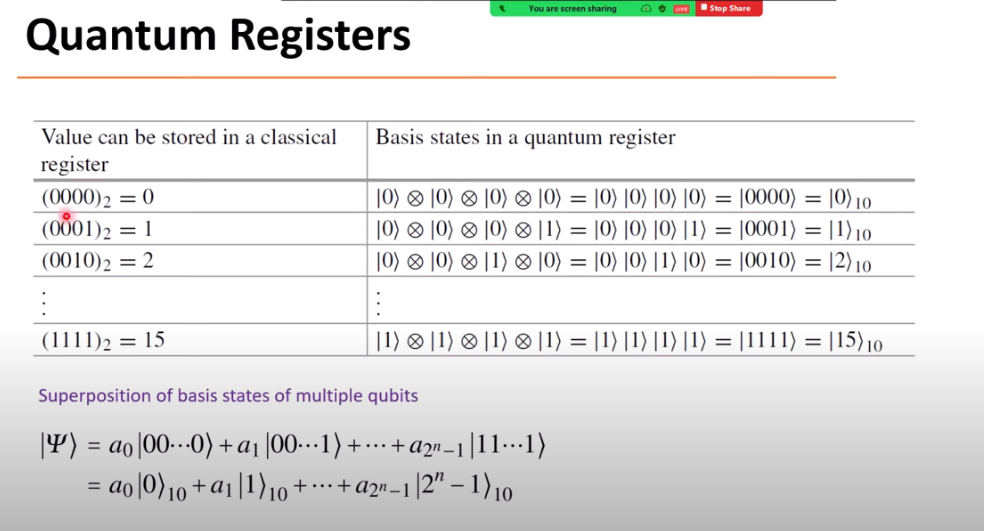

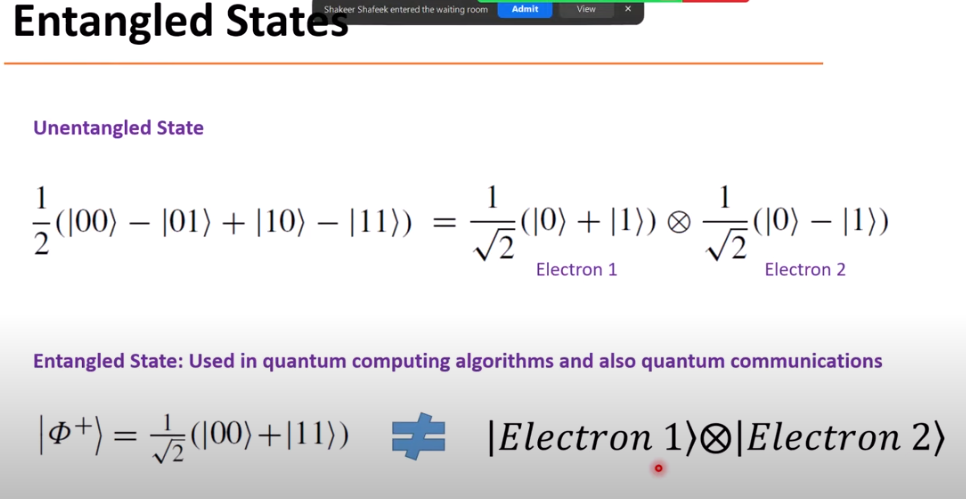

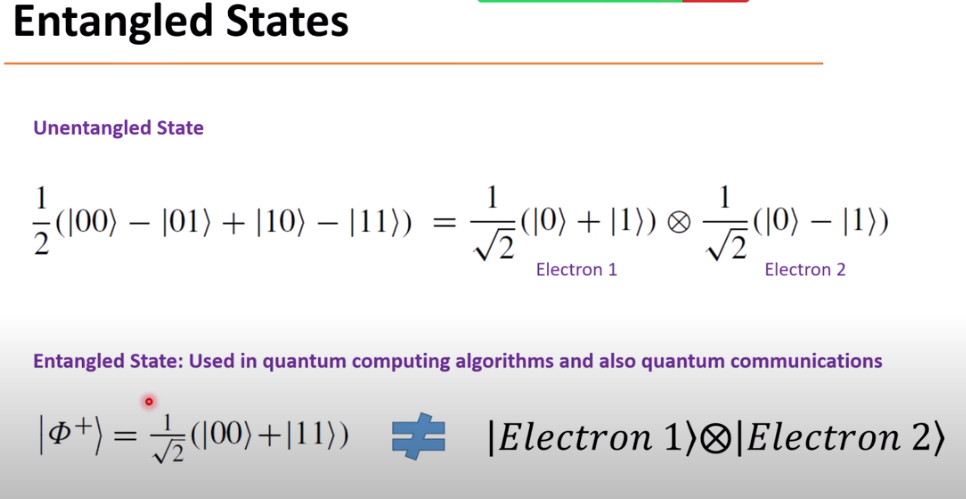

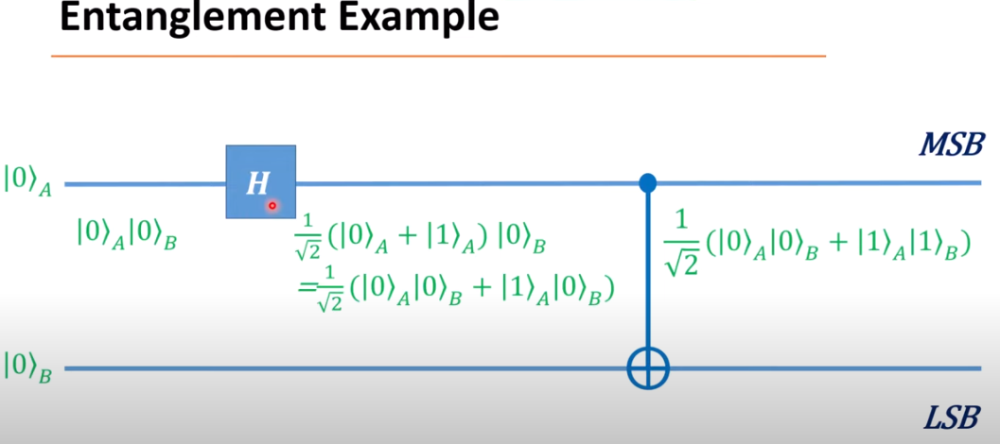

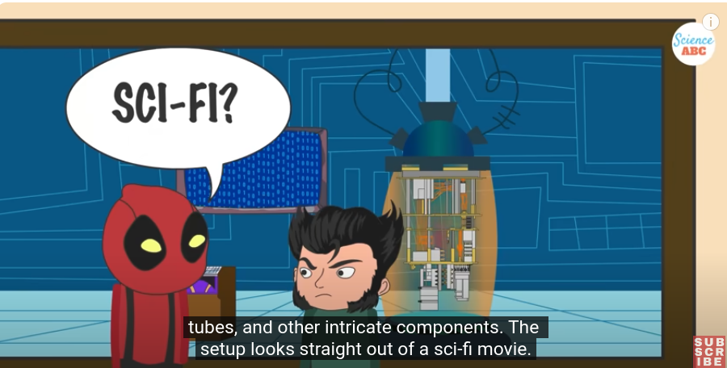

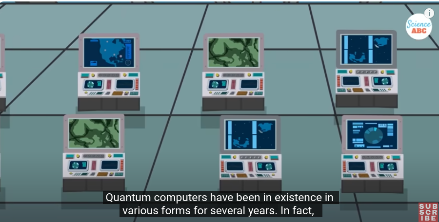

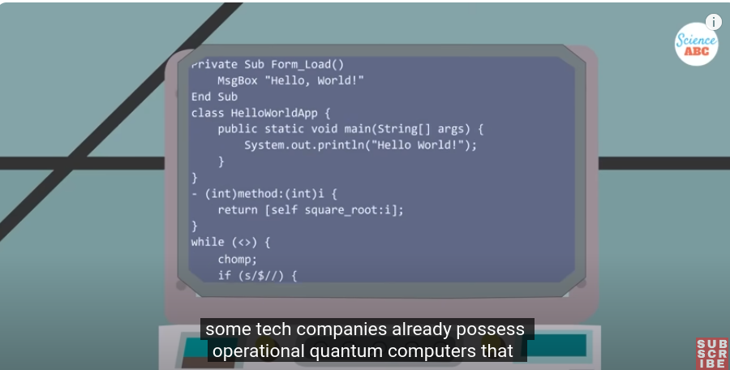

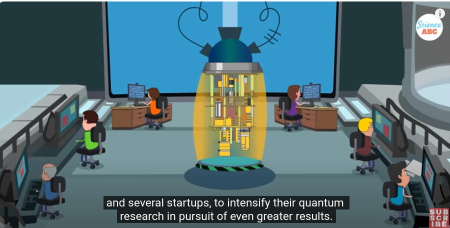

**Bloch sphere representation of a qubit**
 

## Quantum Entanglement (Quantum Mechanics)

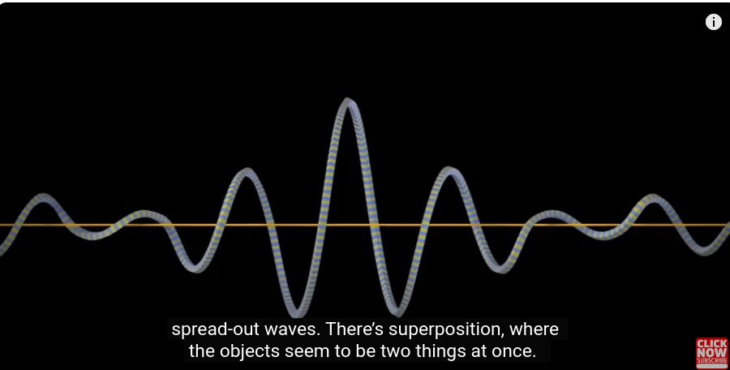

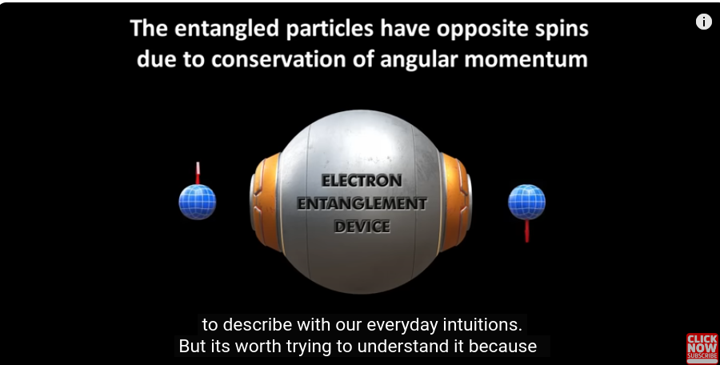

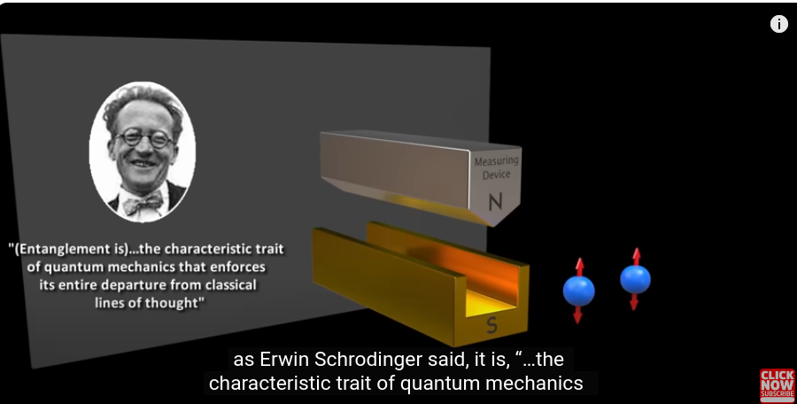

but we don't know which is up and which is down, but if we measure to know one is up , and the other is down,

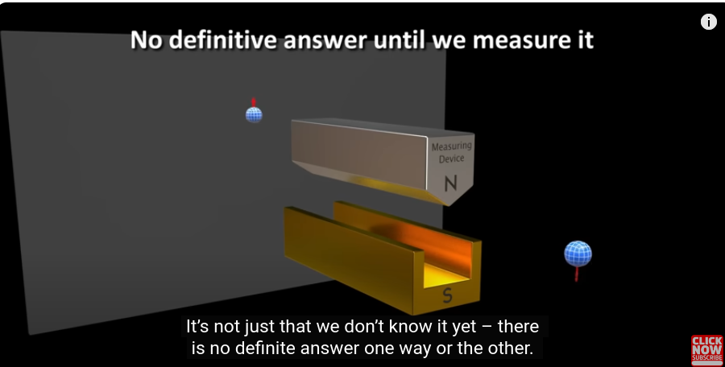

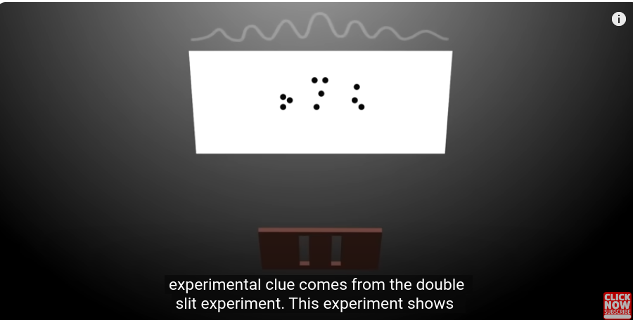

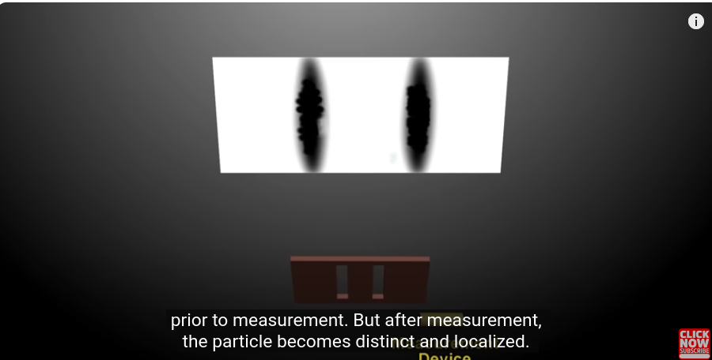

https://www.youtube.com/watch?v=B3U1NDUiwSA
https://www.youtube.com/watch?v=unb_yoj1Usk
https://en.wikipedia.org/wiki/Quantum_computing