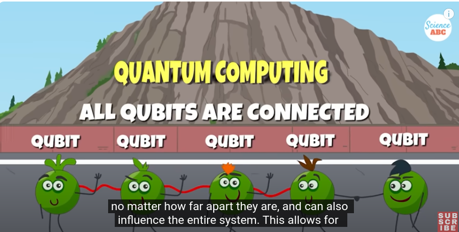
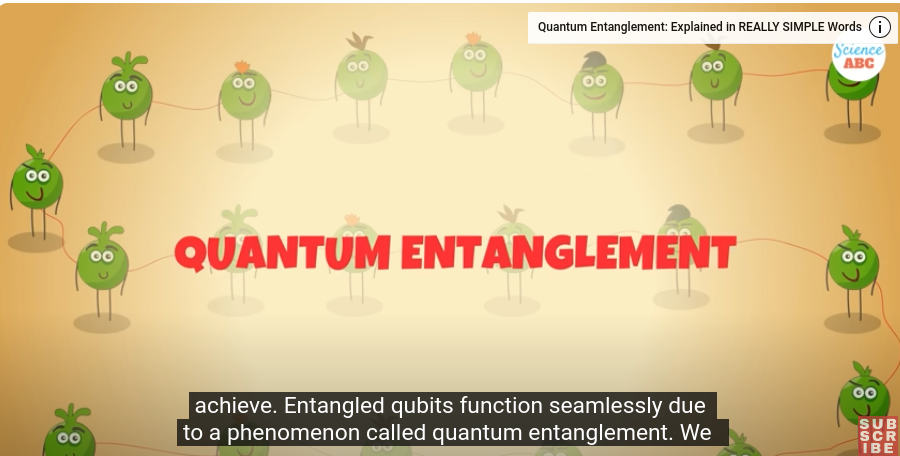
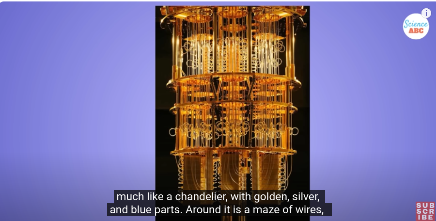
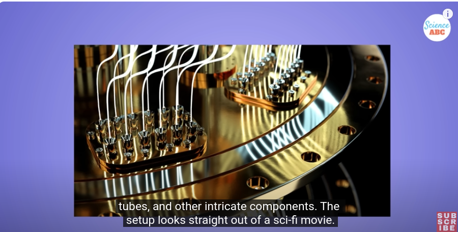
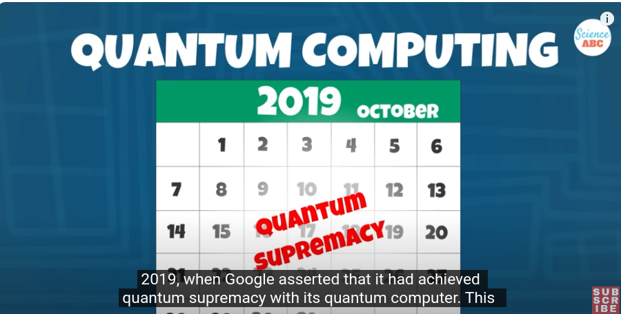

# Quantum Computer

## What is Quantum computing

* Quantum vs Classic Computer

Both uses chips and logic gates,

Classic computer relies on 0,1 for state, either 0 or 1. While quantum can have both used at the same time.

* Quibits

* Superposition

How this superposition is working?

* Quantum + Virtualization

* Google's quantum processor

**Companies are doing quantum research**

* Google
* Microsoft
* IBM
* China...

**Quantum Cloud**

* Private cloud
* public cloud, Virtual machines connect to the quantum server
* OS for the quantum computers
* Software for the quantum computers

**Bloch sphere representation of a qubit**

## Quantum Entanglement (Quantum Mechanics)

but we don't know which is up and which is down, but if we measure to know one is up , and the other is down,

https://www.youtube.com/watch?v=B3U1NDUiwSA
https://www.youtube.com/watch?v=unb_yoj1Usk
https://en.wikipedia.org/wiki/Quantum_computing