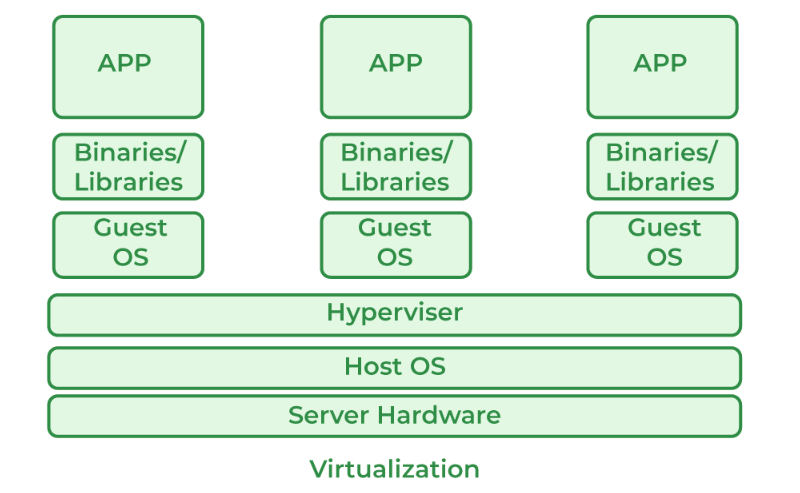

# Virtualization

## Part I Virtualization Today

## What is Virtualization?

Virtualization is technology that you can use to create **virtual representations** of servers, storage, networks, and other physical machines. Virtual software mimics the functions of physical hardware to run multiple virtual machines simultaneously on a single physical machine. Businesses use virtualization to use their hardware resources efficiently and get greater returns from their investment. It also powers cloud computing services that help organizations manage infrastructure more efficiently.

>Hint For example, in JP Morgan you have one desktop, it runs 1 `host operating system` on which runs 10 virtual operating systems, and we have 10 employees, and they were told to login to each machine with machine name, host1.jpmorganchase.com, host2.jpmorganchase.com..., host3.jpmorganchase.com. All you invested as a business is one `bare metal machine`, and 10 instances of `hypervisors`(a software emulator) to run operating systems.

## Why is virtualization important?

By using virtualization, you can interact with any hardware resource with greater flexibility. Physical servers consume electricity, take up storage space, and need maintenance. You are often limited by physical proximity and network design if you want to access them. Virtualization removes all these limitations by abstracting physical hardware functionality into software. You can manage, maintain, and use your hardware infrastructure like an application on the web.

**Virtualization example**

Consider a company that needs servers for three functions:

* Store business email securely
* Run a customer-facing application
* Run internal business applications

Each of these functions has different configuration requirements:

The email application requires more storage capacity and a Windows operating system.
The customer-facing application requires a Linux operating system and high processing power to handle large volumes of website traffic.

The internal business application requires iOS and more internal memory (RAM).
To meet these requirements, the company sets up three different dedicated physical servers for each application. The company must make a high initial investment and perform ongoing maintenance and upgrades for one machine at a time. The company also cannot optimize its computing capacity. It pays 100% of the servers’ maintenance costs but uses only a fraction of their storage and processing capacities.

**Efficient hardware use**

With virtualization, the company creates three digital servers, or virtual machines, on a single physical server. It specifies the operating system requirements for the virtual machines and can use them like the physical servers. However, the company now has less hardware and fewer related expenses.

**Infrastructure as a service**

The company can go one step further and use a cloud instance or virtual machine from a cloud computing provider such as AWS. AWS manages all the underlying hardware, and the company can request server resources with varying configurations. All the applications run on these virtual servers without the users noticing any difference. Server management also becomes easier for the company’s IT team.

>Hint: In banks and insurance companies, you can not plugin your USB drive to the remote desktop,and you can not checkout their source code into some other physical laptop and bring home or to the airports.

## What are the benefits of virtualization?

Virtualization provides several benefits to any organization:

**Efficient resource use**

Virtualization improves hardware resources used in your data center. For example, instead of running one server on one computer system, you can create a virtual server pool on the same computer system by using and returning servers to the pool as required. Having fewer underlying physical servers frees up space in your data center and saves money on electricity, generators, and cooling appliances. 

**Automated IT management**

Now that physical computers are virtual, you can manage them by using software tools. Administrators create deployment and configuration programs to define virtual machine templates. You can duplicate your infrastructure repeatedly and consistently and avoid error-prone manual configurations.

**Faster disaster recovery**

When events such as natural disasters or cyberattacks negatively affect business operations, regaining access to IT infrastructure and replacing or fixing a physical server can take hours or even days. By contrast, the process takes minutes with virtualized environments. This prompt response significantly improves resiliency and facilitates business continuity so that operations can continue as scheduled.

## What is virtualization?

To properly understand Kernel-based Virtual Machine (KVM), you first need to understand some basic concepts in virtualization. Virtualization is a process that allows a computer to share its hardware resources with multiple digitally separated environments. Each virtualized environment runs within its allocated resources, such as memory, processing power, and storage. With virtualization, organizations can switch between different operating systems on the same server without rebooting.

Virtual machines and hypervisors are two important concepts in virtualization.

**Virtual machine**

A virtual machine is a software-defined computer that runs on a physical computer with a separate operating system and computing resources. The physical computer is called the host machine and virtual machines are guest machines. Multiple virtual machines can run on a single physical machine. Virtual machines are abstracted from the computer hardware by a hypervisor.

**Hypervisor**

The hypervisor is a software component that manages multiple virtual machines in a computer. It ensures that each virtual machine gets the allocated resources and does not interfere with the operation of other virtual machines. There are two types of hypervisors.

* Type 1 hypervisor

A type 1 hypervisor, or bare-metal hypervisor, is a hypervisor program installed directly on the computer’s hardware instead of the operating system. Therefore, type 1 hypervisors have better performance and are commonly used by enterprise applications. KVM uses the type 1 hypervisor to host multiple virtual machines on the Linux operating system.

* Type 2 hypervisor

Also known as a hosted hypervisor, the type 2 hypervisor is installed on an operating system. Type 2 hypervisors are suitable for end-user computing.

## Types of virtualization (Summerized by IBM)

To this point we’ve discussed server virtualization, but many other IT infrastructure elements can be virtualized to deliver significant advantages to IT managers in particular and the enterprise as a whole. In this section, we cover the following types of virtualization:

* Desktop virtualization
* Network virtualization
* Storage virtualization
* Data virtualization
* Application virtualization
* Data center virtualization
* CPU virtualization
* GPU virtualization
* Linux virtualization
* Cloud virtualization

### Desktop virtualization

Desktop virtualization lets you run multiple desktop operating systems, each in its own VM on the same computer.

There are two types of desktop virtualization:

* **Virtual desktop infrastructure**

Virtual desktop infrastructure (VDI) runs multiple desktops in VMs on a central server and streams them to users who log in on thin client devices. In this way, VDI lets an organization provide its users access to a variety of OSs from any device, without installing them on any device.

* **Local desktop virtualization**

Local desktop virtualization runs a hypervisor on a local computer, enabling the user to run one or more additional OSs on that computer and switch from one OS to another as needed without changing anything about the primary OS.

For more information on virtual desktops, see “Desktop-as-a-Service (DaaS).”

### Network virtualization

Network virtualization uses software to create a “view” of the network that an administrator can use to manage the network from a single console. It abstracts hardware elements and functions (for example connections, switches and routers) and abstracts them into software running on a hypervisor. The network administrator can modify and control these elements without touching the underlying physical components, which dramatically simplifies network management.

Types of network virtualization include software-defined networking, which virtualizes hardware that controls network traffic routing, called the control plane. Another type is network function virtualization, which virtualizes one or more hardware appliances that provide a specific network function (for example a firewall, load balancer or traffic analyzer), making those appliances easier to configure, provision and manage.

### Storage virtualization

Storage virtualization enables all the storage devices on the network—whether they’re installed on individual servers or stand-alone storage units—to be accessed and managed as a single storage device. Specifically, storage virtualization masses all blocks of storage into a single shared pool from which they can be assigned to any VM on the network as needed. Storage virtualization makes it easier to provision storage for VMs and makes maximum use of all available storage on the network.

For a closer look at storage virtualization, check out "What is Cloud Storage?"

### Data virtualization

Modern enterprises store data from multiple applications, by using multiple file formats, in multiple locations, ranging from the cloud to on-premise hardware and software systems. Data virtualization lets any application access all of that data—irrespective of source, format or location.

Data virtualization tools create a software layer between the applications accessing the data and the systems storing it. The layer translates an application’s data request or query as needed and returns results that can span multiple systems. Data virtualization can help break down data silos when other types of integration aren’t feasible, desirable or affordable.

### Application virtualization

Application virtualization runs application software without installing it directly on the user’s OS. This differs from complete desktop virtualization because only the application runs in a virtual environment—the OS on the end user’s device runs as usual. There are three types of application virtualization:

- Local application virtualization: The entire application runs on the endpoint device but runs in a runtime environment instead of on the native hardware.

- Application streaming: The application lives on a server which sends small components of the software to run on the end user's device when needed.

- Server-based application virtualization The application runs entirely on a server that sends only its user interface to the client device.

### Data center virtualization

Data center virtualization abstracts most of a data center’s hardware into software, effectively enabling an administrator to divide a single physical data center into multiple virtual data centers for different clients.

Each client can access its own infrastructure as a service (IaaS), which would run on the same underlying physical hardware. Virtual data centers offer an easy on-ramp into cloud-based computing, letting a company quickly set up a complete data center environment without purchasing infrastructure hardware.

### CPU virtualization

Central processing unit (CPU) virtualization is the fundamental technology that makes hypervisors, virtual machines, and operating systems possible. It allows a single CPU to be divided into multiple virtual CPUs for use by multiple VMs.

At first, CPU virtualization was entirely software-defined, but many of today’s processors include extended instruction sets that support CPU virtualization, which improves VM performance.

### GPU virtualization

A graphical processing unit (GPU) is a special multi-core processor that improves overall computing performance by taking over heavy-duty graphic or mathematical processing. GPU virtualization lets multiple VMs use all or some of a single GPU’s processing power for faster video, AI and other graphic- or math-intensive applications.

- Pass-through GPUs make the entire GPU available to a single guest OS.
- Shared vGPUs divide physical GPU cores among several virtual GPUs (vGPUs) for use by server-based VMs.

### Linux virtualization

Linux includes its own hypervisor, called the kernel-based virtual machine, which supports Intel and AMD’s virtualization processor extensions so you can create x86-based VMs from within a Linux host OS.

As an open source OS, Linux is highly customizable. You can create VMs running versions of Linux tailored for specific workloads or security-hardened versions for more sensitive applications.

### Cloud virtualization

As noted above, the cloud computing model depends on virtualization. By virtualizing servers, storage, and other physical data center resources, cloud computing providers can offer a range of services to customers, including the following:

- Infrastructure as a service (IaaS): Virtualized server, storage and network resources you can configure based on their requirements.  

- Platform as a service (PaaS): Virtualized development tools, databases and other cloud-based services you can use to build your own cloud-based applications and solutions.

- Software as a service (SaaS): Software applications you use on the cloud. SaaS is the cloud-based service most abstracted from the hardware. If you’d like to learn more about these cloud service models, see our guide: “IaaS vs. PaaS vs. SaaS.”

## How is virtualization different from cloud computing?

Cloud computing is the on-demand delivery of computing resources over the internet with pay-as-you-go pricing. Instead of buying, owning, and maintaining a physical data center, you can access technology services, such as computing power, storage, and databases, as you need them from a cloud provider.

**Virtualization technology makes cloud computing possible.** Cloud providers set up and maintain their own data centers. They create different virtual environments that use the underlying hardware resources. You can then program your system to access these cloud resources by using APIs. Your infrastructure needs can be met as a fully managed service.

## How is server virtualization different from containerization?

Containerization is a way to deploy application code to run on any physical or virtual environment without changes. Developers bundle application code with related libraries, configuration files, and other dependencies that the code needs to run. This single package of the software, called a container, can run independently on any platform. Containerization is a type of application virtualization.

You can think of server virtualization as building a road to connect two places. You have to recreate an entire virtual environment and then run your application on it. By comparison, containerization is like building a helicopter that can fly to either of those places. Your application is inside a container and can run on all types of physical or virtual environments.

>Hint: In short, an app run in a docker container is a VM inside of another physical or even another VM.

## Part II Lab (Install Ubuntu in a VM)

### Step 1

* Option1: Download and Install Oracle virtual box.

https://www.virtualbox.org/wiki/Downloads

* Option2: Download and Install VMWare hypervisor.

https://www.vmware.com/products/desktop-hypervisor/workstation-and-fusion

### Step 2 Download Ubuntu 24 iso

**Download from here**

https://ubuntu.com/download/server

### Step 3 Install the ubuntu ISO file in the virtual box

- https://ubuntu.com/tutorials/how-to-run-ubuntu-desktop-on-a-virtual-machine-using-virtualbox#1-overview

**Youtube tutorial**

- https://www.youtube.com/watch?v=hYaCCpvjsEY&pp=ygUcaW5zdGFsbCB1YnVudHUgaW4gdmlydHVhbGJveA%3D%3D
- https://www.youtube.com/watch?v=Hva8lsV2nTk&pp=ygUcaW5zdGFsbCB1YnVudHUgaW4gdmlydHVhbGJveA%3D%3D
- https://www.youtube.com/watch?v=rJ9ysibH768&pp=ygUcaW5zdGFsbCB1YnVudHUgaW4gdmlydHVhbGJveA%3D%3D

## Free hypervisor

free virtual machine software options include:

* Citrix Hypervisor
* Google Compute Engine
* Proxmox VE
* Scale Computing Platform
* VMware ESXi
* VMware Fusion
* VMware vSphere

## Ref

- https://aws.amazon.com/what-is/virtualization/#:~:text=Virtualization%20is%20technology%20that%20you,on%20a%20single%20physical%20machine.

- https://www.vmware.com/solutions/cloud-infrastructure/virtualization

- https://azure.microsoft.com/en-ca/resources/cloud-computing-dictionary/what-is-virtualization#:~:text=Virtualization%20creates%20a%20simulated%2C%20or,the%20hardware%20and%20operating%20system.
