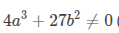

# **Elliptic Curve Cryptography (ECC)**

**Elliptic Curve Cryptography (ECC)** is a modern **public-key encryption** method that provides **stronger security with smaller key sizes** compared to RSA. It is widely used in SSL/TLS, Bitcoin (ECDSA), and mobile devices due to its efficiency.

---

## **1. Key Concepts**
### **Elliptic Curve Basics**
An **elliptic curve** is defined by the equation:

where:
- \(a, b\) are coefficients (e.g., **secp256k1** uses \(a = 0, b = 7\) for Bitcoin).
- The curve must satisfy  (no singularities).

### **Key Properties**
1. **Group Operations**:
   - **Point Addition (\(P + Q = R\))**: Geometric line intersection.
   - **Scalar Multiplication (\(k \times P\))**: Repeated addition (basis of ECC).
2. **Discrete Logarithm Problem (ECDLP)**:
   - Given \(P\) and \(Q = k \times P\), finding \(k\) is computationally hard.
   - This is the **core security assumption** of ECC.

---

## **2. ECC vs. RSA**
| Feature          | ECC                          | RSA                          |
|------------------|-----------------------------|-----------------------------|
| **Key Size**     | 256-bit (equivalent to RSA 3072-bit) | 3072-bit for similar security |
| **Speed**        | Faster computations          | Slower                      |
| **Usage**        | SSL, Bitcoin, IoT           | Legacy systems, certificates |
| **Quantum Threat** | Vulnerable (Shor’s algorithm) | Vulnerable                  |

---

## **3. ECC Key Generation**
1. **Choose an elliptic curve** (e.g., **secp256k1** or **Curve25519**).
2. **Select a base point \(G\)** (publicly known generator).
3. **Private Key (\(d\))**:
   - Random integer \(1 < d < n-1\) (where \(n\) is the curve’s order).
4. **Public Key (\(Q\))**:
   - Computed as \(Q = d \times G\) (scalar multiplication).

---

## **4. ECC Encryption (ECIES)**
**Elliptic Curve Integrated Encryption Scheme (ECIES)** combines ECC with symmetric encryption:
1. **Key Exchange**:
   - Alice sends her public key \(Q_A = d_A \times G\).
   - Bob generates an ephemeral key pair \((d_B, Q_B)\) and computes:
     \[
     S = d_B \times Q_A = d_B \times d_A \times G
     \]
   - The shared secret is the x-coordinate of \(S\).
2. **Encrypt Data**:
   - Use a symmetric cipher (e.g., AES) with the derived key.

---

## **5. ECC Signatures (ECDSA)**
**Elliptic Curve Digital Signature Algorithm (ECDSA)** is used in Bitcoin:
1. **Signing**:
   - Compute \(k = \text{random nonce}\).
   - Calculate \((x, y) = k \times G\).
   - Signature: \((r, s)\), where:
     \[
     r = x \mod n, \quad s = k^{-1}(H(m) + d \cdot r) \mod n
     \]
2. **Verification**:
   - Check if \(r\) and \(s\) are valid.
   - Recompute \(S_1 = s^{-1} \times H(m) \times G + s^{-1} \times r \times Q\).
   - Verify that \(r = x_{S_1} \mod n\).

---

## **6. Advantages of ECC**
✅ **Smaller key sizes** → Less storage, faster computation.  
✅ **Stronger security per bit** than RSA.  
✅ **Efficient for IoT & mobile** (low power consumption).  

---

## **7. Challenges & Attacks**
- **Side-channel attacks**: Timing/power analysis can leak secrets.
- **Weak curves**: Some curves (e.g., NIST’s P-256) have backdoor suspicions.
- **Quantum threat**: Shor’s algorithm can break ECC (post-quantum crypto needed).

---

## **8. Popular ECC Curves**
| Curve          | Usage                     | Security Level |
|---------------|--------------------------|---------------|
| **secp256k1** | Bitcoin, Ethereum        | ~128-bit       |
| **Curve25519**| Signal, WireGuard        | ~128-bit       |
| **P-256**     | TLS, NIST standards      | ~128-bit       |

---

## **9. Example (Simplified ECDH Key Exchange)**
1. **Alice** has private key \(d_A = 5\), public key \(Q_A = 5 \times G\).
2. **Bob** has private key \(d_B = 7\), public key \(Q_B = 7 \times G\).
3. **Shared Secret**:
   - Alice computes \(S = d_A \times Q_B = 5 \times 7 \times G = 35 \times G\).
   - Bob computes \(S = d_B \times Q_A = 7 \times 5 \times G = 35 \times G\).
   - The shared secret is the x-coordinate of \(S\).

---

## **10. Conclusion**
ECC is **faster, more efficient, and more secure** than RSA for most modern applications. However, **quantum computing** poses a future risk, leading to research into **post-quantum cryptography** (e.g., lattice-based schemes).

