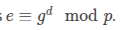
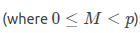
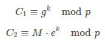
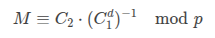
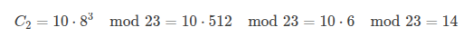
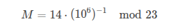
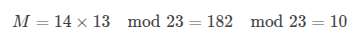

# **ElGamal Encryption Algorithm**

The **ElGamal encryption** system is a **public-key cryptosystem** based on the **Diffie-Hellman key exchange**. It provides **asymmetric encryption** and is used in applications like **PGP (Pretty Good Privacy)** and **GNU Privacy Guard (GPG)**. Unlike RSA, ElGamal relies on the **Discrete Logarithm Problem (DLP)** for security.

---

## **1. Key Concepts**
### **Core Idea**
- **Public Key**: Used for encryption.
- **Private Key**: Used for decryption.
- Security relies on the **hardness of solving the Discrete Logarithm Problem (DLP)** in a finite field.

### **Comparison with RSA & ECC**
| Feature          | ElGamal                     | RSA                          | ECC                          |
|------------------|----------------------------|-----------------------------|-----------------------------|
| **Basis**        | Discrete Logarithm Problem | Integer Factorization       | Elliptic Curve DLP          |
| **Security**     | Strong (but slower than ECC) | Weaker with small keys      | Strongest (small keys)      |
| **Key Size**     | ~2048 bits for 112-bit sec  | ~2048 bits for 112-bit sec  | ~256 bits for 128-bit sec   |
| **Usage**        | PGP, GPG                   | SSL, Certificates           | Bitcoin, TLS (ECDH)         |

---

## **2. ElGamal Key Generation**
1. **Choose a large prime \( p \)** (public).
2. **Select a generator \( g \)** of the multiplicative group \( \mathbb{Z}_p^* \) (public).
3. **Private Key (\( d \))**:
   - Random integer \( 1 < d < p-1 \).
4. **Public Key (\( e \))**:
   - Computed as .

---

## **3. ElGamal Encryption**
To encrypt a message \( M \) :
1. **Choose a random integer \( k \)** (ephemeral key, \( 1 < k < p-1 \)).
2. **Compute ciphertext components**:
   
   - The **full ciphertext** is \( (C1, C2) \).
    
---

## **4. ElGamal Decryption**
Given ciphertext \( (C_1, C_2) \), the receiver computes:

**Why this works**:

---

## **5. Example (Simplified)**
Let:
- \( p = 23 \) (small prime for demo)
- \( g = 5 \) (generator of \( \mathbb{Z}_{23}^* \))
- **Private Key \( d = 6 \)**
- **Public Key \( e = 5^6 \mod 23 = 8 \)**

**Encrypt \( M = 10 \)**:
1. Choose \( k = 3 \).
2. Compute:

  
   - **Ciphertext**: \( (10, 14) \)

**Decrypt \( (10, 14) \)**:

First, compute \( 10^6 \mod 23 = 16 \).  
Then, find \( 16^{-1} \mod 23 \) (which is 13, since \( 16 \times 13 = 208 \equiv 1 \mod 23 \)).  

Finally:

---

## **6. Security of ElGamal**
### **Strengths**
✅ **Semantic Security**: Different ciphertexts for the same plaintext due to random \( k \).  
✅ **Based on DLP**: Hard to reverse \( g^k \mod p \) without knowing \( k \).  

### **Weaknesses & Attacks**
- **Requires a good random \( k \)**: Reusing \( k \) leaks the private key.
- **Malleability**: An attacker can modify \( C_2 \) without knowing \( M \).
- **Slower than RSA/ECC**: Due to modular exponentiation.

---

## **7. Applications**
- **PGP/GPG** (for secure email).
- **Hybrid cryptosystems** (combining symmetric + ElGamal).
- **Voting systems** (homomorphic properties).

---

## **8. ElGamal vs. ECC (ECDH)**
| Feature          | ElGamal (DLP)              | ECC (ECDH)                  |
|------------------|----------------------------|-----------------------------|
| **Key Size**     | 2048 bits (~112-bit sec)   | 256 bits (~128-bit sec)     |
| **Speed**        | Slower                     | Faster                      |
| **Quantum Threat** | Broken by Shor’s algorithm | Broken by Shor’s algorithm  |
| **Usage**        | Legacy systems             | Modern crypto (TLS, Bitcoin)|

---

## **9. Conclusion**
ElGamal is a **secure** but **less efficient** alternative to RSA and ECC. While still used in **privacy tools (PGP)**, modern systems prefer **ECC** for better performance. **Post-quantum cryptography** (e.g., lattice-based schemes) is the future.