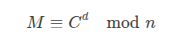
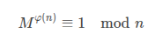
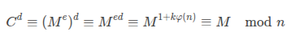

The **RSA algorithm** (Rivest-Shamir-Adleman) is a widely used **public-key cryptosystem** for secure data transmission, digital signatures, and key exchange. It relies on the mathematical properties of **large prime numbers** and **modular arithmetic**.

---

### **Key Concepts in RSA**
1. **Public Key (Encryption Key)** – Shared openly (`(e, n)`).
2. **Private Key (Decryption Key)** – Kept secret (`(d, n)`).
3. **Modulus (`n`)** – Product of two large primes (`p` and `q`).
4. **Euler's Totient Function (`φ(n)`)** – Used to compute keys.

---

### **RSA Algorithm Steps**
#### **1. Key Generation**
1. **Choose two large primes** `p` and `q` (secret).
2. **Compute modulus** `n = p * q` (public).
3. **Compute φ(n) = (p-1)(q-1)** (secret).
4. **Choose public exponent `e`** such that:
   - `1 < e < φ(n)`
   - `gcd(e, φ(n)) = 1` (i.e., `e` and `φ(n)` are coprime).
5. **Compute private exponent `d`** (modular inverse of `e`):
   - `d ≡ e⁻¹ mod φ(n)` (i.e., `d * e ≡ 1 mod φ(n)`).

#### **2. Encryption (Using Public Key)**
- **Ciphertext (`C`)** is computed from plaintext (`M`):

  
  
- **Condition**: `M < n` (if `M` is larger, use padding like OAEP).

#### **3. Decryption (Using Private Key)**
- **Recover plaintext (`M`)** from ciphertext (`C`):

   

---

### **Example (Simplified)**
Let’s choose small primes for illustration:
- **p = 5**, **q = 11**  
- **n = p × q = 55**  
- **φ(n) = (5-1)(11-1) = 40**  
- Choose **e = 3** (since `gcd(3, 40) = 1`).  
- Compute **d ≡ 3⁻¹ mod 40 = 27** (since `3 × 27 = 81 ≡ 1 mod 40`).  

Now, encrypt `M = 9`:
- **C ≡ 9³ mod 55 = 729 mod 55 = 14**  

Decrypt `C = 14`:
- **M ≡ 14²⁷ mod 55 = 9** (using modular exponentiation).

---

### **Security of RSA**
- **Relies on the hardness of factoring `n`** into `p` and `q`.
- **Key sizes**: Typically **2048-bit or 4096-bit** for security.
- **Attacks**:
  - Brute force (infeasible for large keys).
  - Mathematical attacks (e.g., Pollard’s Rho, Number Field Sieve).
  - Side-channel attacks (timing/power analysis).
- **Best practices**:
  - Use **probabilistic padding** (e.g., OAEP).
  - Avoid small exponents (`e=3` can be risky without padding).

---

### **Applications**
- **Secure communication** (HTTPS, SSH).
- **Digital signatures** (signing with private key).
- **Key exchange** (e.g., in TLS).

---

### **Mathematical Foundation**
- **Euler’s Theorem**: If `M` and `n` are coprime,  
 
- **Decryption works because**:  
 
---

### **Limitations**
- **Slow for large data** (used mainly for encrypting keys).
- **Vulnerable to quantum computing** (Shor’s algorithm can factor `n` efficiently).
