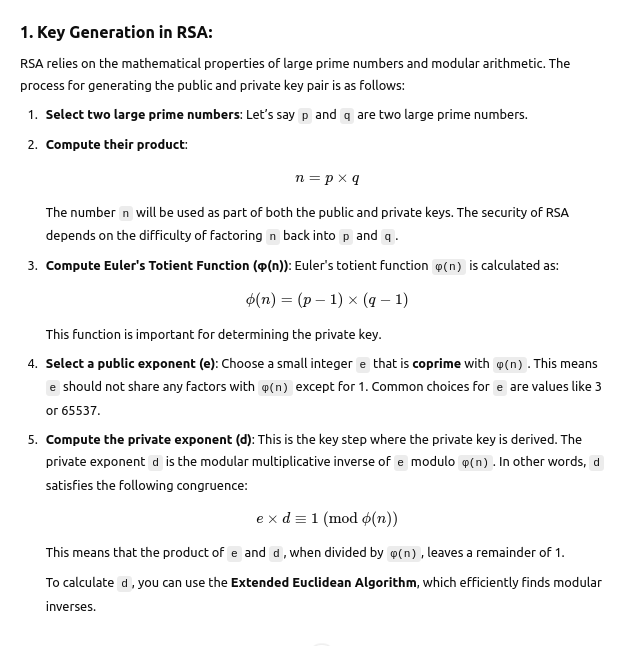
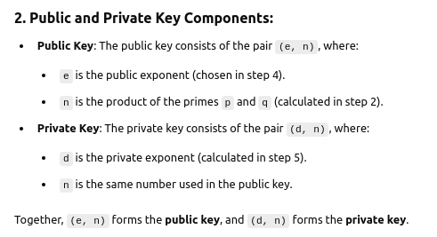
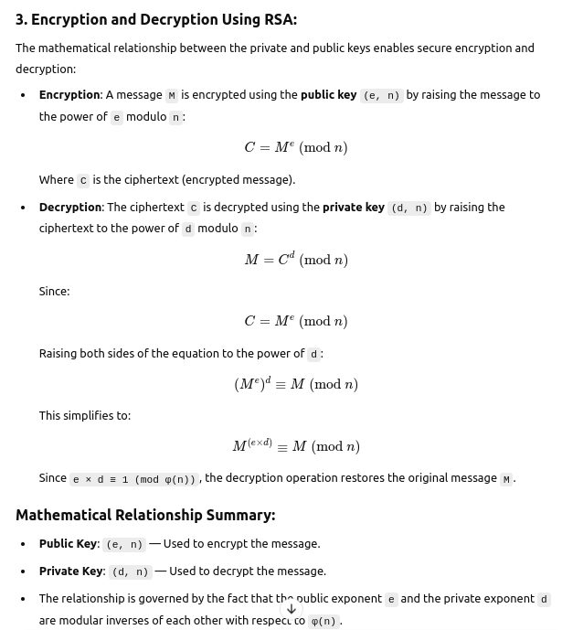
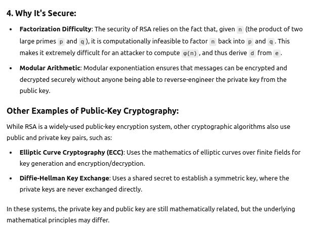

# Matheamtics of Public and Private Key

## Other related reading

The concept of **public-key cryptography** and the specific example of **RSA** encryption is often referred to as **"Asymmetric Cryptography"** in Wikipedia.

Here are some related Wikipedia articles that cover these topics:

1. **Asymmetric Cryptography** – This is the main topic of public-key cryptography, describing how cryptographic algorithms use key pairs (public and private) for encryption and decryption. 
   - [Asymmetric Cryptography on Wikipedia](https://en.wikipedia.org/wiki/Asymmetric_cryptography)

2. **RSA Algorithm** – The specific example of a widely-used asymmetric cryptography algorithm, which uses large prime numbers for key generation.
   - [RSA Algorithm on Wikipedia](https://en.wikipedia.org/wiki/RSA_(cryptosystem))

3. **Public Key Infrastructure (PKI)** – A broader system that manages digital keys and certificates, often using asymmetric cryptography for secure communication.
   - [Public Key Infrastructure on Wikipedia](https://en.wikipedia.org/wiki/Public_key_infrastructure)

4. **Modular Arithmetic** – The mathematical foundation used in algorithms like RSA for modular exponentiation.
   - [Modular Arithmetic on Wikipedia](https://en.wikipedia.org/wiki/Modular_arithmetic)

These articles cover the mathematical concepts, algorithms, and cryptographic techniques behind public and private keys. Let me know if you'd like further details on any of them!

## Conclusion

The private key and public key are mathematically related in such a way that it is easy to compute the public key from the private key, but it is computationally infeasible to reverse the process (i.e., derive the private key from the public key).

This relationship is crucial for the security of asymmetric encryption schemes like RSA, ensuring that only the holder of the private key can decrypt messages encrypted with the corresponding public key.

## Ref

- `ChatGPT`
- https://www.ibm.com/docs/en/informix-servers/14.10?topic=tls-relationship-between-certificates-keys
- https://www.cantorsparadise.com/the-mathematical-relation-between-public-and-private-keys-dfb7959d19ad
- https://www.kiteworks.com/cmmc-compliance/cryptography-public-key-private-key/
- https://en.wikipedia.org/wiki/Public-key_cryptography
