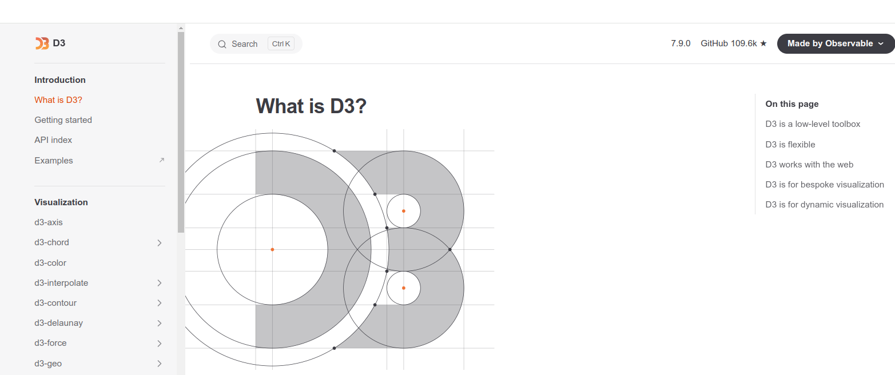
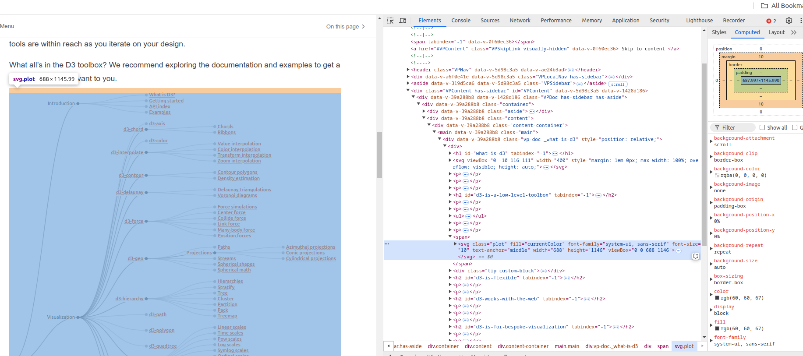
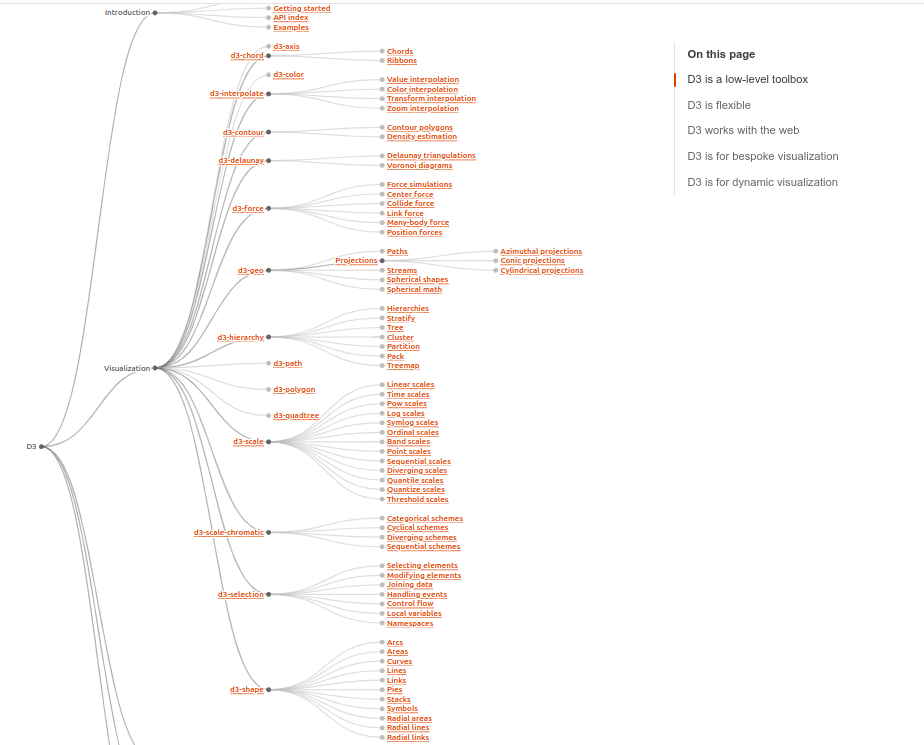
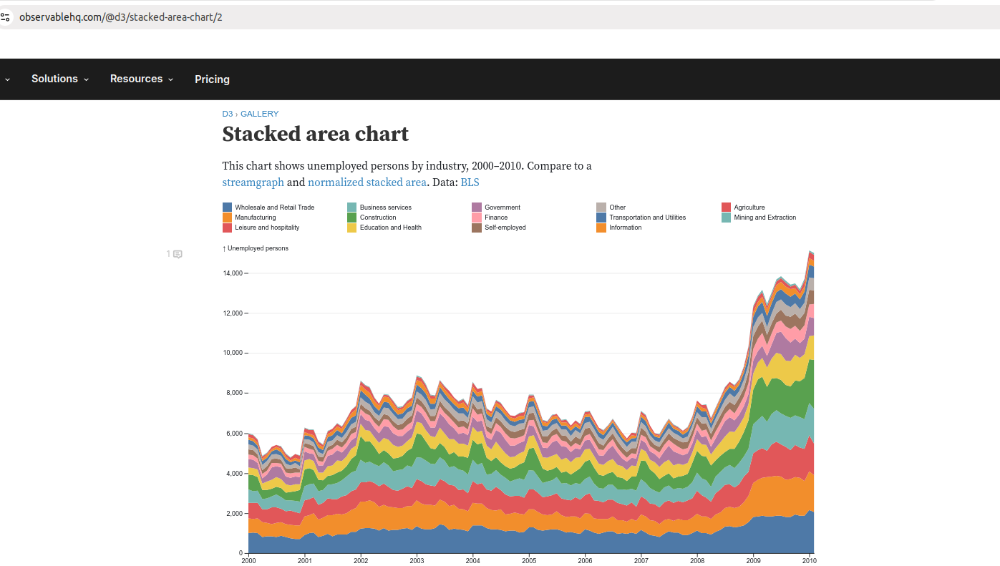

# D3

## Requirement and Expactations

* Before the class you should install the software called "Visual Studio Code" from here.
[download](https://code.visualstudio.com/download)

* Install a plugin called "html preview" from the `visual studio code`.


* Search for `html preview`.


* Write a simple html file. First you have to select a folder like in the following image, name it 1.html,


```html
<!DOCTYPE html>
<html>
<script src="https://d3js.org/d3.v4.js"></script>
<body>
<h2>D3.js Scatter-Plot</h2>
<body>
Test me!
</body>
</html>
```

Then your 1.html should look like the following,


Then click the following button circled, 


And you will see your html is being rendered and displayed.


## What is D3

D3 (or D3.js) is a free, open-source JavaScript library for visualizing data. Its low-level approach built on web standards offers unparalleled flexibility in authoring dynamic, data-driven graphics. For more than a decade D3 has powered groundbreaking and award-winning visualizations, become a foundational building block of higher-level chart libraries, and fostered a vibrant community of data practitioners around the world.


D3 “slingshotted the field into growth, diversification and creativity that has been unprecedented” and “changed how millions of data visualizations are created across newsrooms, websites, and personal portfolios,” remarked the Information is Beautiful 2022 Test of Time Award. The IEEE VIS 2021 Test of Time Award noted, “By creating a framework that was compelling and easy for web developers to use to author interactive visualizations, the authors have undeniably helped to bring data visualization to the mainstream. [D3] is a cornerstone contribution to this conference specifically and more generally to the success of our field as a whole.”

## Who created D3?

D3 was created by `Mike Bostock` in 2011. Mike co-authored the D3 paper with `Jeff Heer` and `Vadim Ogievetsky` at Stanford. `Jason Davies` made major contributions to D3 from 2011 to 2013, most notably to D3’s geographic projection system. `Philippe Rivière` has been a major contributor to D3 and its documentation since 2016. Over the years, countless kind individuals have contributed to D3 by sharing code and ideas, by teaching and answering questions, and by bringing people together to further the practice of visualization. Mike and Philippe now maintain D3 and Observable Plot at Observable.



## Key People

* D3 was created by `Mike Bostock` in 2011

* Mike co-authored the D3 paper with `Jeff Heer` and `Vadim Ogievetsky` at Stanford.

* `Jason Davies` made major contributions to D3 from 2011 to 2013, most notably to D3’s geographic projection system.

* `Philippe Rivière` has been a major contributor to D3 and its documentation since 2016.

## Deep Dive

SVG is an important ingradient from HTML5. The following content/graph on the website `https://d3js.org/what-is-d3` is a SVG example. I had the svg code highlighted on the right hand side.



The way you can open and inspect the html or any html code on your browser, is to press down F12 or right click and `inspect`

### D3 is a low-level toolbox

D3 is not a charting library in the traditional sense. It has no concept of “charts”. When you visualize data with D3, you compose a variety of primitives.

D3 is not a single monolith but rather a suite of 30 discrete libraries (or “modules”). We bundle these modules together for convenience rather than necessity so your tools are within reach as you iterate on your design.



Let us see an example,

To make a stacked area chart like the following, 



you might use,

* a CSV parser to load data,
* a time scale for horizontal position (x),
* a linear scale for vertical position (y),
* an ordinal scale and categorical scheme for color,
* a stack layout for arranging values,
* an area shape with a linear curve for generating SVG path data,
* axes for documenting the position encodings, and
* selections for creating SVG elements.

That is a lot right? You can see how the chart function below is being implemented and how it will be called in here.

Remember coding is like building legos. The idea to build code in the future is to write less code!!
With AI or without AI that is the trend!

```javascript
chart = {
  // Specify the chart’s dimensions.
  const width = 928;
  const height = 500;
  const marginTop = 10;
  const marginRight = 10;
  const marginBottom = 20;
  const marginLeft = 40;

  // Determine the series that need to be stacked.
  const series = d3.stack()
      .keys(d3.union(data.map(d => d.industry))) // distinct series keys, in input order
      .value(([, D], key) => D.get(key).unemployed) // get value for each series key and stack
    (d3.index(data, d => d.date, d => d.industry)); // group by stack then series key

  // Prepare the scales for positional and color encodings.
  const x = d3.scaleUtc()
      .domain(d3.extent(data, d => d.date))
      .range([marginLeft, width - marginRight]);

  const y = d3.scaleLinear()
      .domain([0, d3.max(series, d => d3.max(d, d => d[1]))])
      .rangeRound([height - marginBottom, marginTop]);

  const color = d3.scaleOrdinal()
      .domain(series.map(d => d.key))
      .range(d3.schemeTableau10);

  // Construct an area shape.
  const area = d3.area()
      .x(d => x(d.data[0]))
      .y0(d => y(d[0]))
      .y1(d => y(d[1]));

  // Create the SVG container.
  const svg = d3.create("svg")
      .attr("width", width)
      .attr("height", height)
      .attr("viewBox", [0, 0, width, height])
      .attr("style", "max-width: 100%; height: auto;");

  // Add the y-axis, remove the domain line, add grid lines and a label.
  svg.append("g")
      .attr("transform", `translate(${marginLeft},0)`)
      .call(d3.axisLeft(y).ticks(height / 80))
      .call(g => g.select(".domain").remove())
      .call(g => g.selectAll(".tick line").clone()
          .attr("x2", width - marginLeft - marginRight)
          .attr("stroke-opacity", 0.1))
      .call(g => g.append("text")
          .attr("x", -marginLeft)
          .attr("y", 10)
          .attr("fill", "currentColor")
          .attr("text-anchor", "start")
          .text("↑ Unemployed persons"));

  // Append a path for each series.
  svg.append("g")
    .selectAll()
    .data(series)
    .join("path")
      .attr("fill", d => color(d.key))
      .attr("d", area)
    .append("title")
      .text(d => d.key);

  // Append the horizontal axis atop the area.
  svg.append("g")
      .attr("transform", `translate(0,${height - marginBottom})`)
      .call(d3.axisBottom(x).tickSizeOuter(0));

  // Return the chart with the color scale as a property (for the legend).
  return Object.assign(svg.node(), {scales: {color}});
}
```

Then the following code is to load the data and call it.

```javascript
data = FileAttachment("unemployment.csv").csv({typed: true})
import {Swatches} from "@d3/color-legend"

```

Using Observable Plot’s concise API, you can create a similar chart with an area mark. See the Plot: [Stacked area chart example notebook](https://observablehq.com/@observablehq/plot-stacked-area-chart).

```javascript
Plot.plot({
  marginLeft: 60,
  y: {grid: true},
  color: {legend: true, columns: 6},
  marks: [
    Plot.areaY(data, {x: "date", y: "unemployed", fill: "industry"}),
    Plot.ruleY([0])
  ]
})
```

**Watch this youtube video**

[what is D3](https://www.youtube.com/watch?v=bp2GF8XcJdY)

## How to use D3 library

**D3 in vanilla HTML**

In vanilla HTML, you can load D3 from a CDN such as jsDelivr or you can download it locally. We recommend using the CDN-hosted ES module bundle. But for those who need it, we also provide a UMD bundle that exports the d3 global when loaded as a plain script.


**Example 1**


```html
<!DOCTYPE html>
<div id="container"></div>
<script type="module">

import * as d3 from "https://cdn.jsdelivr.net/npm/d3@7/+esm";

// Declare the chart dimensions and margins.
const width = 640;
const height = 400;
const marginTop = 20;
const marginRight = 20;
const marginBottom = 30;
const marginLeft = 40;

// Declare the x (horizontal position) scale.
const x = d3.scaleUtc()
    .domain([new Date("2023-01-01"), new Date("2024-01-01")])
    .range([marginLeft, width - marginRight]);

// Declare the y (vertical position) scale.
const y = d3.scaleLinear()
    .domain([0, 100])
    .range([height - marginBottom, marginTop]);

// Create the SVG container.
const svg = d3.create("svg")
    .attr("width", width)
    .attr("height", height);

// Add the x-axis.
svg.append("g")
    .attr("transform", `translate(0,${height - marginBottom})`)
    .call(d3.axisBottom(x));

// Add the y-axis.
svg.append("g")
    .attr("transform", `translate(${marginLeft},0)`)
    .call(d3.axisLeft(y));

// Append the SVG element.
container.append(svg.node());

</script>
```

**Example 2**

* First open your code editor.

```html
<!DOCTYPE html>
<html>
<script src="https://d3js.org/d3.v4.js"></script>
<body>
<h2>D3.js Scatter-Plot</h2>

<svg id="myPlot" style="width:500px;height:500px"></svg>

<script>
// Set Dimensions
const xSize = 500; 
const ySize = 500;
const margin = 40;
const xMax = xSize - margin*2;
const yMax = ySize - margin*2;

// Create Random Points
const numPoints = 100;
const data = [];
for (let i = 0; i < numPoints; i++) {
  data.push([Math.random() * xMax, Math.random() * yMax]);
}

// Append SVG Object to the Page
const svg = d3.select("#myPlot")
  .append("svg")
  .append("g")
  .attr("transform","translate(" + margin + "," + margin + ")");

// X Axis
const x = d3.scaleLinear()
  .domain([0, 500])
  .range([0, xMax]);

svg.append("g")
  .attr("transform", "translate(0," + yMax + ")")
  .call(d3.axisBottom(x));

// Y Axis
const y = d3.scaleLinear()
  .domain([0, 500])
  .range([ yMax, 0]);

svg.append("g")
  .call(d3.axisLeft(y));

// Dots
svg.append('g')
  .selectAll("dot")
  .data(data).enter()
  .append("circle")
  .attr("cx", function (d) { return d[0] } )
  .attr("cy", function (d) { return d[1] } )
  .attr("r", 3)
  .style("fill", "Red");
</script>

</body>
</html>
```


**Youtube video**

[D3 with Vinilla](https://www.youtube.com/watch?v=n5NcCoa9dDU&list=PL6il2r9i3BqH9PmbOf5wA5E1wOG3FT22p)

## D3 + ReactJS

**Youtube video on ReactJs + D3**

[youtube](https://www.youtube.com/watch?v=2LhoCfjm8R4)

### Ref

- https://d3js.org/what-is-d3
