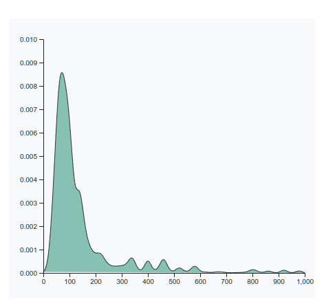
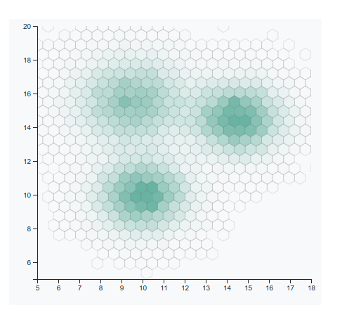
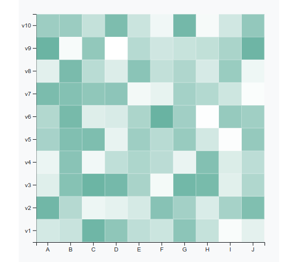
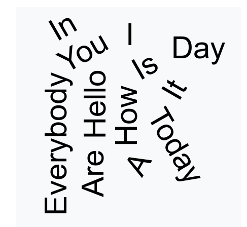
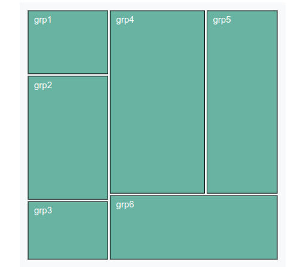
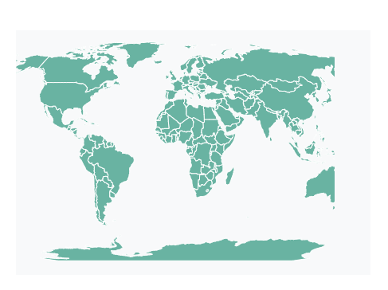
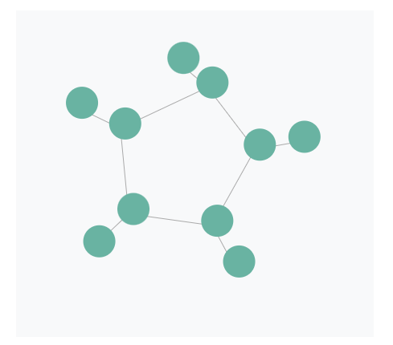

# D3 - Visualize with a lot more charts

## Takeaway

In this tutorial we will look at more examples of different commonly used charts. They are,

* density chart
* density2d chart
* heatmap chart
* spider chart
* wordcloud chart
* treemap chart
* backgroundmap chart
* network chart

## density chart

```html
<!-- Code from d3-graph-gallery.com -->
<!DOCTYPE html>
<meta charset="utf-8">

<!-- Load d3.js -->
<script src="https://d3js.org/d3.v6.js"></script>

<!-- Create a div where the graph will take place -->
<div id="my_dataviz"></div>

<script>

  // set the dimensions and margins of the graph
  const margin = {top: 30, right: 30, bottom: 30, left: 50},
      width = 460 - margin.left - margin.right,
      height = 400 - margin.top - margin.bottom;
  
  // append the svg object to the body of the page
  const svg = d3.select("#my_dataviz")
    .append("svg")
      .attr("width", width + margin.left + margin.right)
      .attr("height", height + margin.top + margin.bottom)
    .append("g")
      .attr("transform", `translate(${margin.left},${margin.top})`);
  
  // get the data
  d3.csv("https://raw.githubusercontent.com/holtzy/data_to_viz/master/Example_dataset/1_OneNum.csv").then( function(data) {
  
    // add the x Axis
    const x = d3.scaleLinear()
              .domain([0, 1000])
              .range([0, width]);
    svg.append("g")
        .attr("transform", `translate(0, ${height})`)
        .call(d3.axisBottom(x));
  
    // add the y Axis
    const y = d3.scaleLinear()
              .range([height, 0])
              .domain([0, 0.01]);
    svg.append("g")
        .call(d3.axisLeft(y));
  
    // Compute kernel density estimation
    const kde = kernelDensityEstimator(kernelEpanechnikov(7), x.ticks(40))
    const density =  kde( data.map(function(d){  return d.price; }) )
  
    // Plot the area
    svg.append("path")
        .attr("class", "mypath")
        .datum(density)
        .attr("fill", "#69b3a2")
        .attr("opacity", ".8")
        .attr("stroke", "#000")
        .attr("stroke-width", 1)
        .attr("stroke-linejoin", "round")
        .attr("d",  d3.line()
          .curve(d3.curveBasis)
            .x(function(d) { return x(d[0]); })
            .y(function(d) { return y(d[1]); })
        );
  
  });
  
  
  // Function to compute density
  function kernelDensityEstimator(kernel, X) {
    return function(V) {
      return X.map(function(x) {
        return [x, d3.mean(V, function(v) { return kernel(x - v); })];
      });
    };
  }
  function kernelEpanechnikov(k) {
    return function(v) {
      return Math.abs(v /= k) <= 1 ? 0.75 * (1 - v * v) / k : 0;
    };
  }
  </script>
```

Open the html you just saved, and open it with a browser, and you should see the chart like the following,



### Steps

* The Html part of the code just creates a div that will be modified by d3 later on.

* The first part of the javascript code set a svg area. It specify the chart size and its margin. Read more.

* Then, X and Y axis are drawn. Read this dedicated page on axis to understand how it works.

* Kernel density estimation is computed. You can play with the x.ticks(40) argument to control the bandwidth used for computation.

* The resulting variable called density gives a Y coordinate for each of the X axis ticks. It is possible to use this information to draw a curve with d3.line().

## density2d chart

```html
<!DOCTYPE html>
<meta charset="utf-8">

<!-- Load d3.js -->
<script src="https://d3js.org/d3.v6.js"></script>

<!-- Create a div where the graph will take place -->
<div id="my_dataviz"></div>

<script>

  // set the dimensions and margins of the graph
  const margin = {top: 10, right: 30, bottom: 30, left: 40},
      width = 460 - margin.left - margin.right,
      height = 400 - margin.top - margin.bottom;
  
  // append the svg object to the body of the page
  const svg = d3.select("#my_dataviz")
    .append("svg")
      .attr("width", width + margin.left + margin.right)
      .attr("height", height + margin.top + margin.bottom)
    .append("g")
      .attr("transform", `translate(${margin.left}, ${margin.top})`);
  
  // read data
  d3.csv("https://raw.githubusercontent.com/holtzy/D3-graph-gallery/master/DATA/data_for_density2d.csv").then( function(data) {
  
    // Add X axis
    const x = d3.scaleLinear()
      .domain([5, 18])
      .range([ 0, width ]);
    svg.append("g")
      .attr("transform", `translate(0, ${height})`)
      .call(d3.axisBottom(x));
  
    // Add Y axis
    const y = d3.scaleLinear()
      .domain([5, 20])
      .range([ height, 0 ]);
    svg.append("g")
      .call(d3.axisLeft(y));
  
    // Reformat the data: d3.hexbin() needs a specific format
    const inputForHexbinFun = []
    data.forEach(function(d) {
      inputForHexbinFun.push( [x(d.x), y(d.y)] )  // Note that we had the transform value of X and Y !
    })
  
    // Prepare a color palette
    const color = d3.scaleLinear()
        .domain([0, 600]) // Number of points in the bin?
        .range(["transparent",  "#69b3a2"])
  
    // Compute the hexbin data
    const hexbin = d3.hexbin()
      .radius(9) // size of the bin in px
      .extent([ [0, 0], [width, height] ])
  
    // Plot the hexbins
    svg.append("clipPath")
        .attr("id", "clip")
      .append("rect")
        .attr("width", width)
        .attr("height", height)
  
    svg.append("g")
      .attr("clip-path", "url(#clip)")
      .selectAll("path")
      .data( hexbin(inputForHexbinFun) )
      .join("path")
        .attr("d", hexbin.hexagon())
        .attr("transform", function(d) { return `translate(${d.x}, ${d.y})`})
        .attr("fill", function(d) { return color(d.length); })
        .attr("stroke", "black")
        .attr("stroke-width", "0.1")
  })
  </script>
```

Open the html you just saved, and open it with a browser, and you should see the chart like the following,
s


### Steps

* The Html part of the code just creates a div that will be modified by d3 later on. It also load the d3-hexbin plugin

* The input dataset has 2 numeric variables: x and y. A 2d density plot basically represents the amount of data point on each part of the grid.

* The d3-hexbin plugin allows to group two-dimensional points into hexagonal bins using the d3.hexbin(). You can control the hexbin size with the radius() argument.

* Finally, paths can be drawn using .hexagon()

## heatmap chart

```html
<!DOCTYPE html>
<meta charset="utf-8">

<!-- Load d3.js -->
<script src="https://d3js.org/d3.v6.js"></script>

<!-- Create a div where the graph will take place -->
<div id="my_dataviz"></div>

<script>

  // set the dimensions and margins of the graph
  const margin = {top: 30, right: 30, bottom: 30, left: 30},
    width = 450 - margin.left - margin.right,
    height = 450 - margin.top - margin.bottom;
  
  // append the svg object to the body of the page
  const svg = d3.select("#my_dataviz")
  .append("svg")
    .attr("width", width + margin.left + margin.right)
    .attr("height", height + margin.top + margin.bottom)
  .append("g")
    .attr("transform", `translate(${margin.left},${margin.top})`);
  
  // Labels of row and columns
  const myGroups = ["A", "B", "C", "D", "E", "F", "G", "H", "I", "J"]
  const myVars = ["v1", "v2", "v3", "v4", "v5", "v6", "v7", "v8", "v9", "v10"]
  
  // Build X scales and axis:
  const x = d3.scaleBand()
    .range([ 0, width ])
    .domain(myGroups)
    .padding(0.01);
  svg.append("g")
    .attr("transform", `translate(0, ${height})`)
    .call(d3.axisBottom(x))
  
  // Build X scales and axis:
  const y = d3.scaleBand()
    .range([ height, 0 ])
    .domain(myVars)
    .padding(0.01);
  svg.append("g")
    .call(d3.axisLeft(y));
  
  // Build color scale
  const myColor = d3.scaleLinear()
    .range(["white", "#69b3a2"])
    .domain([1,100])
  
  //Read the data
  d3.csv("https://raw.githubusercontent.com/holtzy/D3-graph-gallery/master/DATA/heatmap_data.csv").then( function(data) {
  
    svg.selectAll()
        .data(data, function(d) {return d.group+':'+d.variable;})
        .join("rect")
        .attr("x", function(d) { return x(d.group) })
        .attr("y", function(d) { return y(d.variable) })
        .attr("width", x.bandwidth() )
        .attr("height", y.bandwidth() )
        .style("fill", function(d) { return myColor(d.value)} )
  
  })
  </script>
```

Open the html you just saved, and open it with a browser, and you should see the chart like the following,



### Steps

* The Html part of the code just creates a div that will be modified by d3 later on.

* The first part of the javascript code set a svg area. It specify the chart size and its margin. Read more.

* A dummy dataset has been created for this example, at the long format. (3 columns: row, col, value).

* The first step is to build scales and axis. Thus each entity will have a position on the grid.

* A scaleBand() is used, which allows to control the size of each square using the padding property. If padding is close from 1, square are very small. (0 for very big)

* Finally, each square can be added using a rect element.

## spider chart [missing]

```html

```

## wordcloud chart

```html
<!-- Code from d3-graph-gallery.com -->
<!DOCTYPE html>
<meta charset="utf-8">

<!-- Load d3.js -->
<script src="https://d3js.org/d3.v4.js"></script>

<!-- Load d3-cloud -->
<script src="https://cdn.jsdelivr.net/gh/holtzy/D3-graph-gallery@master/LIB/d3.layout.cloud.js"></script>

<!-- Create a div where the graph will take place -->
<div id="my_dataviz"></div>


<script>

// List of words
var myWords = ["Hello", "Everybody", "How", "Are", "You", "Today", "It", "Is", "A", "Lovely", "Day", "I", "Love", "Coding", "In", "My", "Van", "Mate"]

// set the dimensions and margins of the graph
var margin = {top: 10, right: 10, bottom: 10, left: 10},
    width = 450 - margin.left - margin.right,
    height = 450 - margin.top - margin.bottom;

// append the svg object to the body of the page
var svg = d3.select("#my_dataviz").append("svg")
    .attr("width", width + margin.left + margin.right)
    .attr("height", height + margin.top + margin.bottom)
  .append("g")
    .attr("transform",
          "translate(" + margin.left + "," + margin.top + ")");

// Constructs a new cloud layout instance. It run an algorithm to find the position of words that suits your requirements
var layout = d3.layout.cloud()
  .size([width, height])
  .words(myWords.map(function(d) { return {text: d}; }))
  .padding(10)
  .fontSize(60)
  .on("end", draw);
layout.start();

// This function takes the output of 'layout' above and draw the words
// Better not to touch it. To change parameters, play with the 'layout' variable above
function draw(words) {
  svg
    .append("g")
      .attr("transform", "translate(" + layout.size()[0] / 2 + "," + layout.size()[1] / 2 + ")")
      .selectAll("text")
        .data(words)
      .enter().append("text")
        .style("font-size", function(d) { return d.size + "px"; })
        .attr("text-anchor", "middle")
        .attr("transform", function(d) {
          return "translate(" + [d.x, d.y] + ")rotate(" + d.rotate + ")";
        })
        .text(function(d) { return d.text; });
}
</script>
```

Open the html you just saved, and open it with a browser, and you should see the chart like the following,



### Steps

* The Html part of the code just creates a div that will be modified by d3 later on.

* The first part of the javascript code set a svg area. It specify the chart size and its margin. Read more.

* In this example dummy data are created. It's a vector format. See here to work from a .csv

* The wordcloud is then drawn thanks to the d3-cloud plugin. The first step is to set the layout. Basically, it runs an algorithm that compute the position of each word.

* The built object has all the requested features to draw words on by one.

## treemap chart

```html
<!DOCTYPE html>
<meta charset="utf-8">

<!-- Load d3.js -->
<script src="https://d3js.org/d3.v6.js"></script>

<!-- Create a div where the graph will take place -->
<div id="my_dataviz"></div>

<script>

  // set the dimensions and margins of the graph
  const margin = {top: 10, right: 10, bottom: 10, left: 10},
    width = 445 - margin.left - margin.right,
    height = 445 - margin.top - margin.bottom;
  
  // append the svg object to the body of the page
  const svg = d3.select("#my_dataviz")
  .append("svg")
    .attr("width", width + margin.left + margin.right)
    .attr("height", height + margin.top + margin.bottom)
  .append("g")
    .attr("transform",
          `translate(${margin.left}, ${margin.top})`);
  
  // Read data
  d3.csv('https://raw.githubusercontent.com/holtzy/D3-graph-gallery/master/DATA/data_hierarchy_1level.csv').then(function(data) {
  
    // stratify the data: reformatting for d3.js
    const root = d3.stratify()
      .id(function(d) { return d.name; })   // Name of the entity (column name is name in csv)
      .parentId(function(d) { return d.parent; })   // Name of the parent (column name is parent in csv)
      (data);
    root.sum(function(d) { return +d.value })   // Compute the numeric value for each entity
  
    // Then d3.treemap computes the position of each element of the hierarchy
    // The coordinates are added to the root object above
    d3.treemap()
      .size([width, height])
      .padding(4)
      (root)
  
    // use this information to add rectangles:
    svg
      .selectAll("rect")
      .data(root.leaves())
      .join("rect")
        .attr('x', function (d) { return d.x0; })
        .attr('y', function (d) { return d.y0; })
        .attr('width', function (d) { return d.x1 - d.x0; })
        .attr('height', function (d) { return d.y1 - d.y0; })
        .style("stroke", "black")
        .style("fill", "#69b3a2");
  
    // and to add the text labels
    svg
      .selectAll("text")
      .data(root.leaves())
      .join("text")
        .attr("x", function(d){ return d.x0+10})    // +10 to adjust position (more right)
        .attr("y", function(d){ return d.y0+20})    // +20 to adjust position (lower)
        .text(function(d){ return d.data.name})
        .attr("font-size", "15px")
        .attr("fill", "white")
  })
  </script>
```

Open the html you just saved, and open it with a browser, and you should see the chart like the following,



### Steps

* The Html part of the code just creates a div that will be modified by d3 later on.

* The first part of the javascript code set a svg area. It specify the chart size and its margin. Read more.

* The input dataset used here is stored at the .csv format. The d3.stratify() function is thus needed for reformatting. read more.

* Then, the d3.treemap() function can be used to compute the rectangle coordinates of each entity of the hierarchy.

* Finally, it is possible to use these coordinates to add rectangles and labels with rect and text.

## backgroundmap chart

```html
<!DOCTYPE html>
<meta charset="utf-8">

<!-- Load d3.js -->
<script src="https://d3js.org/d3.v6.js"></script>

<!-- Create an element where the map will take place -->
<svg id="my_dataviz" width="400" height="300"></svg>

<script>
    // The svg
    const svg = d3.select("svg"),
        width = +svg.attr("width"),
        height = +svg.attr("height");
    
    // Map and projection
    const projection = d3.geoNaturalEarth1()
        .scale(width / 1.3 / Math.PI)
        .translate([width / 2, height / 2])
    
    // Load external data and boot
    d3.json("https://raw.githubusercontent.com/holtzy/D3-graph-gallery/master/DATA/world.geojson").then( function(data) {
    
        // Draw the map
        svg.append("g")
            .selectAll("path")
            .data(data.features)
            .join("path")
                .attr("fill", "#69b3a2")
                .attr("d", d3.geoPath()
                .projection(projection)
                )
                .style("stroke", "#fff")
    
    })
    </script>
```

Open the html you just saved, and open it with a browser, and you should see the chart like the following,



### Steps

* The Html part of the code just creates a div that will be modified by d3 later on.

* In this example the world country boundaries are used. Data comes from here. They are provided at geojson format. If you have a shapefile format, visit the background map section to see how to proceed.

* Note that the geo.projection plugin is used. It allows to represent the world using different projection. See this page of the gallery to see the possibilities.

>Note: I don't understand the logic behind the .scale part.

## network chart


```html
<!DOCTYPE html>
<meta charset="utf-8">

<!-- Load d3.js -->
<script src="https://d3js.org/d3.v6.js"></script>

<!-- Create a div where the graph will take place -->
<div id="my_dataviz"></div>

<script>

  // set the dimensions and margins of the graph
  const margin = {top: 10, right: 30, bottom: 30, left: 40},
    width = 400 - margin.left - margin.right,
    height = 400 - margin.top - margin.bottom;
  
  // append the svg object to the body of the page
  const svg = d3.select("#my_dataviz")
  .append("svg")
    .attr("width", width + margin.left + margin.right)
    .attr("height", height + margin.top + margin.bottom)
  .append("g")
    .attr("transform",
          `translate(${margin.left}, ${margin.top})`);
  
  d3.json("https://raw.githubusercontent.com/holtzy/D3-graph-gallery/master/DATA/data_network.json").then( function( data) {
  
    // Initialize the links
    const link = svg
      .selectAll("line")
      .data(data.links)
      .join("line")
        .style("stroke", "#aaa")
  
    // Initialize the nodes
    const node = svg
      .selectAll("circle")
      .data(data.nodes)
      .join("circle")
        .attr("r", 20)
        .style("fill", "#69b3a2")
  
    // Let's list the force we wanna apply on the network
    const simulation = d3.forceSimulation(data.nodes)                 // Force algorithm is applied to data.nodes
        .force("link", d3.forceLink()                               // This force provides links between nodes
              .id(function(d) { return d.id; })                     // This provide  the id of a node
              .links(data.links)                                    // and this the list of links
        )
        .force("charge", d3.forceManyBody().strength(-400))         // This adds repulsion between nodes. Play with the -400 for the repulsion strength
        .force("center", d3.forceCenter(width / 2, height / 2))     // This force attracts nodes to the center of the svg area
        .on("end", ticked);
  
    // This function is run at each iteration of the force algorithm, updating the nodes position.
    function ticked() {
      link
          .attr("x1", function(d) { return d.source.x; })
          .attr("y1", function(d) { return d.source.y; })
          .attr("x2", function(d) { return d.target.x; })
          .attr("y2", function(d) { return d.target.y; });
  
      node
           .attr("cx", function (d) { return d.x+6; })
           .attr("cy", function(d) { return d.y-6; });
    }
  
  });
  </script>
```

Open the html you just saved, and open it with a browser, and you should see the chart like the following,



### Steps

* First of all, it is important to understand that network input data is composed by a list of nodes and a list of links. Have a look to the data.

* After the d3.csv() call, you can do console.log(data.links) to check how the data looks like.

* In the links part, elements must be called source and target to be recognized by d3.

### Ref

- https://d3js.org/what-is-d3
- https://d3-graph-gallery.com/density.html
- https://d3-graph-gallery.com/density2d.html
- https://d3-graph-gallery.com/heatmap.html
- https://d3-graph-gallery.com/spider.html
- https://d3-graph-gallery.com/wordcloud.html
- https://d3-graph-gallery.com/treemap.html
- https://d3-graph-gallery.com/backgroundmap.html
- https://d3-graph-gallery.com/network.html
- https://d3-graph-gallery.com/graph/backgroundmap_basic.html
- https://d3-graph-gallery.com/graph/network_basic.html