# Introduction Data Visualization

https://en.wikipedia.org/wiki/Data_and_information_visualization

## Graphics and Traditional Visualization

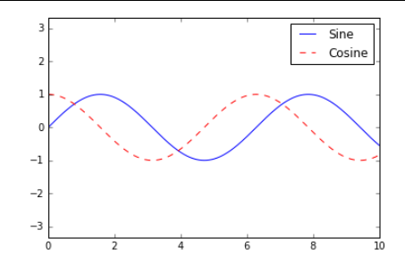

## Visualization

## Visualize Data from Data Analysis

### Matplotlib

Matplotlib is a Python plotting library that provides a MATLAB-like interface. Here are a few examples of how to create plots using Matplotlib that resemble MATLAB plots:

Line Plot

```python
import matplotlib.pyplot as plt
import numpy as np

# Generate some data
x = np.linspace(0, 10, 100)
y = np.sin(x)

# Create the plot
plt.plot(x, y)
plt.xlabel('x')
plt.ylabel('y')
plt.title('Sine Wave')
plt.grid(True)
plt.show()
```

Scatter Plot

```python
import matplotlib.pyplot as plt
import numpy as np

# Generate some random data
x = np.random.rand(100)
y = np.random.rand(100)

# Create the plot
plt.scatter(x, y)
plt.xlabel('x')
plt.ylabel('y')
plt.title('Scatter Plot')
plt.grid(True)
plt.show()
```

Bar Plot

```python
import matplotlib.pyplot as plt
import numpy as np

# Create some data
categories = ['A', 'B', 'C', 'D']
values = [10, 25, 15, 30]

# Create the plot
plt.bar(categories, values)
plt.xlabel('Categories')
plt.ylabel('Values')
plt.title('Bar Chart')
plt.grid(True)
plt.show()
```

Histogram

```python
import matplotlib.pyplot as plt
import numpy as np

# Generate some random data
data = np.random.randn(1000)

# Create the plot
plt.hist(data, bins=20)
plt.xlabel('Value')
plt.ylabel('Frequency')
plt.title('Histogram')
plt.grid(True)
plt.show()
```

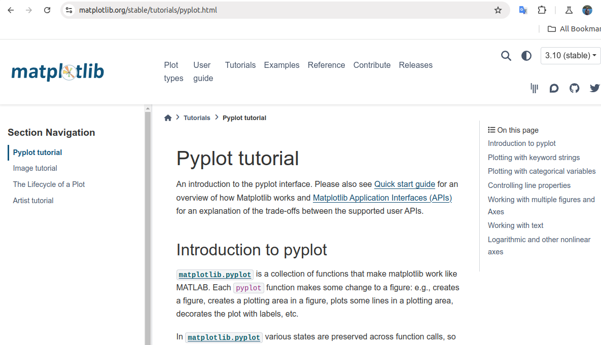

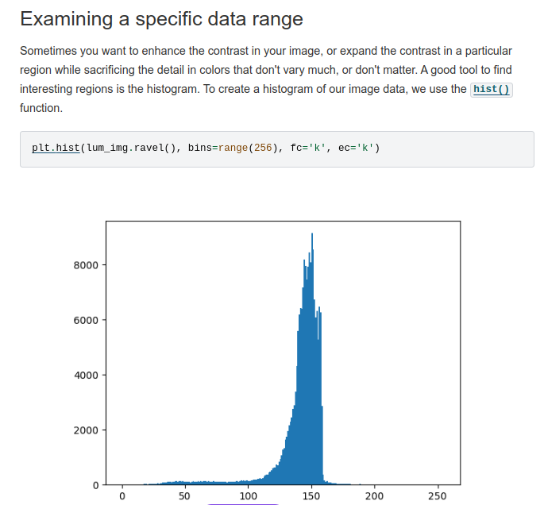


### Seaborn

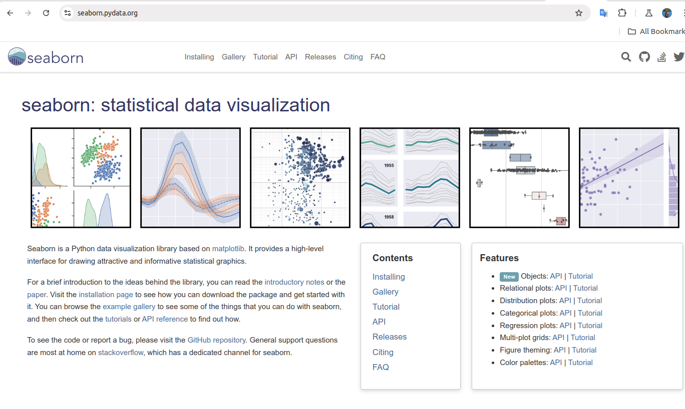

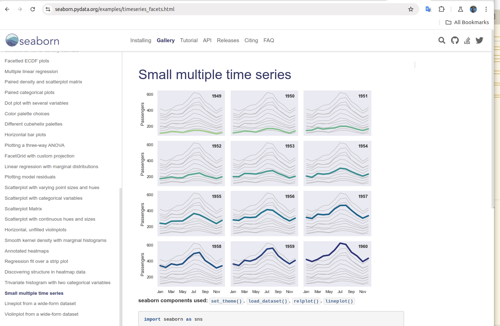


## D3 - A JavaScript Visualization Library for the Web Development


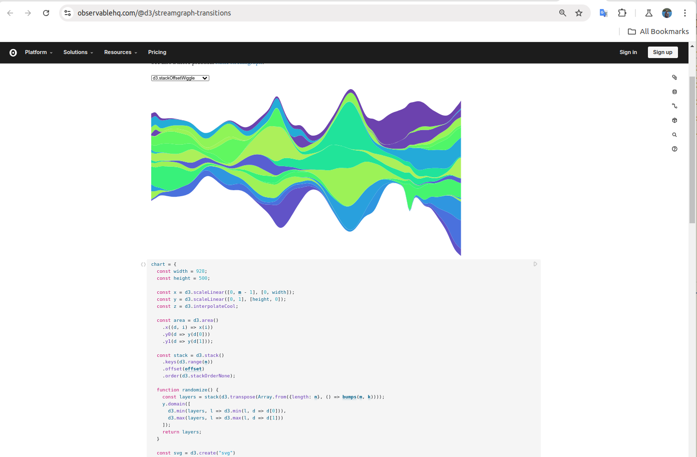

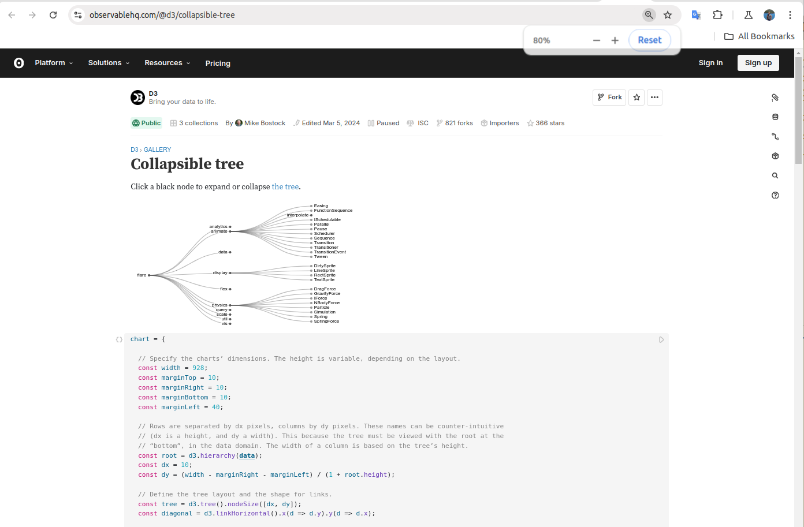

## Apache Echarts

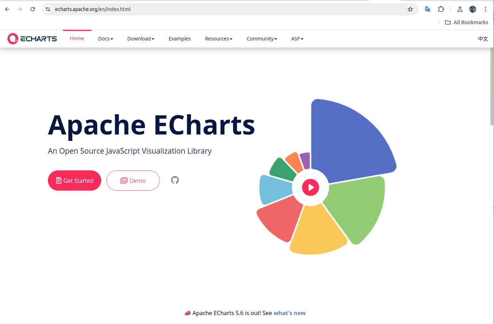

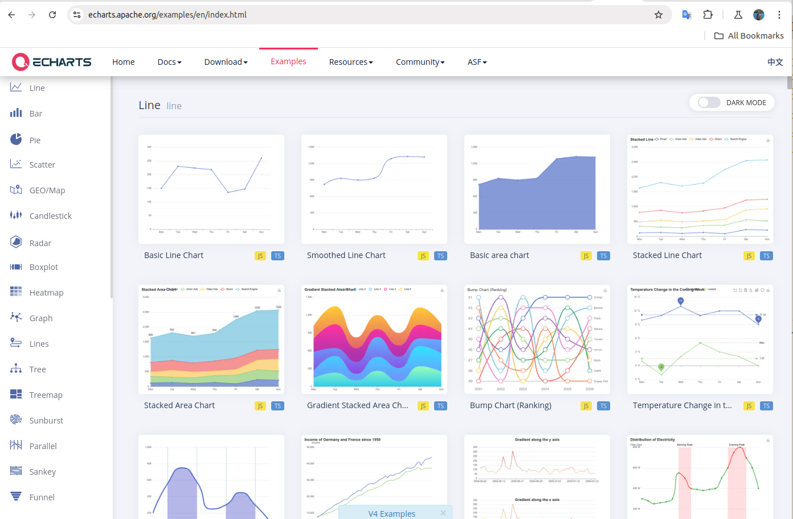

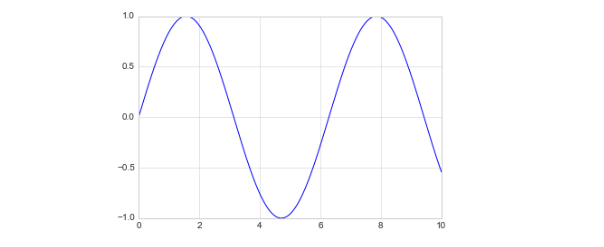

## Visualization is everywhere

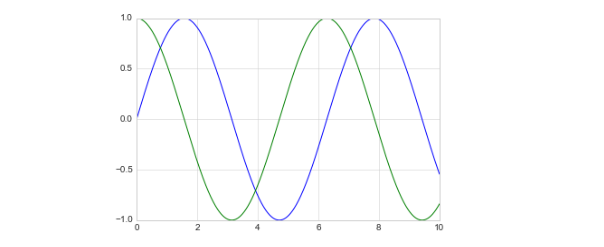

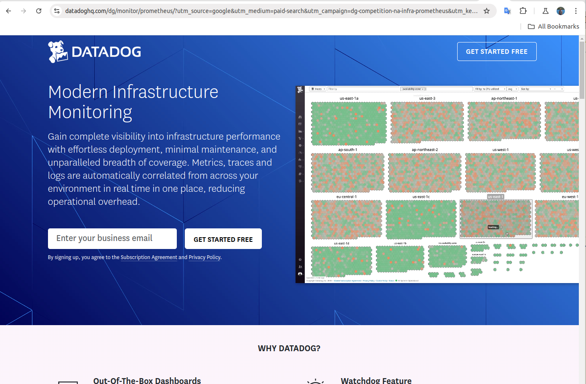

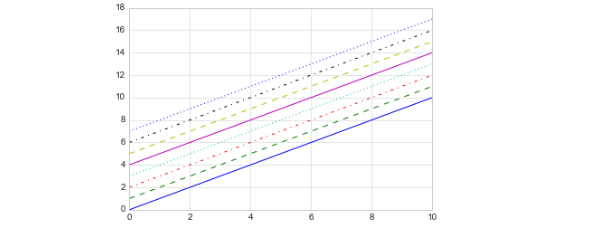

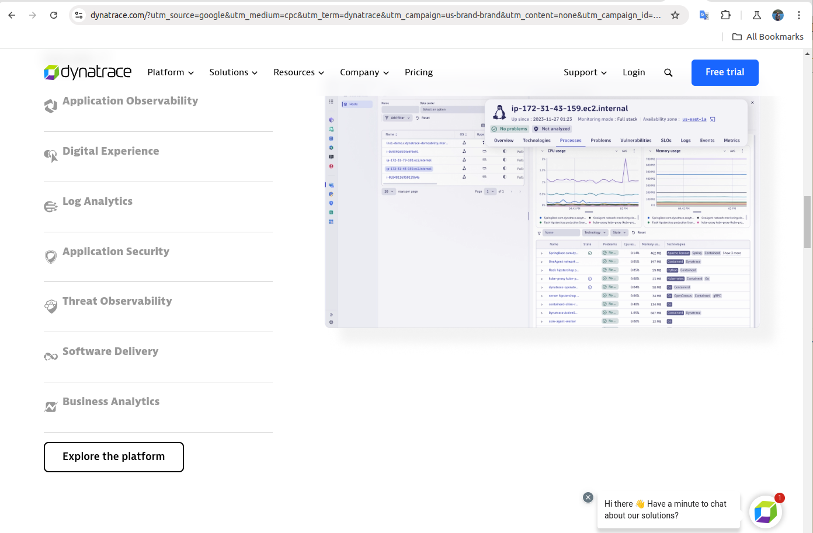

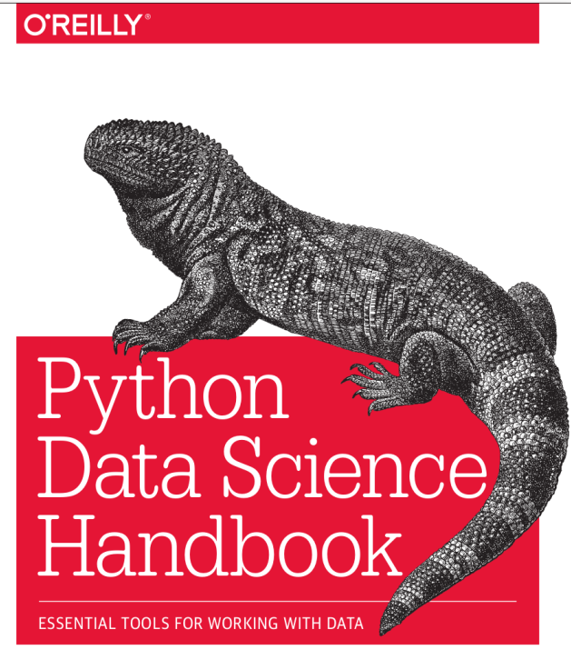


Snowflake uses the above programming language's libraries to visualize data.

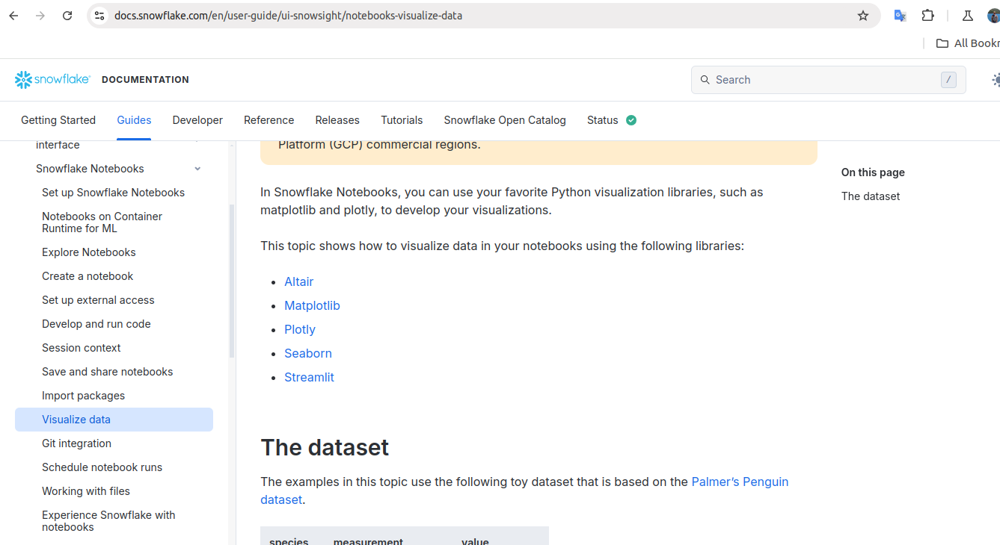

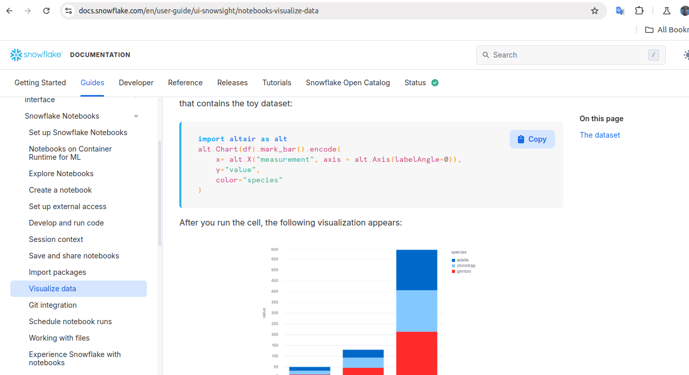

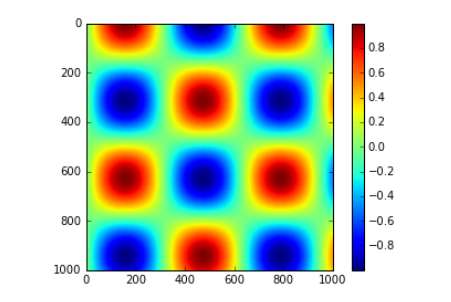

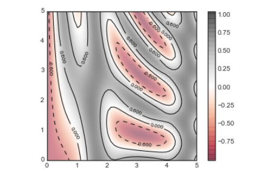

## Visualization in Business Application

* Tableau

* PowerBI

Since we are business major, we are more interested in learning more specialized softwares such as Tableau and PowerBI.
In the next few classes we will be learning a little more about these two softwares.
