# Introduction Data Visualization

https://en.wikipedia.org/wiki/Data_and_information_visualization

## Graphics and Traditional Visualization

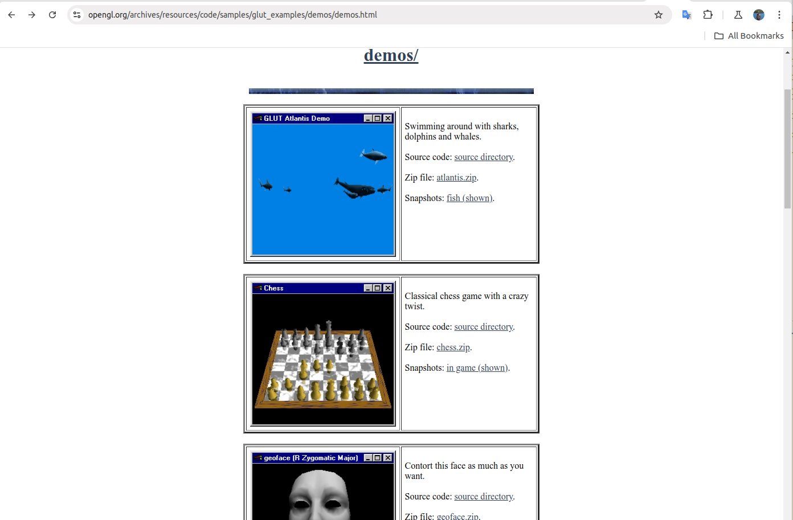

## Visualize Data from Data Analysis

When we study data science, Machine Learning or any fundamental python or data programming, we might have been learning a little bit or heard about the following Python libraries for data visualization.

Data Visualization has become an indispensable parts of the data science including ML and any business key metrics.
We need to learn not only various charting types as regard with what they are and what they are best used for but also to learn some emerging new chart types. But anyhow, in the following section, we are going to unearth some of these python libraries and give you some idea how the commercial software have been built with these underlined libraries behind the scene including Python and Javascript.

### Matplotlib

Matplotlib is a Python plotting library that provides a MATLAB-like interface. Here are a few examples of how to create plots using Matplotlib that resemble MATLAB plots:

**Line Plot**

```python
import matplotlib.pyplot as plt
import numpy as np

# Generate some data
x = np.linspace(0, 10, 100)
y = np.sin(x)

# Create the plot
plt.plot(x, y)
plt.xlabel('x')
plt.ylabel('y')
plt.title('Sine Wave')
plt.grid(True)
plt.show()
```

**Scatter Plot**

```python
import matplotlib.pyplot as plt
import numpy as np

# Generate some random data
x = np.random.rand(100)
y = np.random.rand(100)

# Create the plot
plt.scatter(x, y)
plt.xlabel('x')
plt.ylabel('y')
plt.title('Scatter Plot')
plt.grid(True)
plt.show()
```

**Bar Plot**

```python
import matplotlib.pyplot as plt
import numpy as np

# Create some data
categories = ['A', 'B', 'C', 'D']
values = [10, 25, 15, 30]

# Create the plot
plt.bar(categories, values)
plt.xlabel('Categories')
plt.ylabel('Values')
plt.title('Bar Chart')
plt.grid(True)
plt.show()
```

**Histogram**

```python
import matplotlib.pyplot as plt
import numpy as np

# Generate some random data
data = np.random.randn(1000)

# Create the plot
plt.hist(data, bins=20)
plt.xlabel('Value')
plt.ylabel('Frequency')
plt.title('Histogram')
plt.grid(True)
plt.show()
```


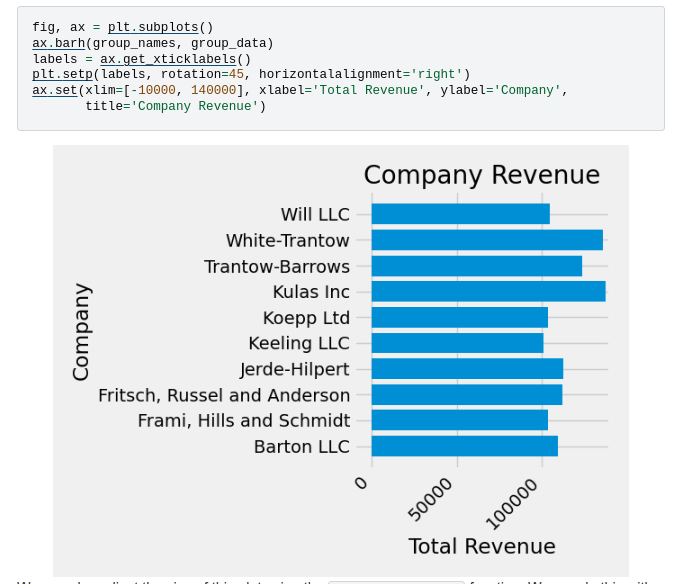

### Seaborn


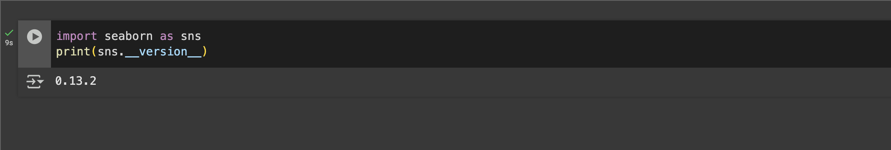

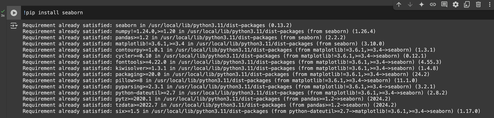

## D3 - A JavaScript Visualization Library for the Web Development

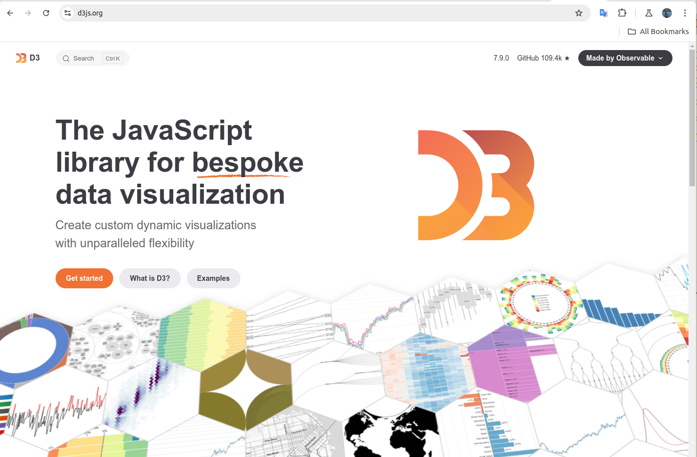

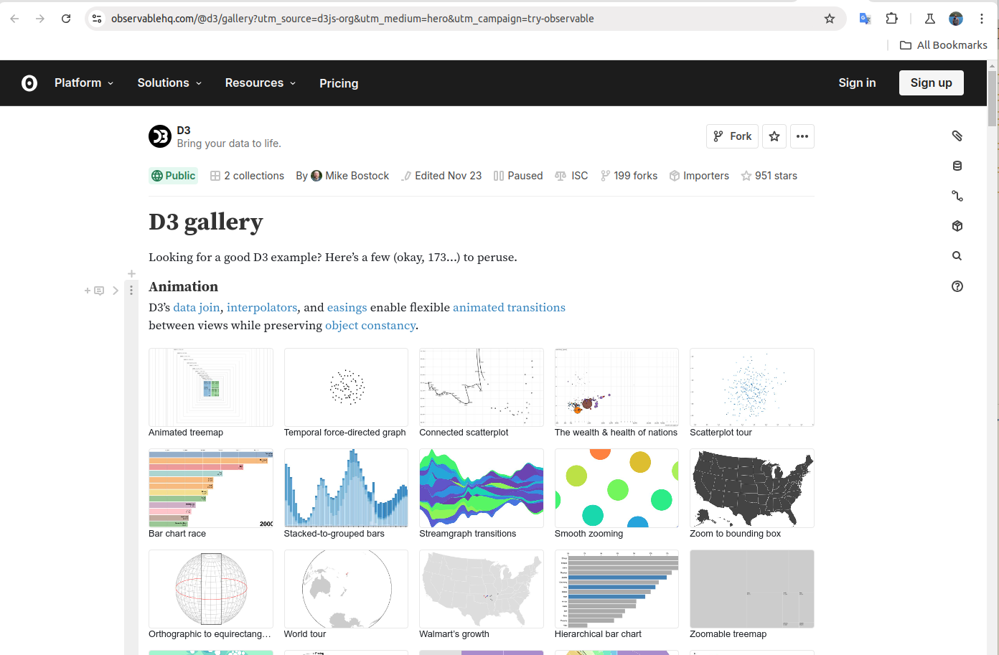


## Apache Echarts


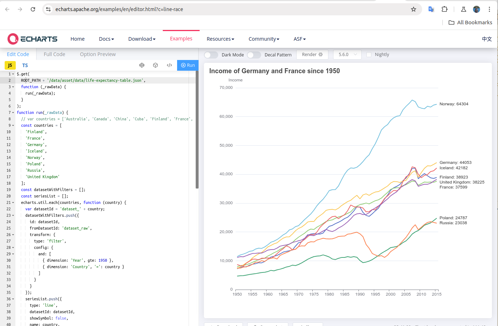

## Visualization is everywhere

In this section, I would like to show you a wide range of software systems(commercial software) that could do data visualization. As a matter of fact, data visualization has become a great selling-point for these commercial softwares.
You might be wondering why there are so many commercial software doing visualization or in another word, there are less open-source visualization software as thorough as commercials. The reason behind is that, there are a lot of software development efforts to analyze the market's real needs and putting a lot of capital efforts to implement such softwares.

The following are a group of the most popular and famous commercial softwares we have seen in the market and each of them are serving for different purpose but most likely they are all using different charts and behind the charts are the data science and mathematics to accure and aggrate the data. It is more visual to give customers an idea what is going on.

**Grafana**


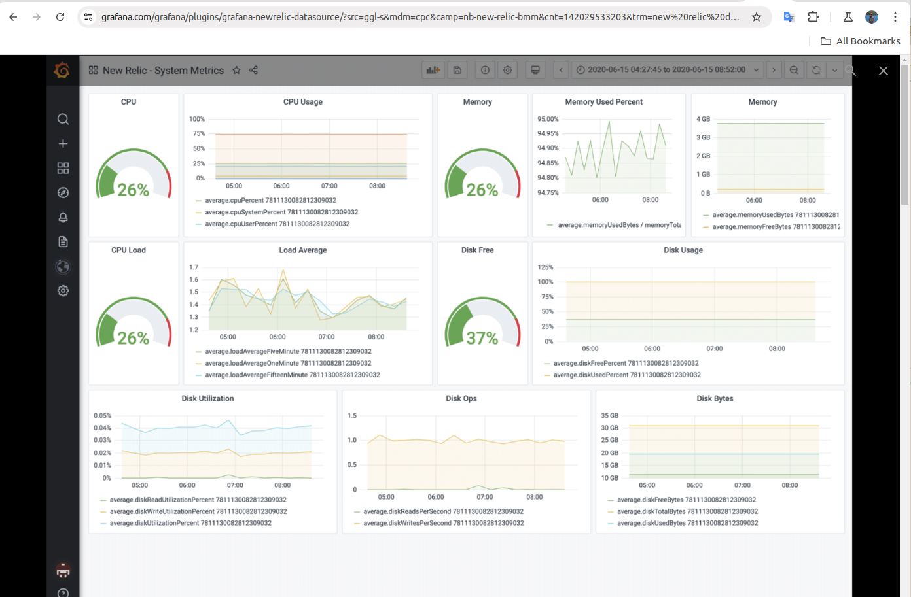

**Data Dog**


**Dynatrace**


**Data Bricks**

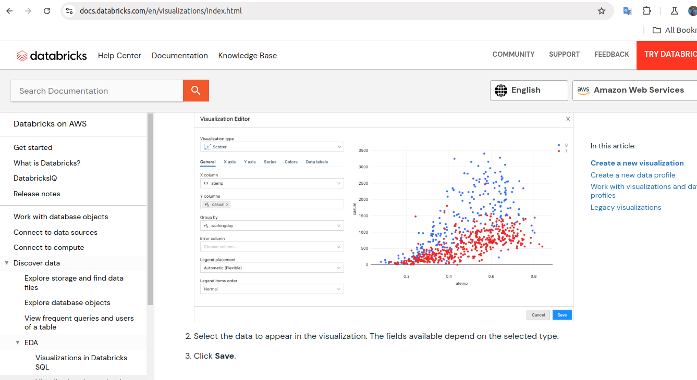

**Snowflakes**

Snowflake uses the above programming language's libraries such as python and Javascript to visualize data.


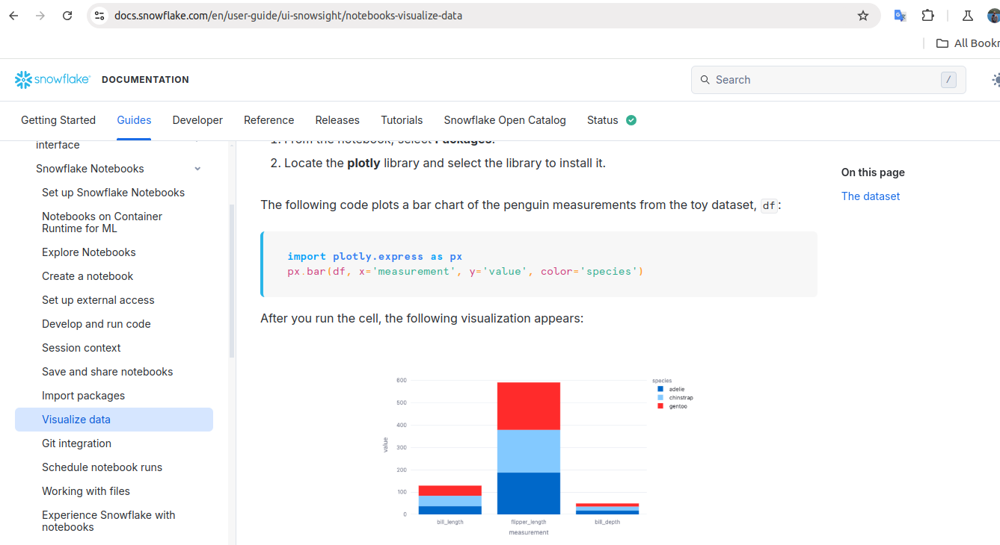

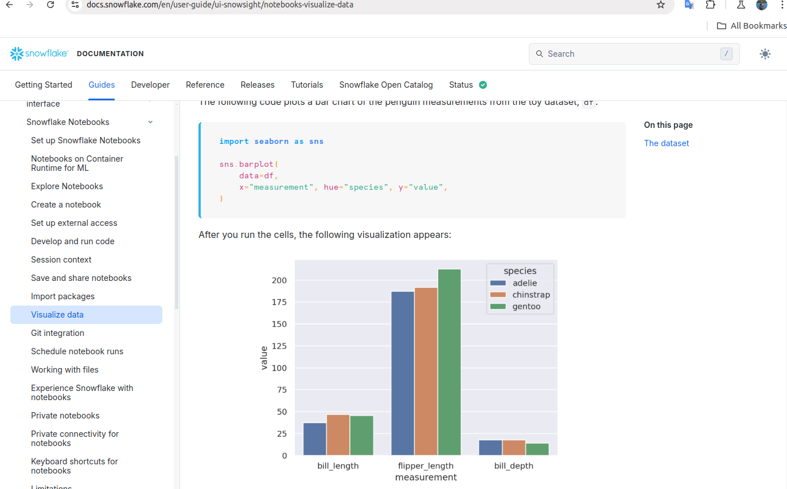

## Visualization in Business Application

* Tableau

* PowerBI

Since we are business major, we are more interested in learning more specialized softwares such as Tableau and PowerBI.
In the next few classes we will be learning a little more about these two softwares.
