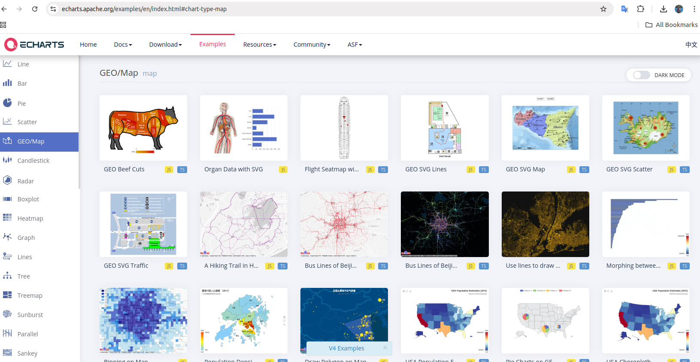
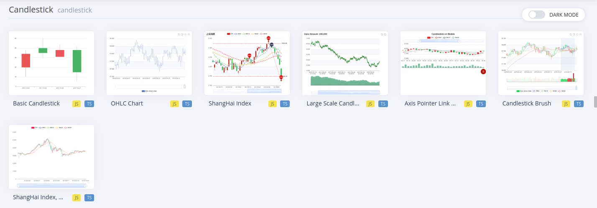
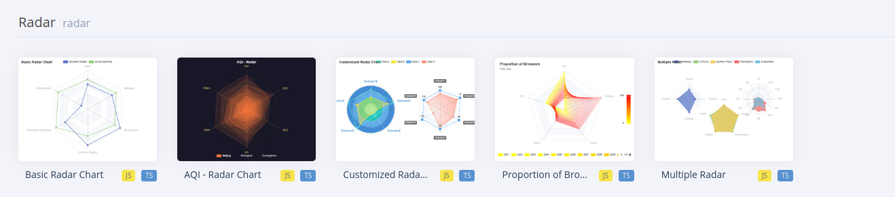
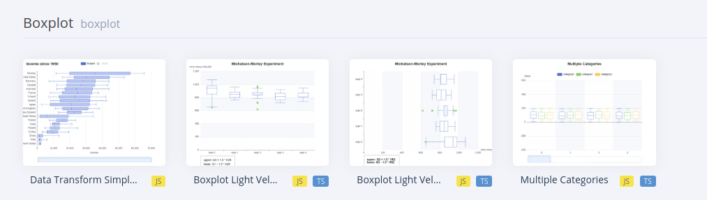
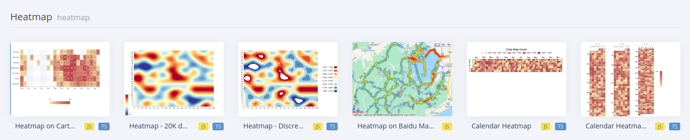
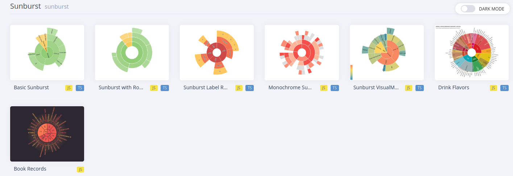
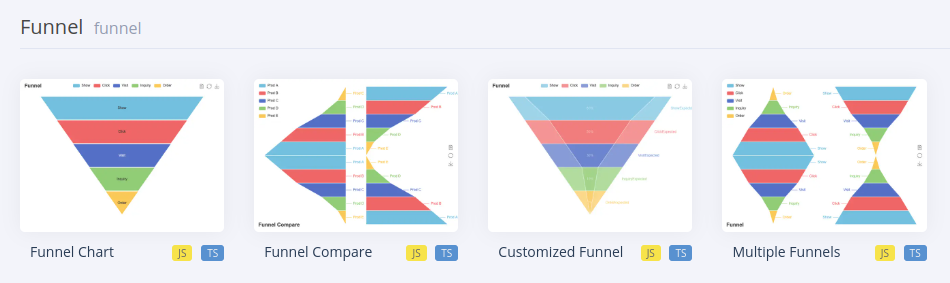
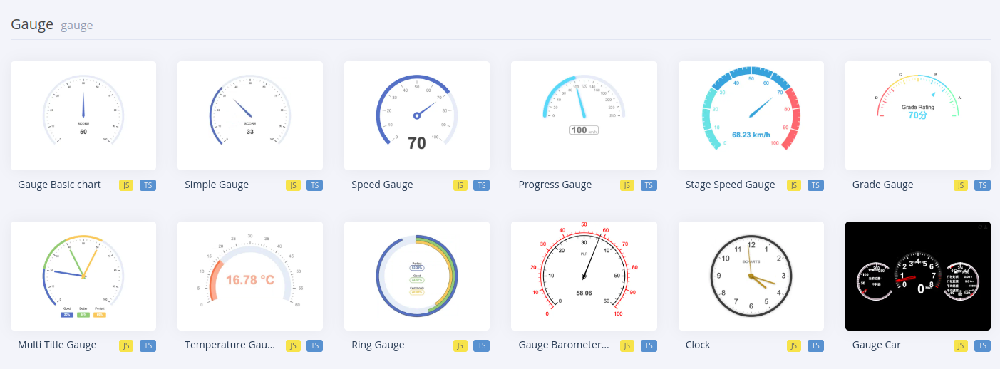
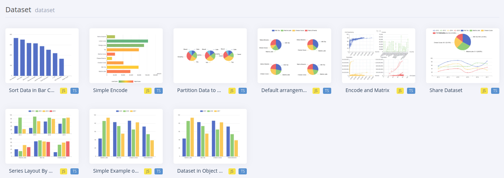
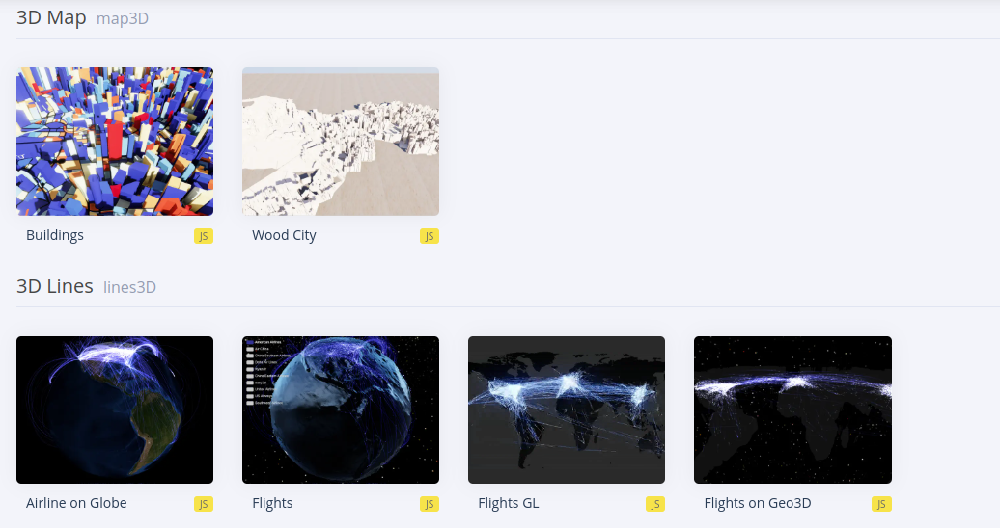

# Introduction to Apache ECharts

## What is Echarts

## Features

## ECharts: A Declarative Framework for Rapid Construction of Web-based Visualization

[ECharts: A Declarative Framework for Rapid Construction of Web-based Visualization](https://www.sciencedirect.com/science/article/pii/S2468502X18300068)

Examples of ECharts chart types. From top to down, left to right: scatterplot, line chart, candle-stick charts, geomap, radar chart, node-link graph, heatmap, tree diagram, sankey diagram, parallel coordinates, gauge chart, treemap.

## Who uses ECharts

## Powerful Visualization

### Ref

- https://echarts.apache.org/en/index.html