# Introduction to Apache ECharts

## What is Echarts

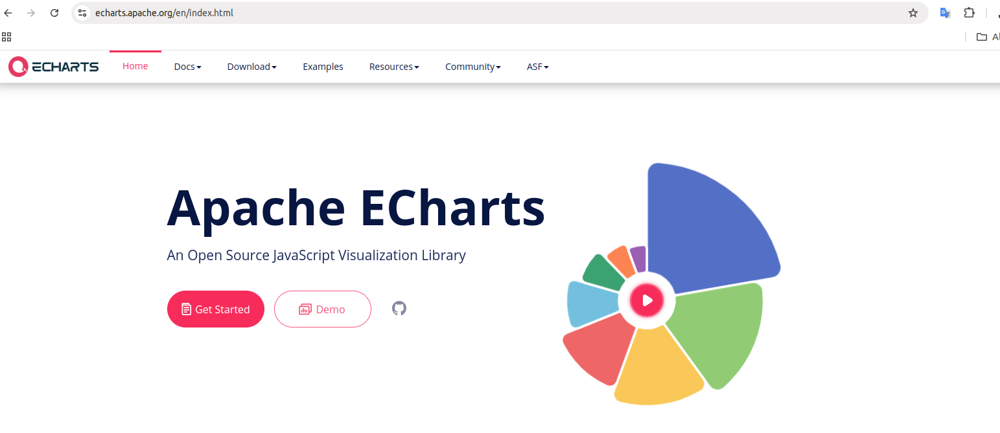

## Features

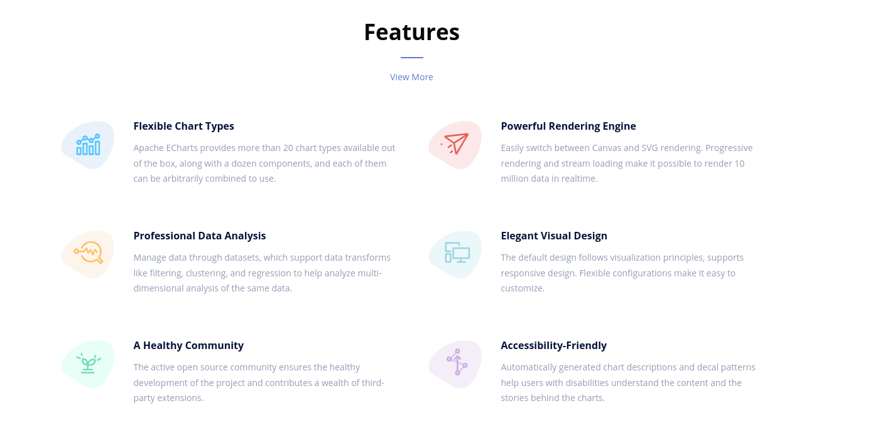

## ECharts: A Declarative Framework for Rapid Construction of Web-based Visualization

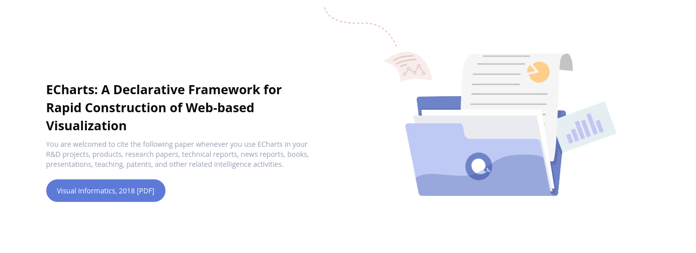

[ECharts: A Declarative Framework for Rapid Construction of Web-based Visualization](https://www.sciencedirect.com/science/article/pii/S2468502X18300068)

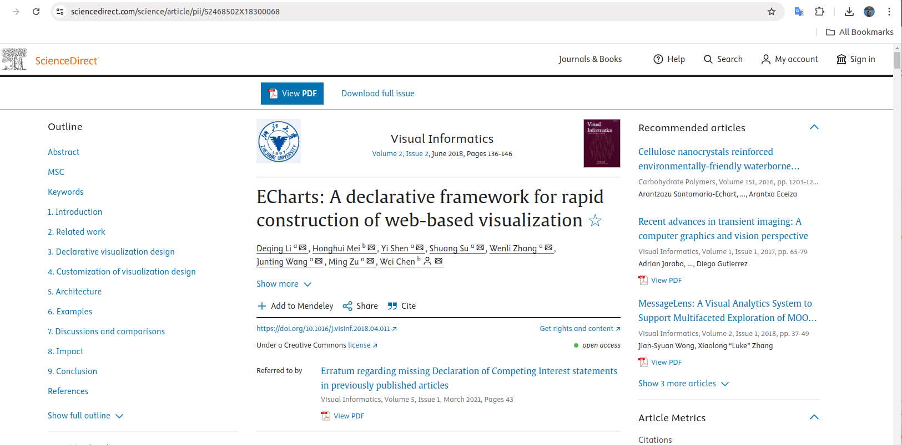

Examples of ECharts chart types. From top to down, left to right: scatterplot, line chart, candle-stick charts, geomap, radar chart, node-link graph, heatmap, tree diagram, sankey diagram, parallel coordinates, gauge chart, treemap.

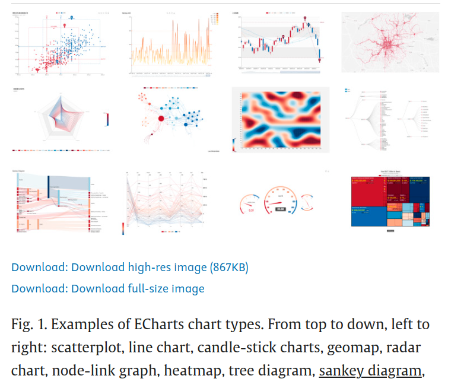

## Who uses ECharts


## Powerful Visualization Capabilities

Here are some examples that you can see the richess of the chart types it offered,

* Radar charts


* GEO MAP


* Candle Stick


* Boxplot


* Heatmap


* Graph

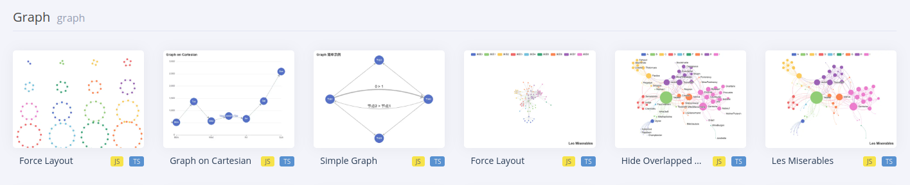

* Lines
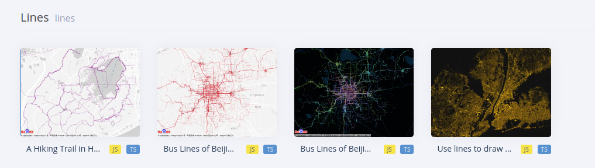

* Tree

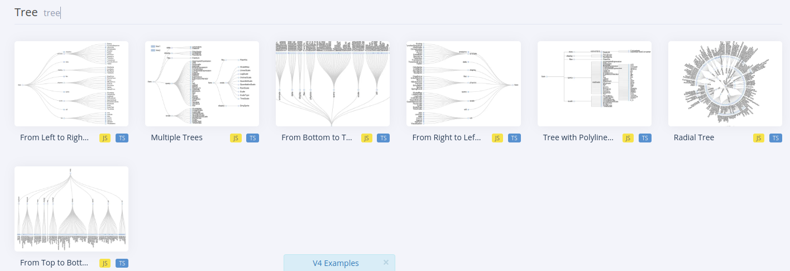

* Treemap

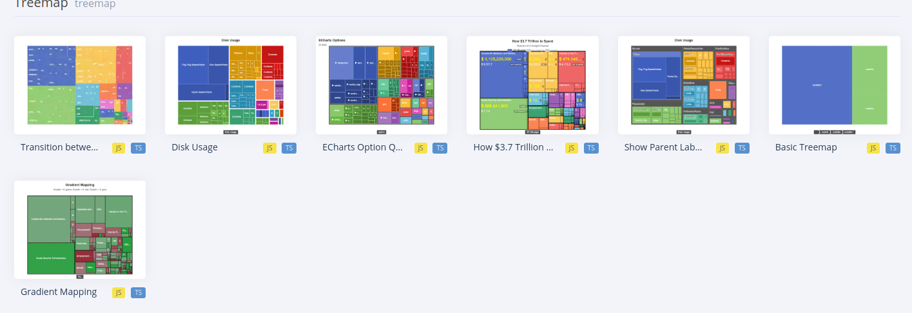

* Sunburst


* Parallel

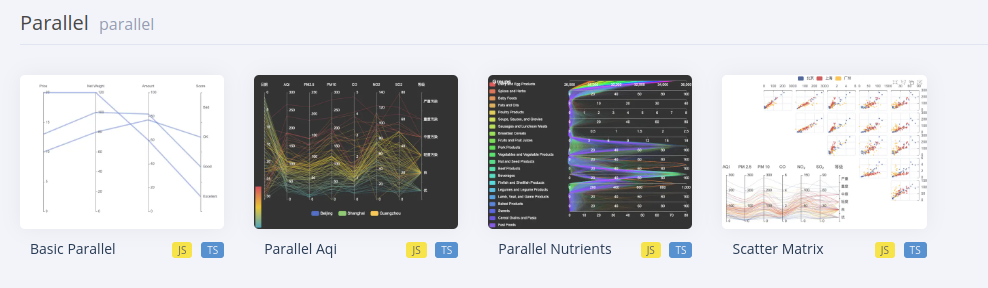

* Sankey

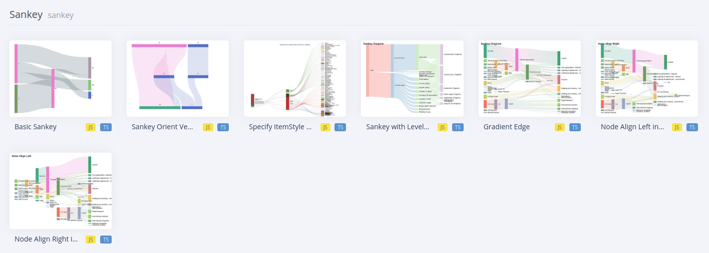

* Funnel


* Gauge


* PictorialBar

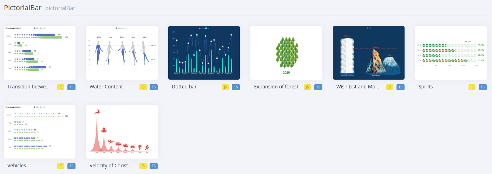

* Calendar

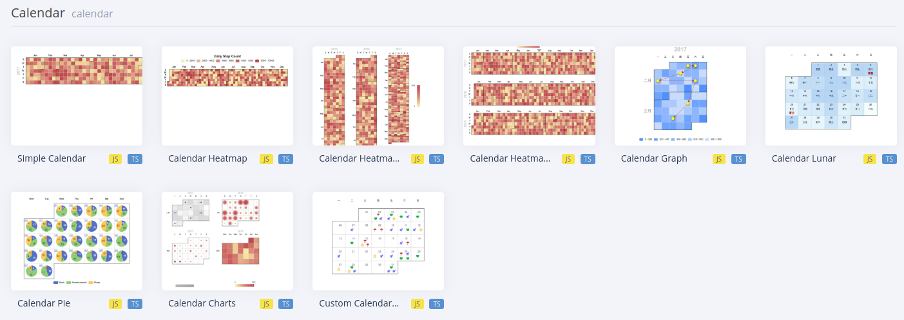

* Dataset


* 3D Bar

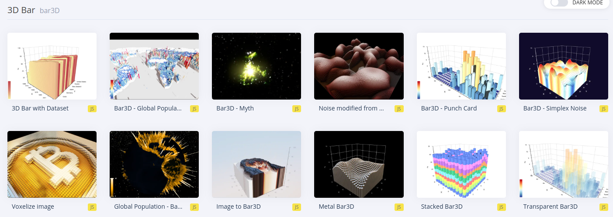

* 3D Scatter


* 3D Surface

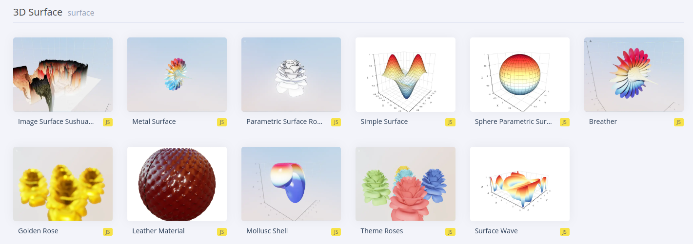

* 3D Map


* Flow GL

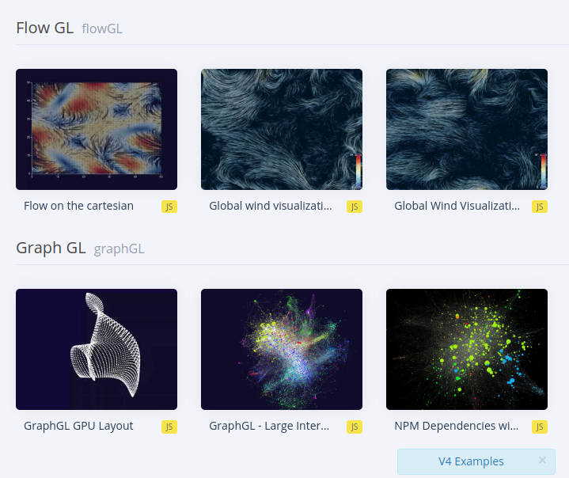

## Let us run some code

* Save the following into `barchart.html`

```html
<!DOCTYPE html>
<html lang="en">
<head>
  <meta charset="UTF-8">
  <meta name="viewport" content="width=device-width, initial-scale=1.0">
  <title>ECharts Example with Vanilla JS</title>
  <script src="https://cdn.jsdelivr.net/npm/echarts@5.4.1/dist/echarts.min.js"></script>
  <style>
    #main {
      width: 600px;
      height: 400px;
    }
  </style>
</head>
<body>
  <h2>ECharts Example</h2>
  <div id="main"></div>

  <script>
    // Initialize the chart
    var chart = echarts.init(document.getElementById('main'));

    // Chart options
    var option = {
      title: {
        text: 'ECharts Basic Example'
      },
      tooltip: {},
      legend: {
        data: ['Sales']
      },
      xAxis: {
        data: ['Shirts', 'Cardigans', 'Chiffon', 'Pants', 'Heels', 'Socks']
      },
      yAxis: {},
      series: [
        {
          name: 'Sales',
          type: 'bar',
          data: [5, 20, 36, 10, 10, 20]
        }
      ]
    };

    // Set the options
    chart.setOption(option);
  </script>
</body>
</html>
```

* Open it with your browser (Chrome or firefox).

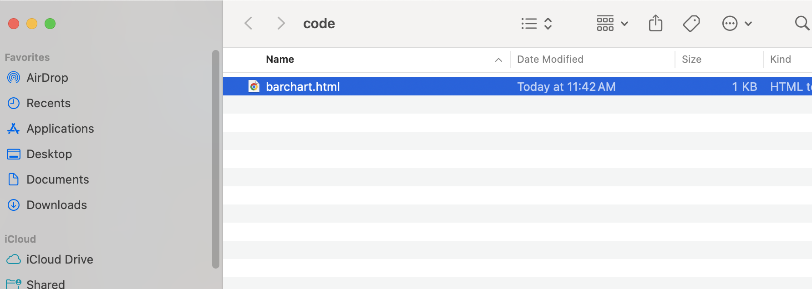

* The html will be rendered in the broswer like the following.

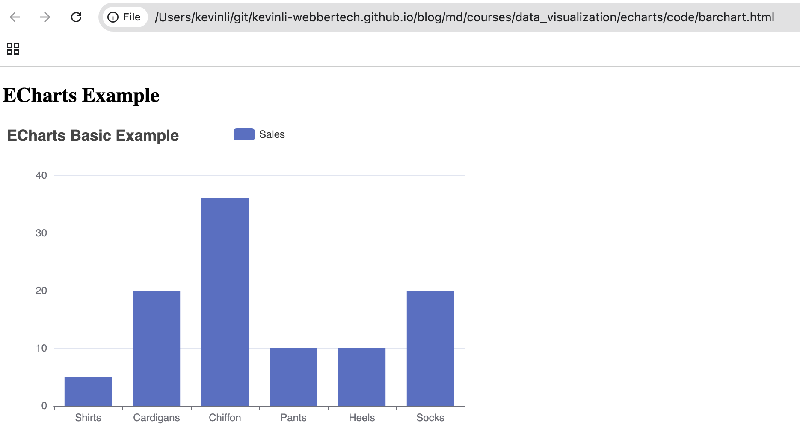

**This code:**

* Loads ECharts from a CDN.
* Creates a div element as a container.
* Initializes an ECharts instance and configures a basic bar chart.
* Renders the chart inside the container.


>Hint: For doing any future works, we could,
* modify the above html to fit our need.
* just use the cdn url for the js library of the echarts for the rest of the tutorials.

### Ref

- https://echarts.apache.org/en/index.html