# Visualization with ECharts - Line and Bar Charts

In this tutorial, I would like to introduce you some javascript code to call ECharts to draw a couple of most commonly used chart tyeps.

Remember this is the foundation of the implementation of a lot of commercial web systems.

After today's class, you will learn and be more confident about both Javascript and web visualization. In this tutorial I list you some good examples that I compiled and I was able to provide you the complete html code to copy and paste and to run them. The purpose is for you to learn the usage by referencing these examples and modify it for your own use.

## Takeaway

* Line Chart
  * Basic line chart
  * Smoothed Line Chart
  * Stacked Line Chart
  * Line Gradient
  * Function Plot
  * Line Race
  * Step Line
  * line-in-cartesian-coordinate-system

* Bar Chart
  * Basic Bar
  * bar-polar-label-radial
  * bar-y-category
  * bar-polar-label-tangential
  * polar-endAngle

## Line Chart

### Basic line chart

Please copy and save the code to `basic_line.html`.

``html
<!DOCTYPE html>
<html lang="en">
<head>
  <meta charset="UTF-8">
  <meta name="viewport" content="width=device-width, initial-scale=1.0">
  <title>ECharts Example with Vanilla JS</title>
  <script src="https://cdn.jsdelivr.net/npm/echarts@5.4.1/dist/echarts.min.js"></script>
  <style>
    #main {
      width: 600px;
      height: 400px;
    }
  </style>
</head>
<body>
  <h2>ECharts Example</h2>
  <div id="main"></div>

  <script>
    // Initialize the chart
    var chart = echarts.init(document.getElementById('main'));

    // Chart options
    var option = {
        xAxis: {
          type: 'category',
          data: ['Mon', 'Tue', 'Wed', 'Thu', 'Fri', 'Sat', 'Sun']
        },
        yAxis: {
          type: 'value'
        },
        series: [
          {
            data: [150, 230, 224, 218, 135, 147, 260],
            type: 'line'
          }
        ]
};

    // Set the options
    chart.setOption(option);
  </script>
</body>
</html>
```

Open the containing folder, and double click on the html file you just saved.
And you will see the chart rendered like below,

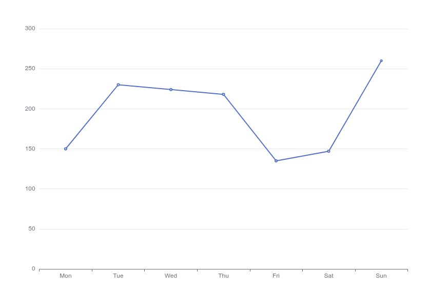

### Smoothed Line Chart

Please copy and save the code to `smooth_line_chart.html`.

```html
<!DOCTYPE html>
<html lang="en">
<head>
  <meta charset="UTF-8">
  <meta name="viewport" content="width=device-width, initial-scale=1.0">
  <title>ECharts Example with Vanilla JS</title>
  <script src="https://cdn.jsdelivr.net/npm/echarts@5.4.1/dist/echarts.min.js"></script>
  <style>
    #main {
      width: 600px;
      height: 400px;
    }
  </style>
</head>
<body>
  <h2>ECharts Example</h2>
  <div id="main"></div>

  <script>
    // Initialize the chart
    var chart = echarts.init(document.getElementById('main'));

    // Chart options
    var option = {
      xAxis: {
        type: 'category',
        data: ['Mon', 'Tue', 'Wed', 'Thu', 'Fri', 'Sat', 'Sun']
      },
      yAxis: {
        type: 'value'
      },
      series: [
        {
          data: [820, 932, 901, 934, 1290, 1330, 1320],
          type: 'line',
          smooth: true
        }
      ]
    };

    // Set the options
    chart.setOption(option);
  </script>
</body>
</html>
```

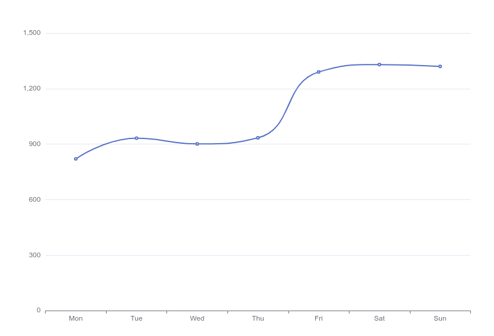

Open the containing folder, and double click on the html file you just saved.
And you will see the chart rendered like below,

### Stacked Line Chart

Please copy and save the code to `stacked_line_chart.html`.

```html
<!DOCTYPE html>
<html lang="en">
<head>
  <meta charset="UTF-8">
  <meta name="viewport" content="width=device-width, initial-scale=1.0">
  <title>ECharts Example with Vanilla JS</title>
  <script src="https://cdn.jsdelivr.net/npm/echarts@5.4.1/dist/echarts.min.js"></script>
  <style>
    #main {
      width: 600px;
      height: 400px;
    }
  </style>
</head>
<body>
  <h2>ECharts Example</h2>
  <div id="main"></div>

  <script>
    // Initialize the chart
    var chart = echarts.init(document.getElementById('main'));

    // Chart options
    var option = {
      title: {
        text: 'Stacked Line'
      },
      tooltip: {
        trigger: 'axis'
      },
      legend: {
        data: ['Email', 'Union Ads', 'Video Ads', 'Direct', 'Search Engine']
      },
      grid: {
        left: '3%',
        right: '4%',
        bottom: '3%',
        containLabel: true
      },
      toolbox: {
        feature: {
          saveAsImage: {}
        }
      },
      xAxis: {
        type: 'category',
        boundaryGap: false,
        data: ['Mon', 'Tue', 'Wed', 'Thu', 'Fri', 'Sat', 'Sun']
      },
      yAxis: {
        type: 'value'
      },
      series: [
        {
          name: 'Email',
          type: 'line',
          stack: 'Total',
          data: [120, 132, 101, 134, 90, 230, 210]
        },
        {
          name: 'Union Ads',
          type: 'line',
          stack: 'Total',
          data: [220, 182, 191, 234, 290, 330, 310]
        },
        {
          name: 'Video Ads',
          type: 'line',
          stack: 'Total',
          data: [150, 232, 201, 154, 190, 330, 410]
        },
        {
          name: 'Direct',
          type: 'line',
          stack: 'Total',
          data: [320, 332, 301, 334, 390, 330, 320]
        },
        {
          name: 'Search Engine',
          type: 'line',
          stack: 'Total',
          data: [820, 932, 901, 934, 1290, 1330, 1320]
        }
      ]
    };

    // Set the options
    chart.setOption(option);
  </script>
</body>
</html>
```

Open the containing folder, and double click on the html file you just saved.
And you will see the chart rendered like below,

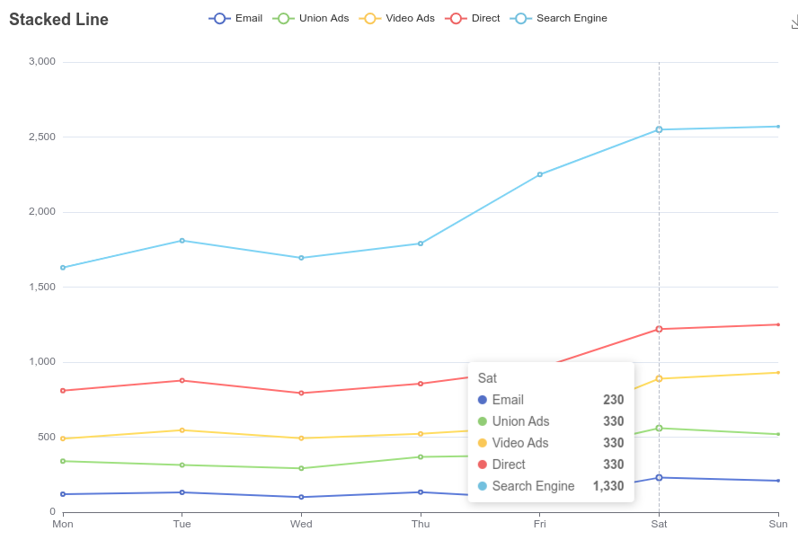

### Line Gradient

Please copy and save the code to `line_gradient.html`.

```html
<!DOCTYPE html>
<html lang="en">
<head>
  <meta charset="UTF-8">
  <meta name="viewport" content="width=device-width, initial-scale=1.0">
  <title>ECharts Example with Vanilla JS</title>
  <script src="https://cdn.jsdelivr.net/npm/echarts@5.4.1/dist/echarts.min.js"></script>
  <style>
    #main {
      width: 600px;
      height: 400px;
    }
  </style>
</head>
<body>
  <h2>ECharts Example</h2>
  <div id="main"></div>

  <script>
    // Initialize the chart
    var chart = echarts.init(document.getElementById('main'));

    // Chart options
    // prettier-ignore
    const data = [["2000-06-05", 116], ["2000-06-06", 129], ["2000-06-07", 135], ["2000-06-08", 86], ["2000-06-09", 73], ["2000-06-10", 85], ["2000-06-11", 73], ["2000-06-12", 68], ["2000-06-13", 92], ["2000-06-14", 130], ["2000-06-15", 245], ["2000-06-16", 139], ["2000-06-17", 115], ["2000-06-18", 111], ["2000-06-19", 309], ["2000-06-20", 206], ["2000-06-21", 137], ["2000-06-22", 128], ["2000-06-23", 85], ["2000-06-24", 94], ["2000-06-25", 71], ["2000-06-26", 106], ["2000-06-27", 84], ["2000-06-28", 93], ["2000-06-29", 85], ["2000-06-30", 73], ["2000-07-01", 83], ["2000-07-02", 125], ["2000-07-03", 107], ["2000-07-04", 82], ["2000-07-05", 44], ["2000-07-06", 72], ["2000-07-07", 106], ["2000-07-08", 107], ["2000-07-09", 66], ["2000-07-10", 91], ["2000-07-11", 92], ["2000-07-12", 113], ["2000-07-13", 107], ["2000-07-14", 131], ["2000-07-15", 111], ["2000-07-16", 64], ["2000-07-17", 69], ["2000-07-18", 88], ["2000-07-19", 77], ["2000-07-20", 83], ["2000-07-21", 111], ["2000-07-22", 57], ["2000-07-23", 55], ["2000-07-24", 60]];
    const dateList = data.map(function (item) {
      return item[0];
    });
    const valueList = data.map(function (item) {
      return item[1];
    });
    var option = {
      // Make gradient line here
      visualMap: [
        {
          show: false,
          type: 'continuous',
          seriesIndex: 0,
          min: 0,
          max: 400
        },
        {
          show: false,
          type: 'continuous',
          seriesIndex: 1,
          dimension: 0,
          min: 0,
          max: dateList.length - 1
        }
      ],
      title: [
        {
          left: 'center',
          text: 'Gradient along the y axis'
        },
        {
          top: '55%',
          left: 'center',
          text: 'Gradient along the x axis'
        }
      ],
      tooltip: {
        trigger: 'axis'
      },
      xAxis: [
        {
          data: dateList
        },
        {
          data: dateList,
          gridIndex: 1
        }
      ],
      yAxis: [
        {},
        {
          gridIndex: 1
        }
      ],
      grid: [
        {
          bottom: '60%'
        },
        {
          top: '60%'
        }
      ],
      series: [
        {
          type: 'line',
          showSymbol: false,
          data: valueList
        },
        {
          type: 'line',
          showSymbol: false,
          data: valueList,
          xAxisIndex: 1,
          yAxisIndex: 1
        }
      ]
    };

    // Set the options
    chart.setOption(option);
  </script>
</body>
</html>
```

Open the containing folder, and double click on the html file you just saved.
And you will see the chart rendered like below,

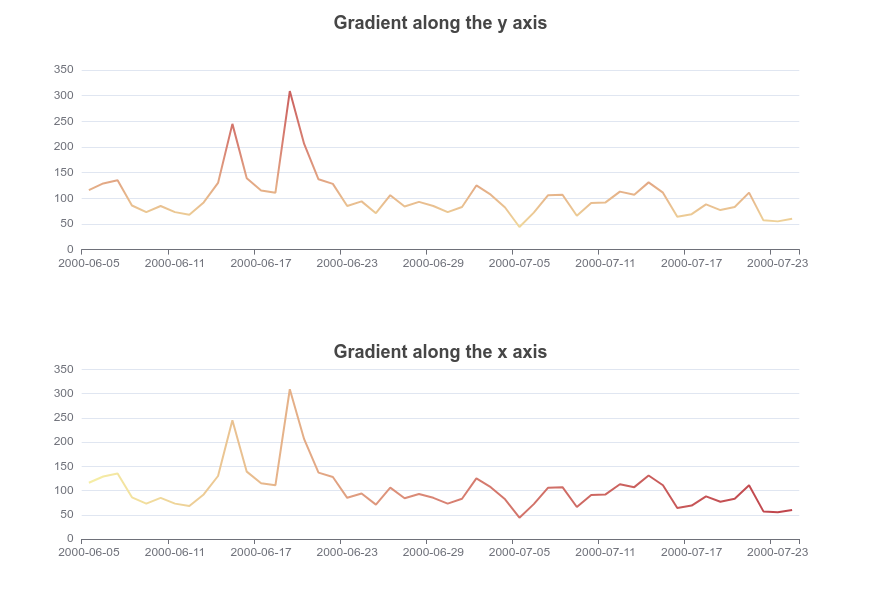

### Function Plot

Please copy and save the code to `function_plot.html`.

```html
<!DOCTYPE html>
<html lang="en">
<head>
  <meta charset="UTF-8">
  <meta name="viewport" content="width=device-width, initial-scale=1.0">
  <title>ECharts Example with Vanilla JS</title>
  <script src="https://cdn.jsdelivr.net/npm/echarts@5.4.1/dist/echarts.min.js"></script>
  <style>
    #main {
      width: 600px;
      height: 400px;
    }
  </style>
</head>
<body>
  <h2>ECharts Example</h2>
  <div id="main"></div>
  <script>
    
    // Initialize the chart
    var chart = echarts.init(document.getElementById('main'));

    function func(x) {
      x /= 10;
      return Math.sin(x) * Math.cos(x * 2 + 1) * Math.sin(x * 3 + 2) * 50;
    }

    function generateData() {
      let data = [];
      for (let i = -200; i <= 200; i += 0.1) {
        data.push([i, func(i)]);
      }
      return data;
    }

    // Chart options
     
    var option = {
      animation: false,
      grid: {
        top: 40,
        left: 50,
        right: 40,
        bottom: 50
      },
      xAxis: {
        name: 'x',
        minorTick: {
          show: true
        },
        minorSplitLine: {
          show: true
        }
      },
      yAxis: {
        name: 'y',
        min: -100,
        max: 100,
        minorTick: {
          show: true
        },
        minorSplitLine: {
          show: true
        }
      },
      dataZoom: [
        {
          show: true,
          type: 'inside',
          filterMode: 'none',
          xAxisIndex: [0],
          startValue: -20,
          endValue: 20
        },
        {
          show: true,
          type: 'inside',
          filterMode: 'none',
          yAxisIndex: [0],
          startValue: -20,
          endValue: 20
        }
      ],
      series: [
        {
          type: 'line',
          showSymbol: false,
          clip: true,
          data: generateData()
        }
      ]
    };

    // Set the options
    chart.setOption(option);
  </script>
</body>
</html>
```

Open the containing folder, and double click on the html file you just saved.
And you will see the chart rendered like below,

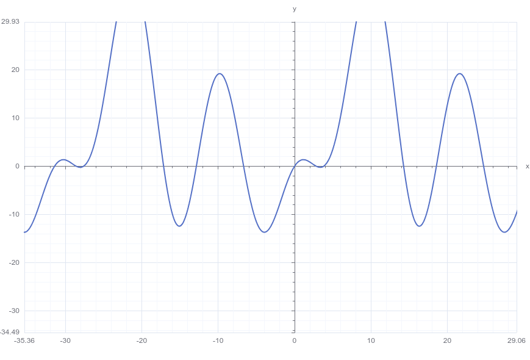

### Line Race

Please copy and save the code to `line_race.html`.

```html
<!DOCTYPE html>
<html lang="en">
<head>
  <meta charset="UTF-8">
  <meta name="viewport" content="width=device-width, initial-scale=1.0">
  <title>ECharts Example with Vanilla JS</title>
  <script src="https://cdn.jsdelivr.net/npm/echarts@5.4.1/dist/echarts.min.js"></script>
  <script src="https://echarts.apache.org/en/js/vendors/jquery@3.7.1/dist/jquery.min.js"></script>
  <!--
  https://echarts.apache.org/en/js/vendors/seedrandom@3.0.5/seedrandom.min.js
  https://echarts.apache.org/en/js/vendors/acorn@8.7.1/dist/acorn.min.js
-->
  <style>
    #main {
      width: 600px;
      height: 400px;
    }
  </style>
</head>
<body>
  <h2>ECharts Example</h2>
  <div id="main"></div>

  <script>
    
    var chartDom = document.getElementById('main');
    var myChart = echarts.init(chartDom);
    var option;

    $.get(
        './life-expectancy-table.json', 
      function (_rawData) {
        run(_rawData);
      }
    );

    function run(_rawData) {
      // var countries = ['Australia', 'Canada', 'China', 'Cuba', 'Finland', 'France', 'Germany', 'Iceland', 'India', 'Japan', 'North Korea', 'South Korea', 'New Zealand', 'Norway', 'Poland', 'Russia', 'Turkey', 'United Kingdom', 'United States'];
      const countries = [
        'Finland',
        'France',
        'Germany',
        'Iceland',
        'Norway',
        'Poland',
        'Russia',
        'United Kingdom'
      ];
    const datasetWithFilters = [];
    const seriesList = [];
    echarts.util.each(countries, function (country) {
      var datasetId = 'dataset_' + country;
      datasetWithFilters.push({
        id: datasetId,
        fromDatasetId: 'dataset_raw',
        transform: {
          type: 'filter',
          config: {
            and: [
              { dimension: 'Year', gte: 1950 },
              { dimension: 'Country', '=': country }
            ]
          }
        }
      });
      seriesList.push({
        type: 'line',
        datasetId: datasetId,
        showSymbol: false,
        name: country,
        endLabel: {
          show: true,
          formatter: function (params) {
            return params.value[3] + ': ' + params.value[0];
          }
        },
        labelLayout: {
          moveOverlap: 'shiftY'
        },
        emphasis: {
          focus: 'series'
        },
        encode: {
          x: 'Year',
          y: 'Income',
          label: ['Country', 'Income'],
          itemName: 'Year',
          tooltip: ['Income']
        }
      });
    });
  option = {
      animationDuration: 10000,
      dataset: [
        {
          id: 'dataset_raw',
          source: _rawData
        },
        ...datasetWithFilters
      ],
      title: {
        text: 'Income of Germany and France since 1950'
      },
      tooltip: {
        order: 'valueDesc',
        trigger: 'axis'
      },
      xAxis: {
        type: 'category',
        nameLocation: 'middle'
      },
      yAxis: {
        name: 'Income'
      },
      grid: {
        right: 140
      },
      series: seriesList
    };
    myChart.setOption(option);
  }
  </script>
</body>
</html>
```

Open the containing folder, and double click on the html file you just saved.
And you will see the chart rendered like below,

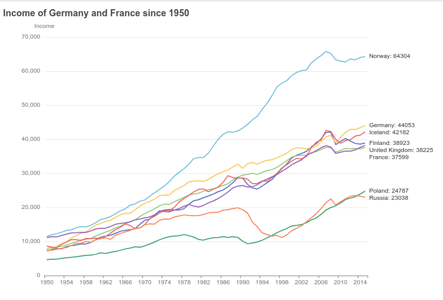

### Step Line

```html
<!DOCTYPE html>
<html lang="en">
<head>
  <meta charset="UTF-8">
  <meta name="viewport" content="width=device-width, initial-scale=1.0">
  <title>ECharts Example with Vanilla JS</title>
  <script src="https://cdn.jsdelivr.net/npm/echarts@5.4.1/dist/echarts.min.js"></script>
  <style>
    #main {
      width: 600px;
      height: 400px;
    }
  </style>
</head>
<body>
  <h2>ECharts Example</h2>
  <div id="main"></div>

  <script>
    // Initialize the chart
    var chart = echarts.init(document.getElementById('main'));

    // Chart options
    var option = {
      title: {
        text: 'Step Line'
      },
      tooltip: {
        trigger: 'axis'
      },
      legend: {
        data: ['Step Start', 'Step Middle', 'Step End']
      },
      grid: {
        left: '3%',
        right: '4%',
        bottom: '3%',
        containLabel: true
      },
      toolbox: {
        feature: {
          saveAsImage: {}
        }
      },
      xAxis: {
        type: 'category',
        data: ['Mon', 'Tue', 'Wed', 'Thu', 'Fri', 'Sat', 'Sun']
      },
      yAxis: {
        type: 'value'
      },
      series: [
        {
          name: 'Step Start',
          type: 'line',
          step: 'start',
          data: [120, 132, 101, 134, 90, 230, 210]
        },
        {
          name: 'Step Middle',
          type: 'line',
          step: 'middle',
          data: [220, 282, 201, 234, 290, 430, 410]
        },
        {
          name: 'Step End',
          type: 'line',
          step: 'end',
          data: [450, 432, 401, 454, 590, 530, 510]
        }
      ]
    };

    // Set the options
    chart.setOption(option);
  </script>
</body>
</html>
```

Open the containing folder, and double click on the html file you just saved.
And you will see the chart rendered like below,

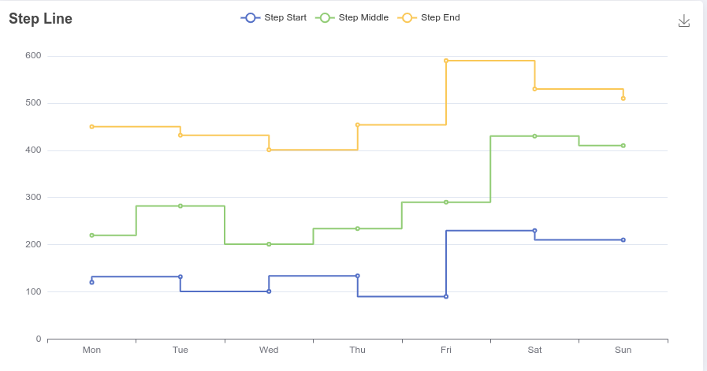

### line-in-cartesian-coordinate-system

Please copy and save the code to `line-in-cartesian-coordinate-system.html`.

```html
<!DOCTYPE html>
<html lang="en">
<head>
  <meta charset="UTF-8">
  <meta name="viewport" content="width=device-width, initial-scale=1.0">
  <title>ECharts Example with Vanilla JS</title>
  <script src="https://cdn.jsdelivr.net/npm/echarts@5.4.1/dist/echarts.min.js"></script>
  <style>
    #main {
      width: 600px;
      height: 400px;
    }
  </style>
</head>
<body>
  <h2>ECharts Example</h2>
  <div id="main"></div>

  <script>
    // Initialize the chart
    var chart = echarts.init(document.getElementById('main'));

    // Chart options
    option = {
      xAxis: {},
      yAxis: {},
      series: [
        {
          data: [
            [10, 40],
            [50, 100],
            [40, 20]
          ],
          type: 'line'
        }
      ]
    };

    // Set the options
    chart.setOption(option);
  </script>
</body>
</html>
```

Open the containing folder, and double click on the html file you just saved.
And you will see the chart rendered like below,

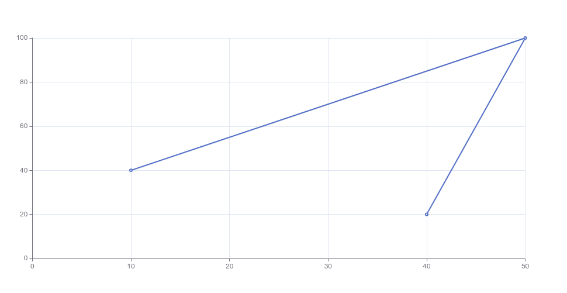

## Bar Chart

### Basic Bar

Please copy and save the code to `basic_bar.html`.

```html
<!DOCTYPE html>
<html lang="en">
<head>
  <meta charset="UTF-8">
  <meta name="viewport" content="width=device-width, initial-scale=1.0">
  <title>ECharts Example with Vanilla JS</title>
  <script src="https://cdn.jsdelivr.net/npm/echarts@5.4.1/dist/echarts.min.js"></script>
  <style>
    #main {
      width: 600px;
      height: 400px;
    }
  </style>
</head>
<body>
  <h2>ECharts Example</h2>
  <div id="main"></div>

  <script>
    // Initialize the chart
    var chart = echarts.init(document.getElementById('main'));

    option = {
  xAxis: {
    type: 'category',
    data: ['Mon', 'Tue', 'Wed', 'Thu', 'Fri', 'Sat', 'Sun']
  },
  yAxis: {
    type: 'value'
  },
  series: [
    {
      data: [120, 200, 150, 80, 70, 110, 130],
      type: 'bar'
    }
  ]
};

    // Set the options
    chart.setOption(option);
  </script>
</body>
</html>
```

Open the containing folder, and double click on the html file you just saved.
And you will see the chart rendered like below,

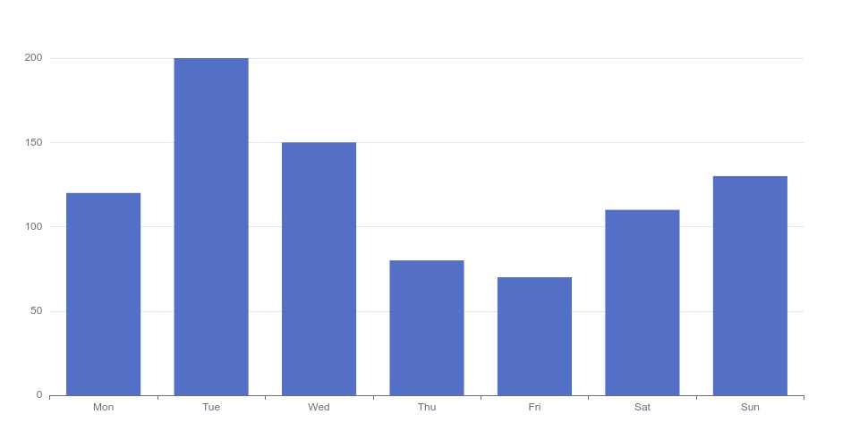

### bar-polar-label-radial

Please copy and save the code to `bar-polar-label-radial.html`.

```html
<!DOCTYPE html>
<html lang="en">
<head>
  <meta charset="utf-8">
  <title>Polar endAngle - Apache ECharts Demo</title>

  <style>
    * {
      margin: 0;
      padding: 0;
    }
    #chart-container {
      position: relative;
      height: 100vh;
      overflow: hidden;
    }

  </style>
</head>
<body>
  <div id="chart-container"></div>
  <script src="https://echarts.apache.org/en/js/vendors/echarts/dist/echarts.min.js"></script>

  <script>
    var dom = document.getElementById('chart-container');
    var myChart = echarts.init(dom, null, {
      renderer: 'canvas',
      useDirtyRect: false
    });
      var app = {};

      var option;

      option = {
        title: [
          {
            text: 'Radial Polar Bar Label Position (middle)'
          }
        ],
        polar: {
          radius: [30, '80%']
        },
        radiusAxis: {
          max: 4
        },
        angleAxis: {
          type: 'category',
          data: ['a', 'b', 'c', 'd'],
          startAngle: 75
        },
        tooltip: {},
        series: {
          type: 'bar',
          data: [2, 1.2, 2.4, 3.6],
          coordinateSystem: 'polar',
          label: {
            show: true,
            position: 'middle',
            formatter: '{b}: {c}'
          }
        },
        animation: false
      };


      if (option && typeof option === 'object') {
        myChart.setOption(option);
      }

      window.addEventListener('resize', myChart.resize);
</script>
</body>
</html>
```

Open the containing folder, and double click on the html file you just saved.
And you will see the chart rendered like below,

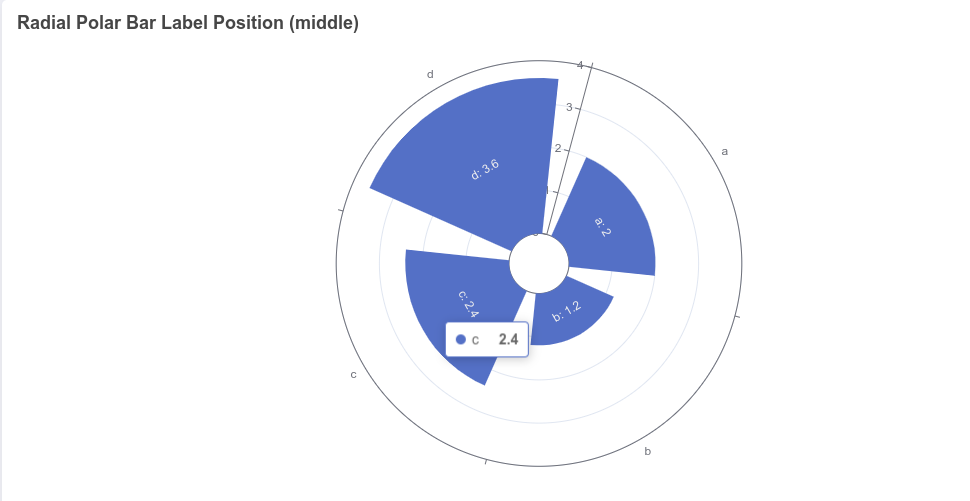

### bar-y-category

Please copy and save the code to `bar-y-category.html`.

```html
<!DOCTYPE html>
<html lang="en">
<head>
  <meta charset="utf-8">
  <title>Polar endAngle - Apache ECharts Demo</title>

  <style>
    * {
      margin: 0;
      padding: 0;
    }
    #chart-container {
      position: relative;
      height: 100vh;
      overflow: hidden;
    }

  </style>
</head>
<body>
  <div id="chart-container"></div>
  <script src="https://echarts.apache.org/en/js/vendors/echarts/dist/echarts.min.js"></script>

  <script>
    var dom = document.getElementById('chart-container');
    var myChart = echarts.init(dom, null, {
      renderer: 'canvas',
      useDirtyRect: false
    });
      var app = {};

      var option;

      option = {
      title: {
        text: 'World Population'
      },
      tooltip: {
        trigger: 'axis',
        axisPointer: {
          type: 'shadow'
        }
      },
      legend: {},
      grid: {
        left: '3%',
        right: '4%',
        bottom: '3%',
        containLabel: true
      },
      xAxis: {
        type: 'value',
        boundaryGap: [0, 0.01]
      },
      yAxis: {
        type: 'category',
        data: ['Brazil', 'Indonesia', 'USA', 'India', 'China', 'World']
      },
      series: [
        {
          name: '2011',
          type: 'bar',
          data: [18203, 23489, 29034, 104970, 131744, 630230]
        },
        {
          name: '2012',
          type: 'bar',
          data: [19325, 23438, 31000, 121594, 134141, 681807]
        }
      ]
      };

      if (option && typeof option === 'object') {
        myChart.setOption(option);
      }

      window.addEventListener('resize', myChart.resize);
</script>
</body>
</html>
```

Open the containing folder, and double click on the html file you just saved.
And you will see the chart rendered like below,

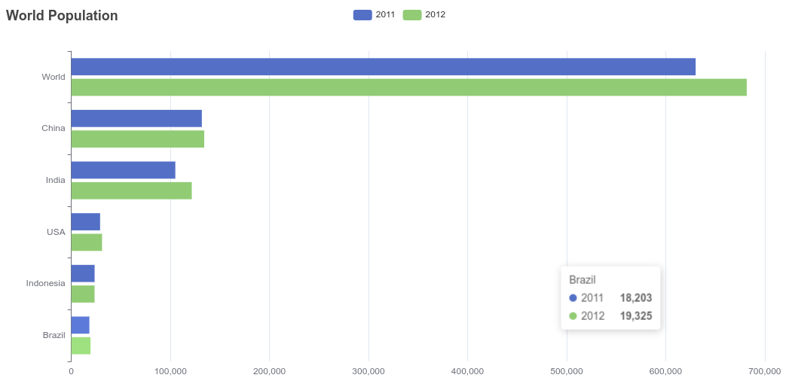

### bar-polar-label-tangential

Please copy and save the code to `bar-polar-label-tangential.html`.

```html
<!DOCTYPE html>
<html lang="en">
<head>
  <meta charset="utf-8">
  <title>Polar endAngle - Apache ECharts Demo</title>

  <style>
    * {
      margin: 0;
      padding: 0;
    }
    #chart-container {
      position: relative;
      height: 100vh;
      overflow: hidden;
    }

  </style>
</head>
<body>
  <div id="chart-container"></div>
  <script src="https://echarts.apache.org/en/js/vendors/echarts/dist/echarts.min.js"></script>

  <script>
    var dom = document.getElementById('chart-container');
    var myChart = echarts.init(dom, null, {
      renderer: 'canvas',
      useDirtyRect: false
    });
      var app = {};

      var option;

      option = {
        title: [
          {
            text: 'Tangential Polar Bar Label Position (middle)'
          }
        ],
        polar: {
          radius: [30, '80%']
        },
        angleAxis: {
          max: 4,
          startAngle: 75
        },
        radiusAxis: {
          type: 'category',
          data: ['a', 'b', 'c', 'd']
        },
        tooltip: {},
        series: {
          type: 'bar',
          data: [2, 1.2, 2.4, 3.6],
          coordinateSystem: 'polar',
          label: {
            show: true,
            position: 'middle',
            formatter: '{b}: {c}'
          }
        }
      };

      if (option && typeof option === 'object') {
        myChart.setOption(option);
      }

      window.addEventListener('resize', myChart.resize);
</script>
</body>
</html>
```

Open the containing folder, and double click on the html file you just saved.
And you will see the chart rendered like below,

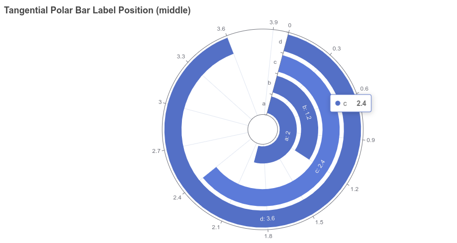

### polar-endAngle

Please copy and save the code to `polar-endAngle.html`.

```html
<!DOCTYPE html>
<html lang="en">
<head>
  <meta charset="utf-8">
  <title>Polar endAngle - Apache ECharts Demo</title>

  <style>
    * {
      margin: 0;
      padding: 0;
    }
    #chart-container {
      position: relative;
      height: 100vh;
      overflow: hidden;
    }

  </style>
</head>
<body>
  <div id="chart-container"></div>
  <script src="https://echarts.apache.org/en/js/vendors/echarts/dist/echarts.min.js"></script>

  <script>
    var dom = document.getElementById('chart-container');
    var myChart = echarts.init(dom, null, {
      renderer: 'canvas',
      useDirtyRect: false
    });
      var app = {};

      var option;

      option = {
        tooltip: {},
        angleAxis: [
          {
            type: 'category',
            polarIndex: 0,
            startAngle: 90,
            endAngle: 0,
            data: ['S1', 'S2', 'S3']
          },
          {
            type: 'category',
            polarIndex: 1,
            startAngle: -90,
            endAngle: -180,
            data: ['T1', 'T2', 'T3']
          }
        ],
        radiusAxis: [{ polarIndex: 0 }, { polarIndex: 1 }],
        polar: [{}, {}],
        series: [
          {
            type: 'bar',
            polarIndex: 0,
            data: [1, 2, 3],
            coordinateSystem: 'polar'
          },
          {
            type: 'bar',
            polarIndex: 1,
            data: [1, 2, 3],
            coordinateSystem: 'polar'
          }
        ]
      };


      if (option && typeof option === 'object') {
        myChart.setOption(option);
      }

      window.addEventListener('resize', myChart.resize);
</script>
</body>
</html>
```

Open the containing folder, and double click on the html file you just saved.
And you will see the chart rendered like below,

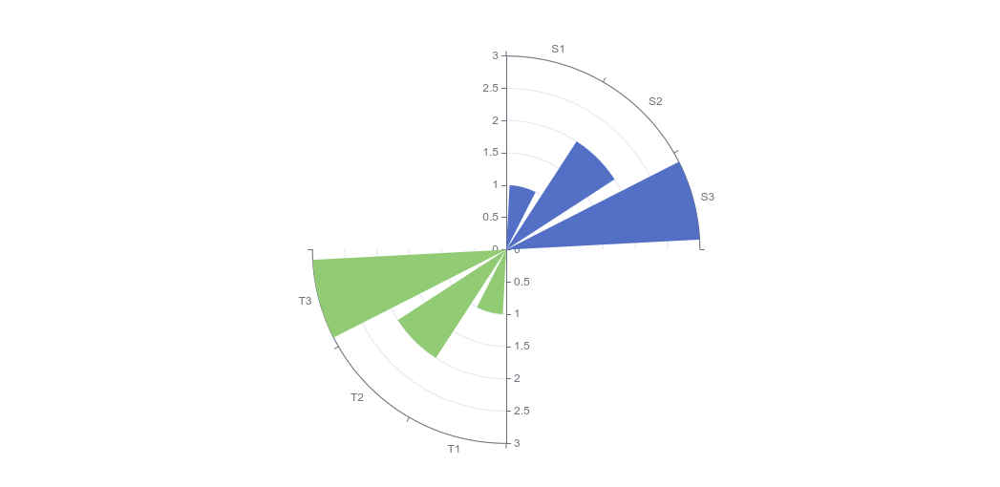

## Ref

- https://echarts.apache.org/examples/en/index.html#chart-type-bar