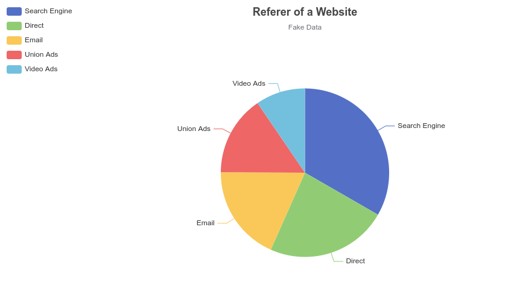
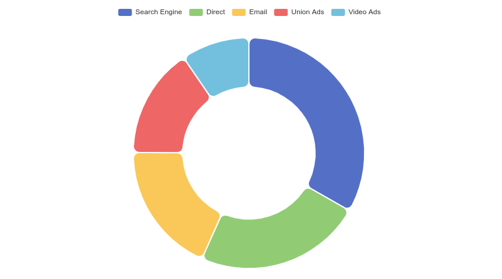
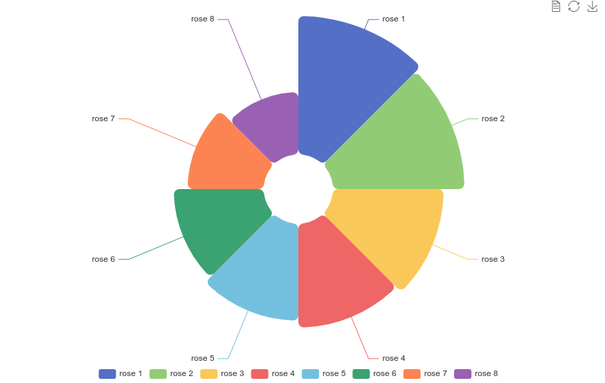
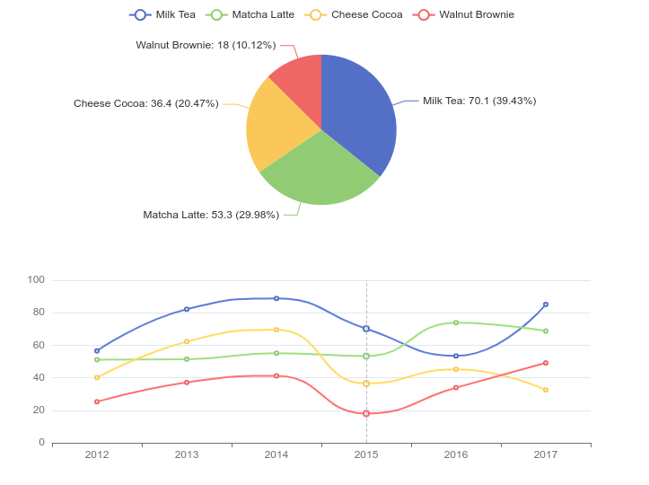
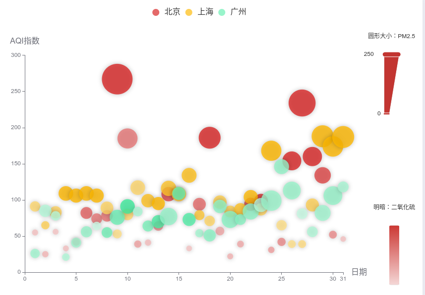
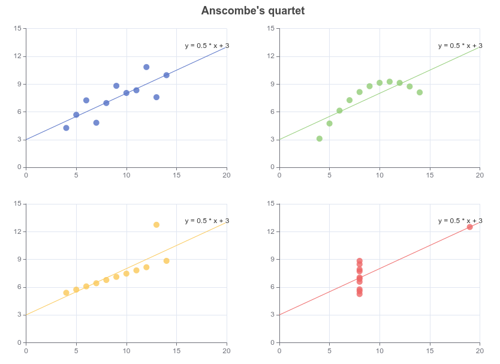
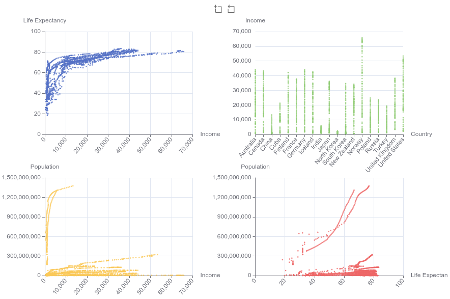
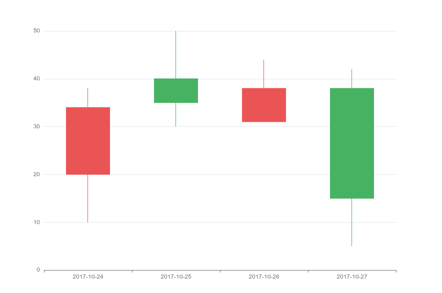
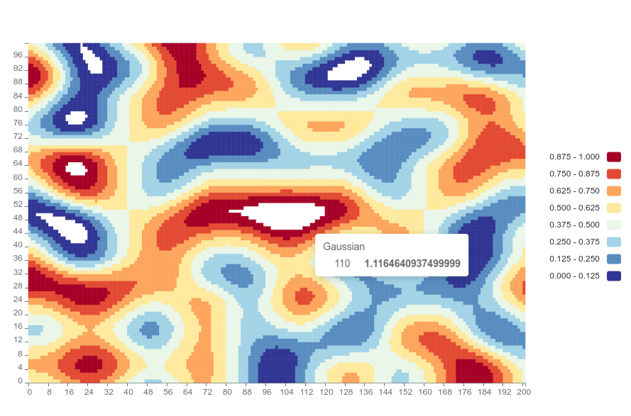
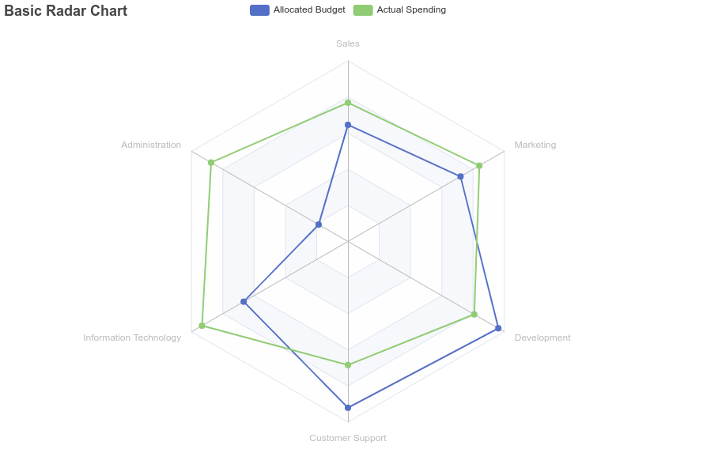

# Visualization with ECharts - Pie and Radar Charts

In this course, we would learn the following charts. 
As you can see from the references, the original code and charts are provided by Apache Echarts.

What is different in this course is that, I did not complete the full html for your but leave a little work for yourself to do in order to make a working example.

**Instruction:**

What you need to do is to copy the code in the folowing examples, and paste it in the `<script>` section from the former course html template, such as bar chart those examples.

Shove in the code properly and see if you can view them.

## Takeaway

* Pie Chart

  * simple pie
  * pie-borderRadius
  * pie-roseType-simple
  * dataset-link

* Scatter Chart
  * scatter-simple
  * scatter-aqi-color
  * scatter-anscombe-quartet
  * scatter-polynomial-regression
* Dataset
* Candlestick
  * candlestick-simple
  * candlestick-sh
  * candlestick-large
* Heatmap
* Radar
  * Simple Radar
  * radar-multiple
  * radar-aqi

## Pie Chart

### pie-simple

```html
option = {
  title: {
    text: 'Referer of a Website',
    subtext: 'Fake Data',
    left: 'center'
  },
  tooltip: {
    trigger: 'item'
  },
  legend: {
    orient: 'vertical',
    left: 'left'
  },
  series: [
    {
      name: 'Access From',
      type: 'pie',
      radius: '50%',
      data: [
        { value: 1048, name: 'Search Engine' },
        { value: 735, name: 'Direct' },
        { value: 580, name: 'Email' },
        { value: 484, name: 'Union Ads' },
        { value: 300, name: 'Video Ads' }
      ],
      emphasis: {
        itemStyle: {
          shadowBlur: 10,
          shadowOffsetX: 0,
          shadowColor: 'rgba(0, 0, 0, 0.5)'
        }
      }
    }
  ]
};
```



### pie-borderRadius

```html
option = {
  tooltip: {
    trigger: 'item'
  },
  legend: {
    top: '5%',
    left: 'center'
  },
  series: [
    {
      name: 'Access From',
      type: 'pie',
      radius: ['40%', '70%'],
      avoidLabelOverlap: false,
      itemStyle: {
        borderRadius: 10,
        borderColor: '#fff',
        borderWidth: 2
      },
      label: {
        show: false,
        position: 'center'
      },
      emphasis: {
        label: {
          show: true,
          fontSize: 40,
          fontWeight: 'bold'
        }
      },
      labelLine: {
        show: false
      },
      data: [
        { value: 1048, name: 'Search Engine' },
        { value: 735, name: 'Direct' },
        { value: 580, name: 'Email' },
        { value: 484, name: 'Union Ads' },
        { value: 300, name: 'Video Ads' }
      ]
    }
  ]
};
```



### pie-roseType-simple

```html
option = {
  legend: {
    top: 'bottom'
  },
  toolbox: {
    show: true,
    feature: {
      mark: { show: true },
      dataView: { show: true, readOnly: false },
      restore: { show: true },
      saveAsImage: { show: true }
    }
  },
  series: [
    {
      name: 'Nightingale Chart',
      type: 'pie',
      radius: [50, 250],
      center: ['50%', '50%'],
      roseType: 'area',
      itemStyle: {
        borderRadius: 8
      },
      data: [
        { value: 40, name: 'rose 1' },
        { value: 38, name: 'rose 2' },
        { value: 32, name: 'rose 3' },
        { value: 30, name: 'rose 4' },
        { value: 28, name: 'rose 5' },
        { value: 26, name: 'rose 6' },
        { value: 22, name: 'rose 7' },
        { value: 18, name: 'rose 8' }
      ]
    }
  ]
};
```



### dataset-link

```html
setTimeout(function () {
  option = {
    legend: {},
    tooltip: {
      trigger: 'axis',
      showContent: false
    },
    dataset: {
      source: [
        ['product', '2012', '2013', '2014', '2015', '2016', '2017'],
        ['Milk Tea', 56.5, 82.1, 88.7, 70.1, 53.4, 85.1],
        ['Matcha Latte', 51.1, 51.4, 55.1, 53.3, 73.8, 68.7],
        ['Cheese Cocoa', 40.1, 62.2, 69.5, 36.4, 45.2, 32.5],
        ['Walnut Brownie', 25.2, 37.1, 41.2, 18, 33.9, 49.1]
      ]
    },
    xAxis: { type: 'category' },
    yAxis: { gridIndex: 0 },
    grid: { top: '55%' },
    series: [
      {
        type: 'line',
        smooth: true,
        seriesLayoutBy: 'row',
        emphasis: { focus: 'series' }
      },
      {
        type: 'line',
        smooth: true,
        seriesLayoutBy: 'row',
        emphasis: { focus: 'series' }
      },
      {
        type: 'line',
        smooth: true,
        seriesLayoutBy: 'row',
        emphasis: { focus: 'series' }
      },
      {
        type: 'line',
        smooth: true,
        seriesLayoutBy: 'row',
        emphasis: { focus: 'series' }
      },
      {
        type: 'pie',
        id: 'pie',
        radius: '30%',
        center: ['50%', '25%'],
        emphasis: {
          focus: 'self'
        },
        label: {
          formatter: '{b}: {@2012} ({d}%)'
        },
        encode: {
          itemName: 'product',
          value: '2012',
          tooltip: '2012'
        }
      }
    ]
  };
  myChart.on('updateAxisPointer', function (event) {
    const xAxisInfo = event.axesInfo[0];
    if (xAxisInfo) {
      const dimension = xAxisInfo.value + 1;
      myChart.setOption({
        series: {
          id: 'pie',
          label: {
            formatter: '{b}: {@[' + dimension + ']} ({d}%)'
          },
          encode: {
            value: dimension,
            tooltip: dimension
          }
        }
      });
    }
  });
  myChart.setOption(option);
});

```



## Scatter Chart

### scatter-simple

```html

```


https://echarts.apache.org/examples/en/editor.html?c=scatter-simple

### scatter-aqi-color

```html
const dataBJ = [
  [1, 55, 9, 56, 0.46, 18, 6, '良'],
  [2, 25, 11, 21, 0.65, 34, 9, '优'],
  [3, 56, 7, 63, 0.3, 14, 5, '良'],
  [4, 33, 7, 29, 0.33, 16, 6, '优'],
  [5, 42, 24, 44, 0.76, 40, 16, '优'],
  [6, 82, 58, 90, 1.77, 68, 33, '良'],
  [7, 74, 49, 77, 1.46, 48, 27, '良'],
  [8, 78, 55, 80, 1.29, 59, 29, '良'],
  [9, 267, 216, 280, 4.8, 108, 64, '重度污染'],
  [10, 185, 127, 216, 2.52, 61, 27, '中度污染'],
  [11, 39, 19, 38, 0.57, 31, 15, '优'],
  [12, 41, 11, 40, 0.43, 21, 7, '优'],
  [13, 64, 38, 74, 1.04, 46, 22, '良'],
  [14, 108, 79, 120, 1.7, 75, 41, '轻度污染'],
  [15, 108, 63, 116, 1.48, 44, 26, '轻度污染'],
  [16, 33, 6, 29, 0.34, 13, 5, '优'],
  [17, 94, 66, 110, 1.54, 62, 31, '良'],
  [18, 186, 142, 192, 3.88, 93, 79, '中度污染'],
  [19, 57, 31, 54, 0.96, 32, 14, '良'],
  [20, 22, 8, 17, 0.48, 23, 10, '优'],
  [21, 39, 15, 36, 0.61, 29, 13, '优'],
  [22, 94, 69, 114, 2.08, 73, 39, '良'],
  [23, 99, 73, 110, 2.43, 76, 48, '良'],
  [24, 31, 12, 30, 0.5, 32, 16, '优'],
  [25, 42, 27, 43, 1, 53, 22, '优'],
  [26, 154, 117, 157, 3.05, 92, 58, '中度污染'],
  [27, 234, 185, 230, 4.09, 123, 69, '重度污染'],
  [28, 160, 120, 186, 2.77, 91, 50, '中度污染'],
  [29, 134, 96, 165, 2.76, 83, 41, '轻度污染'],
  [30, 52, 24, 60, 1.03, 50, 21, '良'],
  [31, 46, 5, 49, 0.28, 10, 6, '优']
];
const dataGZ = [
  [1, 26, 37, 27, 1.163, 27, 13, '优'],
  [2, 85, 62, 71, 1.195, 60, 8, '良'],
  [3, 78, 38, 74, 1.363, 37, 7, '良'],
  [4, 21, 21, 36, 0.634, 40, 9, '优'],
  [5, 41, 42, 46, 0.915, 81, 13, '优'],
  [6, 56, 52, 69, 1.067, 92, 16, '良'],
  [7, 64, 30, 28, 0.924, 51, 2, '良'],
  [8, 55, 48, 74, 1.236, 75, 26, '良'],
  [9, 76, 85, 113, 1.237, 114, 27, '良'],
  [10, 91, 81, 104, 1.041, 56, 40, '良'],
  [11, 84, 39, 60, 0.964, 25, 11, '良'],
  [12, 64, 51, 101, 0.862, 58, 23, '良'],
  [13, 70, 69, 120, 1.198, 65, 36, '良'],
  [14, 77, 105, 178, 2.549, 64, 16, '良'],
  [15, 109, 68, 87, 0.996, 74, 29, '轻度污染'],
  [16, 73, 68, 97, 0.905, 51, 34, '良'],
  [17, 54, 27, 47, 0.592, 53, 12, '良'],
  [18, 51, 61, 97, 0.811, 65, 19, '良'],
  [19, 91, 71, 121, 1.374, 43, 18, '良'],
  [20, 73, 102, 182, 2.787, 44, 19, '良'],
  [21, 73, 50, 76, 0.717, 31, 20, '良'],
  [22, 84, 94, 140, 2.238, 68, 18, '良'],
  [23, 93, 77, 104, 1.165, 53, 7, '良'],
  [24, 99, 130, 227, 3.97, 55, 15, '良'],
  [25, 146, 84, 139, 1.094, 40, 17, '轻度污染'],
  [26, 113, 108, 137, 1.481, 48, 15, '轻度污染'],
  [27, 81, 48, 62, 1.619, 26, 3, '良'],
  [28, 56, 48, 68, 1.336, 37, 9, '良'],
  [29, 82, 92, 174, 3.29, 0, 13, '良'],
  [30, 106, 116, 188, 3.628, 101, 16, '轻度污染'],
  [31, 118, 50, 0, 1.383, 76, 11, '轻度污染']
];
const dataSH = [
  [1, 91, 45, 125, 0.82, 34, 23, '良'],
  [2, 65, 27, 78, 0.86, 45, 29, '良'],
  [3, 83, 60, 84, 1.09, 73, 27, '良'],
  [4, 109, 81, 121, 1.28, 68, 51, '轻度污染'],
  [5, 106, 77, 114, 1.07, 55, 51, '轻度污染'],
  [6, 109, 81, 121, 1.28, 68, 51, '轻度污染'],
  [7, 106, 77, 114, 1.07, 55, 51, '轻度污染'],
  [8, 89, 65, 78, 0.86, 51, 26, '良'],
  [9, 53, 33, 47, 0.64, 50, 17, '良'],
  [10, 80, 55, 80, 1.01, 75, 24, '良'],
  [11, 117, 81, 124, 1.03, 45, 24, '轻度污染'],
  [12, 99, 71, 142, 1.1, 62, 42, '良'],
  [13, 95, 69, 130, 1.28, 74, 50, '良'],
  [14, 116, 87, 131, 1.47, 84, 40, '轻度污染'],
  [15, 108, 80, 121, 1.3, 85, 37, '轻度污染'],
  [16, 134, 83, 167, 1.16, 57, 43, '轻度污染'],
  [17, 79, 43, 107, 1.05, 59, 37, '良'],
  [18, 71, 46, 89, 0.86, 64, 25, '良'],
  [19, 97, 71, 113, 1.17, 88, 31, '良'],
  [20, 84, 57, 91, 0.85, 55, 31, '良'],
  [21, 87, 63, 101, 0.9, 56, 41, '良'],
  [22, 104, 77, 119, 1.09, 73, 48, '轻度污染'],
  [23, 87, 62, 100, 1, 72, 28, '良'],
  [24, 168, 128, 172, 1.49, 97, 56, '中度污染'],
  [25, 65, 45, 51, 0.74, 39, 17, '良'],
  [26, 39, 24, 38, 0.61, 47, 17, '优'],
  [27, 39, 24, 39, 0.59, 50, 19, '优'],
  [28, 93, 68, 96, 1.05, 79, 29, '良'],
  [29, 188, 143, 197, 1.66, 99, 51, '中度污染'],
  [30, 174, 131, 174, 1.55, 108, 50, '中度污染'],
  [31, 187, 143, 201, 1.39, 89, 53, '中度污染']
];
const schema = [
  { name: 'date', index: 0, text: '日' },
  { name: 'AQIindex', index: 1, text: 'AQI指数' },
  { name: 'PM25', index: 2, text: 'PM2.5' },
  { name: 'PM10', index: 3, text: 'PM10' },
  { name: 'CO', index: 4, text: '一氧化碳（CO）' },
  { name: 'NO2', index: 5, text: '二氧化氮（NO2）' },
  { name: 'SO2', index: 6, text: '二氧化硫（SO2）' }
];
const itemStyle = {
  opacity: 0.8,
  shadowBlur: 10,
  shadowOffsetX: 0,
  shadowOffsetY: 0,
  shadowColor: 'rgba(0,0,0,0.3)'
};
option = {
  color: ['#dd4444', '#fec42c', '#80F1BE'],
  legend: {
    top: 10,
    data: ['北京', '上海', '广州'],
    textStyle: {
      fontSize: 16
    }
  },
  grid: {
    left: '10%',
    right: 150,
    top: '18%',
    bottom: '10%'
  },
  tooltip: {
    backgroundColor: 'rgba(255,255,255,0.7)',
    formatter: function (param) {
      var value = param.value;
      // prettier-ignore
      return '<div style="border-bottom: 1px solid rgba(255,255,255,.3); font-size: 18px;padding-bottom: 7px;margin-bottom: 7px">'
                + param.seriesName + ' ' + value[0] + '日：'
                + value[7]
                + '</div>'
                + schema[1].text + '：' + value[1] + '<br>'
                + schema[2].text + '：' + value[2] + '<br>'
                + schema[3].text + '：' + value[3] + '<br>'
                + schema[4].text + '：' + value[4] + '<br>'
                + schema[5].text + '：' + value[5] + '<br>'
                + schema[6].text + '：' + value[6] + '<br>';
    }
  },
  xAxis: {
    type: 'value',
    name: '日期',
    nameGap: 16,
    nameTextStyle: {
      fontSize: 16
    },
    max: 31,
    splitLine: {
      show: false
    }
  },
  yAxis: {
    type: 'value',
    name: 'AQI指数',
    nameLocation: 'end',
    nameGap: 20,
    nameTextStyle: {
      fontSize: 16
    },
    splitLine: {
      show: false
    }
  },
  visualMap: [
    {
      left: 'right',
      top: '10%',
      dimension: 2,
      min: 0,
      max: 250,
      itemWidth: 30,
      itemHeight: 120,
      calculable: true,
      precision: 0.1,
      text: ['圆形大小：PM2.5'],
      textGap: 30,
      inRange: {
        symbolSize: [10, 70]
      },
      outOfRange: {
        symbolSize: [10, 70],
        color: ['rgba(255,255,255,0.4)']
      },
      controller: {
        inRange: {
          color: ['#c23531']
        },
        outOfRange: {
          color: ['#999']
        }
      }
    },
    {
      left: 'right',
      bottom: '5%',
      dimension: 6,
      min: 0,
      max: 50,
      itemHeight: 120,
      text: ['明暗：二氧化硫'],
      textGap: 30,
      inRange: {
        colorLightness: [0.9, 0.5]
      },
      outOfRange: {
        color: ['rgba(255,255,255,0.4)']
      },
      controller: {
        inRange: {
          color: ['#c23531']
        },
        outOfRange: {
          color: ['#999']
        }
      }
    }
  ],
  series: [
    {
      name: '北京',
      type: 'scatter',
      itemStyle: itemStyle,
      data: dataBJ
    },
    {
      name: '上海',
      type: 'scatter',
      itemStyle: itemStyle,
      data: dataSH
    },
    {
      name: '广州',
      type: 'scatter',
      itemStyle: itemStyle,
      data: dataGZ
    }
  ]
};
```



### scatter-anscombe-quartet

```html
const dataAll = [
  [
    [10.0, 8.04],
    [8.0, 6.95],
    [13.0, 7.58],
    [9.0, 8.81],
    [11.0, 8.33],
    [14.0, 9.96],
    [6.0, 7.24],
    [4.0, 4.26],
    [12.0, 10.84],
    [7.0, 4.82],
    [5.0, 5.68]
  ],
  [
    [10.0, 9.14],
    [8.0, 8.14],
    [13.0, 8.74],
    [9.0, 8.77],
    [11.0, 9.26],
    [14.0, 8.1],
    [6.0, 6.13],
    [4.0, 3.1],
    [12.0, 9.13],
    [7.0, 7.26],
    [5.0, 4.74]
  ],
  [
    [10.0, 7.46],
    [8.0, 6.77],
    [13.0, 12.74],
    [9.0, 7.11],
    [11.0, 7.81],
    [14.0, 8.84],
    [6.0, 6.08],
    [4.0, 5.39],
    [12.0, 8.15],
    [7.0, 6.42],
    [5.0, 5.73]
  ],
  [
    [8.0, 6.58],
    [8.0, 5.76],
    [8.0, 7.71],
    [8.0, 8.84],
    [8.0, 8.47],
    [8.0, 7.04],
    [8.0, 5.25],
    [19.0, 12.5],
    [8.0, 5.56],
    [8.0, 7.91],
    [8.0, 6.89]
  ]
];
const markLineOpt = {
  animation: false,
  label: {
    formatter: 'y = 0.5 * x + 3',
    align: 'right'
  },
  lineStyle: {
    type: 'solid'
  },
  tooltip: {
    formatter: 'y = 0.5 * x + 3'
  },
  data: [
    [
      {
        coord: [0, 3],
        symbol: 'none'
      },
      {
        coord: [20, 13],
        symbol: 'none'
      }
    ]
  ]
};
option = {
  title: {
    text: "Anscombe's quartet",
    left: 'center',
    top: 0
  },
  grid: [
    { left: '7%', top: '7%', width: '38%', height: '38%' },
    { right: '7%', top: '7%', width: '38%', height: '38%' },
    { left: '7%', bottom: '7%', width: '38%', height: '38%' },
    { right: '7%', bottom: '7%', width: '38%', height: '38%' }
  ],
  tooltip: {
    formatter: 'Group {a}: ({c})'
  },
  xAxis: [
    { gridIndex: 0, min: 0, max: 20 },
    { gridIndex: 1, min: 0, max: 20 },
    { gridIndex: 2, min: 0, max: 20 },
    { gridIndex: 3, min: 0, max: 20 }
  ],
  yAxis: [
    { gridIndex: 0, min: 0, max: 15 },
    { gridIndex: 1, min: 0, max: 15 },
    { gridIndex: 2, min: 0, max: 15 },
    { gridIndex: 3, min: 0, max: 15 }
  ],
  series: [
    {
      name: 'I',
      type: 'scatter',
      xAxisIndex: 0,
      yAxisIndex: 0,
      data: dataAll[0],
      markLine: markLineOpt
    },
    {
      name: 'II',
      type: 'scatter',
      xAxisIndex: 1,
      yAxisIndex: 1,
      data: dataAll[1],
      markLine: markLineOpt
    },
    {
      name: 'III',
      type: 'scatter',
      xAxisIndex: 2,
      yAxisIndex: 2,
      data: dataAll[2],
      markLine: markLineOpt
    },
    {
      name: 'IV',
      type: 'scatter',
      xAxisIndex: 3,
      yAxisIndex: 3,
      data: dataAll[3],
      markLine: markLineOpt
    }
  ]
};
```



### scatter-polynomial-regression

```html
// See https://github.com/ecomfe/echarts-stat
echarts.registerTransform(ecStat.transform.regression);
const data = [
  [96.24, 11.35],
  [33.09, 85.11],
  [57.6, 36.61],
  [36.77, 27.26],
  [20.1, 6.72],
  [45.53, 36.37],
  [110.07, 80.13],
  [72.05, 20.88],
  [39.82, 37.15],
  [48.05, 70.5],
  [0.85, 2.57],
  [51.66, 63.7],
  [61.07, 127.13],
  [64.54, 33.59],
  [35.5, 25.01],
  [226.55, 664.02],
  [188.6, 175.31],
  [81.31, 108.68]
];
option = {
  dataset: [
    {
      source: data
    },
    {
      transform: {
        type: 'ecStat:regression',
        config: { method: 'polynomial', order: 3 }
      }
    }
  ],
  title: {
    text: '18 companies net profit and main business income (million)',
    subtext: 'By ecStat.regression',
    sublink: 'https://github.com/ecomfe/echarts-stat',
    left: 'center',
    top: 16
  },
  tooltip: {
    trigger: 'axis',
    axisPointer: {
      type: 'cross'
    }
  },
  xAxis: {
    splitLine: {
      lineStyle: {
        type: 'dashed'
      }
    },
    splitNumber: 20
  },
  yAxis: {
    min: -40,
    splitLine: {
      lineStyle: {
        type: 'dashed'
      }
    }
  },
  series: [
    {
      name: 'scatter',
      type: 'scatter'
    },
    {
      name: 'line',
      type: 'line',
      smooth: true,
      datasetIndex: 1,
      symbolSize: 0.1,
      symbol: 'circle',
      label: { show: true, fontSize: 16 },
      labelLayout: { dx: -20 },
      encode: { label: 2, tooltip: 1 }
    }
  ]
};
```

## Dataset

### dataset-encode1

```html
$.get(
  ROOT_PATH + '/data/asset/data/life-expectancy-table.json',
  function (data) {
    var sizeValue = '57%';
    var symbolSize = 2.5;
    option = {
      legend: {},
      tooltip: {},
      toolbox: {
        left: 'center',
        feature: {
          dataZoom: {}
        }
      },
      grid: [
        { right: sizeValue, bottom: sizeValue },
        { left: sizeValue, bottom: sizeValue },
        { right: sizeValue, top: sizeValue },
        { left: sizeValue, top: sizeValue }
      ],
      xAxis: [
        {
          type: 'value',
          gridIndex: 0,
          name: 'Income',
          axisLabel: { rotate: 50, interval: 0 }
        },
        {
          type: 'category',
          gridIndex: 1,
          name: 'Country',
          boundaryGap: false,
          axisLabel: { rotate: 50, interval: 0 }
        },
        {
          type: 'value',
          gridIndex: 2,
          name: 'Income',
          axisLabel: { rotate: 50, interval: 0 }
        },
        {
          type: 'value',
          gridIndex: 3,
          name: 'Life Expectancy',
          axisLabel: { rotate: 50, interval: 0 }
        }
      ],
      yAxis: [
        { type: 'value', gridIndex: 0, name: 'Life Expectancy' },
        { type: 'value', gridIndex: 1, name: 'Income' },
        { type: 'value', gridIndex: 2, name: 'Population' },
        { type: 'value', gridIndex: 3, name: 'Population' }
      ],
      dataset: {
        dimensions: [
          'Income',
          'Life Expectancy',
          'Population',
          'Country',
          { name: 'Year', type: 'ordinal' }
        ],
        source: data
      },
      series: [
        {
          type: 'scatter',
          symbolSize: symbolSize,
          xAxisIndex: 0,
          yAxisIndex: 0,
          encode: {
            x: 'Income',
            y: 'Life Expectancy',
            tooltip: [0, 1, 2, 3, 4]
          }
        },
        {
          type: 'scatter',
          symbolSize: symbolSize,
          xAxisIndex: 1,
          yAxisIndex: 1,
          encode: {
            x: 'Country',
            y: 'Income',
            tooltip: [0, 1, 2, 3, 4]
          }
        },
        {
          type: 'scatter',
          symbolSize: symbolSize,
          xAxisIndex: 2,
          yAxisIndex: 2,
          encode: {
            x: 'Income',
            y: 'Population',
            tooltip: [0, 1, 2, 3, 4]
          }
        },
        {
          type: 'scatter',
          symbolSize: symbolSize,
          xAxisIndex: 3,
          yAxisIndex: 3,
          encode: {
            x: 'Life Expectancy',
            y: 'Population',
            tooltip: [0, 1, 2, 3, 4]
          }
        }
      ]
    };
    myChart.setOption(option);
  }
);
```



## Candlestick

### candlestick-simple

```html
option = {
  xAxis: {
    data: ['2017-10-24', '2017-10-25', '2017-10-26', '2017-10-27']
  },
  yAxis: {},
  series: [
    {
      type: 'candlestick',
      data: [
        [20, 34, 10, 38],
        [40, 35, 30, 50],
        [31, 38, 33, 44],
        [38, 15, 5, 42]
      ]
    }
  ]
};
```



### candlestick-sh

```html
const upColor = '#ec0000';
const upBorderColor = '#8A0000';
const downColor = '#00da3c';
const downBorderColor = '#008F28';
// Each item: open，close，lowest，highest
const data0 = splitData([
  ['2013/1/24', 2320.26, 2320.26, 2287.3, 2362.94],
  ['2013/1/25', 2300, 2291.3, 2288.26, 2308.38],
  ['2013/1/28', 2295.35, 2346.5, 2295.35, 2346.92],
  ['2013/1/29', 2347.22, 2358.98, 2337.35, 2363.8],
  ['2013/1/30', 2360.75, 2382.48, 2347.89, 2383.76],
  ['2013/1/31', 2383.43, 2385.42, 2371.23, 2391.82],
  ['2013/2/1', 2377.41, 2419.02, 2369.57, 2421.15],
  ['2013/2/4', 2425.92, 2428.15, 2417.58, 2440.38],
  ['2013/2/5', 2411, 2433.13, 2403.3, 2437.42],
  ['2013/2/6', 2432.68, 2434.48, 2427.7, 2441.73],
  ['2013/2/7', 2430.69, 2418.53, 2394.22, 2433.89],
  ['2013/2/8', 2416.62, 2432.4, 2414.4, 2443.03],
  ['2013/2/18', 2441.91, 2421.56, 2415.43, 2444.8],
  ['2013/2/19', 2420.26, 2382.91, 2373.53, 2427.07],
  ['2013/2/20', 2383.49, 2397.18, 2370.61, 2397.94],
  ['2013/2/21', 2378.82, 2325.95, 2309.17, 2378.82],
  ['2013/2/22', 2322.94, 2314.16, 2308.76, 2330.88],
  ['2013/2/25', 2320.62, 2325.82, 2315.01, 2338.78],
  ['2013/2/26', 2313.74, 2293.34, 2289.89, 2340.71],
  ['2013/2/27', 2297.77, 2313.22, 2292.03, 2324.63],
  ['2013/2/28', 2322.32, 2365.59, 2308.92, 2366.16],
  ['2013/3/1', 2364.54, 2359.51, 2330.86, 2369.65],
  ['2013/3/4', 2332.08, 2273.4, 2259.25, 2333.54],
  ['2013/3/5', 2274.81, 2326.31, 2270.1, 2328.14],
  ['2013/3/6', 2333.61, 2347.18, 2321.6, 2351.44],
  ['2013/3/7', 2340.44, 2324.29, 2304.27, 2352.02],
  ['2013/3/8', 2326.42, 2318.61, 2314.59, 2333.67],
  ['2013/3/11', 2314.68, 2310.59, 2296.58, 2320.96],
  ['2013/3/12', 2309.16, 2286.6, 2264.83, 2333.29],
  ['2013/3/13', 2282.17, 2263.97, 2253.25, 2286.33],
  ['2013/3/14', 2255.77, 2270.28, 2253.31, 2276.22],
  ['2013/3/15', 2269.31, 2278.4, 2250, 2312.08],
  ['2013/3/18', 2267.29, 2240.02, 2239.21, 2276.05],
  ['2013/3/19', 2244.26, 2257.43, 2232.02, 2261.31],
  ['2013/3/20', 2257.74, 2317.37, 2257.42, 2317.86],
  ['2013/3/21', 2318.21, 2324.24, 2311.6, 2330.81],
  ['2013/3/22', 2321.4, 2328.28, 2314.97, 2332],
  ['2013/3/25', 2334.74, 2326.72, 2319.91, 2344.89],
  ['2013/3/26', 2318.58, 2297.67, 2281.12, 2319.99],
  ['2013/3/27', 2299.38, 2301.26, 2289, 2323.48],
  ['2013/3/28', 2273.55, 2236.3, 2232.91, 2273.55],
  ['2013/3/29', 2238.49, 2236.62, 2228.81, 2246.87],
  ['2013/4/1', 2229.46, 2234.4, 2227.31, 2243.95],
  ['2013/4/2', 2234.9, 2227.74, 2220.44, 2253.42],
  ['2013/4/3', 2232.69, 2225.29, 2217.25, 2241.34],
  ['2013/4/8', 2196.24, 2211.59, 2180.67, 2212.59],
  ['2013/4/9', 2215.47, 2225.77, 2215.47, 2234.73],
  ['2013/4/10', 2224.93, 2226.13, 2212.56, 2233.04],
  ['2013/4/11', 2236.98, 2219.55, 2217.26, 2242.48],
  ['2013/4/12', 2218.09, 2206.78, 2204.44, 2226.26],
  ['2013/4/15', 2199.91, 2181.94, 2177.39, 2204.99],
  ['2013/4/16', 2169.63, 2194.85, 2165.78, 2196.43],
  ['2013/4/17', 2195.03, 2193.8, 2178.47, 2197.51],
  ['2013/4/18', 2181.82, 2197.6, 2175.44, 2206.03],
  ['2013/4/19', 2201.12, 2244.64, 2200.58, 2250.11],
  ['2013/4/22', 2236.4, 2242.17, 2232.26, 2245.12],
  ['2013/4/23', 2242.62, 2184.54, 2182.81, 2242.62],
  ['2013/4/24', 2187.35, 2218.32, 2184.11, 2226.12],
  ['2013/4/25', 2213.19, 2199.31, 2191.85, 2224.63],
  ['2013/4/26', 2203.89, 2177.91, 2173.86, 2210.58],
  ['2013/5/2', 2170.78, 2174.12, 2161.14, 2179.65],
  ['2013/5/3', 2179.05, 2205.5, 2179.05, 2222.81],
  ['2013/5/6', 2212.5, 2231.17, 2212.5, 2236.07],
  ['2013/5/7', 2227.86, 2235.57, 2219.44, 2240.26],
  ['2013/5/8', 2242.39, 2246.3, 2235.42, 2255.21],
  ['2013/5/9', 2246.96, 2232.97, 2221.38, 2247.86],
  ['2013/5/10', 2228.82, 2246.83, 2225.81, 2247.67],
  ['2013/5/13', 2247.68, 2241.92, 2231.36, 2250.85],
  ['2013/5/14', 2238.9, 2217.01, 2205.87, 2239.93],
  ['2013/5/15', 2217.09, 2224.8, 2213.58, 2225.19],
  ['2013/5/16', 2221.34, 2251.81, 2210.77, 2252.87],
  ['2013/5/17', 2249.81, 2282.87, 2248.41, 2288.09],
  ['2013/5/20', 2286.33, 2299.99, 2281.9, 2309.39],
  ['2013/5/21', 2297.11, 2305.11, 2290.12, 2305.3],
  ['2013/5/22', 2303.75, 2302.4, 2292.43, 2314.18],
  ['2013/5/23', 2293.81, 2275.67, 2274.1, 2304.95],
  ['2013/5/24', 2281.45, 2288.53, 2270.25, 2292.59],
  ['2013/5/27', 2286.66, 2293.08, 2283.94, 2301.7],
  ['2013/5/28', 2293.4, 2321.32, 2281.47, 2322.1],
  ['2013/5/29', 2323.54, 2324.02, 2321.17, 2334.33],
  ['2013/5/30', 2316.25, 2317.75, 2310.49, 2325.72],
  ['2013/5/31', 2320.74, 2300.59, 2299.37, 2325.53],
  ['2013/6/3', 2300.21, 2299.25, 2294.11, 2313.43],
  ['2013/6/4', 2297.1, 2272.42, 2264.76, 2297.1],
  ['2013/6/5', 2270.71, 2270.93, 2260.87, 2276.86],
  ['2013/6/6', 2264.43, 2242.11, 2240.07, 2266.69],
  ['2013/6/7', 2242.26, 2210.9, 2205.07, 2250.63],
  ['2013/6/13', 2190.1, 2148.35, 2126.22, 2190.1]
]);
function splitData(rawData) {
  const categoryData = [];
  const values = [];
  for (var i = 0; i < rawData.length; i++) {
    categoryData.push(rawData[i].splice(0, 1)[0]);
    values.push(rawData[i]);
  }
  return {
    categoryData: categoryData,
    values: values
  };
}
function calculateMA(dayCount) {
  var result = [];
  for (var i = 0, len = data0.values.length; i < len; i++) {
    if (i < dayCount) {
      result.push('-');
      continue;
    }
    var sum = 0;
    for (var j = 0; j < dayCount; j++) {
      sum += +data0.values[i - j][1];
    }
    result.push(sum / dayCount);
  }
  return result;
}
option = {
  title: {
    text: '上证指数',
    left: 0
  },
  tooltip: {
    trigger: 'axis',
    axisPointer: {
      type: 'cross'
    }
  },
  legend: {
    data: ['日K', 'MA5', 'MA10', 'MA20', 'MA30']
  },
  grid: {
    left: '10%',
    right: '10%',
    bottom: '15%'
  },
  xAxis: {
    type: 'category',
    data: data0.categoryData,
    boundaryGap: false,
    axisLine: { onZero: false },
    splitLine: { show: false },
    min: 'dataMin',
    max: 'dataMax'
  },
  yAxis: {
    scale: true,
    splitArea: {
      show: true
    }
  },
  dataZoom: [
    {
      type: 'inside',
      start: 50,
      end: 100
    },
    {
      show: true,
      type: 'slider',
      top: '90%',
      start: 50,
      end: 100
    }
  ],
  series: [
    {
      name: '日K',
      type: 'candlestick',
      data: data0.values,
      itemStyle: {
        color: upColor,
        color0: downColor,
        borderColor: upBorderColor,
        borderColor0: downBorderColor
      },
      markPoint: {
        label: {
          formatter: function (param) {
            return param != null ? Math.round(param.value) + '' : '';
          }
        },
        data: [
          {
            name: 'Mark',
            coord: ['2013/5/31', 2300],
            value: 2300,
            itemStyle: {
              color: 'rgb(41,60,85)'
            }
          },
          {
            name: 'highest value',
            type: 'max',
            valueDim: 'highest'
          },
          {
            name: 'lowest value',
            type: 'min',
            valueDim: 'lowest'
          },
          {
            name: 'average value on close',
            type: 'average',
            valueDim: 'close'
          }
        ],
        tooltip: {
          formatter: function (param) {
            return param.name + '<br>' + (param.data.coord || '');
          }
        }
      },
      markLine: {
        symbol: ['none', 'none'],
        data: [
          [
            {
              name: 'from lowest to highest',
              type: 'min',
              valueDim: 'lowest',
              symbol: 'circle',
              symbolSize: 10,
              label: {
                show: false
              },
              emphasis: {
                label: {
                  show: false
                }
              }
            },
            {
              type: 'max',
              valueDim: 'highest',
              symbol: 'circle',
              symbolSize: 10,
              label: {
                show: false
              },
              emphasis: {
                label: {
                  show: false
                }
              }
            }
          ],
          {
            name: 'min line on close',
            type: 'min',
            valueDim: 'close'
          },
          {
            name: 'max line on close',
            type: 'max',
            valueDim: 'close'
          }
        ]
      }
    },
    {
      name: 'MA5',
      type: 'line',
      data: calculateMA(5),
      smooth: true,
      lineStyle: {
        opacity: 0.5
      }
    },
    {
      name: 'MA10',
      type: 'line',
      data: calculateMA(10),
      smooth: true,
      lineStyle: {
        opacity: 0.5
      }
    },
    {
      name: 'MA20',
      type: 'line',
      data: calculateMA(20),
      smooth: true,
      lineStyle: {
        opacity: 0.5
      }
    },
    {
      name: 'MA30',
      type: 'line',
      data: calculateMA(30),
      smooth: true,
      lineStyle: {
        opacity: 0.5
      }
    }
  ]
};
```


### candlestick-large

```html
const upColor = '#ec0000';
const upBorderColor = '#8A0000';
const downColor = '#00da3c';
const downBorderColor = '#008F28';
const dataCount = 2e5;
const data = generateOHLC(dataCount);
option = {
  dataset: {
    source: data
  },
  title: {
    text: 'Data Amount: ' + echarts.format.addCommas(dataCount)
  },
  tooltip: {
    trigger: 'axis',
    axisPointer: {
      type: 'line'
    }
  },
  toolbox: {
    feature: {
      dataZoom: {
        yAxisIndex: false
      }
    }
  },
  grid: [
    {
      left: '10%',
      right: '10%',
      bottom: 200
    },
    {
      left: '10%',
      right: '10%',
      height: 80,
      bottom: 80
    }
  ],
  xAxis: [
    {
      type: 'category',
      boundaryGap: false,
      // inverse: true,
      axisLine: { onZero: false },
      splitLine: { show: false },
      min: 'dataMin',
      max: 'dataMax'
    },
    {
      type: 'category',
      gridIndex: 1,
      boundaryGap: false,
      axisLine: { onZero: false },
      axisTick: { show: false },
      splitLine: { show: false },
      axisLabel: { show: false },
      min: 'dataMin',
      max: 'dataMax'
    }
  ],
  yAxis: [
    {
      scale: true,
      splitArea: {
        show: true
      }
    },
    {
      scale: true,
      gridIndex: 1,
      splitNumber: 2,
      axisLabel: { show: false },
      axisLine: { show: false },
      axisTick: { show: false },
      splitLine: { show: false }
    }
  ],
  dataZoom: [
    {
      type: 'inside',
      xAxisIndex: [0, 1],
      start: 10,
      end: 100
    },
    {
      show: true,
      xAxisIndex: [0, 1],
      type: 'slider',
      bottom: 10,
      start: 10,
      end: 100
    }
  ],
  visualMap: {
    show: false,
    seriesIndex: 1,
    dimension: 6,
    pieces: [
      {
        value: 1,
        color: upColor
      },
      {
        value: -1,
        color: downColor
      }
    ]
  },
  series: [
    {
      type: 'candlestick',
      itemStyle: {
        color: upColor,
        color0: downColor,
        borderColor: upBorderColor,
        borderColor0: downBorderColor
      },
      encode: {
        x: 0,
        y: [1, 4, 3, 2]
      }
    },
    {
      name: 'Volumn',
      type: 'bar',
      xAxisIndex: 1,
      yAxisIndex: 1,
      itemStyle: {
        color: '#7fbe9e'
      },
      large: true,
      encode: {
        x: 0,
        y: 5
      }
    }
  ]
};
function generateOHLC(count) {
  let data = [];
  let xValue = +new Date(2011, 0, 1);
  let minute = 60 * 1000;
  let baseValue = Math.random() * 12000;
  let boxVals = new Array(4);
  let dayRange = 12;
  for (let i = 0; i < count; i++) {
    baseValue = baseValue + Math.random() * 20 - 10;
    for (let j = 0; j < 4; j++) {
      boxVals[j] = (Math.random() - 0.5) * dayRange + baseValue;
    }
    boxVals.sort();
    let openIdx = Math.round(Math.random() * 3);
    let closeIdx = Math.round(Math.random() * 2);
    if (closeIdx === openIdx) {
      closeIdx++;
    }
    let volumn = boxVals[3] * (1000 + Math.random() * 500);
    // ['open', 'close', 'lowest', 'highest', 'volumn']
    // [1, 4, 3, 2]
    data[i] = [
      echarts.format.formatTime('yyyy-MM-dd\nhh:mm:ss', (xValue += minute)),
      +boxVals[openIdx].toFixed(2),
      +boxVals[3].toFixed(2),
      +boxVals[0].toFixed(2),
      +boxVals[closeIdx].toFixed(2),
      +volumn.toFixed(0),
      getSign(data, i, +boxVals[openIdx], +boxVals[closeIdx], 4) // sign
    ];
  }
  return data;
  function getSign(data, dataIndex, openVal, closeVal, closeDimIdx) {
    var sign;
    if (openVal > closeVal) {
      sign = -1;
    } else if (openVal < closeVal) {
      sign = 1;
    } else {
      sign =
        dataIndex > 0
          ? // If close === open, compare with close of last record
            data[dataIndex - 1][closeDimIdx] <= closeVal
            ? 1
            : -1
          : // No record of previous, set to be positive
            1;
    }
    return sign;
  }
}
```


https://echarts.apache.org/examples/en/editor.html?c=candlestick-large

## Heatmap

```html
let noise = getNoiseHelper();
let xData = [];
let yData = [];
noise.seed(Math.random());
function generateData(theta, min, max) {
  let data = [];
  for (let i = 0; i <= 200; i++) {
    for (let j = 0; j <= 100; j++) {
      // let x = (max - min) * i / 200 + min;
      // let y = (max - min) * j / 100 + min;
      data.push([i, j, noise.perlin2(i / 40, j / 20) + 0.5]);
      // data.push([i, j, normalDist(theta, x) * normalDist(theta, y)]);
    }
    xData.push(i);
  }
  for (let j = 0; j < 100; j++) {
    yData.push(j);
  }
  return data;
}
let data = generateData(2, -5, 5);
option = {
  tooltip: {},
  grid: {
    right: 140,
    left: 40
  },
  xAxis: {
    type: 'category',
    data: xData
  },
  yAxis: {
    type: 'category',
    data: yData
  },
  visualMap: {
    type: 'piecewise',
    min: 0,
    max: 1,
    left: 'right',
    top: 'center',
    calculable: true,
    realtime: false,
    splitNumber: 8,
    inRange: {
      color: [
        '#313695',
        '#4575b4',
        '#74add1',
        '#abd9e9',
        '#e0f3f8',
        '#ffffbf',
        '#fee090',
        '#fdae61',
        '#f46d43',
        '#d73027',
        '#a50026'
      ]
    }
  },
  series: [
    {
      name: 'Gaussian',
      type: 'heatmap',
      data: data,
      emphasis: {
        itemStyle: {
          borderColor: '#333',
          borderWidth: 1
        }
      },
      progressive: 1000,
      animation: false
    }
  ]
};
///////////////////////////////////////////////////////////////////////////
// perlin noise helper from https://github.com/josephg/noisejs
///////////////////////////////////////////////////////////////////////////
function getNoiseHelper() {
  class Grad {
    constructor(x, y, z) {
      this.x = x;
      this.y = y;
      this.z = z;
    }
    dot2(x, y) {
      return this.x * x + this.y * y;
    }
    dot3(x, y, z) {
      return this.x * x + this.y * y + this.z * z;
    }
  }
  const grad3 = [
    new Grad(1, 1, 0),
    new Grad(-1, 1, 0),
    new Grad(1, -1, 0),
    new Grad(-1, -1, 0),
    new Grad(1, 0, 1),
    new Grad(-1, 0, 1),
    new Grad(1, 0, -1),
    new Grad(-1, 0, -1),
    new Grad(0, 1, 1),
    new Grad(0, -1, 1),
    new Grad(0, 1, -1),
    new Grad(0, -1, -1)
  ];
  const p = [
    151, 160, 137, 91, 90, 15, 131, 13, 201, 95, 96, 53, 194, 233, 7, 225, 140,
    36, 103, 30, 69, 142, 8, 99, 37, 240, 21, 10, 23, 190, 6, 148, 247, 120,
    234, 75, 0, 26, 197, 62, 94, 252, 219, 203, 117, 35, 11, 32, 57, 177, 33,
    88, 237, 149, 56, 87, 174, 20, 125, 136, 171, 168, 68, 175, 74, 165, 71,
    134, 139, 48, 27, 166, 77, 146, 158, 231, 83, 111, 229, 122, 60, 211, 133,
    230, 220, 105, 92, 41, 55, 46, 245, 40, 244, 102, 143, 54, 65, 25, 63, 161,
    1, 216, 80, 73, 209, 76, 132, 187, 208, 89, 18, 169, 200, 196, 135, 130,
    116, 188, 159, 86, 164, 100, 109, 198, 173, 186, 3, 64, 52, 217, 226, 250,
    124, 123, 5, 202, 38, 147, 118, 126, 255, 82, 85, 212, 207, 206, 59, 227,
    47, 16, 58, 17, 182, 189, 28, 42, 223, 183, 170, 213, 119, 248, 152, 2, 44,
    154, 163, 70, 221, 153, 101, 155, 167, 43, 172, 9, 129, 22, 39, 253, 19, 98,
    108, 110, 79, 113, 224, 232, 178, 185, 112, 104, 218, 246, 97, 228, 251, 34,
    242, 193, 238, 210, 144, 12, 191, 179, 162, 241, 81, 51, 145, 235, 249, 14,
    239, 107, 49, 192, 214, 31, 181, 199, 106, 157, 184, 84, 204, 176, 115, 121,
    50, 45, 127, 4, 150, 254, 138, 236, 205, 93, 222, 114, 67, 29, 24, 72, 243,
    141, 128, 195, 78, 66, 215, 61, 156, 180
  ];
  // To remove the need for index wrapping, double the permutation table length
  let perm = new Array(512);
  let gradP = new Array(512);
  // This isn't a very good seeding function, but it works ok. It supports 2^16
  // different seed values. Write something better if you need more seeds.
  function seed(seed) {
    if (seed > 0 && seed < 1) {
      // Scale the seed out
      seed *= 65536;
    }
    seed = Math.floor(seed);
    if (seed < 256) {
      seed |= seed << 8;
    }
    for (let i = 0; i < 256; i++) {
      let v;
      if (i & 1) {
        v = p[i] ^ (seed & 255);
      } else {
        v = p[i] ^ ((seed >> 8) & 255);
      }
      perm[i] = perm[i + 256] = v;
      gradP[i] = gradP[i + 256] = grad3[v % 12];
    }
  }
  seed(0);
  // ##### Perlin noise stuff
  function fade(t) {
    return t * t * t * (t * (t * 6 - 15) + 10);
  }
  function lerp(a, b, t) {
    return (1 - t) * a + t * b;
  }
  // 2D Perlin Noise
  function perlin2(x, y) {
    // Find unit grid cell containing point
    let X = Math.floor(x),
      Y = Math.floor(y);
    // Get relative xy coordinates of point within that cell
    x = x - X;
    y = y - Y;
    // Wrap the integer cells at 255 (smaller integer period can be introduced here)
    X = X & 255;
    Y = Y & 255;
    // Calculate noise contributions from each of the four corners
    let n00 = gradP[X + perm[Y]].dot2(x, y);
    let n01 = gradP[X + perm[Y + 1]].dot2(x, y - 1);
    let n10 = gradP[X + 1 + perm[Y]].dot2(x - 1, y);
    let n11 = gradP[X + 1 + perm[Y + 1]].dot2(x - 1, y - 1);
    // Compute the fade curve value for x
    let u = fade(x);
    // Interpolate the four results
    return lerp(lerp(n00, n10, u), lerp(n01, n11, u), fade(y));
  }
  return {
    seed,
    perlin2
  };
}
```



## Radar

### Simple Radar

```html
option = {
  title: {
    text: 'Basic Radar Chart'
  },
  legend: {
    data: ['Allocated Budget', 'Actual Spending']
  },
  radar: {
    // shape: 'circle',
    indicator: [
      { name: 'Sales', max: 6500 },
      { name: 'Administration', max: 16000 },
      { name: 'Information Technology', max: 30000 },
      { name: 'Customer Support', max: 38000 },
      { name: 'Development', max: 52000 },
      { name: 'Marketing', max: 25000 }
    ]
  },
  series: [
    {
      name: 'Budget vs spending',
      type: 'radar',
      data: [
        {
          value: [4200, 3000, 20000, 35000, 50000, 18000],
          name: 'Allocated Budget'
        },
        {
          value: [5000, 14000, 28000, 26000, 42000, 21000],
          name: 'Actual Spending'
        }
      ]
    }
  ]
};
```



### radar-multiple

```html
option = {
  title: {
    text: 'Multiple Radar'
  },
  tooltip: {
    trigger: 'axis'
  },
  legend: {
    left: 'center',
    data: [
      'A Software',
      'A Phone',
      'Another Phone',
      'Precipitation',
      'Evaporation'
    ]
  },
  radar: [
    {
      indicator: [
        { text: 'Brand', max: 100 },
        { text: 'Content', max: 100 },
        { text: 'Usability', max: 100 },
        { text: 'Function', max: 100 }
      ],
      center: ['25%', '40%'],
      radius: 80
    },
    {
      indicator: [
        { text: 'Look', max: 100 },
        { text: 'Photo', max: 100 },
        { text: 'System', max: 100 },
        { text: 'Performance', max: 100 },
        { text: 'Screen', max: 100 }
      ],
      radius: 80,
      center: ['50%', '60%']
    },
    {
      indicator: (function () {
        var res = [];
        for (var i = 1; i <= 12; i++) {
          res.push({ text: i + '月', max: 100 });
        }
        return res;
      })(),
      center: ['75%', '40%'],
      radius: 80
    }
  ],
  series: [
    {
      type: 'radar',
      tooltip: {
        trigger: 'item'
      },
      areaStyle: {},
      data: [
        {
          value: [60, 73, 85, 40],
          name: 'A Software'
        }
      ]
    },
    {
      type: 'radar',
      radarIndex: 1,
      areaStyle: {},
      data: [
        {
          value: [85, 90, 90, 95, 95],
          name: 'A Phone'
        },
        {
          value: [95, 80, 95, 90, 93],
          name: 'Another Phone'
        }
      ]
    },
    {
      type: 'radar',
      radarIndex: 2,
      areaStyle: {},
      data: [
        {
          name: 'Precipitation',
          value: [
            2.6, 5.9, 9.0, 26.4, 28.7, 70.7, 75.6, 82.2, 48.7, 18.8, 6.0, 2.3
          ]
        },
        {
          name: 'Evaporation',
          value: [
            2.0, 4.9, 7.0, 23.2, 25.6, 76.7, 35.6, 62.2, 32.6, 20.0, 6.4, 3.3
          ]
        }
      ]
    }
  ]
};
```


### radar-aqi

```html
// Schema:
// date,AQIindex,PM2.5,PM10,CO,NO2,SO2
const dataBJ = [
  [55, 9, 56, 0.46, 18, 6, 1],
  [25, 11, 21, 0.65, 34, 9, 2],
  [56, 7, 63, 0.3, 14, 5, 3],
  [33, 7, 29, 0.33, 16, 6, 4],
  [42, 24, 44, 0.76, 40, 16, 5],
  [82, 58, 90, 1.77, 68, 33, 6],
  [74, 49, 77, 1.46, 48, 27, 7],
  [78, 55, 80, 1.29, 59, 29, 8],
  [267, 216, 280, 4.8, 108, 64, 9],
  [185, 127, 216, 2.52, 61, 27, 10],
  [39, 19, 38, 0.57, 31, 15, 11],
  [41, 11, 40, 0.43, 21, 7, 12],
  [64, 38, 74, 1.04, 46, 22, 13],
  [108, 79, 120, 1.7, 75, 41, 14],
  [108, 63, 116, 1.48, 44, 26, 15],
  [33, 6, 29, 0.34, 13, 5, 16],
  [94, 66, 110, 1.54, 62, 31, 17],
  [186, 142, 192, 3.88, 93, 79, 18],
  [57, 31, 54, 0.96, 32, 14, 19],
  [22, 8, 17, 0.48, 23, 10, 20],
  [39, 15, 36, 0.61, 29, 13, 21],
  [94, 69, 114, 2.08, 73, 39, 22],
  [99, 73, 110, 2.43, 76, 48, 23],
  [31, 12, 30, 0.5, 32, 16, 24],
  [42, 27, 43, 1, 53, 22, 25],
  [154, 117, 157, 3.05, 92, 58, 26],
  [234, 185, 230, 4.09, 123, 69, 27],
  [160, 120, 186, 2.77, 91, 50, 28],
  [134, 96, 165, 2.76, 83, 41, 29],
  [52, 24, 60, 1.03, 50, 21, 30],
  [46, 5, 49, 0.28, 10, 6, 31]
];
const dataGZ = [
  [26, 37, 27, 1.163, 27, 13, 1],
  [85, 62, 71, 1.195, 60, 8, 2],
  [78, 38, 74, 1.363, 37, 7, 3],
  [21, 21, 36, 0.634, 40, 9, 4],
  [41, 42, 46, 0.915, 81, 13, 5],
  [56, 52, 69, 1.067, 92, 16, 6],
  [64, 30, 28, 0.924, 51, 2, 7],
  [55, 48, 74, 1.236, 75, 26, 8],
  [76, 85, 113, 1.237, 114, 27, 9],
  [91, 81, 104, 1.041, 56, 40, 10],
  [84, 39, 60, 0.964, 25, 11, 11],
  [64, 51, 101, 0.862, 58, 23, 12],
  [70, 69, 120, 1.198, 65, 36, 13],
  [77, 105, 178, 2.549, 64, 16, 14],
  [109, 68, 87, 0.996, 74, 29, 15],
  [73, 68, 97, 0.905, 51, 34, 16],
  [54, 27, 47, 0.592, 53, 12, 17],
  [51, 61, 97, 0.811, 65, 19, 18],
  [91, 71, 121, 1.374, 43, 18, 19],
  [73, 102, 182, 2.787, 44, 19, 20],
  [73, 50, 76, 0.717, 31, 20, 21],
  [84, 94, 140, 2.238, 68, 18, 22],
  [93, 77, 104, 1.165, 53, 7, 23],
  [99, 130, 227, 3.97, 55, 15, 24],
  [146, 84, 139, 1.094, 40, 17, 25],
  [113, 108, 137, 1.481, 48, 15, 26],
  [81, 48, 62, 1.619, 26, 3, 27],
  [56, 48, 68, 1.336, 37, 9, 28],
  [82, 92, 174, 3.29, 0, 13, 29],
  [106, 116, 188, 3.628, 101, 16, 30],
  [118, 50, 0, 1.383, 76, 11, 31]
];
const dataSH = [
  [91, 45, 125, 0.82, 34, 23, 1],
  [65, 27, 78, 0.86, 45, 29, 2],
  [83, 60, 84, 1.09, 73, 27, 3],
  [109, 81, 121, 1.28, 68, 51, 4],
  [106, 77, 114, 1.07, 55, 51, 5],
  [109, 81, 121, 1.28, 68, 51, 6],
  [106, 77, 114, 1.07, 55, 51, 7],
  [89, 65, 78, 0.86, 51, 26, 8],
  [53, 33, 47, 0.64, 50, 17, 9],
  [80, 55, 80, 1.01, 75, 24, 10],
  [117, 81, 124, 1.03, 45, 24, 11],
  [99, 71, 142, 1.1, 62, 42, 12],
  [95, 69, 130, 1.28, 74, 50, 13],
  [116, 87, 131, 1.47, 84, 40, 14],
  [108, 80, 121, 1.3, 85, 37, 15],
  [134, 83, 167, 1.16, 57, 43, 16],
  [79, 43, 107, 1.05, 59, 37, 17],
  [71, 46, 89, 0.86, 64, 25, 18],
  [97, 71, 113, 1.17, 88, 31, 19],
  [84, 57, 91, 0.85, 55, 31, 20],
  [87, 63, 101, 0.9, 56, 41, 21],
  [104, 77, 119, 1.09, 73, 48, 22],
  [87, 62, 100, 1, 72, 28, 23],
  [168, 128, 172, 1.49, 97, 56, 24],
  [65, 45, 51, 0.74, 39, 17, 25],
  [39, 24, 38, 0.61, 47, 17, 26],
  [39, 24, 39, 0.59, 50, 19, 27],
  [93, 68, 96, 1.05, 79, 29, 28],
  [188, 143, 197, 1.66, 99, 51, 29],
  [174, 131, 174, 1.55, 108, 50, 30],
  [187, 143, 201, 1.39, 89, 53, 31]
];
const lineStyle = {
  width: 1,
  opacity: 0.5
};
option = {
  backgroundColor: '#161627',
  title: {
    text: 'AQI - Radar',
    left: 'center',
    textStyle: {
      color: '#eee'
    }
  },
  legend: {
    bottom: 5,
    data: ['Beijing', 'Shanghai', 'Guangzhou'],
    itemGap: 20,
    textStyle: {
      color: '#fff',
      fontSize: 14
    },
    selectedMode: 'single'
  },
  radar: {
    indicator: [
      { name: 'AQI', max: 300 },
      { name: 'PM2.5', max: 250 },
      { name: 'PM10', max: 300 },
      { name: 'CO', max: 5 },
      { name: 'NO2', max: 200 },
      { name: 'SO2', max: 100 }
    ],
    shape: 'circle',
    splitNumber: 5,
    axisName: {
      color: 'rgb(238, 197, 102)'
    },
    splitLine: {
      lineStyle: {
        color: [
          'rgba(238, 197, 102, 0.1)',
          'rgba(238, 197, 102, 0.2)',
          'rgba(238, 197, 102, 0.4)',
          'rgba(238, 197, 102, 0.6)',
          'rgba(238, 197, 102, 0.8)',
          'rgba(238, 197, 102, 1)'
        ].reverse()
      }
    },
    splitArea: {
      show: false
    },
    axisLine: {
      lineStyle: {
        color: 'rgba(238, 197, 102, 0.5)'
      }
    }
  },
  series: [
    {
      name: 'Beijing',
      type: 'radar',
      lineStyle: lineStyle,
      data: dataBJ,
      symbol: 'none',
      itemStyle: {
        color: '#F9713C'
      },
      areaStyle: {
        opacity: 0.1
      }
    },
    {
      name: 'Shanghai',
      type: 'radar',
      lineStyle: lineStyle,
      data: dataSH,
      symbol: 'none',
      itemStyle: {
        color: '#B3E4A1'
      },
      areaStyle: {
        opacity: 0.05
      }
    },
    {
      name: 'Guangzhou',
      type: 'radar',
      lineStyle: lineStyle,
      data: dataGZ,
      symbol: 'none',
      itemStyle: {
        color: 'rgb(238, 197, 102)'
      },
      areaStyle: {
        opacity: 0.05
      }
    }
  ]
};
```


## Ref

- https://echarts.apache.org/examples/