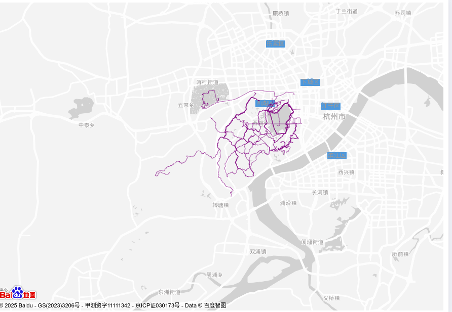
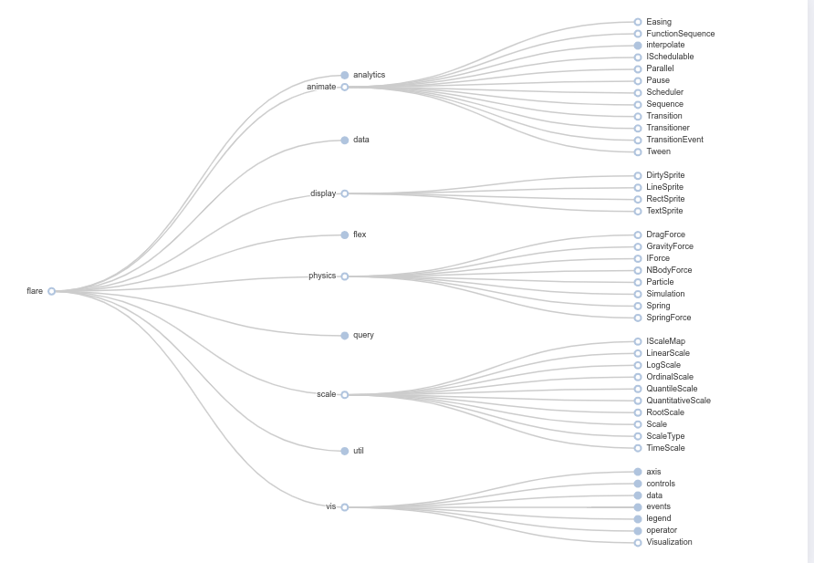
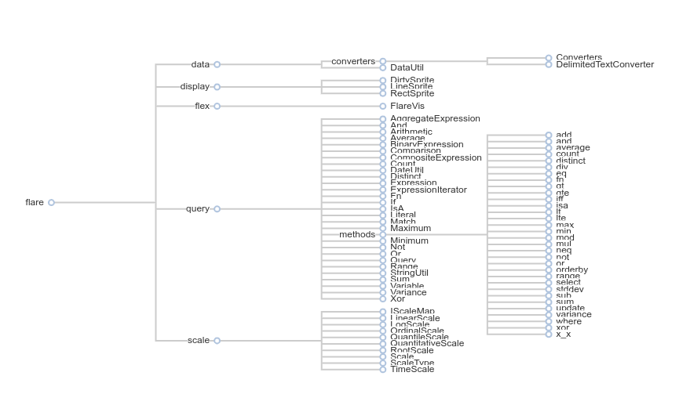
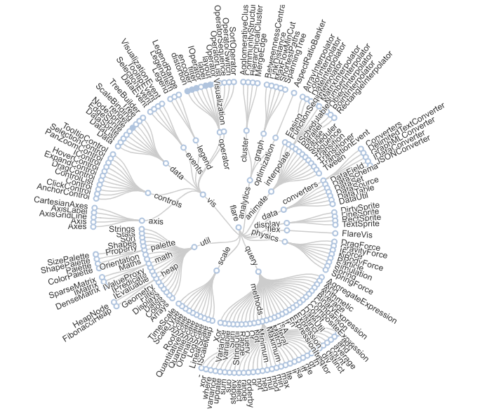
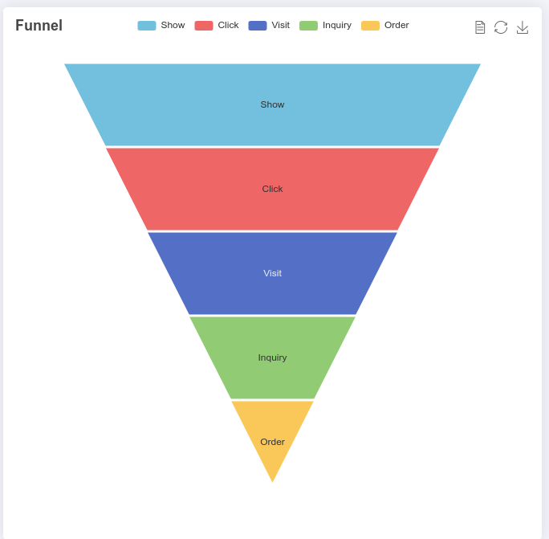
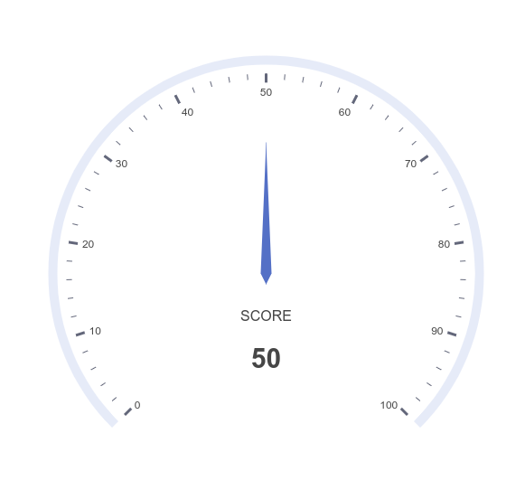
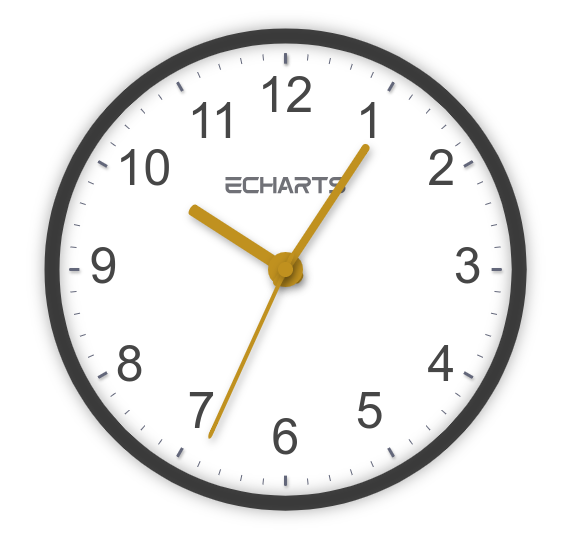
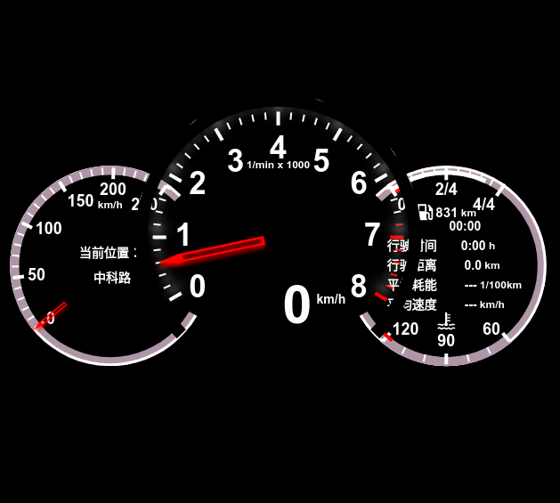
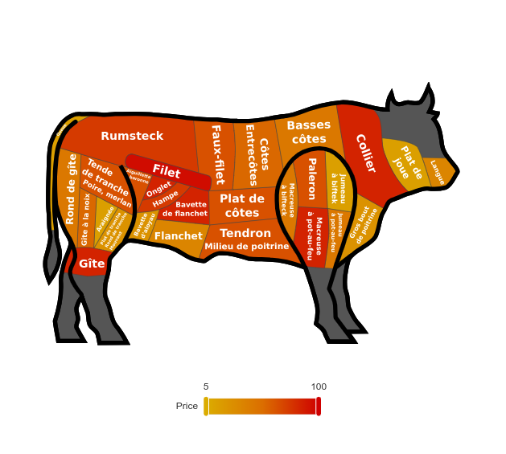
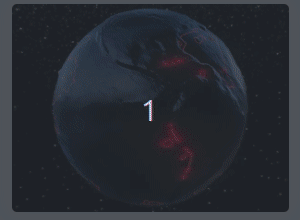

# Visualization with ECharts

In this course, we will learn some more advanced charts.
These charts are more modern, non-typical and more popular charts.

During the learning, you will face the challenges of getting the source data file which is shown in the following example html code. Try to download it from inferring from the relative path from EChart's official website. Download them and put them into the layout of your html, so that they will be shown properly.

## Takeaway

* Lines
* Tree
* Graph
* Funnel
* Gauge
* GEO/Map
* 3D Globe
* 3D Bar
* 3D Scatter
* 3D Surface
* 3D Lines
* Flow GL
* Graph GL

## Lines

### lines-bmap

Hint> the following code might not run without you downloading the .json and put it in your current directory.

```html
$.get(ROOT_PATH + '/data/asset/data/hangzhou-tracks.json', function (data) {
  const lines = data.map(function (track) {
    return {
      coords: track.map(function (seg, idx) {
        return seg.coord;
      })
    };
  });
  myChart.setOption(
    (option = {
      backgroundColor: 'transparent',
      bmap: {
        center: [120.13066322374, 30.240018034923],
        zoom: 14,
        roam: true,
        mapStyle: {
          styleJson: [
            {
              featureType: 'water',
              elementType: 'all',
              stylers: {
                color: '#d1d1d1'
              }
            },
            {
              featureType: 'land',
              elementType: 'all',
              stylers: {
                color: '#f3f3f3'
              }
            },
            {
              featureType: 'railway',
              elementType: 'all',
              stylers: {
                visibility: 'off'
              }
            },
            {
              featureType: 'highway',
              elementType: 'all',
              stylers: {
                color: '#fdfdfd'
              }
            },
            {
              featureType: 'highway',
              elementType: 'labels',
              stylers: {
                visibility: 'off'
              }
            },
            {
              featureType: 'arterial',
              elementType: 'geometry',
              stylers: {
                color: '#fefefe'
              }
            },
            {
              featureType: 'arterial',
              elementType: 'geometry.fill',
              stylers: {
                color: '#fefefe'
              }
            },
            {
              featureType: 'poi',
              elementType: 'all',
              stylers: {
                visibility: 'off'
              }
            },
            {
              featureType: 'green',
              elementType: 'all',
              stylers: {
                visibility: 'off'
              }
            },
            {
              featureType: 'subway',
              elementType: 'all',
              stylers: {
                visibility: 'off'
              }
            },
            {
              featureType: 'manmade',
              elementType: 'all',
              stylers: {
                color: '#d1d1d1'
              }
            },
            {
              featureType: 'local',
              elementType: 'all',
              stylers: {
                color: '#d1d1d1'
              }
            },
            {
              featureType: 'arterial',
              elementType: 'labels',
              stylers: {
                visibility: 'off'
              }
            },
            {
              featureType: 'boundary',
              elementType: 'all',
              stylers: {
                color: '#fefefe'
              }
            },
            {
              featureType: 'building',
              elementType: 'all',
              stylers: {
                color: '#d1d1d1'
              }
            },
            {
              featureType: 'label',
              elementType: 'labels.text.fill',
              stylers: {
                color: '#999999'
              }
            }
          ]
        }
      },
      series: [
        {
          type: 'lines',
          coordinateSystem: 'bmap',
          data: lines,
          polyline: true,
          lineStyle: {
            color: 'purple',
            opacity: 0.6,
            width: 1
          }
        }
      ]
    })
  );
});
```



## Tree

### tree-basic

```html
myChart.showLoading();
$.get(ROOT_PATH + '/data/asset/data/flare.json', function (data) {
  myChart.hideLoading();
  data.children.forEach(function (datum, index) {
    index % 2 === 0 && (datum.collapsed = true);
  });
  myChart.setOption(
    (option = {
      tooltip: {
        trigger: 'item',
        triggerOn: 'mousemove'
      },
      series: [
        {
          type: 'tree',
          data: [data],
          top: '1%',
          left: '7%',
          bottom: '1%',
          right: '20%',
          symbolSize: 7,
          label: {
            position: 'left',
            verticalAlign: 'middle',
            align: 'right',
            fontSize: 9
          },
          leaves: {
            label: {
              position: 'right',
              verticalAlign: 'middle',
              align: 'left'
            }
          },
          emphasis: {
            focus: 'descendant'
          },
          expandAndCollapse: true,
          animationDuration: 550,
          animationDurationUpdate: 750
        }
      ]
    })
  );
});
```



### tree-polyline

```html
const data = {
  name: 'flare',
  children: [
    {
      name: 'data',
      children: [
        {
          name: 'converters',
          children: [
            { name: 'Converters', value: 721 },
            { name: 'DelimitedTextConverter', value: 4294 }
          ]
        },
        {
          name: 'DataUtil',
          value: 3322
        }
      ]
    },
    {
      name: 'display',
      children: [
        { name: 'DirtySprite', value: 8833 },
        { name: 'LineSprite', value: 1732 },
        { name: 'RectSprite', value: 3623 }
      ]
    },
    {
      name: 'flex',
      children: [{ name: 'FlareVis', value: 4116 }]
    },
    {
      name: 'query',
      children: [
        { name: 'AggregateExpression', value: 1616 },
        { name: 'And', value: 1027 },
        { name: 'Arithmetic', value: 3891 },
        { name: 'Average', value: 891 },
        { name: 'BinaryExpression', value: 2893 },
        { name: 'Comparison', value: 5103 },
        { name: 'CompositeExpression', value: 3677 },
        { name: 'Count', value: 781 },
        { name: 'DateUtil', value: 4141 },
        { name: 'Distinct', value: 933 },
        { name: 'Expression', value: 5130 },
        { name: 'ExpressionIterator', value: 3617 },
        { name: 'Fn', value: 3240 },
        { name: 'If', value: 2732 },
        { name: 'IsA', value: 2039 },
        { name: 'Literal', value: 1214 },
        { name: 'Match', value: 3748 },
        { name: 'Maximum', value: 843 },
        {
          name: 'methods',
          children: [
            { name: 'add', value: 593 },
            { name: 'and', value: 330 },
            { name: 'average', value: 287 },
            { name: 'count', value: 277 },
            { name: 'distinct', value: 292 },
            { name: 'div', value: 595 },
            { name: 'eq', value: 594 },
            { name: 'fn', value: 460 },
            { name: 'gt', value: 603 },
            { name: 'gte', value: 625 },
            { name: 'iff', value: 748 },
            { name: 'isa', value: 461 },
            { name: 'lt', value: 597 },
            { name: 'lte', value: 619 },
            { name: 'max', value: 283 },
            { name: 'min', value: 283 },
            { name: 'mod', value: 591 },
            { name: 'mul', value: 603 },
            { name: 'neq', value: 599 },
            { name: 'not', value: 386 },
            { name: 'or', value: 323 },
            { name: 'orderby', value: 307 },
            { name: 'range', value: 772 },
            { name: 'select', value: 296 },
            { name: 'stddev', value: 363 },
            { name: 'sub', value: 600 },
            { name: 'sum', value: 280 },
            { name: 'update', value: 307 },
            { name: 'variance', value: 335 },
            { name: 'where', value: 299 },
            { name: 'xor', value: 354 },
            { name: 'x_x', value: 264 }
          ]
        },
        { name: 'Minimum', value: 843 },
        { name: 'Not', value: 1554 },
        { name: 'Or', value: 970 },
        { name: 'Query', value: 13896 },
        { name: 'Range', value: 1594 },
        { name: 'StringUtil', value: 4130 },
        { name: 'Sum', value: 791 },
        { name: 'Variable', value: 1124 },
        { name: 'Variance', value: 1876 },
        { name: 'Xor', value: 1101 }
      ]
    },
    {
      name: 'scale',
      children: [
        { name: 'IScaleMap', value: 2105 },
        { name: 'LinearScale', value: 1316 },
        { name: 'LogScale', value: 3151 },
        { name: 'OrdinalScale', value: 3770 },
        { name: 'QuantileScale', value: 2435 },
        { name: 'QuantitativeScale', value: 4839 },
        { name: 'RootScale', value: 1756 },
        { name: 'Scale', value: 4268 },
        { name: 'ScaleType', value: 1821 },
        { name: 'TimeScale', value: 5833 }
      ]
    }
  ]
};
option = {
  tooltip: {
    trigger: 'item',
    triggerOn: 'mousemove'
  },
  series: [
    {
      type: 'tree',
      id: 0,
      name: 'tree1',
      data: [data],
      top: '10%',
      left: '8%',
      bottom: '22%',
      right: '20%',
      symbolSize: 7,
      edgeShape: 'polyline',
      edgeForkPosition: '63%',
      initialTreeDepth: 3,
      lineStyle: {
        width: 2
      },
      label: {
        backgroundColor: '#fff',
        position: 'left',
        verticalAlign: 'middle',
        align: 'right'
      },
      leaves: {
        label: {
          position: 'right',
          verticalAlign: 'middle',
          align: 'left'
        }
      },
      emphasis: {
        focus: 'descendant'
      },
      expandAndCollapse: true,
      animationDuration: 550,
      animationDurationUpdate: 750
    }
  ]
};
```



### tree-radial

```html
myChart.showLoading();
$.get(ROOT_PATH + '/data/asset/data/flare.json', function (data) {
  myChart.hideLoading();
  myChart.setOption(
    (option = {
      tooltip: {
        trigger: 'item',
        triggerOn: 'mousemove'
      },
      series: [
        {
          type: 'tree',
          data: [data],
          top: '18%',
          bottom: '14%',
          layout: 'radial',
          symbol: 'emptyCircle',
          symbolSize: 7,
          initialTreeDepth: 3,
          animationDurationUpdate: 750,
          emphasis: {
            focus: 'descendant'
          }
        }
      ]
    })
  );
});
```



## Graphic

```html
let noise = getNoiseHelper();
let config = (app.config = {
  frequency: 500,
  offsetX: 0,
  offsetY: 100,
  minSize: 5,
  maxSize: 22,
  duration: 4000,
  color0: '#fff',
  color1: '#000',
  backgroundColor: '#fff',
  onChange() {
    myChart.setOption({
      backgroundColor: config.backgroundColor,
      graphic: {
        elements: createElements()
      }
    });
  }
});
noise.seed(Math.random());
function createElements() {
  const elements = [];
  for (let x = 20; x < myChart.getWidth(); x += 40) {
    for (let y = 20; y < myChart.getHeight(); y += 40) {
      const rand = noise.perlin2(
        x / config.frequency + config.offsetX,
        y / config.frequency + config.offsetY
      );
      elements.push({
        type: 'circle',
        x,
        y,
        style: {
          fill: config.color1
        },
        shape: {
          r: config.maxSize
        },
        keyframeAnimation: {
          duration: config.duration,
          loop: true,
          delay: (rand - 1) * 4000,
          keyframes: [
            {
              percent: 0.5,
              easing: 'sinusoidalInOut',
              style: {
                fill: config.color0
              },
              scaleX: config.minSize / config.maxSize,
              scaleY: config.minSize / config.maxSize
            },
            {
              percent: 1,
              easing: 'sinusoidalInOut',
              style: {
                fill: config.color1
              },
              scaleX: 1,
              scaleY: 1
            }
          ]
        }
      });
    }
  }
  return elements;
}
option = {
  backgroundColor: config.backgroundColor,
  graphic: {
    elements: createElements()
  }
};
app.configParameters = {
  frequency: { min: 10, max: 1000 },
  offsetX: { min: 0, max: 1000 },
  offsetY: { min: 0, max: 1000 },
  minSize: { min: 0, max: 100 },
  maxSize: { min: 0, max: 100 },
  duration: { min: 100, max: 100000 }
};
///////////////////////////////////////////////////////////////////////////
// Simplex and perlin noise helper from https://github.com/josephg/noisejs
///////////////////////////////////////////////////////////////////////////
function getNoiseHelper() {
  class Grad {
    constructor(x, y, z) {
      this.x = x;
      this.y = y;
      this.z = z;
    }
    dot2(x, y) {
      return this.x * x + this.y * y;
    }
    dot3(x, y, z) {
      return this.x * x + this.y * y + this.z * z;
    }
  }
  const grad3 = [
    new Grad(1, 1, 0),
    new Grad(-1, 1, 0),
    new Grad(1, -1, 0),
    new Grad(-1, -1, 0),
    new Grad(1, 0, 1),
    new Grad(-1, 0, 1),
    new Grad(1, 0, -1),
    new Grad(-1, 0, -1),
    new Grad(0, 1, 1),
    new Grad(0, -1, 1),
    new Grad(0, 1, -1),
    new Grad(0, -1, -1)
  ];
  const p = [
    151, 160, 137, 91, 90, 15, 131, 13, 201, 95, 96, 53, 194, 233, 7, 225, 140,
    36, 103, 30, 69, 142, 8, 99, 37, 240, 21, 10, 23, 190, 6, 148, 247, 120,
    234, 75, 0, 26, 197, 62, 94, 252, 219, 203, 117, 35, 11, 32, 57, 177, 33,
    88, 237, 149, 56, 87, 174, 20, 125, 136, 171, 168, 68, 175, 74, 165, 71,
    134, 139, 48, 27, 166, 77, 146, 158, 231, 83, 111, 229, 122, 60, 211, 133,
    230, 220, 105, 92, 41, 55, 46, 245, 40, 244, 102, 143, 54, 65, 25, 63, 161,
    1, 216, 80, 73, 209, 76, 132, 187, 208, 89, 18, 169, 200, 196, 135, 130,
    116, 188, 159, 86, 164, 100, 109, 198, 173, 186, 3, 64, 52, 217, 226, 250,
    124, 123, 5, 202, 38, 147, 118, 126, 255, 82, 85, 212, 207, 206, 59, 227,
    47, 16, 58, 17, 182, 189, 28, 42, 223, 183, 170, 213, 119, 248, 152, 2, 44,
    154, 163, 70, 221, 153, 101, 155, 167, 43, 172, 9, 129, 22, 39, 253, 19, 98,
    108, 110, 79, 113, 224, 232, 178, 185, 112, 104, 218, 246, 97, 228, 251, 34,
    242, 193, 238, 210, 144, 12, 191, 179, 162, 241, 81, 51, 145, 235, 249, 14,
    239, 107, 49, 192, 214, 31, 181, 199, 106, 157, 184, 84, 204, 176, 115, 121,
    50, 45, 127, 4, 150, 254, 138, 236, 205, 93, 222, 114, 67, 29, 24, 72, 243,
    141, 128, 195, 78, 66, 215, 61, 156, 180
  ];
  // To remove the need for index wrapping, double the permutation table length
  let perm = new Array(512);
  let gradP = new Array(512);
  // This isn't a very good seeding function, but it works ok. It supports 2^16
  // different seed values. Write something better if you need more seeds.
  function seed(seed) {
    if (seed > 0 && seed < 1) {
      // Scale the seed out
      seed *= 65536;
    }
    seed = Math.floor(seed);
    if (seed < 256) {
      seed |= seed << 8;
    }
    for (let i = 0; i < 256; i++) {
      let v;
      if (i & 1) {
        v = p[i] ^ (seed & 255);
      } else {
        v = p[i] ^ ((seed >> 8) & 255);
      }
      perm[i] = perm[i + 256] = v;
      gradP[i] = gradP[i + 256] = grad3[v % 12];
    }
  }
  seed(0);
  // ##### Perlin noise stuff
  function fade(t) {
    return t * t * t * (t * (t * 6 - 15) + 10);
  }
  function lerp(a, b, t) {
    return (1 - t) * a + t * b;
  }
  // 2D Perlin Noise
  function perlin2(x, y) {
    // Find unit grid cell containing point
    let X = Math.floor(x),
      Y = Math.floor(y);
    // Get relative xy coordinates of point within that cell
    x = x - X;
    y = y - Y;
    // Wrap the integer cells at 255 (smaller integer period can be introduced here)
    X = X & 255;
    Y = Y & 255;
    // Calculate noise contributions from each of the four corners
    let n00 = gradP[X + perm[Y]].dot2(x, y);
    let n01 = gradP[X + perm[Y + 1]].dot2(x, y - 1);
    let n10 = gradP[X + 1 + perm[Y]].dot2(x - 1, y);
    let n11 = gradP[X + 1 + perm[Y + 1]].dot2(x - 1, y - 1);
    // Compute the fade curve value for x
    let u = fade(x);
    // Interpolate the four results
    return lerp(lerp(n00, n10, u), lerp(n01, n11, u), fade(y));
  }
  return {
    seed,
    perlin2
  };
}
```


## Funnel

### funnel

```html
option = {
  title: {
    text: 'Funnel'
  },
  tooltip: {
    trigger: 'item',
    formatter: '{a} <br/>{b} : {c}%'
  },
  toolbox: {
    feature: {
      dataView: { readOnly: false },
      restore: {},
      saveAsImage: {}
    }
  },
  legend: {
    data: ['Show', 'Click', 'Visit', 'Inquiry', 'Order']
  },
  series: [
    {
      name: 'Funnel',
      type: 'funnel',
      left: '10%',
      top: 60,
      bottom: 60,
      width: '80%',
      min: 0,
      max: 100,
      minSize: '0%',
      maxSize: '100%',
      sort: 'descending',
      gap: 2,
      label: {
        show: true,
        position: 'inside'
      },
      labelLine: {
        length: 10,
        lineStyle: {
          width: 1,
          type: 'solid'
        }
      },
      itemStyle: {
        borderColor: '#fff',
        borderWidth: 1
      },
      emphasis: {
        label: {
          fontSize: 20
        }
      },
      data: [
        { value: 60, name: 'Visit' },
        { value: 40, name: 'Inquiry' },
        { value: 20, name: 'Order' },
        { value: 80, name: 'Click' },
        { value: 100, name: 'Show' }
      ]
    }
  ]
};
```



### funnel-mutiple

```html
option = {
  title: {
    text: 'Funnel',
    left: 'left',
    top: 'bottom'
  },
  tooltip: {
    trigger: 'item',
    formatter: '{a} <br/>{b} : {c}%'
  },
  toolbox: {
    orient: 'vertical',
    top: 'center',
    feature: {
      dataView: { readOnly: false },
      restore: {},
      saveAsImage: {}
    }
  },
  legend: {
    orient: 'vertical',
    left: 'left',
    data: ['Show', 'Click', 'Visit', 'Inquiry', 'Order']
  },
  series: [
    {
      name: 'Funnel',
      type: 'funnel',
      width: '40%',
      height: '45%',
      left: '5%',
      top: '50%',
      data: [
        { value: 60, name: 'Visit' },
        { value: 30, name: 'Inquiry' },
        { value: 10, name: 'Order' },
        { value: 80, name: 'Click' },
        { value: 100, name: 'Show' }
      ]
    },
    {
      name: 'Pyramid',
      type: 'funnel',
      width: '40%',
      height: '45%',
      left: '5%',
      top: '5%',
      sort: 'ascending',
      data: [
        { value: 60, name: 'Visit' },
        { value: 30, name: 'Inquiry' },
        { value: 10, name: 'Order' },
        { value: 80, name: 'Click' },
        { value: 100, name: 'Show' }
      ]
    },
    {
      name: 'Funnel',
      type: 'funnel',
      width: '40%',
      height: '45%',
      left: '55%',
      top: '5%',
      label: {
        position: 'left'
      },
      data: [
        { value: 60, name: 'Visit' },
        { value: 30, name: 'Inquiry' },
        { value: 10, name: 'Order' },
        { value: 80, name: 'Click' },
        { value: 100, name: 'Show' }
      ]
    },
    {
      name: 'Pyramid',
      type: 'funnel',
      width: '40%',
      height: '45%',
      left: '55%',
      top: '50%',
      sort: 'ascending',
      label: {
        position: 'left'
      },
      data: [
        { value: 60, name: 'Visit' },
        { value: 30, name: 'Inquiry' },
        { value: 10, name: 'Order' },
        { value: 80, name: 'Click' },
        { value: 100, name: 'Show' }
      ]
    }
  ]
};
```


## Gauge

### Basic Gauge

```html
option = {
  tooltip: {
    formatter: '{a} <br/>{b} : {c}%'
  },
  series: [
    {
      name: 'Pressure',
      type: 'gauge',
      detail: {
        formatter: '{value}'
      },
      data: [
        {
          value: 50,
          name: 'SCORE'
        }
      ]
    }
  ]
};
```



### gauge-clock

```html
option = {
  series: [
    {
      name: 'hour',
      type: 'gauge',
      startAngle: 90,
      endAngle: -270,
      min: 0,
      max: 12,
      splitNumber: 12,
      clockwise: true,
      axisLine: {
        lineStyle: {
          width: 15,
          color: [[1, 'rgba(0,0,0,0.7)']],
          shadowColor: 'rgba(0, 0, 0, 0.5)',
          shadowBlur: 15
        }
      },
      splitLine: {
        lineStyle: {
          shadowColor: 'rgba(0, 0, 0, 0.3)',
          shadowBlur: 3,
          shadowOffsetX: 1,
          shadowOffsetY: 2
        }
      },
      axisLabel: {
        fontSize: 50,
        distance: 25,
        formatter: function (value) {
          if (value === 0) {
            return '';
          }
          return value + '';
        }
      },
      anchor: {
        show: true,
        icon: 'path://M532.8,70.8C532.8,70.8,532.8,70.8,532.8,70.8L532.8,70.8C532.7,70.8,532.8,70.8,532.8,70.8z M456.1,49.6c-2.2-6.2-8.1-10.6-15-10.6h-37.5v10.6h37.5l0,0c2.9,0,5.3,2.4,5.3,5.3c0,2.9-2.4,5.3-5.3,5.3v0h-22.5c-1.5,0.1-3,0.4-4.3,0.9c-4.5,1.6-8.1,5.2-9.7,9.8c-0.6,1.7-0.9,3.4-0.9,5.3v16h10.6v-16l0,0l0,0c0-2.7,2.1-5,4.7-5.3h10.3l10.4,21.2h11.8l-10.4-21.2h0c6.9,0,12.8-4.4,15-10.6c0.6-1.7,0.9-3.5,0.9-5.3C457,53,456.7,51.2,456.1,49.6z M388.9,92.1h11.3L381,39h-3.6h-11.3L346.8,92v0h11.3l3.9-10.7h7.3h7.7l3.9-10.6h-7.7h-7.3l7.7-21.2v0L388.9,92.1z M301,38.9h-10.6v53.1H301V70.8h28.4l3.7-10.6H301V38.9zM333.2,38.9v10.6v10.7v31.9h10.6V38.9H333.2z M249.5,81.4L249.5,81.4L249.5,81.4c-2.9,0-5.3-2.4-5.3-5.3h0V54.9h0l0,0c0-2.9,2.4-5.3,5.3-5.3l0,0l0,0h33.6l3.9-10.6h-37.5c-1.9,0-3.6,0.3-5.3,0.9c-4.5,1.6-8.1,5.2-9.7,9.7c-0.6,1.7-0.9,3.5-0.9,5.3l0,0v21.3c0,1.9,0.3,3.6,0.9,5.3c1.6,4.5,5.2,8.1,9.7,9.7c1.7,0.6,3.5,0.9,5.3,0.9h33.6l3.9-10.6H249.5z M176.8,38.9v10.6h49.6l3.9-10.6H176.8z M192.7,81.4L192.7,81.4L192.7,81.4c-2.9,0-5.3-2.4-5.3-5.3l0,0v-5.3h38.9l3.9-10.6h-53.4v10.6v5.3l0,0c0,1.9,0.3,3.6,0.9,5.3c1.6,4.5,5.2,8.1,9.7,9.7c1.7,0.6,3.4,0.9,5.3,0.9h23.4h10.2l3.9-10.6l0,0H192.7z M460.1,38.9v10.6h21.4v42.5h10.6V49.6h17.5l3.8-10.6H460.1z M541.6,68.2c-0.2,0.1-0.4,0.3-0.7,0.4C541.1,68.4,541.4,68.3,541.6,68.2L541.6,68.2z M554.3,60.2h-21.6v0l0,0c-2.9,0-5.3-2.4-5.3-5.3c0-2.9,2.4-5.3,5.3-5.3l0,0l0,0h33.6l3.8-10.6h-37.5l0,0c-6.9,0-12.8,4.4-15,10.6c-0.6,1.7-0.9,3.5-0.9,5.3c0,1.9,0.3,3.7,0.9,5.3c2.2,6.2,8.1,10.6,15,10.6h21.6l0,0c2.9,0,5.3,2.4,5.3,5.3c0,2.9-2.4,5.3-5.3,5.3l0,0h-37.5v10.6h37.5c6.9,0,12.8-4.4,15-10.6c0.6-1.7,0.9-3.5,0.9-5.3c0-1.9-0.3-3.7-0.9-5.3C567.2,64.6,561.3,60.2,554.3,60.2z',
        showAbove: false,
        offsetCenter: [0, '-35%'],
        size: 120,
        keepAspect: true,
        itemStyle: {
          color: '#707177'
        }
      },
      pointer: {
        icon: 'path://M2.9,0.7L2.9,0.7c1.4,0,2.6,1.2,2.6,2.6v115c0,1.4-1.2,2.6-2.6,2.6l0,0c-1.4,0-2.6-1.2-2.6-2.6V3.3C0.3,1.9,1.4,0.7,2.9,0.7z',
        width: 12,
        length: '55%',
        offsetCenter: [0, '8%'],
        itemStyle: {
          color: '#C0911F',
          shadowColor: 'rgba(0, 0, 0, 0.3)',
          shadowBlur: 8,
          shadowOffsetX: 2,
          shadowOffsetY: 4
        }
      },
      detail: {
        show: false
      },
      title: {
        offsetCenter: [0, '30%']
      },
      data: [
        {
          value: 0
        }
      ]
    },
    {
      name: 'minute',
      type: 'gauge',
      startAngle: 90,
      endAngle: -270,
      min: 0,
      max: 60,
      clockwise: true,
      axisLine: {
        show: false
      },
      splitLine: {
        show: false
      },
      axisTick: {
        show: false
      },
      axisLabel: {
        show: false
      },
      pointer: {
        icon: 'path://M2.9,0.7L2.9,0.7c1.4,0,2.6,1.2,2.6,2.6v115c0,1.4-1.2,2.6-2.6,2.6l0,0c-1.4,0-2.6-1.2-2.6-2.6V3.3C0.3,1.9,1.4,0.7,2.9,0.7z',
        width: 8,
        length: '70%',
        offsetCenter: [0, '8%'],
        itemStyle: {
          color: '#C0911F',
          shadowColor: 'rgba(0, 0, 0, 0.3)',
          shadowBlur: 8,
          shadowOffsetX: 2,
          shadowOffsetY: 4
        }
      },
      anchor: {
        show: true,
        size: 20,
        showAbove: false,
        itemStyle: {
          borderWidth: 15,
          borderColor: '#C0911F',
          shadowColor: 'rgba(0, 0, 0, 0.3)',
          shadowBlur: 8,
          shadowOffsetX: 2,
          shadowOffsetY: 4
        }
      },
      detail: {
        show: false
      },
      title: {
        offsetCenter: ['0%', '-40%']
      },
      data: [
        {
          value: 0
        }
      ]
    },
    {
      name: 'second',
      type: 'gauge',
      startAngle: 90,
      endAngle: -270,
      min: 0,
      max: 60,
      animationEasingUpdate: 'bounceOut',
      clockwise: true,
      axisLine: {
        show: false
      },
      splitLine: {
        show: false
      },
      axisTick: {
        show: false
      },
      axisLabel: {
        show: false
      },
      pointer: {
        icon: 'path://M2.9,0.7L2.9,0.7c1.4,0,2.6,1.2,2.6,2.6v115c0,1.4-1.2,2.6-2.6,2.6l0,0c-1.4,0-2.6-1.2-2.6-2.6V3.3C0.3,1.9,1.4,0.7,2.9,0.7z',
        width: 4,
        length: '85%',
        offsetCenter: [0, '8%'],
        itemStyle: {
          color: '#C0911F',
          shadowColor: 'rgba(0, 0, 0, 0.3)',
          shadowBlur: 8,
          shadowOffsetX: 2,
          shadowOffsetY: 4
        }
      },
      anchor: {
        show: true,
        size: 15,
        showAbove: true,
        itemStyle: {
          color: '#C0911F',
          shadowColor: 'rgba(0, 0, 0, 0.3)',
          shadowBlur: 8,
          shadowOffsetX: 2,
          shadowOffsetY: 4
        }
      },
      detail: {
        show: false
      },
      title: {
        offsetCenter: ['0%', '-40%']
      },
      data: [
        {
          value: 0
        }
      ]
    }
  ]
};
setInterval(function () {
  var date = new Date();
  var second = date.getSeconds();
  var minute = date.getMinutes() + second / 60;
  var hour = (date.getHours() % 12) + minute / 60;
  option.animationDurationUpdate = 300;
  myChart.setOption({
    series: [
      {
        name: 'hour',
        animation: hour !== 0,
        data: [{ value: hour }]
      },
      {
        name: 'minute',
        animation: minute !== 0,
        data: [{ value: minute }]
      },
      {
        animation: second !== 0,
        name: 'second',
        data: [{ value: second }]
      }
    ]
  });
}, 1000);
```



### gauge-car

```html
option = {
  backgroundColor: '#000',
  tooltip: {
    formatter: '{a} <br/>{b} : {c}%'
  },
  toolbox: {
    feature: {
      restore: {},
      saveAsImage: {}
    }
  },
  series: [
    // left
    {
      name: 'gauge 0',
      type: 'gauge',
      min: -200,
      max: 250,
      startAngle: -30,
      endAngle: -315,
      splitNumber: 9,
      radius: '35%',
      center: ['21%', '55%'],
      axisLine: {
        lineStyle: {
          color: [[1, '#AE96A6']]
        }
      },
      splitLine: {
        show: false
      },
      axisTick: {
        show: false
      },
      axisLabel: {
        show: false
      },
      anchor: {},
      pointer: {
        show: false
      },
      detail: {
        show: false
      },
      title: {
        fontSize: 12,
        fontWeight: 800,
        fontFamily: 'Arial',
        color: '#fff',
        offsetCenter: [0, '-60%']
      },
      progress: {
        show: true,
        width: 3,
        itemStyle: {
          color: '#fff'
        }
      },
      data: [
        {
          value: 250,
          name: 'km/h'
        }
      ]
    },
    {
      name: 'gauge 1',
      type: 'gauge',
      min: 0,
      max: 250,
      startAngle: -140,
      endAngle: -305,
      splitNumber: 5,
      radius: '35%',
      center: ['21%', '55%'],
      axisLine: {
        lineStyle: {
          color: [[1, '#AE96A6']]
        }
      },
      splitLine: {
        distance: -7,
        length: 12,
        lineStyle: {
          color: '#fff',
          width: 4
        }
      },
      axisTick: {
        distance: -8,
        length: 8,
        lineStyle: {
          color: '#fff',
          width: 2
        }
      },
      axisLabel: {
        distance: 14,
        fontSize: 18,
        fontWeight: 800,
        fontFamily: 'Arial',
        color: '#fff'
      },
      anchor: {},
      pointer: {
        icon: 'path://M-36.5,23.9L-41,4.4c-0.1-0.4-0.4-0.7-0.7-0.7c-0.5-0.1-1.1,0.2-1.2,0.7l-4.5,19.5c0,0.1,0,0.1,0,0.2v92.3c0,0.6,0.4,1,1,1h9c0.6,0,1-0.4,1-1V24.1C-36.5,24-36.5,23.9-36.5,23.9z M-39.5,114.6h-5v-85h5V114.6z',
        width: 5,
        length: '40%',
        offsetCenter: [0, '-58%'],
        itemStyle: {
          color: '#f00',
          shadowColor: 'rgba(255, 0, 0)',
          shadowBlur: 5,
          shadowOffsetY: 2
        }
      },
      title: {
        color: '#fff',
        fontSize: 14,
        fontWeight: 800,
        fontFamily: 'Arial',
        offsetCenter: [0, 0]
      },
      detail: {
        show: false
      },
      data: [
        {
          value: 0,
          name: '当前位置：\n \n 中科路'
        }
      ]
    },
    // middle
    {
      name: 'gauge 2',
      type: 'gauge',
      min: 0,
      max: 8,
      z: 10,
      startAngle: 210,
      endAngle: -30,
      splitNumber: 8,
      radius: '50%',
      center: ['50%', '50%'],
      axisLine: {
        show: true,
        lineStyle: {
          width: 0,
          color: [
            [0.825, '#fff'],
            [1, '#f00']
          ]
        }
      },
      splitLine: {
        distance: 20,
        length: 15,
        lineStyle: {
          color: 'auto',
          width: 4,
          shadowColor: 'rgba(255, 255, 255, 0.5)',
          shadowBlur: 15,
          shadowOffsetY: -10
        }
      },
      axisTick: {
        distance: 20,
        length: 8,
        lineStyle: {
          color: 'auto',
          width: 2,
          shadowColor: 'rgba(255, 255, 255)',
          shadowBlur: 10,
          shadowOffsetY: -10
        }
      },
      axisLabel: {
        distance: 10,
        fontSize: 35,
        fontWeight: 800,
        fontFamily: 'Arial',
        color: '#fff'
      },
      anchor: {},
      pointer: {
        icon: 'path://M-36.5,23.9L-41,4.4c-0.1-0.4-0.4-0.7-0.7-0.7c-0.5-0.1-1.1,0.2-1.2,0.7l-4.5,19.5c0,0.1,0,0.1,0,0.2v92.3c0,0.6,0.4,1,1,1h9c0.6,0,1-0.4,1-1V24.1C-36.5,24-36.5,23.9-36.5,23.9z M-39.5,114.6h-5v-85h5V114.6z',
        width: 10,
        offsetCenter: [0, '-10%'],
        length: '75%',
        itemStyle: {
          color: '#f00',
          shadowColor: 'rgba(255, 0, 0)',
          shadowBlur: 5,
          shadowOffsetY: 3
        }
      },
      title: {
        color: '#fff',
        fontSize: 12,
        fontWeight: 800,
        fontFamily: 'Arial',
        offsetCenter: [0, '-50%']
      },
      data: [
        {
          value: 0.6,
          name: '1/min x 1000'
        }
      ],
      detail: {
        show: false
      }
    },
    {
      name: 'gauge 3',
      type: 'gauge',
      min: 0,
      max: 8,
      z: 10,
      splitNumber: 8,
      radius: '50%',
      axisLine: {
        lineStyle: {
          width: 14,
          color: [[1, '#000']]
        }
      },
      splitLine: {
        show: false
      },
      axisTick: {
        show: false
      },
      axisLabel: {
        show: false
      },
      anchor: {},
      pointer: {
        show: false
      },
      title: {
        show: false
      },
      detail: {
        offsetCenter: ['25%', '50%'],
        formatter: '{a|{value}}{b|km/h}',
        rich: {
          a: {
            fontSize: 60,
            fontWeight: 800,
            fontFamily: 'Arial',
            color: '#fff',
            align: 'center',
            padding: [0, 5, 0, 0]
          },
          b: {
            fontSize: 14,
            fontWeight: 800,
            fontFamily: 'Arial',
            color: '#fff',
            padding: [0, 0, 20, 0]
          }
        }
      },
      // value is speed
      data: [
        {
          value: 0,
          name: ''
        }
      ]
    },
    // right
    {
      name: 'gauge 4',
      type: 'gauge',
      min: 0,
      max: 8,
      startAngle: 135,
      endAngle: -150,
      splitNumber: 8,
      radius: '35%',
      center: ['79%', '55%'],
      axisLine: {
        lineStyle: {
          color: [[1, '#AE96A6']]
        }
      },
      splitLine: {
        show: false
      },
      axisTick: {
        show: false
      },
      axisLabel: {
        show: false
      },
      anchor: {},
      pointer: {
        show: false
      },
      title: {},
      detail: {
        offsetCenter: ['-15%', 0],
        formatter: [
          '{a|                  00:00}',
          '{a|行驶时间       0:00}{b| h}',
          '{a|行驶距离        0.0}{b| km}',
          '{a|平均耗能        ---}{b| 1/100km}',
          '{a|平均速度        ---}{b| km/h}'
        ].join('\n'),
        rich: {
          a: {
            fontSize: 14,
            fontWeight: 800,
            fontFamily: 'Arial',
            lineHeight: 22,
            color: '#fff',
            align: 'left'
          },
          b: {
            fontWeight: 600,
            fontFamily: 'Arial',
            lineHeight: 22,
            color: '#fff',
            align: 'left'
          }
        }
      },
      progress: {
        show: true,
        width: 3,
        itemStyle: {
          color: '#fff'
        }
      },
      data: [
        {
          value: 250,
          name: ''
        }
      ]
    },
    {
      name: 'gauge 5',
      type: 'gauge',
      min: 0,
      max: 1,
      startAngle: 125,
      endAngle: 55,
      splitNumber: 2,
      radius: '34%',
      center: ['79%', '55.3%'],
      axisLine: {
        lineStyle: {
          width: 9,
          color: [
            [0.15, '#f00'],
            [1, 'rgba(255, 0, 0, 0)']
          ]
        }
      },
      splitLine: {
        distance: -14,
        length: 16,
        lineStyle: {
          color: '#fff',
          width: 4
        }
      },
      axisTick: {
        distance: -14,
        length: 10,
        lineStyle: {
          color: '#fff',
          width: 2
        }
      },
      axisLabel: {
        distance: 12,
        fontSize: 18,
        fontWeight: 800,
        fontFamily: 'Arial',
        color: '#fff',
        formatter: function (value) {
          if (value === 0.5) {
            return '2/4';
          }
          if (value === 1) {
            return '4/4';
          }
          return value + '';
        }
      },
      progress: {
        show: true,
        width: 5,
        itemStyle: {
          color: '#fff'
        }
      },
      anchor: {
        show: true,
        itemStyle: {},
        offsetCenter: ['-22%', '-57%'],
        size: 18,
        icon: 'path://M1.11979167,1.11111112 C1.11979167,0.497461393 1.61725306,0 2.23090279,0 L12.2309028,0 C12.8445525,1.43824153e-08 13.3420139,0.497461403 13.3420139,1.11111112 L13.3420139,10 L15.5642361,10 C16.7915356,10 17.7864583,10.9949228 17.7864583,12.2222222 L17.7864583,16.6666667 C17.7865523,17.28025 18.2839861,17.7776077 18.8975694,17.7776077 C19.5111527,17.7776077 20.0085866,17.28025 20.0086805,16.6666667 L20.0086805,8.88888888 L17.7864583,8.88888888 C17.1728086,8.88888888 16.6753472,8.3914275 16.6753472,7.77777779 L16.6753472,3.79333333 L15.6197917,2.73777777 C15.1859413,2.30392741 15.1859413,1.60051702 15.6197917,1.16666667 L15.6197917,1.16666667 C16.053642,0.732816318 16.7570524,0.732816318 17.1909028,1.16666667 L21.9053472,5.88111112 C22.1140468,6.08922811 22.2312072,6.37193273 22.2309028,6.66666667 L22.2309028,16.6666667 C22.2309028,18.5076158 20.7385186,20 18.8975695,20 C17.0566203,20 15.5642361,18.5076158 15.5642361,16.6666667 L15.5642361,12.2222222 L13.3420139,12.2222222 L13.3420139,17.7777778 L13.3420139,17.7777778 C13.9556636,17.7777778 14.453125,18.2752392 14.453125,18.8888889 L14.453125,18.8888889 C14.453125,19.5025386 13.9556636,20 13.3420139,20 L1.11979165,20 C0.506141934,20 0.00868054688,19.5025386 0.00868054687,18.8888889 L0.00868054687,18.8888889 C0.00868054688,18.2752392 0.506141934,17.7777778 1.11979165,17.7777778 L1.11979167,17.7777778 L1.11979167,1.11111112 Z M3.34201388,2.22222221 L3.34201388,8.88888888 L11.1197917,8.88888888 L11.1197917,2.22222221 L3.34201388,2.22222221 Z'
      },
      pointer: {
        show: false
      },
      title: {},
      detail: {
        offsetCenter: ['10%', '-56%'],
        formatter: '{a|831}{b| km}',
        rich: {
          a: {
            fontSize: 15,
            fontWeight: 800,
            fontFamily: 'Arial',
            color: '#fff'
          },
          b: {
            fontWeight: 600,
            fontFamily: 'Arial',
            color: '#fff'
          }
        }
      },
      data: [
        {
          value: 0.85,
          name: ''
        }
      ]
    },
    {
      name: 'gauge 6',
      type: 'gauge',
      min: -120,
      max: -60,
      startAngle: 230,
      endAngle: 310,
      clockwise: false,
      splitNumber: 2,
      radius: '35%',
      center: ['79%', '55%'],
      axisLine: {
        lineStyle: {
          color: [
            [1, '#AE96A6'],
            [1.1, '#f00']
          ]
        }
      },
      splitLine: {
        distance: -8,
        length: 12,
        lineStyle: {
          color: '#fff',
          width: 4
        }
      },
      axisTick: {
        splitNumber: 3,
        length: 8,
        distance: -8,
        lineStyle: {
          color: '#fff',
          width: 2
        }
      },
      axisLabel: {
        distance: 14,
        fontSize: 18,
        fontWeight: 800,
        fontFamily: 'Arial',
        color: '#fff',
        formatter: function (value) {
          return -value + '';
        }
      },
      anchor: {
        show: true,
        itemStyle: {},
        offsetCenter: [0, '55%'],
        size: 20,
        icon: 'path://M-34.1-1.1L-34.1-1.1c0-0.3-0.3-0.6-0.6-0.6h-3.6v-1.5c0-0.5-0.2-0.9-0.6-1.1s-0.9-0.2-1.3,0c-0.4,0.2-0.6,0.7-0.6,1.1V7.9c0,0,0,0.1,0,0.1c-0.8,0.5-1.2,1.5-0.9,2.5c0.3,0.9,1.1,1.6,2.1,1.6c1,0,1.8-0.6,2.1-1.5c0.3-0.9,0-1.9-0.8-2.5V6.3h3.5c0.4,0,0.7-0.3,0.7-0.7l0,0c0-0.4-0.3-0.7-0.7-0.7h-3.5V2.9h3.5c0.4,0,0.7-0.3,0.7-0.7l0,0c0-0.4-0.3-0.7-0.7-0.7h-3.5v-2.1h3.6C-34.4-0.5-34.1-0.8-34.1-1.1z M-44.9,11.6c-0.7,0-1.4-0.2-2-0.6c-0.4-0.3-0.9-0.4-1.4-0.4c-0.4,0-0.9,0.2-1.2,0.4c-0.4,0.2-1.4-0.9-0.9-1.3c0.6-0.4,1.3-0.6,2-0.7c0.8,0,1.5,0.2,2.2,0.5c0.4,0.3,0.9,0.4,1.3,0.4c0.6,0,1.1-0.2,1.5-0.6s1.6,0.7,0.9,1.3S-44,11.6-44.9,11.6L-44.9,11.6z M-34.3,11.6c-0.7,0-1.4-0.3-2-0.7c-0.6-0.4,0.5-1.6,0.9-1.3s0.8,0.4,1.2,0.4c0.5,0,1-0.1,1.4-0.4c0.6-0.3,1.3-0.5,2-0.6h0c0.9,0,1.7,0.3,2.4,0.9c0.7,0.5-0.5,1.6-0.9,1.3c-0.4-0.3-1-0.6-1.5-0.6h0c-0.5,0-0.9,0.2-1.3,0.4c-0.6,0.3-1.3,0.5-2,0.6H-34.3z M-33.5,16.3c-0.7,0-1.4-0.3-1.9-0.8c-0.4-0.3-0.6-0.5-1-0.5c-0.4,0-0.7,0.2-1,0.4c-0.6,0.5-1.3,0.7-2,0.7c-0.7,0-1.4-0.3-1.9-0.8c-0.2-0.3-0.6-0.4-0.9-0.4c-0.4,0-0.7,0.1-1.1,0.5c-0.6,0.5-1.3,0.7-2.1,0.7c-0.7-0.1-1.4-0.4-1.9-0.9c-0.4-0.3-0.6-0.5-1-0.5c-0.3,0-0.6,0.2-0.9,0.4s-1.6-0.7-1.1-1.2c0.5-0.5,1.2-0.8,1.9-0.9c1-0.1,1.6,0.4,2.1,0.8c0.3,0.3,0.6,0.5,1,0.5c0.4,0,0.6-0.1,1-0.4c0.6-0.5,1.4-0.8,2.1-0.8c0.7,0,1.4,0.3,1.9,0.8c0.2,0.2,0.6,0.4,0.9,0.4c0.4,0,0.6-0.1,1-0.4c0.6-0.5,1.3-0.7,2-0.7c0.8,0,1.5,0.3,2,0.9c0.4,0.3,0.6,0.4,0.9,0.4c0.3,0,0.7-0.2,1.1-0.5c0.5-0.4,1.2-0.9,2.3-0.8c0.7,0,1.4,0.3,1.9,0.7c0.5,0.4-0.7,1.5-1,1.3s-0.6-0.4-1-0.4c-0.4,0-0.7,0.2-1.2,0.5C-32,15.9-32.7,16.2-33.5,16.3L-33.5,16.3z'
      },
      pointer: {
        icon: 'path://M2.9,0.7L2.9,0.7c1.4,0,2.6,1.2,2.6,2.6v115c0,1.4-1.2,2.6-2.6,2.6l0,0c-1.4,0-2.6-1.2-2.6-2.6V3.3C0.3,1.9,1.4,0.7,2.9,0.7z',
        width: 15,
        length: '4',
        offsetCenter: [0, '-90%'],
        itemStyle: {
          color: '#f00'
        }
      },
      title: {},
      detail: {
        show: false
      },
      data: [
        {
          value: -120,
          name: ''
        }
      ]
    }
  ]
};
```



## GEO/Map

### geo-beef-cuts

```html
$.get(ROOT_PATH + '/data/asset/geo/Beef_cuts_France.svg', function (svg) {
  echarts.registerMap('Beef_cuts_France', { svg: svg });
  option = {
    tooltip: {},
    visualMap: {
      left: 'center',
      bottom: '10%',
      min: 5,
      max: 100,
      orient: 'horizontal',
      text: ['', 'Price'],
      realtime: true,
      calculable: true,
      inRange: {
        color: ['#dbac00', '#db6e00', '#cf0000']
      }
    },
    series: [
      {
        name: 'French Beef Cuts',
        type: 'map',
        map: 'Beef_cuts_France',
        roam: true,
        emphasis: {
          label: {
            show: false
          }
        },
        selectedMode: false,
        data: [
          { name: 'Queue', value: 15 },
          { name: 'Langue', value: 35 },
          { name: 'Plat de joue', value: 15 },
          { name: 'Gros bout de poitrine', value: 25 },
          { name: 'Jumeau à pot-au-feu', value: 45 },
          { name: 'Onglet', value: 85 },
          { name: 'Plat de tranche', value: 25 },
          { name: 'Araignée', value: 15 },
          { name: 'Gîte à la noix', value: 55 },
          { name: "Bavette d'aloyau", value: 25 },
          { name: 'Tende de tranche', value: 65 },
          { name: 'Rond de gîte', value: 45 },
          { name: 'Bavettede de flanchet', value: 85 },
          { name: 'Flanchet', value: 35 },
          { name: 'Hampe', value: 75 },
          { name: 'Plat de côtes', value: 65 },
          { name: 'Tendron Milieu de poitrine', value: 65 },
          { name: 'Macreuse à pot-au-feu', value: 85 },
          { name: 'Rumsteck', value: 75 },
          { name: 'Faux-filet', value: 65 },
          { name: 'Côtes Entrecôtes', value: 55 },
          { name: 'Basses côtes', value: 45 },
          { name: 'Collier', value: 85 },
          { name: 'Jumeau à biftek', value: 15 },
          { name: 'Paleron', value: 65 },
          { name: 'Macreuse à bifteck', value: 45 },
          { name: 'Gîte', value: 85 },
          { name: 'Aiguillette baronne', value: 65 },
          { name: 'Filet', value: 95 }
        ]
      }
    ]
  };
  myChart.setOption(option);
});
```



### geo-svg-scatter-simple

```html
$.get(ROOT_PATH + '/data/asset/geo/Map_of_Iceland.svg', function (svg) {
  echarts.registerMap('iceland_svg', { svg: svg });
  option = {
    tooltip: {},
    geo: {
      tooltip: {
        show: true
      },
      map: 'iceland_svg',
      roam: true
    },
    series: {
      type: 'effectScatter',
      coordinateSystem: 'geo',
      geoIndex: 0,
      symbolSize: function (params) {
        return (params[2] / 100) * 15 + 5;
      },
      itemStyle: {
        color: '#b02a02'
      },
      encode: {
        tooltip: 2
      },
      data: [
        [488.2358421078053, 459.70913833075736, 100],
        [770.3415644319939, 757.9672194986475, 30],
        [1180.0329284196291, 743.6141808346214, 80],
        [894.03790632245, 1188.1985153835008, 61],
        [1372.98925630313, 477.3839988649537, 70],
        [1378.62251255796, 935.6708486282843, 81]
      ]
    }
  };
  myChart.setOption(option);
  myChart.getZr().on('click', function (params) {
    var pixelPoint = [params.offsetX, params.offsetY];
    var dataPoint = myChart.convertFromPixel({ geoIndex: 0 }, pixelPoint);
    console.log(dataPoint);
  });
});
```


## 3D Globe

### Animating Contour on Globe

```html
var config = {
  color: '#c0101a',
  levels: 1,
  intensity: 4,
  threshold: 0.01
};
var canvas = document.createElement('canvas');
canvas.width = 4096;
canvas.height = 2048;
context = canvas.getContext('2d');
context.lineWidth = 0.5;
context.strokeStyle = config.color;
context.fillStyle = config.color;
context.shadowColor = config.color;
$.when(
  $.getScript(
    'https://fastly.jsdelivr.net/npm/d3-array@2.8.0/dist/d3-array.js'
  ),
  $.getScript(
    'https://fastly.jsdelivr.net/npm/d3-contour@2.0.0/dist/d3-contour.js'
  ),
  $.getScript('https://fastly.jsdelivr.net/npm/d3-geo@2.0.1/dist/d3-geo.js'),
  $.getScript('https://fastly.jsdelivr.net/npm/d3-timer@2.0.0/dist/d3-timer.js')
).done(function () {
  image(ROOT_PATH + '/data-gl/asset/bathymetry_bw_composite_4k.jpg').then(
    function (image) {
      var m = image.height,
        n = image.width,
        values = new Array(n * m),
        contours = d3.contours().size([n, m]).smooth(true),
        projection = d3.geoIdentity().scale(canvas.width / n),
        path = d3.geoPath(projection, context);
      //   StackBlur.R(image, 5);
      for (var j = 0, k = 0; j < m; ++j) {
        for (var i = 0; i < n; ++i, ++k) {
          values[k] = image.data[k << 2] / 255;
        }
      }
      var opt = {
        image: canvas
      };
      var results = [];
      function update(threshold, levels) {
        context.clearRect(0, 0, canvas.width, canvas.height);
        var thresholds = [];
        for (var i = 0; i < levels; i++) {
          thresholds.push((threshold + (1 / levels) * i) % 1);
        }
        results = contours.thresholds(thresholds)(values);
        redraw();
      }
      function redraw() {
        results.forEach(function (d, idx) {
          context.beginPath();
          path(d);
          context.globalAlpha = 1;
          context.stroke();
          if (idx > (config.levels / 5) * 3) {
            context.globalAlpha = 0.01;
            context.fill();
          }
        });
        opt.onupdate();
      }
      d3.timer(function (t) {
        var threshold = (t % 10000) / 10000;
        update(threshold, 1);
      });
      initCharts(opt);
      update(config.threshold, config.levels);
    }
  );
  function image(url) {
    return new Promise(function (resolve) {
      var image = new Image();
      image.src = url;
      image.crossOrigin = 'Anonymous';
      image.onload = function () {
        var canvas = document.createElement('canvas');
        canvas.width = image.width / 8;
        canvas.height = image.height / 8;
        var context = canvas.getContext('2d');
        context.drawImage(image, 0, 0, canvas.width, canvas.height);
        resolve(context.getImageData(0, 0, canvas.width, canvas.height));
      };
    });
  }
  function initCharts(opt) {
    var contourChart = echarts.init(document.createElement('canvas'), null, {
      width: 4096,
      height: 2048
    });
    var img = new echarts.graphic.Image({
      style: {
        image: opt.image,
        x: -1,
        y: -1,
        width: opt.image.width + 2,
        height: opt.image.height + 2
      }
    });
    contourChart.getZr().add(img);
    opt.onupdate = function () {
      img.dirty();
    };
    myChart.setOption({
      backgroundColor: '#000',
      globe: {
        environment: ROOT_PATH + '/data-gl/asset/starfield.jpg',
        heightTexture:
          ROOT_PATH + '/data-gl/asset/bathymetry_bw_composite_4k.jpg',
        displacementScale: 0.05,
        displacementQuality: 'high',
        baseColor: '#000',
        shading: 'realistic',
        realisticMaterial: {
          roughness: 0.2,
          metalness: 0
        },
        postEffect: {
          enable: true,
          depthOfField: {
            // enable: true
          }
        },
        light: {
          ambient: {
            intensity: 0
          },
          main: {
            intensity: 0.1,
            shadow: false
          },
          ambientCubemap: {
            texture: ROOT_PATH + '/data-gl/asset/lake.hdr',
            exposure: 1,
            diffuseIntensity: 0.5,
            specularIntensity: 2
          }
        },
        viewControl: {
          autoRotate: false
        },
        layers: [
          {
            type: 'blend',
            blendTo: 'emission',
            texture: contourChart,
            intensity: config.intensity
          }
        ]
      }
    });
  }
});
```



### ECharts-GL Hello World

```html
option = {
  backgroundColor: '#000',
  globe: {
    baseTexture: ROOT_PATH + '/data-gl/asset/world.topo.bathy.200401.jpg',
    heightTexture: ROOT_PATH + '/data-gl/asset/world.topo.bathy.200401.jpg',
    displacementScale: 0.04,
    shading: 'realistic',
    environment: ROOT_PATH + '/data-gl/asset/starfield.jpg',
    realisticMaterial: {
      roughness: 0.9
    },
    postEffect: {
      enable: true
    },
    light: {
      main: {
        intensity: 5,
        shadow: true
      },
      ambientCubemap: {
        texture: ROOT_PATH + '/data-gl/asset/pisa.hdr',
        diffuseIntensity: 0.2
      }
    }
  }
};
```


## 3D Bar

## 3D Scatter

## 3D Surface

## 3D Lines

## Flow GL

## Graph GL

## Ref

- https://echarts.apache.org/examples