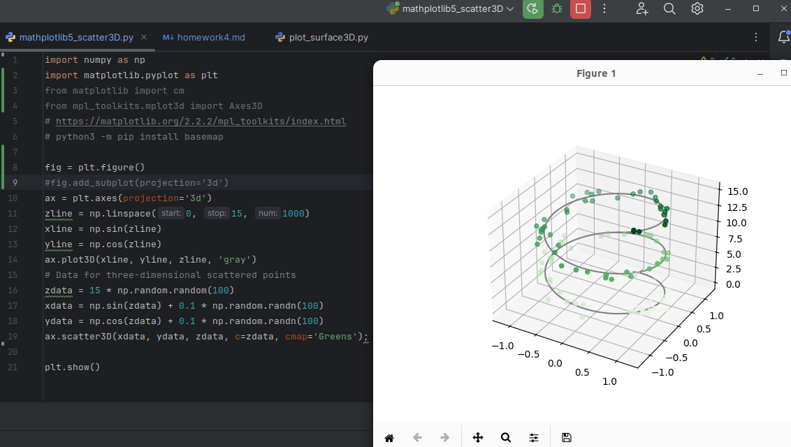
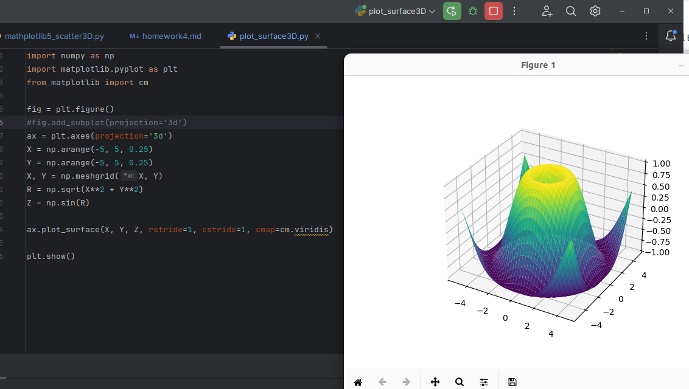

# HW 4 matlibplot 3D visualization

## Task 1: Make sure you can reproduce and run the following example in PyCharm. (50 pts)

Jupyter notebook or copilot is not accepted. All you got to do is to make sure you understand the virtual
environment of Python and where you modules have been installed too.

The following code is run by Python3.10.

## Task2: Make sure you can reproduce the following example. (30 pts)

## Task 3: Visualize the Möbius strip from the example in the following link. (20 pts)

https://kevinli-webbertech.github.io/blog/html/courses/data_visualization/mathplotlib/mathplotlib_5.html

