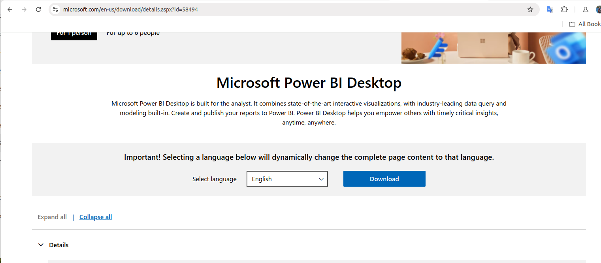
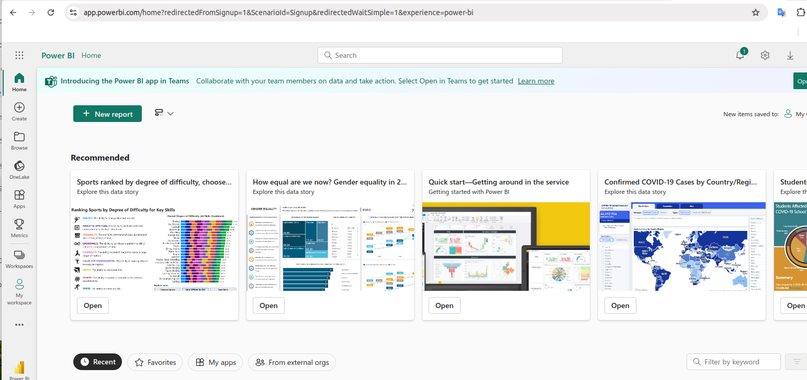
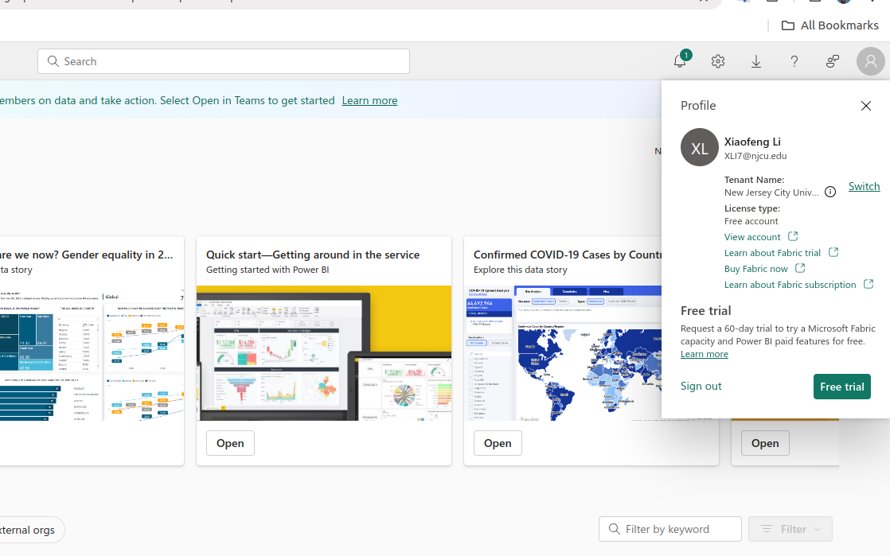

# Introduction to PowerBI

Power BI is considered a major competitor to Tableau, as both are leading business intelligence tools offering data visualization capabilities, allowing users to create reports and dashboards from various data sources, making them direct rivals in the market; with Power BI being developed by Microsoft and having strong integration with other Microsoft products like Excel, while Tableau stands as a separate platform with its own strengths.

## Key points about Power BI and Tableau as competitors

**Similar functionality:**

Both tools allow users to connect to diverse data sources, clean and transform data, create visualizations like charts and graphs, and build interactive dashboards. 

**User interface differences:**

Tableau is often praised for its intuitive drag-and-drop interface, while Power BI is considered user-friendly for those familiar with Microsoft products due to its similar interface. 

**Market presence:**
Both Power BI and Tableau hold significant market share in the business intelligence space, making them primary competitors.

## Installation

Next step,

Your school account should look like the following,

