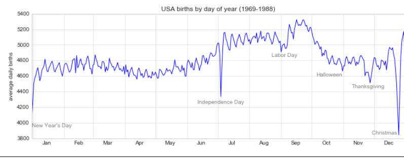
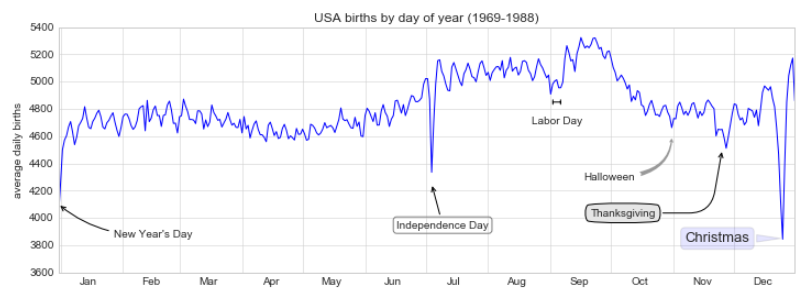
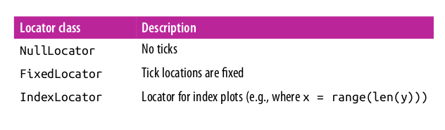
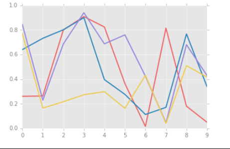
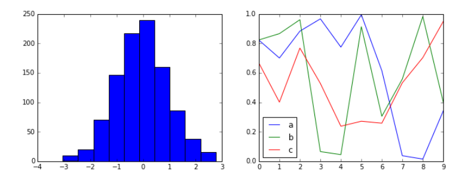
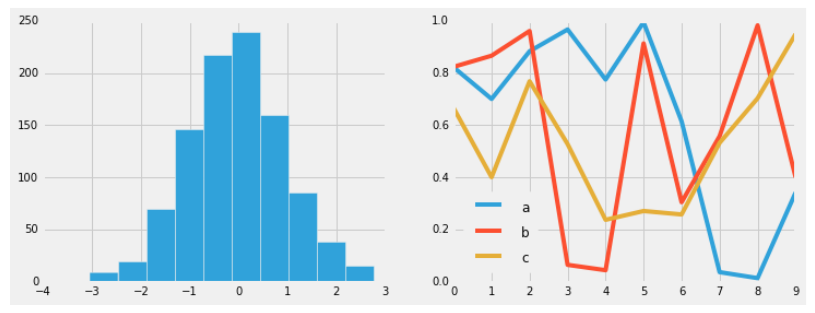

# Text and Annotation

Creating a good visualization involves guiding the reader so that the figure tells a
story. In some cases, this story can be told in an entirely visual manner, without the
need for added text, but in others, small textual cues and labels are necessary. Perhaps
the most basic types of annotations you will use are axes labels and titles, but the
options go beyond this. Let’s take a look at some data and how we might visualize and
annotate it to help convey interesting information. We’ll start by setting up the note‐
book for plotting and importing the functions we will use:

```python
In[1]: %matplotlib inline
import matplotlib.pyplot as plt
import matplotlib as mpl
plt.style.use('seaborn-whitegrid')
import numpy as np
import pandas as pd
```

### Example: Effect of Holidays on US Births

Let’s return to some data we worked with earlier in “Example: Birthrate Data” on page 174, where we generated a plot of average births over the course of the calendar year; as already mentioned, this data can be downloaded at https://raw.githubusercontent.com/jakevdp/data-CDCbirths/master/births.csv.
(see image below):

```python
In[2]:
births = pd.read_csv('births.csv')
quartiles = np.percentile(births['births'], [25, 50, 75])
mu, sig = quartiles[1], 0.74 * (quartiles[2] - quartiles[0])
births = births.query('(births > @mu - 5 * @sig) & (births < @mu + 5 * @sig)')
births['day'] = births['day'].astype(int)
births.index = pd.to_datetime(10000 * births.year +
100 * births.month +
births.day, format='%Y%m%d')
births_by_date = births.pivot_table('births',
[births.index.month, births.index.day])
births_by_date.index = [pd.datetime(2012, month, day)
for (month, day) in births_by_date.index]
In[3]: fig, ax = plt.subplots(figsize=(12, 4))
births_by_date.plot(ax=ax);

```


When we’re communicating data like this, it is often useful to annotate certain features of the plot to draw the reader’s attention. This can be done manually with the plt.text/ax.text command, which will place text at a particular x/y value.

```python
In[4]: fig, ax = plt.subplots(figsize=(12, 4))
births_by_date.plot(ax=ax)
# Add labels to the plot
style = dict(size=10, color='gray')
ax.text('2012-1-1', 3950, "New Year's Day", **style)
ax.text('2012-7-4', 4250, "Independence Day", ha='center', **style)
ax.text('2012-9-4', 4850, "Labor Day", ha='center', **style)
ax.text('2012-10-31', 4600, "Halloween", ha='right', **style)
ax.text('2012-11-25', 4450, "Thanksgiving", ha='center', **style)
ax.text('2012-12-25', 3850, "Christmas ", ha='right', **style)
# Label the axes
ax.set(title='USA births by day of year (1969-1988)',
ylabel='average daily births')
# Format the x axis with centered month labels
ax.xaxis.set_major_locator(mpl.dates.MonthLocator())
ax.xaxis.set_minor_locator(mpl.dates.MonthLocator(bymonthday=15))
ax.xaxis.set_major_formatter(plt.NullFormatter())
ax.xaxis.set_minor_formatter(mpl.dates.DateFormatter('%h'));\
```



The ax.text method takes an x position, a y position, a string, and then optional keywords specifying the color, size, style, alignment, and other properties of the text.

Here we used ha='right' and ha='center', where ha is short for horizonal align‐
ment. See the docstring of plt.text() and of mpl.text.Text() for more information
on available options.

### Transforms and Text Position

In the previous example, we anchored our text annotations to data locations. Sometimes it’s preferable to anchor the text to a position on the axes or figure, independent of the data. In Matplotlib, we do this by modifying the transform.

Any graphics display framework needs some scheme for translating between coordinate systems. For example, a data point at x, y = 1, 1 needs to somehow be represented at a certain location on the figure, which in turn needs to be represented in pixels on the screen. Mathematically, such coordinate transformations are relatively straightforward, and Matplotlib has a well-developed set of tools that it uses internally to perform them (the tools can be explored in the matplotlib.transforms sub‐
module).

The average user rarely needs to worry about the details of these transforms, but it is helpful knowledge to have when considering the placement of text on a figure. There are three predefined transforms that can be useful in this situation:

* ax.transData

Transform associated with data coordinates

* ax.transAxes

Transform associated with the axes (in units of axes dimensions)

* fig.transFigure

Transform associated with the figure (in units of figure dimensions)

Here let’s look at an example of drawing text at various locations using these transforms:

```python
In[5]: fig, ax = plt.subplots(facecolor='lightgray')
ax.axis([0, 10, 0, 10])
# transform=ax.transData is the default, but we'll specify it anyway
ax.text(1, 5, ". Data: (1, 5)", transform=ax.transData)
ax.text(0.5, 0.1, ". Axes: (0.5, 0.1)", transform=ax.transAxes)
ax.text(0.2, 0.2, ". Figure: (0.2, 0.2)", transform=fig.transFigure);
```


Note that by default, the text is aligned above and to the left of the specified coordinates; here the “.” at the beginning of each string will approximately mark the given coordinate location.

The transData coordinates give the usual data coordinates associated with the x- and y-axis labels. The transAxes coordinates give the location from the bottom-left corner of the axes (here the white box) as a fraction of the axes size. The transFigure coordinates are similar, but specify the position from the bottom left of the figure (here the gray box) as a fraction of the figure size.

Notice now that if we change the axes limits, it is only the transData coordinates that will be affected, while the others remain stationary:

```python
In[6]: ax.set_xlim(0, 2)
ax.set_ylim(-6, 6)
fig
```


You can see this behavior more clearly by changing the axes limits interactively; if you are executing this code in a notebook, you can make that happen by changing %matplotlib inline to %matplotlib notebook and using each plot’s menu to interact with the plot.

### Arrows and Annotation

Along with tick marks and text, another useful annotation mark is the simple arrow. Drawing arrows in Matplotlib is often much harder than you might hope. While there is a plt.arrow() function available, I wouldn’t suggest using it; the arrows it creates are SVG objects that will be subject to the varying aspect ratio of your plots, and the result is rarely what the user intended. Instead, I’d suggest using the plt.annotate() function. This function creates some text and an arrow, and the arrows can be very flexibly specified.

Here we’ll use annotate with several of its options:

```python
In[7]: %matplotlib inline
fig, ax = plt.subplots()
x = np.linspace(0, 20, 1000)
ax.plot(x, np.cos(x))
ax.axis('equal')
ax.annotate('local maximum', xy=(6.28, 1), xytext=(10, 4),
arrowprops=dict(facecolor='black', shrink=0.05))
ax.annotate('local minimum', xy=(5 * np.pi, -1), xytext=(2, -6),
arrowprops=dict(arrowstyle="->",
connectionstyle="angle3,angleA=0,angleB=-90"));
```


The arrow style is controlled through the arrowprops dictionary, which has numerous options available. These options are fairly well documented in Matplotlib’s online documentation, so rather than repeating them here I’ll quickly show some of the possibilities. Let’s demonstrate several of the possible options using the birthrate plot from before:

```python
In[8]:
fig, ax = plt.subplots(figsize=(12, 4))
births_by_date.plot(ax=ax)
# Add labels to the plot
ax.annotate("New Year's Day", xy=('2012-1-1', 4100), xycoords='data',
xytext=(50, -30), textcoords='offset points',
arrowprops=dict(arrowstyle="->",
connectionstyle="arc3,rad=-0.2"))
ax.annotate("Independence Day", xy=('2012-7-4', 4250), xycoords='data',
bbox=dict(boxstyle="round", fc="none", ec="gray"),

xytext=(10, -40), textcoords='offset points', ha='center',
arrowprops=dict(arrowstyle="->"))
ax.annotate('Labor Day', xy=('2012-9-4', 4850), xycoords='data', ha='center',
xytext=(0, -20), textcoords='offset points')
ax.annotate('', xy=('2012-9-1', 4850), xytext=('2012-9-7', 4850),
xycoords='data', textcoords='data',
arrowprops={'arrowstyle': '|-|,widthA=0.2,widthB=0.2', })
ax.annotate('Halloween', xy=('2012-10-31', 4600), xycoords='data',
xytext=(-80, -40), textcoords='offset points',
arrowprops=dict(arrowstyle="fancy",
fc="0.6", ec="none",
connectionstyle="angle3,angleA=0,angleB=-90"))
ax.annotate('Thanksgiving', xy=('2012-11-25', 4500), xycoords='data',
xytext=(-120, -60), textcoords='offset points',
bbox=dict(boxstyle="round4,pad=.5", fc="0.9"),
arrowprops=dict(arrowstyle="->",
connectionstyle="angle,angleA=0,angleB=80,rad=20"))
ax.annotate('Christmas', xy=('2012-12-25', 3850), xycoords='data',
xytext=(-30, 0), textcoords='offset points',
size=13, ha='right', va="center",
bbox=dict(boxstyle="round", alpha=0.1),
arrowprops=dict(arrowstyle="wedge,tail_width=0.5", alpha=0.1));
# Label the axes
ax.set(title='USA births by day of year (1969-1988)',
ylabel='average daily births')
# Format the x axis with centered month labels
ax.xaxis.set_major_locator(mpl.dates.MonthLocator())
ax.xaxis.set_minor_locator(mpl.dates.MonthLocator(bymonthday=15))
ax.xaxis.set_major_formatter(plt.NullFormatter())
ax.xaxis.set_minor_formatter(mpl.dates.DateFormatter('%h'));
l.dates.DateFormatter('%h'));
ax.set_ylim(3600, 5400);
```



You’ll notice that the specifications of the arrows and text boxes are very detailed: this gives you the power to create nearly any arrow style you wish. Unfortunately, it also means that these sorts of features often must be manually tweaked, a process that can be very time-consuming when one is producing publication-quality graphics! Finally, I’ll note that the preceding mix of styles is by no means best practice for presenting data, but rather included as a demonstration of some of the available options.

### Customizing Ticks

Matplotlib’s default tick locators and formatters are designed to be generally sufficient in many common situations, but are in no way optimal for every plot. This section will give several examples of adjusting the tick locations and formatting for the particular plot type you’re interested in.

Before we go into examples, it will be best for us to understand further the object hierarchy of Matplotlib plots. Matplotlib aims to have a Python object representing everything that appears on the plot: for example, recall that the figure is the bounding box within which plot elements appear. Each Matplotlib object can also act as a container of sub-objects; for example, each figure can contain one or more axes objects, each of which in turn contain other objects representing plot contents.

The tick marks are no exception. Each axes has attributes xaxis and yaxis, which in turn have attributes that contain all the properties of the lines, ticks, and labels that make up the axes.

### Major and Minor Ticks

Within each axis, there is the concept of a major tick mark and a minor tick mark. As the names would imply, major ticks are usually bigger or more pronounced, while minor ticks are usually smaller. By default, Matplotlib rarely makes use of minor ticks, but one place you can see them is within logarithmic plots:

```python
In[1]: %matplotlib inline
import matplotlib.pyplot as plt
import seaborn as sns
import numpy as np
sns.set_style("whitegrid")
In[2]: ax = plt.axes(xscale='log', yscale='log')
```


We see here that each major tick shows a large tick mark and a label, while each minor tick shows a smaller tick mark with no label.

We can customize these tick properties—that is, locations and labels—by setting the formatter and locator objects of each axis. Let’s examine these for the x axis of the plot just shown:

```python
In[3]: print(ax.xaxis.get_major_locator())
print(ax.xaxis.get_minor_locator())
<matplotlib.ticker.LogLocator object at 0x107530cc0>
<matplotlib.ticker.LogLocator object at 0x107530198>
In[4]: print(ax.xaxis.get_major_formatter())
print(ax.xaxis.get_minor_formatter())
<matplotlib.ticker.LogFormatterMathtext object at 0x107512780>
<matplotlib.ticker.NullFormatter object at 0x10752dc18>
```

We see that both major and minor tick labels have their locations specified by a LogLocator (which makes sense for a logarithmic plot). Minor ticks, though, have their labels formatted by a NullFormatter; this says that no labels will be shown.

We’ll now show a few examples of setting these locators and formatters for various
plots.

### Hiding Ticks or Labels

Perhaps the most common tick/label formatting operation is the act of hiding ticks or labels. We can do this using plt.NullLocator() and plt.NullFormatter(), as shown here:

```python
In[5]: ax = plt.axes()
ax.plot(np.random.rand(50))
ax.yaxis.set_major_locator(plt.NullLocator())
ax.xaxis.set_major_formatter(plt.NullFormatter())
```


Notice that we’ve removed the labels (but kept the ticks/gridlines) from the x axis, and removed the ticks (and thus the labels as well) from the y axis. Having no ticks at all can be useful in many situations—for example, when you want to show a grid of images. 

```python
In[6]: fig, ax = plt.subplots(5, 5, figsize=(5, 5))
fig.subplots_adjust(hspace=0, wspace=0)
# Get some face data from scikit-learn
from sklearn.datasets import fetch_olivetti_faces
faces = fetch_olivetti_faces().images
for i in range(5):
    for j in range(5):
        ax[i, j].xaxis.set_major_locator(plt.NullLocator())
        ax[i, j].yaxis.set_major_locator(plt.NullLocator())
        ax[i, j].imshow(faces[10 * i + j], cmap="bone")

#Enable the following line if you use pyCharm
#plt.show()
```


Notice that each image has its own axes, and we’ve set the locators to null because the tick values (pixel number in this case) do not convey relevant information for this particular visualization.

### Reducing or Increasing the Number of Ticks

One common problem with the default settings is that smaller subplots can end up with crowded labels. We can see this in the plot grid shown in the following code and image:

```python
In[7]: fig, ax = plt.subplots(4, 4, sharex=True, sharey=True)
for a in ax.flat:
    a.grid(True, color='lightgray', linestyle='--', linewidth=0.5)
```


Particularly for the x ticks, the numbers nearly overlap, making them quite difficult to decipher. We can fix this with the plt.MaxNLocator(), which allows us to specify the maximum number of ticks that will be displayed. Given this maximum number, Matplotlib will use internal logic to choose the particular tick locations:

```python
In[8]: # For every axis, set the x and y major locator
for axi in ax.flat:
  axi.xaxis.set_major_locator(plt.MaxNLocator(3))
  axi.yaxis.set_major_locator(plt.MaxNLocator(3))
fig
```


This makes things much cleaner. If you want even more control over the locations of regularly spaced ticks, you might also use plt.MultipleLocator, which we’ll discuss in the following section.

### Fancy Tick Formats

Matplotlib’s default tick formatting can leave a lot to be desired; it works well as a broad default, but sometimes you’d like to do something more. Consider the plot shown in the following image, a sine and a cosine:

```python
In[9]: # Plot a sine and cosine curve
fig, ax = plt.subplots()
x = np.linspace(0, 3 * np.pi, 1000)
ax.plot(x, np.sin(x), lw=3, label='Sine')
ax.plot(x, np.cos(x), lw=3, label='Cosine')
# Set up grid, legend, and limits
ax.grid(True)
ax.legend(frameon=False)
ax.axis('equal')
ax.set_xlim(0, 3 * np.pi);
```


There are a couple changes we might like to make. First, it’s more natural for this data to space the ticks and grid lines in multiples of π. We can do this by setting a Multi pleLocator, which locates ticks at a multiple of the number you provide. For good measure, we’ll add both major and minor ticks in multiples of π/4:

```python
In[10]: ax.xaxis.set_major_locator(plt.MultipleLocator(np.pi / 2))
ax.xaxis.set_minor_locator(plt.MultipleLocator(np.pi / 4))
fig
```


But now these tick labels look a little bit silly: we can see that they are multiples of π, but the decimal representation does not immediately convey this. To fix this, we can change the tick formatter. There’s no built-in formatter for what we want to do, so we’ll instead use plt.FuncFormatter, which accepts a user-defined function giving fine-grained control over the tick outputs:

```python
In[11]: def format_func(value, tick_number):
# find number of multiples of pi/2
N = int(np.round(2 * value / np.pi))
if N == 0:
return "0"

elif N == 1:
return r"$\pi/2$"
elif N == 2:
return r"$\pi$"
elif N % 2 > 0:
return r"${0}\pi/2$".format(N)
else:
return r"${0}\pi$".format(N // 2)
ax.xaxis.set_major_formatter(plt.FuncFormatter(format_func))
fig
```


This is much better! Notice that we’ve made use of Matplotlib’s LaTeX support, specified by enclosing the string within dollar signs. This is very convenient for display of mathematical symbols and formulae; in this case, "$\pi$" is rendered as the Greek character π.

The plt.FuncFormatter() offers extremely fine-grained control over the appearance of your plot ticks, and comes in very handy when you’re preparing plots for presentation or publication.

### Summary of Formatters and Locators

We’ve mentioned a couple of the available formatters and locators. We’ll conclude this section by briefly listing all the built-in locator and formatter options. For more information on any of these, refer to the docstrings or to the Matplotlib online documentation. Each of the following is available in the plt namespace:




### Customizing Matplotlib: Configurations and Stylesheets

Matplotlib’s default plot settings are often the subject of complaint among its users. While much is slated to change in the 2.0 Matplotlib release, the ability to customize default settings helps bring the package in line with your own aesthetic preferences.

Here we’ll walk through some of Matplotlib’s runtime configuration (rc) options, and take a look at the newer stylesheets feature, which contains some nice sets of default configurations.

#### Plot Customization by Hand

Throughout this chapter, we’ve seen how it is possible to tweak individual plot settings to end up with something that looks a little bit nicer than the default. It’s possible to do these customizations for each individual plot. For example, here is a fairly drab default histogram:

```python
In[1]: import matplotlib.pyplot as plt
plt.style.use('classic')
import numpy as np
%matplotlib inline

In[2]: x = np.random.randn(1000)
plt.hist(x);
```


We can adjust this by hand to make it a much more visually pleasing plot, shown below:

```python
In[3]: # use a gray background
ax = plt.axes(facecolor='#E6E6E6')
ax.set_axisbelow(True)
# draw solid white grid lines
plt.grid(color='w', linestyle='solid')
# hide axis spines
for spine in ax.spines.values():
    spine.set_visible(False)

# hide top and right ticks
ax.xaxis.tick_bottom()
ax.yaxis.tick_left()

# lighten ticks and labels
ax.tick_params(colors='gray', direction='out')

for tick in ax.get_xticklabels():
    tick.set_color('gray')

for tick in ax.get_yticklabels():
    tick.set_color('gray')

# control face and edge color of histogram
ax.hist(x, edgecolor='#E6E6E6', color='#EE6666');

# enable the following line in pyCharm
#plt.show()
```


This looks better, and you may recognize the look as inspired by the look of the R language’s ggplot visualization package. But this took a whole lot of effort! We definitely do not want to have to do all that tweaking each time we create a plot. Fortunately, there is a way to adjust these defaults once in a way that will work for all plots.

#### Changing the Defaults: rcParams

Each time Matplotlib loads, it defines a runtime configuration (rc) containing the default styles for every plot element you create. You can adjust this configuration at any time using the plt.rc convenience routine. Let’s see what it looks like to modify the rc parameters so that our default plot will look similar to what we did before.

We’ll start by saving a copy of the current rcParams dictionary, so we can easily reset
these changes in the current session:

```python
In[4]: IPython_default = plt.rcParams.copy()
Now we can use the plt.rc function to change some of these settings:
In[5]: from matplotlib import cycler
colors = cycler('color',
['#EE6666', '#3388BB', '#9988DD',
'#EECC55', '#88BB44', '#FFBBBB'])
plt.rc('axes', facecolor='#E6E6E6', edgecolor='none',
axisbelow=True, grid=True, prop_cycle=colors)
plt.rc('grid', color='w', linestyle='solid')
plt.rc('xtick', direction='out', color='gray')
plt.rc('ytick', direction='out', color='gray')
plt.rc('patch', edgecolor='#E6E6E6')
plt.rc('lines', linewidth=2)
```

With these settings defined, we can now create a plot and see our settings in action:

```python
In[6]: plt.hist(x);

```

Let’s see what simple line plots look like with these rc parameters:

```python
In[7]: for i in range(4):
plt.plot(np.random.rand(10))
```



I find this much more aesthetically pleasing than the default styling. If you disagree with my aesthetic sense, the good news is that you can adjust the rc parameters to suit your own tastes! These settings can be saved in a .matplotlibrc file, which you can read about in the Matplotlib documentation. That said, I prefer to customize Matplotlib using its stylesheets instead.

#### Stylesheets

The version 1.4 release of Matplotlib in August 2014 added a very convenient style module, which includes a number of new default stylesheets, as well as the ability to create and package your own styles. These stylesheets are formatted similarly to the .matplotlibrc files mentioned earlier, but must be named with a .mplstyle extension.

Even if you don’t create your own style, the stylesheets included by default are extremely useful. The available styles are listed in plt.style.available—here I’ll list only the first five for brevity:

```python
In[8]: plt.style.available[:5]
Out[8]: ['fivethirtyeight',
'seaborn-pastel',
'seaborn-whitegrid',
'ggplot',
'grayscale']
```

The basic way to switch to a stylesheet is to call:
`plt.style.use('stylename')`

But keep in mind that this will change the style for the rest of the session! Alternatively, you can use the style context manager, which sets a style temporarily:

```python
with plt.style.context('stylename'):
make_a_plot()
```

Let’s create a function that will make two basic types of plot:

```python
In[9]: def hist_and_lines():
np.random.seed(0)
fig, ax = plt.subplots(1, 2, figsize=(11, 4))
ax[0].hist(np.random.randn(1000))
for i in range(3):
ax[1].plot(np.random.rand(10))
ax[1].legend(['a', 'b', 'c'], loc='lower left')
```

We’ll use this to explore how these plots look using the various built-in styles.

### Default style

The default style is what we’ve been seeing so far throughout the book; we’ll start with
that. First, let’s reset our runtime configuration to the notebook default:

```python
In[10]: # reset rcParams
plt.rcParams.update(IPython_default);
Now let’s see how it looks (below):
In[11]: hist_and_lines()
```



### FiveThirtyEight style

The FiveThirtyEight style mimics the graphics found on the popular FiveThirtyEight
website. As you can see earlier, it is typified by bold colors, thick lines, and
transparent axes.

```python
In[12]: with plt.style.context('fivethirtyeight'):
hist_and_lines()
```



### ggplot

The ggplot package in the R language is a very popular visualization tool. Matplot‐
lib’s ggplot style mimics the default styles from that package:

```python
In[13]: with plt.style.context('ggplot'):
hist_and_lines()
```


### Bayesian Methods for Hackers style

There is a very nice short online book called Probabilistic Programming and Bayesian Methods for Hackers; it features figures created with Matplotlib, and uses a nice set of rc parameters to create a consistent and visually appealing style throughout the book.

This style is reproduced in the bmh stylesheet:

```python
In[14]: with plt.style.context('bmh'):
hist_and_lines()
```


### Dark background

For figures used within presentations, it is often useful to have a dark rather than light background. The dark_background style provides this:

```python
In[15]: with plt.style.context('dark_background'):
hist_and_lines()
```


### Grayscale

Sometimes you might find yourself preparing figures for a print publication that does not accept color figures. For this, the grayscale style, shown below, can be very useful:

```python
In[16]: with plt.style.context('grayscale'):
hist_and_lines()
```


### Seaborn style

Matplotlib also has stylesheets inspired by the Seaborn library (discussed more fully in “Visualization with Seaborn” on page 311). As we will see, these styles are loaded automatically when Seaborn is imported into a notebook. I’ve found these settings to be very nice, and tend to use them as defaults in my own data exploration (see image below):

```python
In[17]: import seaborn
hist_and_lines()
```


With all of these built-in options for various plot styles, Matplotlib becomes much more useful for both interactive visualization and creation of figures for publication.