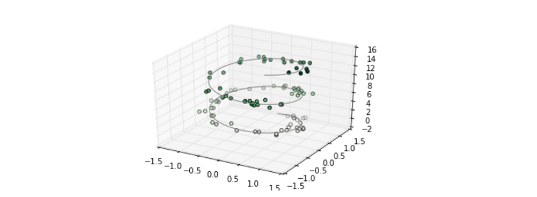
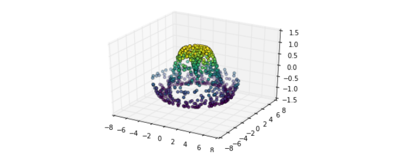

# Three-Dimensional Plotting in Matplotlib

Matplotlib was initially designed with only two-dimensional plotting in mind. Around the time of the 1.0 release, some three-dimensional plotting utilities were built on top of Matplotlib’s two-dimensional display, and the result is a convenient (if somewhat limited) set of tools for three-dimensional data visualization. We enable three-dimensional plots by importing the mplot3d toolkit, included with the main Matplotlib installation:

```python
In[1]: from mpl_toolkits import mplot3d
Once this submodule is imported, we can create a three-dimensional axes by passing
the keyword projection='3d' to any of the normal axes creation routines:
In[2]: %matplotlib inline
import numpy as np
import matplotlib.pyplot as plt
In[3]: fig = plt.figure()
ax = plt.axes(projection='3d')
```


With this 3D axes enabled, we can now plot a variety of three-dimensional plot types. Three-dimensional plotting is one of the functionalities that benefits immensely from viewing figures interactively rather than statically in the notebook; recall that to use interactive figures, you can use %matplotlib notebook rather than %matplotlib inline when running this code.

## Three-Dimensional Points and Lines

The most basic three-dimensional plot is a line or scatter plot created from sets of (x, y, z) triples. In analogy with the more common two-dimensional plots discussed earlier, we can create these using the ax.plot3D and ax.scatter3D functions. The call signature for these is nearly identical to that of their two-dimensional counterparts, so you can refer to “Simple Line Plots” on page 224 and “Simple Scatter Plots” on page 233 for more information on controlling the output. Here we’ll plot a trigonometric spiral, along with some points drawn randomly near the line:

```python
In[4]: ax = plt.axes(projection='3d')
# Data for a three-dimensional line
zline = np.linspace(0, 15, 1000)
xline = np.sin(zline)
yline = np.cos(zline)
ax.plot3D(xline, yline, zline, 'gray')
# Data for three-dimensional scattered points
zdata = 15 * np.random.random(100)
xdata = np.sin(zdata) + 0.1 * np.random.randn(100)
ydata = np.cos(zdata) + 0.1 * np.random.randn(100)
ax.scatter3D(xdata, ydata, zdata, c=zdata, cmap='Greens');
```



Notice that by default, the scatter points have their transparency adjusted to give a sense of depth on the page. While the three-dimensional effect is sometimes difficult to see within a static image, an interactive view can lead to some nice intuition about the layout of the points.

## Three-Dimensional Contour Plots

Analogous to the contour plots we explored in “Density and Contour Plots”, mplot3d contains tools to create three-dimensional relief plots using the same inputs. Like two-dimensional ax.contour plots, ax.contour3D requires all the input data to be in the form of two-dimensional regular grids, with the Z data evaluated at each point. Here we’ll show a three-dimensional contour diagram of a three dimensional sinusoidal function:

```python
In[5]: def f(x, y):
return np.sin(np.sqrt(x ** 2 + y ** 2))
x = np.linspace(-6, 6, 30)
y = np.linspace(-6, 6, 30)
X, Y = np.meshgrid(x, y)
Z = f(X, Y)
In[6]: fig = plt.figure()
ax = plt.axes(projection='3d')
ax.contour3D(X, Y, Z, 50, cmap='binary')
ax.set_xlabel('x')
ax.set_ylabel('y')
ax.set_zlabel('z');
```


Sometimes the default viewing angle is not optimal, in which case we can use the view_init method to set the elevation and azimuthal angles. In this example, we’ll use an elevation of 60 degrees (that is, 60 degrees above the x-y plane) and an azimuth of 35 degrees (that is, rotated 35 degrees counter-clockwise about the z-axis):

```python
In[7]: ax.view_init(60, 35)
fig
```


Again, note that we can accomplish this type of rotation interactively by clicking and dragging when using one of Matplotlib’s interactive backends.

## Wireframes and Surface Plots

Two other types of three-dimensional plots that work on gridded data are wireframes and surface plots. These take a grid of values and project it onto the specified three-dimensional surface, and can make the resulting three-dimensional forms quite easy to visualize. Here’s an example using a wireframe:

```python
In[8]: fig = plt.figure()
ax = plt.axes(projection='3d')
ax.plot_wireframe(X, Y, Z, color='black')
ax.set_title('wireframe');
```


A surface plot is like a wireframe plot, but each face of the wireframe is a filled polygon. Adding a colormap to the filled polygons can aid perception of the topology of the surface being visualized:

```python
In[9]: ax = plt.axes(projection='3d')
ax.plot_surface(X, Y, Z, rstride=1, cstride=1,
cmap='viridis', edgecolor='none')
ax.set_title('surface');
```


Note that though the grid of values for a surface plot needs to be two-dimensional, it need not be rectilinear. Here is an example of creating a partial polar grid, which when used with the surface3D plot can give us a slice into the function we’re visualizing:

```python
In[10]: r = np.linspace(0, 6, 20)
theta = np.linspace(-0.9 * np.pi, 0.8 * np.pi, 40)
r, theta = np.meshgrid(r, theta)
X = r * np.sin(theta)
Y = r * np.cos(theta)
Z = f(X, Y)
ax = plt.axes(projection='3d')
ax.plot_surface(X, Y, Z, rstride=1, cstride=1,
cmap='viridis', edgecolor='none');
```


## Surface Triangulations

For some applications, the evenly sampled grids required by the preceding routines are overly restrictive and inconvenient. In these situations, the triangulation-based plots can be very useful. What if rather than an even draw from a Cartesian or a polar grid, we instead have a set of random draws?

```python
In[11]: theta = 2 * np.pi * np.random.random(1000)
r = 6 * np.random.random(1000)
x = np.ravel(r * np.sin(theta))
y = np.ravel(r * np.cos(theta))
z = f(x, y)
We could create a scatter plot of the points to get an idea of the surface we’re sampling
from (Figure 4-99):
In[12]: ax = plt.axes(projection='3d')
ax.scatter(x, y, z, c=z, cmap='viridis', linewidth=0.5);
```



This leaves a lot to be desired. The function that will help us in this case is ax.plot_trisurf, which creates a surface by first finding a set of triangles formed between adjacent points (remember that x, y, and z here are one-dimensional arrays):

```python
In[13]: ax = plt.axes(projection='3d')
ax.plot_trisurf(x, y, z, cmap='viridis', edgecolor='none');
```


The result is certainly not as clean as when it is plotted with a grid, but the flexibility of such a triangulation allows for some really interesting three-dimensional plots. For example, it is actually possible to plot a three-dimensional Möbius strip using this, as we’ll see next.

### Example: Visualizing a Möbius strip

A Möbius strip is similar to a strip of paper glued into a loop with a half-twist. Topologically, it’s quite interesting because despite appearances it has only a single side!

Here we will visualize such an object using Matplotlib’s three-dimensional tools. The key to creating the Möbius strip is to think about its parameterization: it’s a two dimensional strip, so we need two intrinsic dimensions. Let’s call them θ, which
ranges from 0 to 2π around the loop, and w which ranges from –1 to 1 across the width of the strip:

```python
In[14]: theta = np.linspace(0, 2 * np.pi, 30)
w = np.linspace(-0.25, 0.25, 8)
w, theta = np.meshgrid(w, theta)
```

Now from this parameterization, we must determine the (x, y, z) positions of the embedded strip.

Thinking about it, we might realize that there are two rotations happening: one is the position of the loop about its center (what we’ve called θ), while the other is the twisting of the strip about its axis (we’ll call this ϕ). For a Möbius strip, we must have the strip make half a twist during a full loop, or Δϕ = Δθ/2.

```python
In[15]: phi = 0.5 * theta
```

Now we use our recollection of trigonometry to derive the three-dimensional embedding. We’ll define r, the distance of each point from the center, and use this to find the embedded x, y, z coordinates:

```python
In[16]: # radius in x-y plane
r = 1 + w * np.cos(phi)
x = np.ravel(r * np.cos(theta))
y = np.ravel(r * np.sin(theta))
z = np.ravel(w * np.sin(phi))
```

Finally, to plot the object, we must make sure the triangulation is correct. The best way to do this is to define the triangulation within the underlying parameterization, and then let Matplotlib project this triangulation into the three-dimensional space of the Möbius strip. This can be accomplished as follows:

```python
In[17]: # triangulate in the underlying parameterization
from matplotlib.tri import Triangulation
tri = Triangulation(np.ravel(w), np.ravel(theta))
ax = plt.axes(projection='3d')
ax.plot_trisurf(x, y, z, triangles=tri.triangles, cmap='viridis', linewidths=0.2);
ax.set_xlim(-1, 1); ax.set_ylim(-1, 1); ax.set_zlim(-1, 1);
```


Combining all of these techniques, it is possible to create and display a wide variety of three-dimensional objects and patterns in Matplotlib.

## Geographic Data with Basemap

One common type of visualization in data science is that of geographic data. Matplotlib’s main tool for this type of visualization is the Basemap toolkit, which is one of several Matplotlib toolkits that live under the mpl_toolkits namespace. Admittedly,

Basemap feels a bit clunky to use, and often even simple visualizations take much longer to render than you might hope. More modern solutions, such as leaflet or the Google Maps API, may be a better choice for more intensive map visualizations. Still,

Basemap is a useful tool for Python users to have in their virtual toolbelts. In this section, we’ll show several examples of the type of map visualization that is possible with this toolkit.

Installation of Basemap is straightforward; if you’re using conda you can type this and the package will be downloaded:

`$ conda install basemap`

We add just a single new import to our standard boilerplate:

```python
In[1]: %matplotlib inline
import numpy as np
import matplotlib.pyplot as plt
from mpl_toolkits.basemap import Basemap
```

Once you have the Basemap toolkit installed and imported, geographic plots are just a few lines away.

```python
In[2]: plt.figure(figsize=(8, 8))
m = Basemap(projection='ortho', resolution=None, lat_0=50, lon_0=-100)
m.bluemarble(scale=0.5);
```


The meaning of the arguments to Basemap will be discussed momentarily. The useful thing is that the globe shown here is not a mere image; it is a fully functioning Matplotlib axes that understands spherical coordinates and allows us to easily over-plot data on the map! For example, we can use a different map projection, zoom in to North America, and plot the location of Seattle. We’ll use an etopo image (which shows topographical features both on land and under the ocean) as the map background:

```python
In[3]: fig = plt.figure(figsize=(8, 8))
m = Basemap(projection='lcc', resolution=None, width=8E6, height=8E6, lat_0=45, lon_0=-100,)
m.etopo(scale=0.5, alpha=0.5)
# Map (long, lat) to (x, y) for plotting
x, y = m(-122.3, 47.6)
plt.plot(x, y, 'ok', markersize=5)
plt.text(x, y, ' Seattle', fontsize=12);
```


This gives you a brief glimpse into the sort of geographic visualizations that are possible with just a few lines of Python. We’ll now discuss the features of Basemap in more depth, and provide several examples of visualizing map data. Using these brief examples as building blocks, you should be able to create nearly any map visualization that you desire.

## Map Projections

The first thing to decide when you are using maps is which projection to use. You’re probably familiar with the fact that it is impossible to project a spherical map, such as that of the Earth, onto a flat surface without somehow distorting it or breaking its continuity. These projections have been developed over the course of human history, and there are a lot of choices!

Depending on the intended use of the map projection, there are certain map features (e.g., direction, area, distance, shape, or other considerations) that are useful to maintain.

The Basemap package implements several dozen such projections, all referenced by a short format code. Here we’ll briefly demonstrate some of the more common ones.

We’ll start by defining a convenience routine to draw our world map along with the longitude and latitude lines:

```python
In[4]: from itertools import chain
def draw_map(m, scale=0.2):

# draw a shaded-relief image
m.shadedrelief(scale=scale)
# lats and longs are returned as a dictionary
lats = m.drawparallels(np.linspace(-90, 90, 13))
lons = m.drawmeridians(np.linspace(-180, 180, 13))
# keys contain the plt.Line2D instances
lat_lines = chain(*(tup[1][0] for tup in lats.items()))
lon_lines = chain(*(tup[1][0] for tup in lons.items()))
all_lines = chain(lat_lines, lon_lines)
# cycle through these lines and set the desired style
for line in all_lines:
    line.set(linestyle='-', alpha=0.3, color='w')
```

### Cylindrical projections

The simplest of map projections are cylindrical projections, in which lines of constant latitude and longitude are mapped to horizontal and vertical lines, respectively. This type of mapping represents equatorial regions quite well, but results in extreme distortions near the poles. The spacing of latitude lines varies between different cylindrical projections, leading to different conservation properties, and different distortion near the poles. We show an example of the equidistant cylindrical projection, which chooses a latitude scaling that preserves distances along meridians.

Other cylindrical projections are the Mercator (projection='merc') and the cylindrical equal-area (projection='cea') projections.

```python
In[5]: fig = plt.figure(figsize=(8, 6), edgecolor='w')
m = Basemap(projection='cyl', resolution=None, llcrnrlat=-90, urcrnrlat=90, llcrnrlon=-180, urcrnrlon=180, )
draw_map(m)
```


The additional arguments to Basemap for this view specify the latitude (lat) and longitude (lon) of the lower-left corner (llcrnr) and upper-right corner (urcrnr) for the desired map, in units of degrees.

### Pseudo-cylindrical projections

Pseudo-cylindrical projections relax the requirement that meridians (lines of constant longitude) remain vertical; this can give better properties near the poles of the projection. The Mollweide projection (projection='moll') is one common example of this, in which all meridians are elliptical arcs. It is constructed so as to preserve area across the map: thoughthere are distortions near the poles, the area of small patches reflects the true area. Other pseudo-cylindrical projections are the sinusoidal (projection='sinu') and Robinson (projection='robin') projections.

```python
In[6]: fig = plt.figure(figsize=(8, 6), edgecolor='w')
m = Basemap(projection='moll', resolution=None, lat_0=0, lon_0=0)
draw_map(m)
```


The extra arguments to Basemap here refer to the central latitude (lat_0) and longitude (lon_0) for the desired map.

### Perspective projections

Perspective projections are constructed using a particular choice of perspective point, similar to if you photographed the Earth from a particular point in space (a point which, for some projections, technically lies within the Earth!). One common example is the orthographic projection (projection='ortho'), which shows one side of the globe as seen from a viewer at a very long distance. Thus, it can show only half the globe at a time. Other perspective-based projections include the gnomonic projection (projection='gnom') and stereographic projection (projection='stere'). These are often the most useful for showing small portions of the map.

Here is an example of the orthographic projection:

```python
In[7]: fig = plt.figure(figsize=(8, 8))
m = Basemap(projection='ortho', resolution=None, lat_0=50, lon_0=0)
draw_map(m);
```


### Conic projections

A conic projection projects the map onto a single cone, which is then unrolled. This can lead to very good local properties, but regions far from the focus point of the cone may become very distorted. One example of this is the Lambert conformal conic projection (projection='lcc'), which we saw earlier in the map of North America. It projects the map onto a cone arranged in such a way that two standard parallels (specified in Basemap by lat_1 and lat_2) have well-represented distances, with scale decreasing between them and increasing outside of them. Other useful conic projections are the equidistant conic (projection='eqdc') and the Albers equal-area (projection='aea') projection. Conic projections, like perspective projections, tend to be good choices for representing small to medium patches of the globe.

```python
In[8]: fig = plt.figure(figsize=(8, 8))
m = Basemap(projection='lcc', resolution=None, lon_0=0, lat_0=50, lat_1=45, lat_2=55,width=1.6E7, height=1.2E7)
draw_map(m)
```


### Other projections

If you’re going to do much with map-based visualizations, I encourage you to read up on other available projections, along with their properties, advantages, and disadvantages. Most likely, they are available in the Basemap package. If you dig deep enough into this topic, you’ll find an incredible subculture of geo-viz geeks who will be ready to argue fervently in support of their favorite projection for any given application!

### Drawing a Map Background

Earlier we saw the bluemarble() and shadedrelief() methods for projecting global images on the map, as well as the drawparallels() and drawmeridians() methods for drawing lines of constant latitude and longitude. The Basemap package contains a range of useful functions for drawing borders of physical features like continents, oceans, lakes, and rivers, as well as political boundaries such as countries and US states and counties. The following are some of the available drawing functions that you may wish to explore using IPython’s help features:

* Physical boundaries and bodies of water

    * drawcoastlines()

    Draw continental coast lines

    * drawlsmask()

    Draw a mask between the land and sea, for use with projecting images on one or the other

    * drawmapboundary()

    Draw the map boundary, including the fill color for oceans

    * drawrivers()

    Draw rivers on the map

    * fillcontinents()

    Fill the continents with a given color; optionally fill lakes with another color

*  Political boundaries

    * drawcountries()

    Draw country boundaries

    * drawstates()

    Draw US state boundaries

    * drawcounties()

    Draw US county boundaries

* Map features

    * drawgreatcircle()

    Draw a great circle between two points

    * drawparallels()

    Draw lines of constant latitude

    * drawmeridians()

    Draw lines of constant longitude

    * drawmapscale()

    Draw a linear scale on the map

*  Whole-globe images

    * bluemarble()
    
    Project NASA’s blue marble image onto the map

    * shadedrelief()

    Project a shaded relief image onto the map

    * etopo()

    Draw an etopo relief image onto the map

    * warpimage()

    Project a user-provided image onto the map

For the boundary-based features, you must set the desired resolution when creating a Basemap image. The resolution argument of the Basemap class sets the level of detail in boundaries, either 'c' (crude), 'l' (low), 'i' (intermediate), 'h' (high), 'f' (full), or None if no boundaries will be used. This choice is important: setting high-resolution boundaries on a global map, for example, can be very slow.

Here’s an example of drawing land/sea boundaries, and the effect of the resolution parameter. We’ll create both a low- and high-resolution map of Scotland’s beautiful Isle of Skye. It’s located at 57.3°N, 6.2°W, and a map of 90,000×120,000 kilometers shows it well:

```python
In[9]: fig, ax = plt.subplots(1, 2, figsize=(12, 8))
for i, res in enumerate(['l', 'h']):
    m = Basemap(projection='gnom', lat_0=57.3, lon_0=-6.2, width=90000, height=120000, resolution=res, ax=ax[i])
    m.fillcontinents(color="#FFDDCC", lake_color='#DDEEFF')
    m.drawmapboundary(fill_color="#DDEEFF")
    m.drawcoastlines()
    ax[i].set_title("resolution='{0}'".format(res));
```


Notice that the low-resolution coastlines are not suitable for this level of zoom, while high-resolution works just fine. The low level would work just fine for a global view, however, and would be much faster than loading the high-resolution border data for the entire globe! It might require some experimentation to find the correct resolution parameter for a given view; the best route is to start with a fast, low-resolution plot and increase the resolution as needed.

### Plotting Data on Maps

Perhaps the most useful piece of the Basemap toolkit is the ability to over-plot a variety of data onto a map background. For simple plotting and text, any plt function works on the map; you can use the Basemap instance to project latitude and longitude coordinates to (x, y) coordinates for plotting with plt, as we saw earlier in the Seattle example.

In addition to this, there are many map-specific functions available as methods of the Basemap instance. These work very similarly to their standard Matplotlib counterparts, but have an additional Boolean argument latlon, which if set to True allows you to pass raw latitudes and longitudes to the method, rather than projected (x, y) coordinates.

Some of these map-specific methods are:

* contour()/contourf()

Draw contour lines or filled contours

* imshow()

Draw an image

* pcolor()/pcolormesh()

Draw a pseudocolor plot for irregular/regular meshes

* plot()

Draw lines and/or markers

* scatter()

Draw points with markers

* quiver()

Draw vectors

* barbs()

Draw wind barbs

* drawgreatcircle()

Draw a great circle

We’ll see examples of a few of these as we continue. For more information on these functions, including several example plots, see the online Basemap documentation.