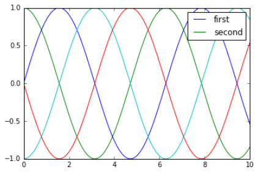
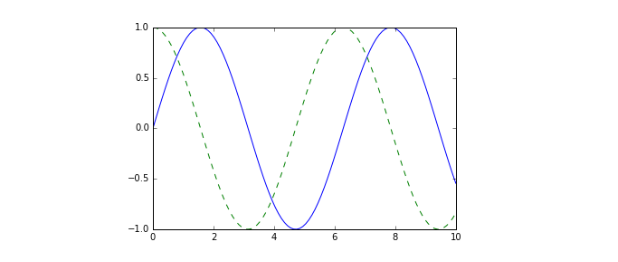
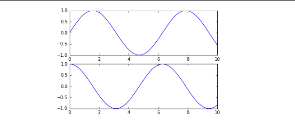
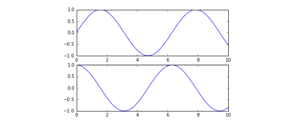
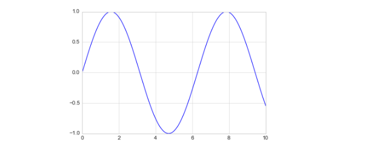
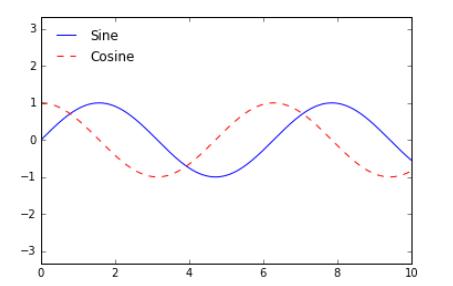
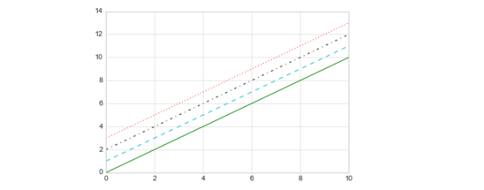

# Visualization with Matplotlib

## What is Mathplotlib

This is the first part of Mathplotlib. Most of the contents from this section are referenced from the book "Python Data Science Handbook" by Jake VanderPlas published by O'Reilly.

>Disclaim: everything is for educational purpose. Not for redistribution or sales.

The book we recommend you to read is the following book,



You should get a copy of this book or find a pdf version to ease the study of data visualization.

Data visualization has been so important that for analyzing either stock data analysis or healthcare data or for any small-scale prototype and proof-of-concept the programmable way of visualization using Python and its Matplotlib has been an indispensible solution.

Even for large-scale data such as tens of gigabytes data, we still take action on a small sample of data and try to visualize it with python. Once we structure and complete our code and our own python packages, we would apply the code to process large data, either with scheduld job or cron job or even with more distributed computer approach such as `Spark framework`. **Please consult our department for `Large Data Processing` for more information.**

Python has been a language selected, and perfect for visualization. Not only because it is easy to use so a lot of non-computer scientist from biology, economy.. etc can program it but also we could write some script or code to analyze data to aid automation or business decision making in real life business.

Python's package has been grown so much that it has developed so much supports such as NumPy, Pandas, Mathplotlib and Seaborn to make Python a perfect language for Data Science, Machine Learning and Quantum/Fintech research.

## How to learn Mathplotlib

We’ll now take an in-depth look at the Matplotlib tool for visualization in Python. Matplotlib is a multiplatform data visualization library built on NumPy arrays, and designed to work with the broader SciPy stack. It was conceived by John Hunter in
2002, originally as a patch to IPython for enabling interactive MATLAB-style plotting via gnuplot from the IPython command line. IPython’s creator, Fernando Perez, was at the time scrambling to finish his PhD, and let John know he wouldn’t have time to review the patch for several months. John took this as a cue to set out on his own, and the Matplotlib package was born, with version 0.1 released in 2003. It received an early boost when it was adopted as the plotting package of choice of the Space Tele‐scope Science Institute (the folks behind the Hubble Telescope), which financially supported Matplotlib’s development and greatly expanded its capabilities.

One of Matplotlib’s most important features is its ability to play well with many oper‐
ating systems and graphics backends. Matplotlib supports dozens of backends and output types, which means you can count on it to work regardless of which operating system you are using or which output format you wish.

This cross-platform, everything-to-everyone approach has been one of the great strengths of Matplotlib. It
has led to a large userbase, which in turn has led to an active developer base and Matplotlib’s powerful tools and ubiquity within the scientific Python world.

In recent years, however, the interface and style of Matplotlib have begun to show their age. Newer tools like ggplot and ggvis in the R language, along with web visualization toolkits based on D3js and HTML5 canvas, often make Matplotlib feel clunky and old-fashioned. Still, we cannot ignore Matplotlib’s strength as a well-tested, cross-platform graphics engine. Recent Matplotlib versions make it relatively easy to set new global plotting styles (see “Customizing Matplotlib: Configurations and Stylesheets” on page 282), and people have been developing new packages that build on its powerful internals to drive Matplotlib via cleaner, more modern APIs—for example, Seaborn (discussed in “Visualization with Seaborn” on my website), ggplot, HoloViews, Altair, and even Pandas itself can be used as wrappers around Matplotlib’s API. Even with wrappers like these, it is still often useful to dive into Matplotlib’s syntax to adjust the final plot output. For this reason, I believe that Matplotlib itself will remain a vital piece of the data visualization stack, even if new tools mean the community gradually moves away from using the Matplotlib API directly.

## General Matplotlib Tips

Before we dive into the details of creating visualizations with Matplotlib, there are a
few useful things you should know about using the package.

### Importing matplotlib

Just as we use the np shorthand for NumPy and the pd shorthand for Pandas, we will use some standard shorthands for Matplotlib imports:

```python
In[1]: import matplotlib as mpl
import matplotlib.pyplot as plt
```

The plt interface is what we will use most often, as we’ll see throughout this chapter.

### Setting Styles

We will use the plt.style directive to choose appropriate aesthetic styles for our figures. Here we will set the classic style, which ensures that the plots we create use the classic Matplotlib style:

`In[2]: plt.style.use('classic')`

Throughout this section, we will adjust this style as needed. Note that the stylesheets used here are supported as of Matplotlib version 1.5; if you are using an earlier version of Matplotlib, only the default style is available.

### show() or No show()? How to Display Your Plots

A visualization you can’t see won’t be of much use, but just how you view your Matplotlib plots depends on the context. The best use of Matplotlib differs depending on how you are using it; roughly, the three applicable contexts are using Matplotlib in a
script, in an IPython terminal, or in an IPython notebook.

### Plotting from a script

If you are using Matplotlib from within a script, the function plt.show() is your friend. plt.show() starts an event loop, looks for all currently active figure objects, and opens one or more interactive windows that display your figure or figures.

So, for example, you may have a file called myplot.py containing the following:

```python
# ------- file: myplot.py ------
import matplotlib.pyplot as plt
import numpy as np
x = np.linspace(0, 10, 100)
plt.plot(x, np.sin(x))
plt.plot(x, np.cos(x))
plt.show()
```

You can then run this script from the command-line prompt, which will result in a
window opening with your figure displayed:

`$ python myplot.py`

The `plt.show()` command does a lot under the hood, as it must interact with your system’s interactive graphical backend. The details of this operation can vary greatly from system to system and even installation to installation, but Matplotlib does its best to hide all these details from you.

One thing to be aware of: the plt.show() command should be used only once per Python session, and is most often seen at the very end of the script. Multiple show() commands can lead to unpredictable backend-dependent behavior, and should mostly be avoided.

### Plotting from an IPython shell

It can be very convenient to use Matplotlib interactively within an IPython shell. IPython is built to work well with Matplotlib if you specify Matplotlib mode. To enable this mode, you can use the **%matplotlib** magic command after starting ipython:

```python
In [1]: %matplotlib
Using matplotlib backend: TkAgg
In [2]: import matplotlib.pyplot as plt
```

At this point, any plt plot command will cause a figure window to open, and further commands can be run to update the plot. Some changes (such as modifying properties of lines that are already drawn) will not draw automatically; to force an update, use `plt.draw()`. Using `plt.show()` in Matplotlib mode is not required.

### **Plotting from an IPython notebook**

The IPython notebook is a browser-based interactive data analysis tool that can combine narrative, code, graphics, HTML elements, and much more into a single executable document.

Plotting interactively within an IPython notebook can be done with the %matplotlib command, and works in a similar way to the IPython shell. In the IPython notebook, you also have the option of embedding graphics directly in the notebook, with two possible options:

• %matplotlib notebook will lead to interactive plots embedded within the notebook

• %matplotlib inline will lead to static images of your plot embedded in the notebook

For this book, we will generally opt for **%matplotlib inline**:

`In[3]: %matplotlib inline`

After you run this command (it needs to be done only once per kernel/session), any cell within the notebook that creates a plot will embed a PNG image of the resulting graphic:

```python
In[4]: import numpy as np
x = np.linspace(0, 10, 100)
fig = plt.figure()
plt.plot(x, np.sin(x), '-')
plt.plot(x, np.cos(x), '--');
```


### Saving Figures to File

One nice feature of Matplotlib is the ability to save figures in a wide variety of formats. You can save a figure using the `savefig()` command. For example, to save the previous figure as a PNG file, you can run this:

`In[5]: fig.savefig('my_figure.png')`

We now have a file called my_figure.png in the current working directory:

```python
In[6]: !ls -lh my_figure.png
-rw-r--r-- 1 jakevdp staff 16K Aug 11 10:59 my_figure.png
```

To confirm that it contains what we think it contains, let’s use the IPython Image object to display the contents of this file.

```python
In[7]: from IPython.display import Image
Image('my_figure.png')
```



In savefig(), the file format is inferred from the extension of the given filename.

Depending on what backends you have installed, many different file formats are available. You can find the list of supported file types for your system by using the following method of the figure canvas object:

```python
In[8]: fig.canvas.get_supported_filetypes()
Out[8]: {'eps': 'Encapsulated Postscript',
'jpeg': 'Joint Photographic Experts Group',
'jpg': 'Joint Photographic Experts Group',
'pdf': 'Portable Document Format',
'pgf': 'PGF code for LaTeX',
'png': 'Portable Network Graphics',
'ps': 'Postscript',
'raw': 'Raw RGBA bitmap',
'rgba': 'Raw RGBA bitmap',
'svg': 'Scalable Vector Graphics',
'svgz': 'Scalable Vector Graphics',
'tif': 'Tagged Image File Format',
'tiff': 'Tagged Image File Format'}
```

Note that when saving your figure, it’s not necessary to use plt.show() or related
commands discussed earlier.

### Two Interfaces for the Price of One

A potentially confusing feature of Matplotlib is its dual interfaces: a convenient MATLAB-style state-based interface, and a more powerful object-oriented interface.

We’ll quickly highlight the differences between the two here.

### MATLAB-style interface

Matplotlib was originally written as a Python alternative for MATLAB users, and much of its syntax reflects that fact. The MATLAB-style tools are contained in the `pyplot (plt)` interface. For example, the following code will probably look quite familiar to MATLAB users:

```python
In[9]: plt.figure()
# create a plot figure
# create the first of two panels and set current axis
plt.subplot(2, 1, 1) # (rows, columns, panel number)
plt.plot(x, np.sin(x))
# create the second panel and set current axis
plt.subplot(2, 1, 2)
plt.plot(x, np.cos(x));
```



It’s important to note that this interface is stateful: it keeps track of the “current” figure
and axes, which are where all plt commands are applied. You can get a reference to these using the `plt.gcf()` (get current figure) and `plt.gca()` (get current axes)routines.

While this stateful interface is fast and convenient for simple plots, it is easy to run
into problems. For example, once the second panel is created, how can we go back and add something to the first? This is possible within the MATLAB-style interface, but a bit clunky. Fortunately, there is a better way.

### Object-oriented interface

The object-oriented interface is available for these more complicated situations, and for when you want more control over your figure. Rather than depending on some notion of an “active” figure or axes, in the object-oriented interface the plotting functions are methods of explicit Figure and Axes objects. To re-create the previous plot using this style of plotting, you might do the following:

```python
In[10]: # First create a grid of plots
# ax will be an array of two Axes objects
fig, ax = plt.subplots(2)
# Call plot() method on the appropriate object
ax[0].plot(x, np.sin(x))
ax[1].plot(x, np.cos(x));
```



For more simple plots, the choice of which style to use is largely a matter of preference, but the object-oriented approach can become a necessity as plots become more complicated. Throughout this chapter, we will switch between the MATLAB-style
and object-oriented interfaces, depending on what is most convenient. In most cases, the difference is as small as switching `plt.plot()` to `ax.plot()`, but there are a few gotchas that we will highlight as they come up in the following sections.

### Simple Line Plots

Perhaps the simplest of all plots is the visualization of a single function `y = f x` . Here
we will take a first look at creating a simple plot of this type. As with all the following sections, we’ll start by setting up the notebook for plotting and importing the functions we will use:

```python
In[1]: %matplotlib inline
import matplotlib.pyplot as plt
plt.style.use('seaborn-whitegrid')
import numpy as np
```

For all Matplotlib plots, we start by creating a figure and an axes. In their simplest
form, a figure and axes can be created as follows:

```python
In[2]: fig = plt.figure()
ax = plt.axes()
```


In Matplotlib, the figure (an instance of the class plt.Figure) can be thought of as a single container that contains all the objects representing axes, graphics, text, and labels. The axes (an instance of the class plt.Axes) is what we see above: a bounding box with ticks and labels, which will eventually contain the plot elements that make up our visualization. Throughout this book, we’ll commonly use the variable name fig to refer to a figure instance, and ax to refer to an axes instance or group of axes instances.

Once we have created an axes, we can use the ax.plot function to plot some data.

Let’s start with a simple sinusoid.

```python
In[3]: fig = plt.figure()
ax = plt.axes()
x = np.linspace(0, 10, 1000)
ax.plot(x, np.sin(x));
```


Alternatively, we can use the pylab interface and let the figure and axes be created for us in the background (see “Two Interfaces for the Price of One” for a discussion of these two interfaces):

`In[4]: plt.plot(x, np.sin(x));`



If we want to create a single figure with multiple lines, we can simply call the plot
function multiple times:

```python
In[5]: plt.plot(x, np.sin(x))
plt.plot(x, np.cos(x));
```



That’s all there is to plotting simple functions in Matplotlib! We’ll now dive into some more details about how to control the appearance of the axes and lines.

Adjusting the Plot: Line Colors and Styles
The first adjustment you might wish to make to a plot is to control the line colors and styles. The `plt.plot()` function takes additional arguments that can be used to specify these. To adjust the color, you can use the color keyword, which accepts a string argument representing virtually any imaginable color. The color can be specified in a variety of ways:

```python
In[6]:
plt.plot(x, np.sin(x - 0), color='blue')
# specify color by name
plt.plot(x, np.sin(x - 1), color='g')
# short color code (rgbcmyk)
plt.plot(x, np.sin(x - 2), color='0.75')
# Grayscale between 0 and 1
plt.plot(x, np.sin(x - 3), color='#FFDD44')
# Hex code (RRGGBB from 00 to FF)
plt.plot(x, np.sin(x - 4), color=(1.0,0.2,0.3)) # RGB tuple, values 0 and 1
plt.plot(x, np.sin(x - 5), color='chartreuse'); # all HTML color names supported
```


If no color is specified, Matplotlib will automatically cycle through a set of default
colors for multiple lines. Similarly, you can adjust the line style using the linestyle keyword.

```python
In[7]: plt.plot(x, x + 0, linestyle='solid')
plt.plot(x, x + 1, linestyle='dashed')
plt.plot(x, x + 2, linestyle='dashdot')
plt.plot(x, x + 3, linestyle='dotted');
# For short, you can use the following codes:
plt.plot(x, x + 4, linestyle='-') # solid
plt.plot(x, x + 5, linestyle='--') # dashed
plt.plot(x, x + 6, linestyle='-.') # dashdot
```


If you would like to be extremely terse, these linestyle and color codes can be com‐
bined into a single nonkeyword argument to the plt.`plot()` function (Figure 4-11):

```python
In[8]: plt.plot(x, x + 0, '-g') # solid green
plt.plot(x, x + 1, '--c') # dashed cyan
plt.plot(x, x + 2, '-.k') # dashdot black
plt.plot(x, x + 3, ':r'); # dotted red
```



These single-character color codes reflect the standard abbreviations in the RGB (Red/Green/Blue) and CMYK (Cyan/Magenta/Yellow/blacK) color systems, commonly used for digital color graphics.

There are many other keyword arguments that can be used to fine-tune the appearance of the plot; for more details, I’d suggest viewing the docstring of the `plt.plot()` function using IPython’s help tools.