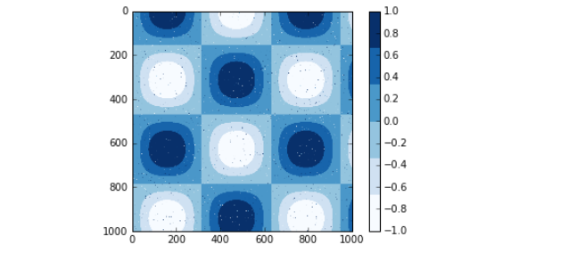
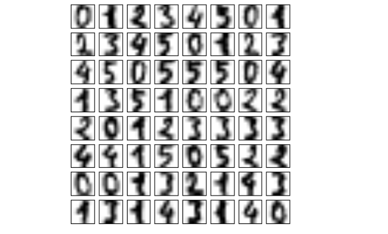
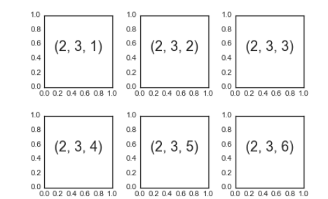
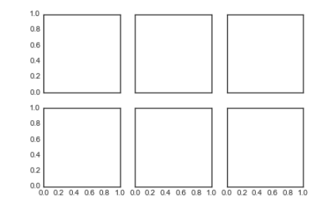
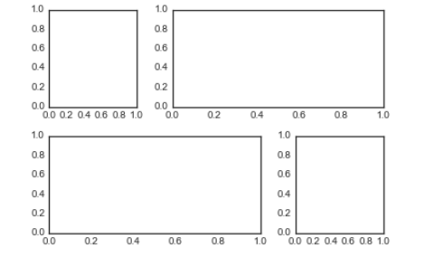
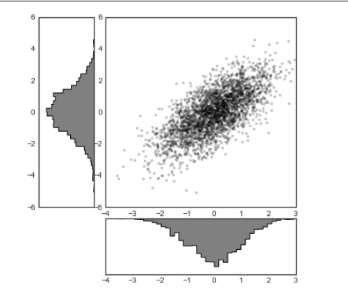

# Mathplotlib - Histogram and 3D Plot

## Histograms, Binnings, and Density

A simple histogram can be a great first step in understanding a dataset. Earlier, we saw a preview of Matplotlib’s histogram function before which creates a basic histogram in one line, once the normal boilerplate imports are done,

```python
In[1]: %matplotlib inline
import numpy as np
import matplotlib.pyplot as plt
plt.style.use('seaborn-white')
data = np.random.randn(1000)
In[2]: plt.hist(data);
```


The hist() function has many options to tune both the calculation and the display;
here’s an example of a more customized histogram (see the image below):

```python
In[3]: plt.hist(data, bins=30, normed=True, alpha=0.5, histtype='stepfilled', color='steelblue', edgecolor='none');
```


The plt.hist docstring has more information on other customization options available. I find this combination of histtype='stepfilled' along with some transparency alpha to be very useful when comparing histograms of several distributions
(see the image below):

```python
In[4]: x1 = np.random.normal(0, 0.8, 1000)
x2 = np.random.normal(-2, 1, 1000)
x3 = np.random.normal(3, 2, 1000)
kwargs = dict(histtype='stepfilled', alpha=0.3, normed=True, bins=40)
plt.hist(x1, **kwargs)
plt.hist(x2, **kwargs)
plt.hist(x3, **kwargs)
```


If you would like to simply compute the histogram (that is, count the number of points in a given bin) and not display it, the np.histogram() function is available:

```python
In[5]: counts, bin_edges = np.histogram(data, bins=5)
print(counts)
[ 12 190 468 301 29]
```

## Two-Dimensional Histograms and Binnings

Just as we create histograms in one dimension by dividing the number line into bins, we can also create histograms in two dimensions by dividing points among two-dimensional bins. We’ll take a brief look at several ways to do this here. We’ll start by
defining some data—an x and y array drawn from a multivariate Gaussian
distribution:

```python
In[6]: mean = [0, 0]
cov = [[1, 1], [1, 2]]
x, y = np.random.multivariate_normal(mean, cov, 10000).T
```

### plt.hist2d: Two-dimensional histogram

One straightforward way to plot a two-dimensional histogram is to use Matplotlib’s `plt.hist2d` function (see the image below):

```python
In[12]: plt.hist2d(x, y, bins=30, cmap='Blues')
cb = plt.colorbar()
cb.set_label('counts in bin')
```


Just as with plt.hist, plt.hist2d has a number of extra options to fine-tune the plot and the binning, which are nicely outlined in the function docstring. Further, just as plt.hist has a counterpart in np.histogram, plt.hist2d has a counterpart in
np.histogram2d, which can be used as follows:

```python
In[8]: counts, xedges, yedges = np.histogram2d(x, y, bins=30)
```

For the generalization of this histogram binning in dimensions higher than two, see the np.histogramdd function.

### plt.hexbin: Hexagonal binnings

The two-dimensional histogram creates a tessellation of squares across the axes.

Another natural shape for such a tessellation is the regular hexagon. For this purpose, Matplotlib provides the plt.hexbin routine, which represents a two-dimensional dataset binned within a grid of hexagons (see the image below):

```python
In[9]: plt.hexbin(x, y, gridsize=30, cmap='Blues')
cb = plt.colorbar(label='count in bin')
```


plt.hexbin has a number of interesting options, including the ability to specify weights for each point, and to change the output in each bin to any NumPy aggregate (mean of weights, standard deviation of weights, etc.).

## Kernel density estimation

Another common method of evaluating densities in multiple dimensions is kernel density estimation (KDE)., but for now we’ll simply mention that KDE can be thought of as a way to “smear out” the points in space and add up the result to obtain
a smooth function. One extremely quick and simple KDE implementation exists in the scipy.stats package. Here is a quick example of using the KDE on this data.

```python
In[10]: from scipy.stats import gaussian_kde
# fit an array of size [Ndim, Nsamples]
data = np.vstack([x, y])
kde = gaussian_kde(data)
# evaluate on a regular grid
xgrid = np.linspace(-3.5, 3.5, 40)
ygrid = np.linspace(-6, 6, 40)
Xgrid, Ygrid = np.meshgrid(xgrid, ygrid)
Z = kde.evaluate(np.vstack([Xgrid.ravel(), Ygrid.ravel()]))

# Plot the result as an image
plt.imshow(Z.reshape(Xgrid.shape),
origin='lower', aspect='auto',
extent=[-3.5, 3.5, -6, 6],
cmap='Blues')
cb = plt.colorbar()
cb.set_label("density")
```


KDE has a smoothing length that effectively slides the knob between detail and smoothness (one example of the ubiquitous bias–variance trade-off). The literature on choosing an appropriate smoothing length is vast: gaussian_kde uses a rule of thumb to attempt to find a nearly optimal smoothing length for the input data.

Other KDE implementations are available within the SciPy ecosystem, each with its own various strengths and weaknesses; see, for example, sklearn.neighbors.Kernel Density and statsmodels.nonparametric.kernel_density.KDEMultivariate. For visualizations based on KDE, using Matplotlib tends to be overly verbose. The Seaborn library, discussed later provides a much more terse API for creating KDE-based visualizations.

### Customizing Plot Legends

Plot legends give meaning to a visualization, assigning labels to the various plot elements. We previously saw how to create a simple legend; here we’ll take a look at customizing the placement and aesthetics of the legend in Matplotlib.

The simplest legend can be created with the plt.legend() command, which automatically creates a legend for any labeled plot elements:

```python
In[1]: import matplotlib.pyplot as plt
plt.style.use('classic')

In[2]: %matplotlib inline
import numpy as np
In[3]: x = np.linspace(0, 10, 1000)
fig, ax = plt.subplots()
ax.plot(x, np.sin(x), '-b', label='Sine')
ax.plot(x, np.cos(x), '--r', label='Cosine')
ax.axis('equal')
leg = ax.legend();
```


But there are many ways we might want to customize such a legend. For example, we can specify the location and turn off the frame (see the image below):

```python
n[4]: ax.legend(loc='upper left', frameon=False)
fig
```


We can use the ncol command to specify the number of columns in the legend (see the image below):

```python
In[5]: ax.legend(frameon=False, loc='lower center', ncol=2)
fig
```


We can use a rounded box (fancybox) or add a shadow, change the transparency (alpha value) of the frame, or change the padding around the text (see the image below):

```python
In[6]: ax.legend(fancybox=True, framealpha=1, shadow=True, borderpad=1)
fig
```


For more information on available legend options, see the plt.legend docstring.

### Choosing Elements for the Legend

As we’ve already seen, the legend includes all labeled elements by default. If this is not what is desired, we can fine-tune which elements and labels appear in the legend by using the objects returned by plot commands. The plt.plot() command is able to
create multiple lines at once, and returns a list of created line instances. Passing any of these to plt.legend() will tell it which to identify, along with the labels we’d like to specify (see the image below):

```python
In[7]: y = np.sin(x[:, np.newaxis] + np.pi * np.arange(0, 2, 0.5))
lines = plt.plot(x, y)
# lines is a list of plt.Line2D instances
plt.legend(lines[:2], ['first', 'second']);
```


I generally find in practice that it is clearer to use the first method, applying labels to the plot elements you’d like to show on the legend (see the image below):

```python
In[8]: plt.plot(x, y[:, 0], label='first')
plt.plot(x, y[:, 1], label='second')
plt.plot(x, y[:, 2:])
plt.legend(framealpha=1, frameon=True);
```


Notice that by default, the legend ignores all elements without a label attribute set.

## Legend for Size of Points

Sometimes the legend defaults are not sufficient for the given visualization. For example, perhaps you’re using the size of points to mark certain features of the data, and want to create a legend reflecting this. Here is an example where we’ll use the size of points to indicate populations of California cities. We’d like a legend that specifies the scale of the sizes of the points, and we’ll accomplish this by plotting some labeled data with no entries (see the image below):

```python
In[9]: import pandas as pd
cities = pd.read_csv('data/california_cities.csv')
# Extract the data we're interested in
lat, lon = cities['latd'], cities['longd']
population, area = cities['population_total'], cities['area_total_km2']
# Scatter the points, using size and color but no label
plt.scatter(lon, lat, label=None,
c=np.log10(population), cmap='viridis',
s=area, linewidth=0, alpha=0.5)
plt.axis(aspect='equal')
plt.xlabel('longitude')
plt.ylabel('latitude')
plt.colorbar(label='log$_{10}$(population)')
plt.clim(3, 7)
# Here we create a legend:
# we'll plot empty lists with the desired size and label
for area in [100, 300, 500]:
plt.scatter([], [], c='k', alpha=0.3, s=area,
label=str(area) + ' km$^2$')
plt.legend(scatterpoints=1, frameon=False,
labelspacing=1, title='City Area')
plt.title('California Cities: Area and Population');
```


The legend will always reference some object that is on the plot, so if we’d like to display a particular shape we need to plot it. In this case, the objects we want (gray circles) are not on the plot, so we fake them by plotting empty lists. Notice too that the legend only lists plot elements that have a label specified.

By plotting empty lists, we create labeled plot objects that are picked up by the legend, and now our legend tells us some useful information. This strategy can be useful for creating more sophisticated visualizations.

Finally, note that for geographic data like this, it would be clearer if we could show state boundaries or other map-specific elements.

### Multiple Legends

Sometimes when designing a plot you’d like to add multiple legends to the same axes. Unfortunately, Matplotlib does not make this easy: via the standard legend interface, it is only possible to create a single legend for the entire plot. If you try to create a second legend using plt.legend() or ax.legend(), it will simply override the first one. We can work around this by creating a new legend artist from scratch, and then using the lower-level ax.add_artist() method to manually add the second artist to the plot (see the image below):

```python
In[10]: fig, ax = plt.subplots()
lines = []
styles = ['-', '--', '-.', ':']
x = np.linspace(0, 10, 1000)
for i in range(4):
lines += ax.plot(x, np.sin(x - i * np.pi / 2),
styles[i], color='black')
ax.axis('equal')
# specify the lines and labels of the first legend
ax.legend(lines[:2], ['line A', 'line B'],
loc='upper right', frameon=False)
# Create the second legend and add the artist manually.
from matplotlib.legend import Legend
leg = Legend(ax, lines[2:], ['line C', 'line D'],
loc='lower right', frameon=False)
ax.add_artist(leg);
```


This is a peek into the low-level artist objects that compose any Matplotlib plot. If you examine the source code of ax.legend() (recall that you can do this within the IPython notebook using ax.legend??) you’ll see that the function simply consists of
some logic to create a suitable Legend artist, which is then saved in the legend_attribute and added to the figure when the plot is drawn.

### Customizing Colorbars

Plot legends identify discrete labels of discrete points. For continuous labels based on the color of points, lines, or regions, a labeled colorbar can be a great tool. In Matplotlib, a colorbar is a separate axes that can provide a key for the meaning of colors in a plot. Because the book is printed in black and white, this section has an accompanying online appendix where you can view the figures in full color (https://github.com/jakevdp/PythonDataScienceHandbook). We’ll start by setting up the note‐book for plotting and importing the functions we will use:

```python
In[1]: import matplotlib.pyplot as plt
plt.style.use('classic')
In[2]: %matplotlib inline
import numpy as np
As we have seen several times throughout this section, the simplest colorbar can be
created with the plt.colorbar function (Figure 4-49):
In[3]: x = np.linspace(0, 10, 1000)
I = np.sin(x) * np.cos(x[:, np.newaxis])
plt.imshow(I)
plt.colorbar();
```


We’ll now discuss a few ideas for customizing these colorbars and using them effectively in various situations.

### Customizing Colorbars

We can specify the colormap using the cmap argument to the plotting function that is creating the visualization (see the image below):

```python
In[4]: plt.imshow(I, cmap='gray');
```


All the available colormaps are in the plt.cm namespace; using IPython’s tab completion feature will give you a full list of built-in possibilities: plt.cm.<TAB>

But being able to choose a colormap is just the first step: more important is how to decide among the possibilities! The choice turns out to be much more subtle than you might initially expect.

### Choosing the colormap

A full treatment of color choice within visualization is beyond the scope of this book, but for entertaining reading on this subject and others, see the article “Ten Simple Rules for Better Figures”. Matplotlib’s online documentation also has an interesting discussion of colormap choice.

Broadly, you should be aware of three different categories of colormaps:

#### Sequential colormaps

These consist of one continuous sequence of colors (e.g., binary or viridis).

#### Divergent colormaps

These usually contain two distinct colors, which show positive and negative devi‐
ations from a mean (e.g., RdBu or PuOr).

#### Qualitative colormaps

These mix colors with no particular sequence (e.g., rainbow or jet).
The jet colormap, which was the default in Matplotlib prior to version 2.0, is an example of a qualitative colormap. Its status as the default was quite unfortunate, because qualitative maps are often a poor choice for representing quantitative data. Among the problems is the fact that qualitative maps usually do not display any uniform progression in brightness as the scale increases. We can see this by converting the jet colorbar into black and white (see the image below):

```python
In[5]:
from matplotlib.colors import LinearSegmentedColormap
def grayscale_cmap(cmap):
"""Return a grayscale version of the given colormap"""
cmap = plt.cm.get_cmap(cmap)
colors = cmap(np.arange(cmap.N))
# convert RGBA to perceived grayscale luminance
# cf. http://alienryderflex.com/hsp.html
RGB_weight = [0.299, 0.587, 0.114]
luminance = np.sqrt(np.dot(colors[:, :3] ** 2, RGB_weight))
colors[:, :3] = luminance[:, np.newaxis]
return LinearSegmentedColormap.from_list(cmap.name + "_gray", colors, cmap.N)
def view_colormap(cmap):
"""Plot a colormap with its grayscale equivalent"""
cmap = plt.cm.get_cmap(cmap)
colors = cmap(np.arange(cmap.N))
cmap = grayscale_cmap(cmap)
grayscale = cmap(np.arange(cmap.N))

fig, ax = plt.subplots(2, figsize=(6, 2),
subplot_kw=dict(xticks=[], yticks=[]))
ax[0].imshow([colors], extent=[0, 10, 0, 1])
ax[1].imshow([grayscale], extent=[0, 10, 0, 1])
In[6]: view_colormap('jet')
```


Notice the bright stripes in the grayscale image. Even in full color, this uneven brightness means that the eye will be drawn to certain portions of the color range, which will potentially emphasize unimportant parts of the dataset. It’s better to use a color map such as viridis (the default as of Matplotlib 2.0), which is specifically constructed to have an even brightness variation across the range. Thus, it not only plays well with our color perception, but also will translate well to grayscale printing:

`In[7]: view_colormap('viridis')`


If you favor rainbow schemes, another good option for continuous data is the cubehelix colormap (like the image below):

`In[8]: view_colormap('cubehelix')`


For other situations, such as showing positive and negative deviations from some mean, dual-color colorbars such as RdBu (short for Red-Blue) can be useful. However,as you can see in before, it’s important to note that the positive-negative infor‐
mation will be lost upon translation to grayscale!

`In[9]: view_colormap('RdBu')`


We’ll see examples of using some of these color maps as we continue.
There are a large number of colormaps available in Matplotlib; to see a list of them, you can use IPython to explore the plt.cm submodule. For a more principled approach to colors in Python, you can refer to the tools and documentation within the Seaborn library.

### Color limits and extensions

Matplotlib allows for a large range of colorbar customization. The colorbar itself is simply an instance of plt.Axes, so all of the axes and tick formatting tricks we’ve learned are applicable. The colorbar has some interesting flexibility; for example, we
can narrow the color limits and indicate the out-of-bounds values with a triangular arrow at the top and bottom by setting the extend property. This might come in handy, for example, if you’re displaying an image that is subject to noise.

```python
In[10]: # make noise in 1% of the image pixels
speckles = (np.random.random(I.shape) < 0.01)
I[speckles] = np.random.normal(0, 3, np.count_nonzero(speckles))
plt.figure(figsize=(10, 3.5))
plt.subplot(1, 2, 1)
plt.imshow(I, cmap='RdBu')
plt.colorbar()
plt.subplot(1, 2, 2)
plt.imshow(I, cmap='RdBu')
plt.colorbar(extend='both')
plt.clim(-1, 1);
```


Notice that in the left panel, the default color limits respond to the noisy pixels, and the range of the noise completely washes out the pattern we are interested in. In the right panel, we manually set the color limits, and add extensions to indicate values that are above or below those limits. The result is a much more useful visualization of our data.

### Discrete colorbars

Colormaps are by default continuous, but sometimes you’d like to represent discrete values. The easiest way to do this is to use the plt.cm.get_cmap() function, and pass the name of a suitable colormap along with the number of desired bins (see the image below):

```python
In[11]: plt.imshow(I, cmap=plt.cm.get_cmap('Blues', 6))
plt.colorbar()
plt.clim(-1, 1);
```



The discrete version of a colormap can be used just like any other colormap.

#### Example: Handwritten Digits

For an example of where this might be useful, let’s look at an interesting visualization of some handwritten digits data. This data is included in Scikit-Learn, and consists of nearly 2,000 8×8 thumbnails showing various handwritten digits. For now, let’s start by downloading the digits data and visualizing several of the example images with plt.imshow() (see the image below):

```python
In[12]: # load images of the digits 0 through 5 and visualize several of them
from sklearn.datasets import load_digits
digits = load_digits(n_class=6)
fig, ax = plt.subplots(8, 8, figsize=(6, 6))
for i, axi in enumerate(ax.flat):
axi.imshow(digits.images[i], cmap='binary')
axi.set(xticks=[], yticks=[])
```



Because each digit is defined by the hue of its 64 pixels, we can consider each digit to be a point lying in 64-dimensional space: each dimension represents the brightness of one pixel. But visualizing relationships in such high-dimensional spaces can be extremely difficult. One way to approach this is to use a dimensionality reduction technique such as manifold learning to reduce the dimensionality of the data while maintaining the relationships of interest. 

```python
In[13]: # project the digits into 2 dimensions using IsoMap
from sklearn.manifold import Isomap
iso = Isomap(n_components=2)
projection = iso.fit_transform(digits.data)
```

We’ll use our discrete colormap to view the results, setting the ticks and clim to improve the aesthetics of the resulting colorbar:

```python
In[14]: # plot the results
plt.scatter(projection[:, 0], projection[:, 1], lw=0.1,
c=digits.target, cmap=plt.cm.get_cmap('cubehelix', 6))
plt.colorbar(ticks=range(6), label='digit value')
plt.clim(-0.5, 5.5)
```


The projection also gives us some interesting insights on the relationships within the dataset: for example, the ranges of 5 and 3 nearly overlap in this projection, indicating that some handwritten fives and threes are difficult to distinguish, and therefore more likely to be confused by an automated classification algorithm. Other values, like 0 and 1, are more distantly separated, and therefore much less likely to be confused. This observation agrees with our intuition, because 5 and 3 look much more similar than do 0 and 1.

### Multiple Subplots

Sometimes it is helpful to compare different views of data side by side. To this end, Matplotlib has the concept of subplots: groups of smaller axes that can exist together within a single figure. These subplots might be insets, grids of plots, or other more complicated layouts. In this section, we’ll explore four routines for creating subplots in Matplotlib. We’ll start by setting up the notebook for plotting and importing the functions we will use:

```python
In[1]: %matplotlib inline
import matplotlib.pyplot as plt
plt.style.use('seaborn-white')
import numpy as np
```

### plt.axes: Subplots by Hand

The most basic method of creating an axes is to use the plt.axes function. As we’ve seen previously, by default this creates a standard axes object that fills the entire figure. plt.axes also takes an optional argument that is a list of four numbers in the
figure coordinate system. These numbers represent [bottom, left, width, height] in the figure coordinate system, which ranges from 0 at the bottom left of the figure to 1 at the top right of the figure.

For example, we might create an inset axes at the top-right corner of another axes by setting the x and y position to 0.65 (that is, starting at 65% of the width and 65% of the height of the figure) and the x and y extents to 0.2 (that is, the size of the axes is 20% of the width and 20% of the height of the figure). Figure 4-59 shows the result of this code:

```python
In[2]: ax1 = plt.axes() # standard axes
ax2 = plt.axes([0.65, 0.65, 0.2, 0.2])
```


The equivalent of this command within the object-oriented interface is fig.add_axes(). Let’s use this to create two vertically stacked axes (see the image below):

```python
In[3]: fig = plt.figure()
ax1 = fig.add_axes([0.1, 0.5, 0.8, 0.4],
xticklabels=[], ylim=(-1.2, 1.2))
ax2 = fig.add_axes([0.1, 0.1, 0.8, 0.4],
ylim=(-1.2, 1.2))
x = np.linspace(0, 10)
ax1.plot(np.sin(x))
ax2.plot(np.cos(x));
```


We now have two axes (the top with no tick labels) that are just touching: the bottom of the upper panel (at position 0.5) matches the top of the lower panel (at position 0.1 + 0.4).

### plt.subplot: Simple Grids of Subplots

Aligned columns or rows of subplots are a common enough need that Matplotlib has several convenience routines that make them easy to create. The lowest level of these is plt.subplot(), which creates a single subplot within a grid. As you can see, this
command takes three integer arguments—the number of rows, the number of columns, and the index of the plot to be created in this scheme, which runs from the upper left to the bottom right (see the image below):

```python
In[4]: for i in range(1, 7):
plt.subplot(2, 3, i)
plt.text(0.5, 0.5, str((2, 3, i)),
fontsize=18, ha='center')
```


The command plt.subplots_adjust can be used to adjust the spacing between these plots. The following code (the result of which is shown in above image) uses the equivalent object-oriented command, fig.add_subplot():

```python
In[5]: fig = plt.figure()
fig.subplots_adjust(hspace=0.4, wspace=0.4)
for i in range(1, 7):
ax = fig.add_subplot(2, 3, i)
ax.text(0.5, 0.5, str((2, 3, i)),
fontsize=18, ha='center')
```



We’ve used the hspace and wspace arguments of plt.subplots_adjust, which specify the spacing along the height and width of the figure, in units of the subplot size (in this case, the space is 40% of the subplot width and height).

### plt.subplots: The Whole Grid in One Go

The approach just described can become quite tedious when you’re creating a large grid of subplots, especially if you’d like to hide the x- and y-axis labels on the inner plots. For this purpose, plt.subplots() is the easier tool to use (note the s at the end of subplots). Rather than creating a single subplot, this function creates a full grid of subplots in a single line, returning them in a NumPy array. The arguments are the number of rows and number of columns, along with optional keywords sharex and sharey, which allow you to specify the relationships between different axes.

Here we’ll create a 2×3 grid of subplots, where all axes in the same row share their y-axis scale, and all axes in the same column share their x-axis scale (see the image below):

`In[6]: fig, ax = plt.subplots(2, 3, sharex='col', sharey='row')`



Note that by specifying sharex and sharey, we’ve automatically removed inner labels on the grid to make the plot cleaner. The resulting grid of axes instances is returned within a NumPy array, allowing for convenient specification of the desired axes using standard array indexing notation (see the image below):

```python
In[7]: # axes are in a two-dimensional array, indexed by [row, col]
for i in range(2):
for j in range(3):
ax[i, j].text(0.5, 0.5, str((i, j)),
fontsize=18, ha='center')

fig
```


In comparison to plt.subplot(), plt.subplots() is more consistent with Python’s conventional 0-based indexing.

### plt.GridSpec: More Complicated Arrangements

To go beyond a regular grid to subplots that span multiple rows and columns, plt.GridSpec() is the best tool. The plt.GridSpec() object does not create a plot by itself; it is simply a convenient interface that is recognized by the plt.subplot() command. For example, a gridspec for a grid of two rows and three columns with some specified width and height space looks like this:

```python
In[8]: grid = plt.GridSpec(2, 3, wspace=0.4, hspace=0.3)
From this we can specify subplot locations and extents using the familiar Python slic‐
ing syntax (Figure 4-65):
In[9]: plt.subplot(grid[0, 0])
plt.subplot(grid[0, 1:])
plt.subplot(grid[1, :2])
plt.subplot(grid[1, 2]);
```



This type of flexible grid alignment has a wide range of uses. I most often use it when creating multi-axes histogram plots like the one shown here (see the image below):

```python
In[10]: # Create some normally distributed data
mean = [0, 0]
cov = [[1, 1], [1, 2]]
x, y = np.random.multivariate_normal(mean, cov, 3000).T
# Set up the axes with gridspec
fig = plt.figure(figsize=(6, 6))
grid = plt.GridSpec(4, 4, hspace=0.2, wspace=0.2)
main_ax = fig.add_subplot(grid[:-1, 1:])
y_hist = fig.add_subplot(grid[:-1, 0], xticklabels=[], sharey=main_ax)
x_hist = fig.add_subplot(grid[-1, 1:], yticklabels=[], sharex=main_ax)
# scatter points on the main axes
main_ax.plot(x, y, 'ok', markersize=3, alpha=0.2)
# histogram on the attached axes
x_hist.hist(x, 40, histtype='stepfilled',
orientation='vertical', color='gray')
x_hist.invert_yaxis()
y_hist.hist(y, 40, histtype='stepfilled',
orientation='horizontal', color='gray')
y_hist.invert_xaxis()
```


