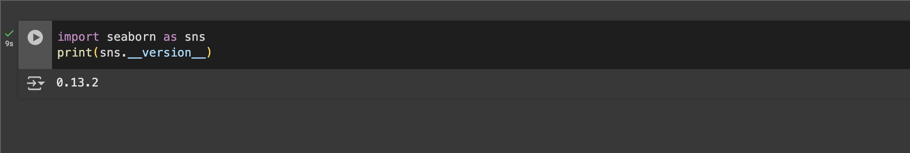

# **Seaborn Tutorial for Beginners**

Seaborn is a Python data visualization library based on Matplotlib. It provides a high-level interface for drawing 
attractive and informative statistical graphics. In this tutorial, we will explore the basics of Seaborn and learn how 
to create different types of visualizations. Each section includes examples and tips to help you build a strong foundation.


## **Getting Started with Seaborn**

For simplicity in development and to avoid setup issues, you can also use Google Colab, a cloud-based Python environment.
Colab comes with many libraries, including Seaborn, pre-installed. To start using Google Colab:

1. Go to Google Colab.
2. Create a new notebook.

Run the following code to verify that Seaborn is available:

```python
import seaborn as sns
print(sns.__version__)
```



This ensures you have a ready-to-use environment without needing to install anything locally.

If its not present it can be installed using pip:

```shell
!pip install seaborn
```


### **Importing Seaborn**

You need to import Seaborn and other essential libraries like NumPy and Pandas:

```python
import seaborn as sns
import matplotlib.pyplot as plt
import pandas as pd
import numpy as np
```

NumPy is used for numerical operations such as generating arrays, performing calculations, or creating custom data 
for plots. Pandas is essential for loading, cleaning, and manipulating datasets, providing the structured data that 
Seaborn requires for its visualizations.

### **Loading Datasets**

Seaborn comes with several built-in datasets that you can use to practice. To explore the list of available datasets, 
you can use:

To explore available datasets, use:

`print(sns.get_dataset_names())`


```python
# Load the built-in "tips" dataset

data = sns.load_dataset("tips")

# Display the first few rows
data.head()
```


### **Basic Plotting with Seaborn**

Seaborn provides a simpler and more intuitive interface compared to Matplotlib for creating complex visualizations 
with minimal code. While Matplotlib is highly flexible, Seaborn excels in statistical data visualization and 
integrates seamlessly with Pandas DataFrames, making it easier to plot data directly from tabular formats.


1. Scatter Plot

Scatter plots are used to observe relationships between two variables. To add more depth to your scatter plot, you can
use the hue parameter to include a third variable that categorizes the data. This allows you to differentiate between 
groups within your dataset:


In this example, the hue parameter is used to color the points based on whether the meal occurred during lunch or dinner. 
This can help identify patterns or differences between categories.


2. Line Plot

Line plots are ideal for visualizing trends over time. They are particularly useful for time-series data, 
where the x-axis represents time intervals and the y-axis represents the observed values.

For example, you can create a line plot using a Pandas DataFrame with a datetime index:

```python
time_series = pd.date_range("2023-01-01", periods=100, freq="D")
data_series = np.random.randn(100).cumsum()

# Create the DataFrame
time_data = pd.DataFrame({"Date": time_series, "Value": data_series})

# Plot the data
sns.lineplot(data=time_data, x="Date", y="Value")
plt.title("Time-Series Line Plot")
plt.show()
```


### Statistical Plots

3. Histogram

Histograms show the distribution of a variable. The kde (Kernel Density Estimate) parameter adds a smoothed curve to 
represent the probability density of the data. This is particularly useful for identifying the underlying distribution pattern:

```python
# Histogram of total bills with KDE
sns.histplot(data=data, x="total_bill", bins=20, kde=True)
plt.title("Distribution of Total Bill with KDE")
plt.show()
```


4. Box Plot

Box plots are used to visualize the distribution of a dataset and identify outliers.

```python
sns.boxplot(data=data, x="day", y="tip")
plt.title("Box Plot of Tips by Day")
plt.show()
```


You can enhance box plots by adding a hue parameter to compare groups:

```python
sns.boxplot(data=data, x="day", y="tip", hue="sex")
plt.title("Box Plot of Tips by Day and Gender")
plt.show()
```


### **Advanced Visualizations**

5. Pair Plot

Pair plots are great for exploring relationships between multiple variables. They provide scatter plots for each pair of numerical variables, along with histograms or KDE plots for individual variables.

To customize pair plots, you can specify which variables to include or add a categorical variable for differentiation:

```python
# Customize variables and add hue
sns.pairplot(data, vars=["total_bill", "tip", "size"], hue="sex", diag_kind="kde")
plt.show()
```


Here, diag_kind="kde" changes the diagonal plots to kernel density estimates, and the hue parameter adds color coding for the sex variable, making it easier to distinguish groups.


### **Customizing Seaborn Plots**

Changing Styles

Seaborn allows you to change the appearance of plots using styles. Available styles include:

* _darkgrid_: Adds grid lines on a dark background, suitable for detailed analysis.

* _whitegrid_: Adds grid lines on a white background, offering a clean look for presentations.

* _dark_: Dark background without grid lines, good for emphasizing the plot elements.

* _white_: Clean white background without grid lines, often used in minimalistic designs.

* _ticks_: Adds ticks to the axes for a sharp and professional appearance.

Replace 'style_name' with one of the options above

`sns.set_style("style_name")`

For Example 

```python
sns.set_style("whitegrid")
sns.scatterplot(data=data, x="total_bill", y="tip")
plt.title("Scatter Plot with Whitegrid Style")
plt.show()
```


## **Tips for Using Seaborn**

1. Start with Built-in Datasets: Use Seaborn’s built-in datasets like tips or iris to practice.
2. Explore the Documentation: The [Seaborn documentation](https://seaborn.pydata.org/) is a great resource for understanding functions and parameters.
3. Combine with Pandas: Use Pandas to preprocess your data before visualizing it with Seaborn.
4. Experiment with Parameters: Don’t hesitate to experiment with various parameters to find the best settings for your data.
5. Save Your Plots: Use plt.savefig("plot.png") to save your visualizations for reports or presentations.


