# Seaborn - Introduction

Seaborn is a Python data visualization library based on Matplotlib. It provides a high-level interface for drawing attractive and informative statistical graphics. In this tutorial, we will explore the basics of Seaborn and learn how to create different types of visualizations. Each section includes examples and tips to help you build a strong foundation.

## **Getting Started with Seaborn**

For simplicity in development and to avoid setup issues, you can also use Google Colab, a cloud-based Python environment.

Colab comes with many libraries, including Seaborn, pre-installed. To start using Google Colab:

1. Go to Google Colab.
2. Create a new notebook.

Run the following code to verify that Seaborn is available:

```python
import seaborn as sns
print(sns.__version__)
```


This ensures you have a ready-to-use environment without needing to install anything locally.

If its not present it can be installed using pip:

```shell
!pip install seaborn
```


### **Importing Seaborn**

You need to import Seaborn and other essential libraries like NumPy and Pandas:

```python
import seaborn as sns
import matplotlib.pyplot as plt
import pandas as pd
import numpy as np
```

NumPy is used for numerical operations such as generating arrays, performing calculations, or creating custom data for plots. Pandas is essential for loading, cleaning, and manipulating datasets, providing the structured data that Seaborn requires for its visualizations.

### **Loading Datasets**

Seaborn comes with several built-in datasets that you can use to practice. To explore the list of available datasets, you can use:

To explore available datasets, use:

`print(sns.get_dataset_names())`


```python
# Load the built-in "tips" dataset

data = sns.load_dataset("tips")

# Display the first few rows
data.head()
```


### **Basic Plotting with Seaborn**

Seaborn provides a simpler and more intuitive interface compared to Matplotlib for creating complex visualizations with minimal code. While Matplotlib is highly flexible, Seaborn excels in statistical data visualization and integrates seamlessly with Pandas DataFrames, making it easier to plot data directly from tabular formats.

### **Scatterplot**

**Example 1**

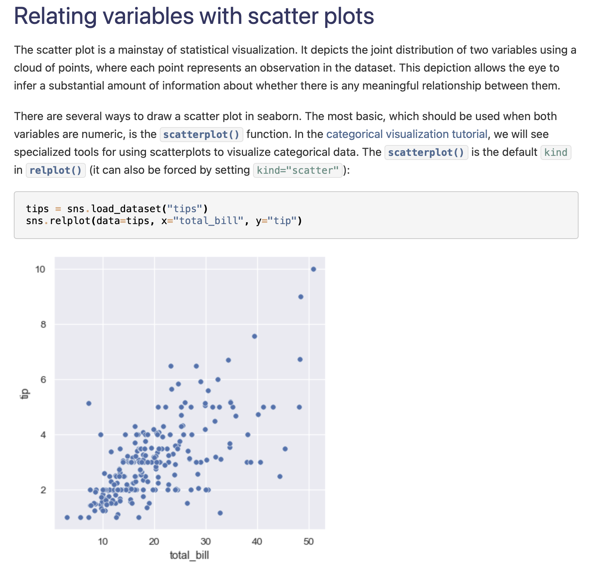

**Example 2**


**Example 3**


**Example 4**

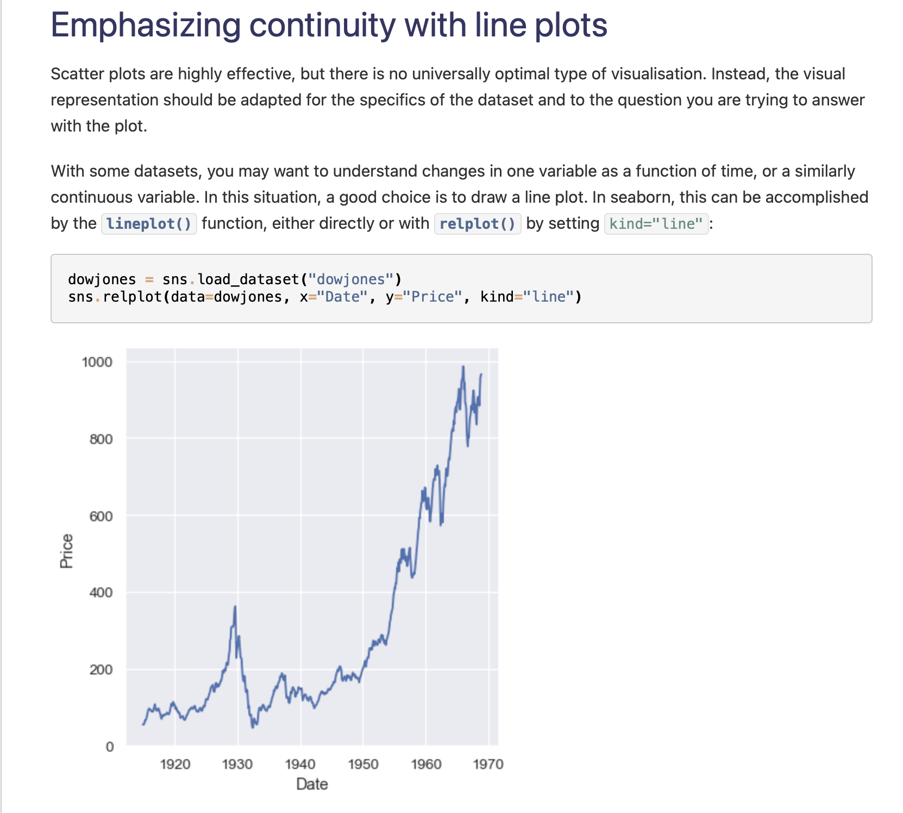

**Example 5**

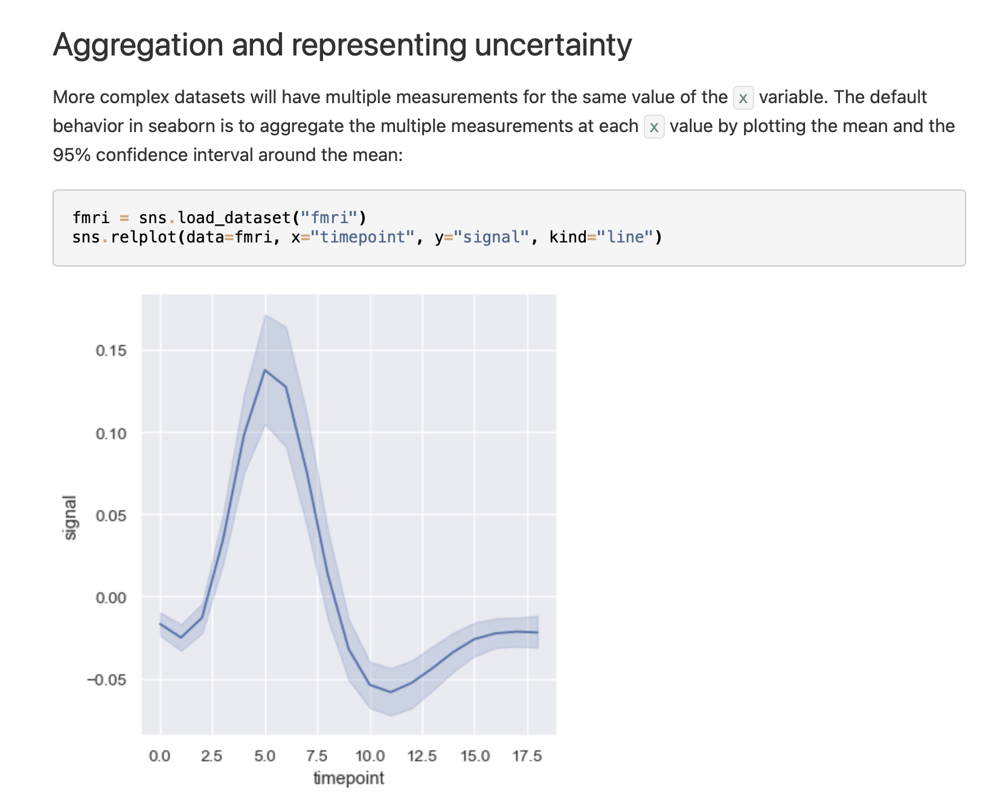

**Example 6**

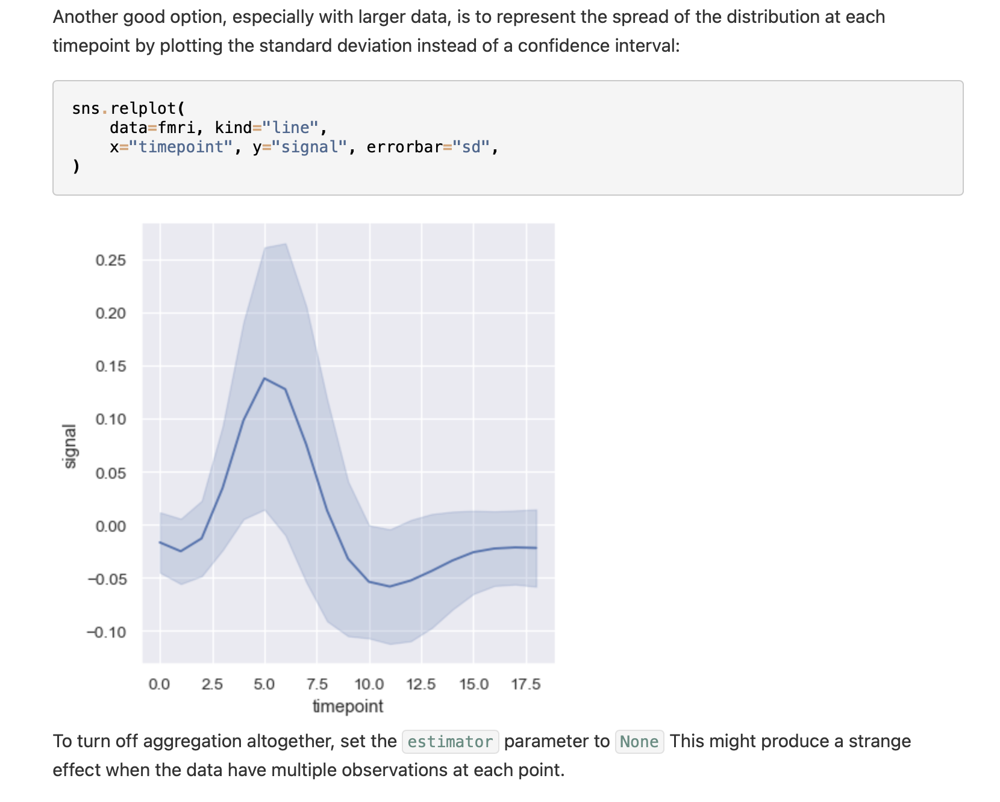

### **Histogram**

**Example 1**

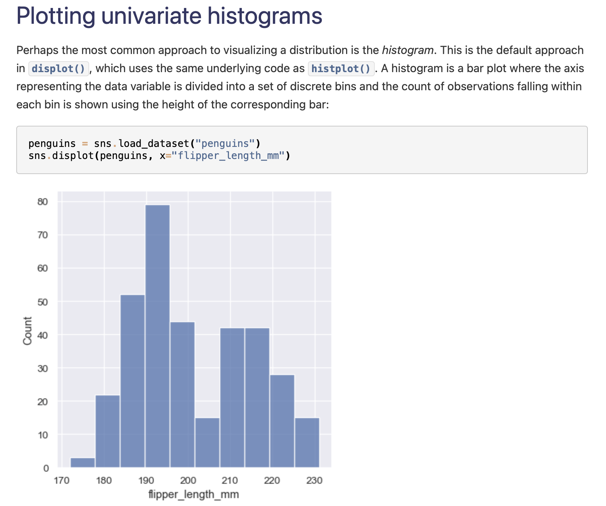

**Example 2**

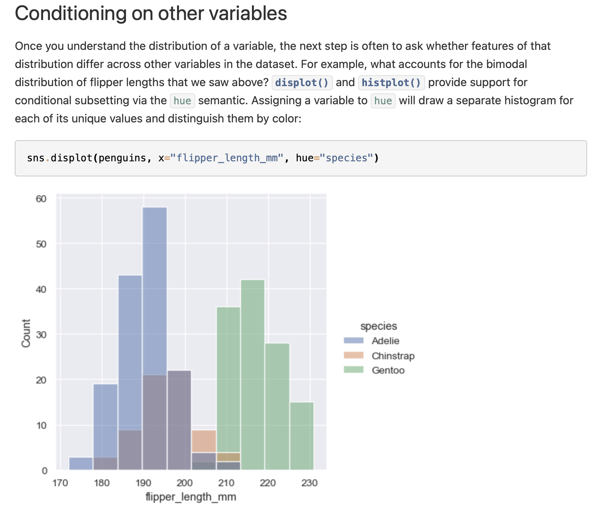

**Example 3**

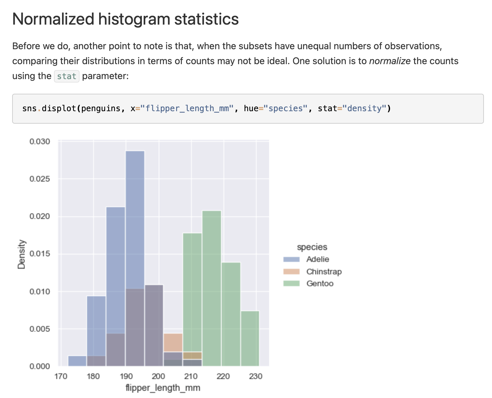

**Example 4**


**Example 5**

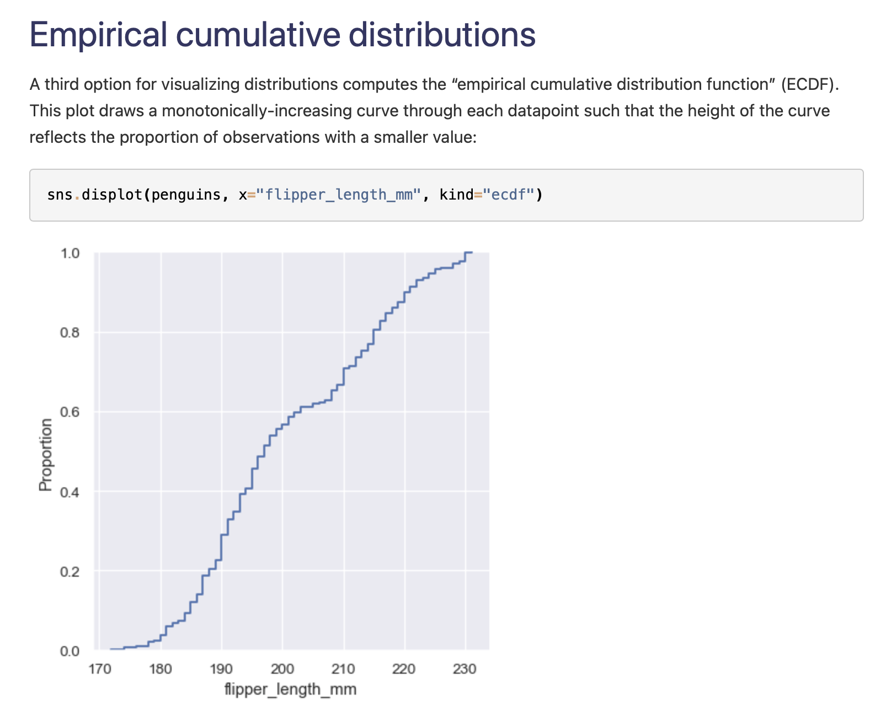

**Example 6**

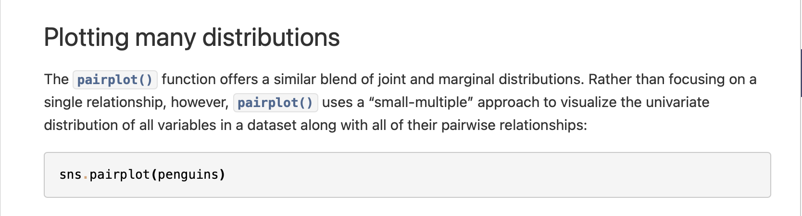

**Example 7**


### **Categorical Visualization**

**Example 1**

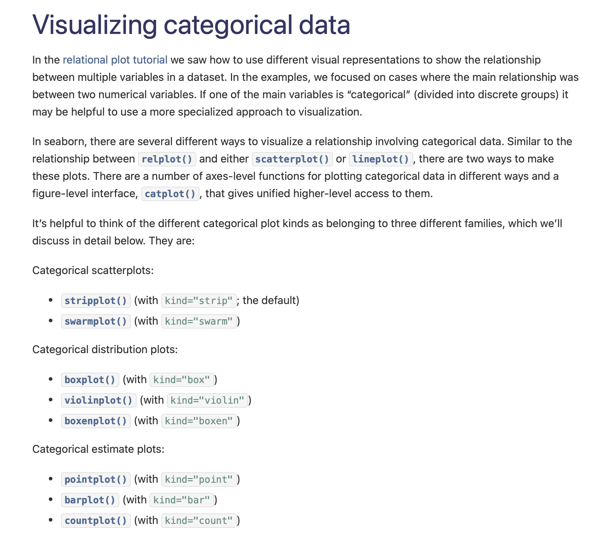

**Example 2**


**Example 3**


**Example 4**

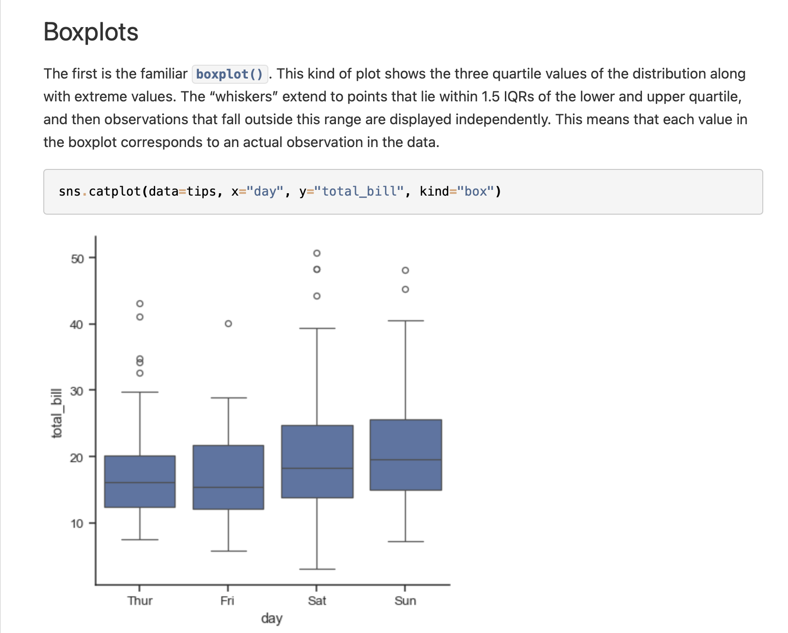

### **Regression**

**Example 1**


**Example 2**

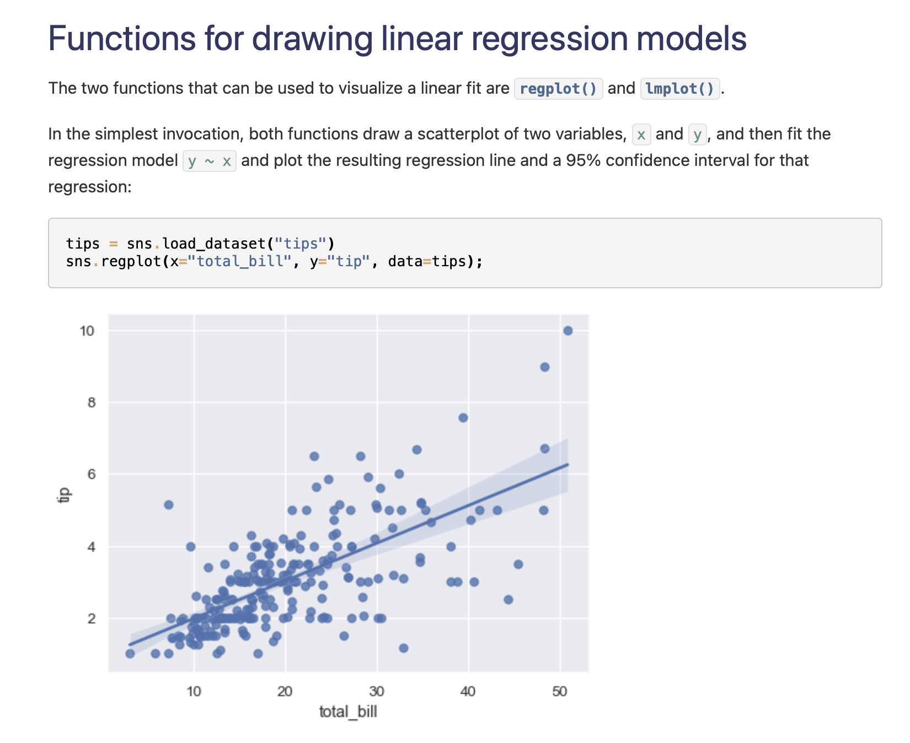

**Example 3**

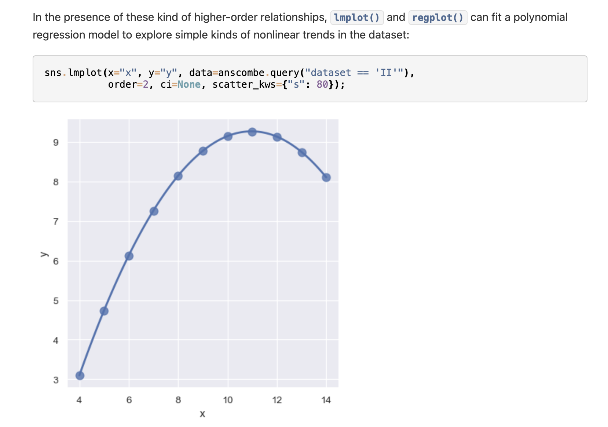

## **Tips for Using Seaborn**

1. Start with Built-in Datasets: Use Seaborn’s built-in datasets like tips or iris to practice.
2. Explore the Documentation: The [Seaborn documentation](https://seaborn.pydata.org/) is a great resource for understanding functions and parameters.
3. Combine with Pandas: Use Pandas to preprocess your data before visualizing it with Seaborn.
4. Experiment with Parameters: Don’t hesitate to experiment with various parameters to find the best settings for your data.
5. Save Your Plots: Use plt.savefig("plot.png") to save your visualizations for reports or presentations.