# Introduction of ER Model

## History

Peter Chen developed the ER diagram in 1976. The ER model was created to provide a simple and understandable model for representing the structure and logic of databases. It has since evolved into variations such as the Enhanced ER Model and the Object Relationship Model

The Entity Relational Model is a model for identifying entities to be represented in the database and representation of how those entities are related. The ER data model specifies enterprise schema that represents the overall logical structure of a database graphically.

The Entity Relationship Diagram explains the relationship among the entities present in the database. ER models are used to model real-world objects like a person, a car, or a company and the relation between these real-world objects. In short, the ER Diagram is the structural format of the database.

## Why Use ER Diagrams In DBMS?

* ER diagrams represent the E-R model in a database, making them easy to convert into relations (tables).

* ER diagrams provide the purpose of real-world modeling of objects which makes them intently useful.

* ER diagrams require no technical knowledge and no hardware support.

* These diagrams are very easy to understand and easy to create even for a naive user.

* It gives a standard solution for visualizing the data logically.

## Symbols Used in ER Model

ER Model is used to model the logical view of the system from a data perspective which consists of these symbols:

The ER Diagram shows the relationship between entities (tables) and the primary key-foreign key relationships between the tables (relationships). An entity is a thing, person, or organization that exists in the real world. A table consists of rows and columns representing data records or entities. The primary key-foreign key relationship indicates the connection or relationship between entities. It identifies the attributes and keys that link them together.

Understanding the Types of ERD Symbols is critical for understanding relational database design. If you're learning relational databases, ERDs are a great way to understand the fundamental concepts and learn how they apply in the real world.

### ERD symbols types

ER Diagram symbols can be categorized into three types. The following are three types of ER Diagram symbols.

1/ Chen ERD Notations

2/ Crow's Foot Notations

3/ UML Notations

4/ Barker's Notations

5/ Bachman Notations

6/ IDEF1X Notations

7/ Min-Max Notation/ISO Notations

8/ Object Relationship Symbols

9/ Express-G Symbols

10/ Martin ERD Symbols

11 ORM Diagram Symbols

### Chen ERD Symbols

Peter Chen was the one responsible for coming up with the Chen ERD notation. He was one of the first individuals who used ERD in database design.

One of the most basic symbols of an ER diagram is the entity. To further elaborate on it, keep reading.

**Elements**

* Rectangles: Rectangles represent Entities in the ER Model.
* Ellipses: Ellipses represent Attributes in the ER Model.
* Diamond: Diamonds represent Relationships among Entities.
* Lines: Lines represent attributes to entities and entity sets with other relationship types.
* Double Ellipse: Double Ellipses represent Multi-Valued Attributes.
* Double Rectangle: Double Rectangle represents a Weak Entity.

**Symbols**

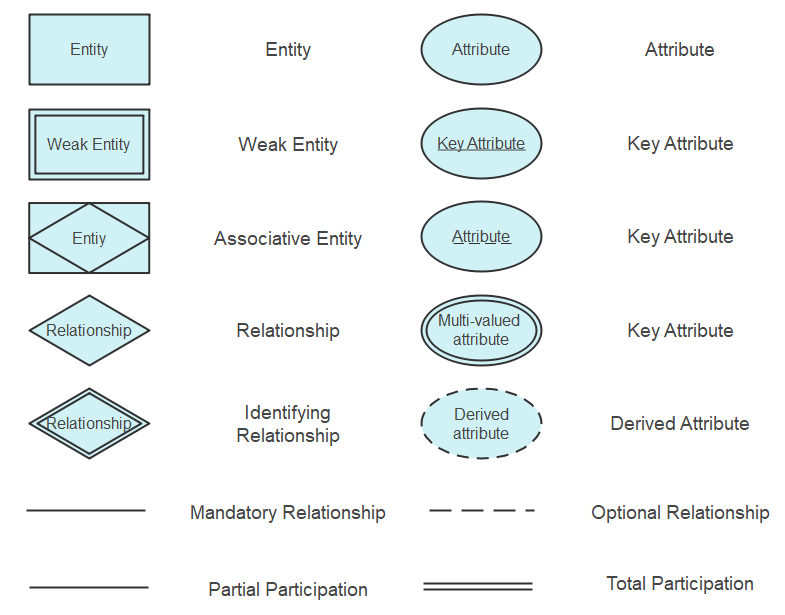

**Relations types**

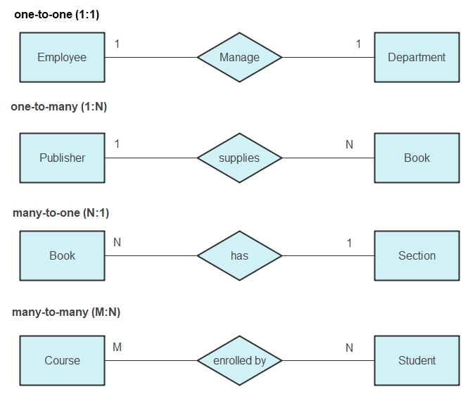

Now we will break down the terms and explain them separately and in more details,

**ERD Entity Symbols**

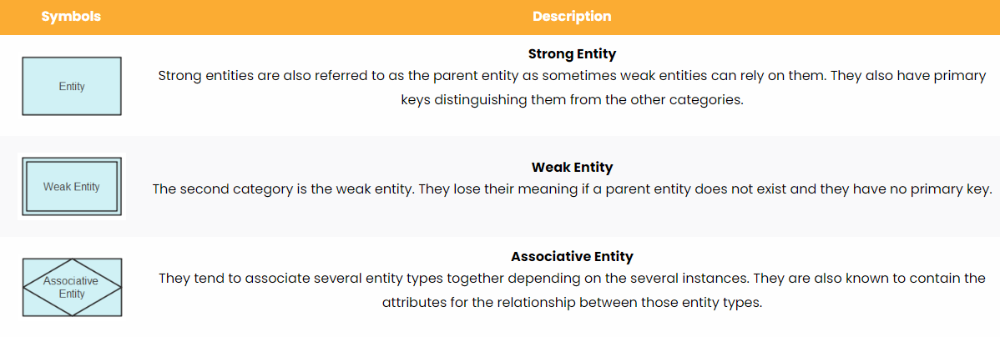

**Entity Set**

An entity set, in simpler terms, is a group of similar entities. They may either share similar values and have attributes of the exact nature.

**ERD Attribute Symbols**

The attribute symbol is also the second step in making an ER diagram. It is an essential component of the entire process. An attribute is a characteristic related to the entity. These characteristics are used to understand the database in more detail and depth.

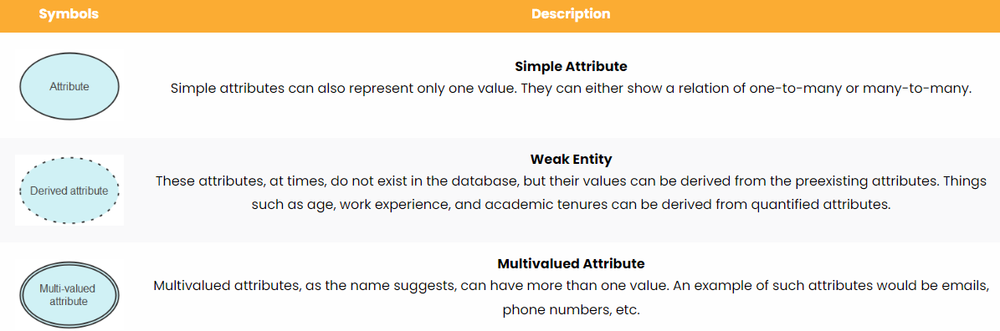 

**ERD Relationship Symbols**

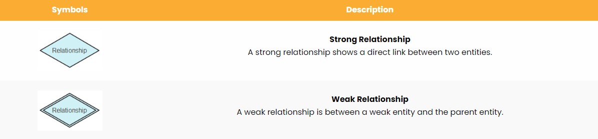  
 
## Crow's Foot Notations

Gordon Everest was the creator of the Crow's Foot notation in an article he wrote in 1976 for the Fifth Computing Conference. The basic idea was to use the name inverted arrow notation, but Gordon stuck with the Crow’s foot notation. The symbols used for this notation are:

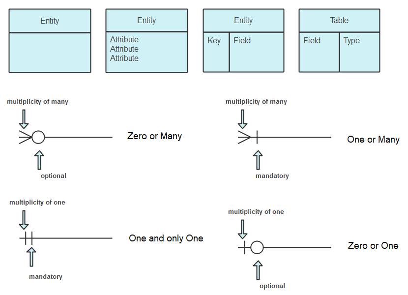

**Explanations**

**ERD Table Symbols**

A table is another way of representing entities. They are an essential component of physical ER diagrams. The table consists of the entity, and the different attributes related to it are listed right below it. They are also called fields in the physical ER diagram.

**ERD Cardinality**

* Cardinality is the maximum times an entity can relate to an instance with another entity or entity set. Ordinality is the minimum time an entity can relate to an instance with another entity or entity set. Usually, in ER diagrams, these terms are used under cardinality itself.
* The cardinality constraints are within the maximum and minimum numbers that are relevant to a relationship.
* Cardinality is represented by lines that have different stylings depending on the type of cardinality that is to be shown.

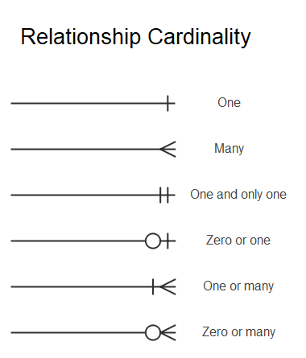

* **One** to One: In such a case, the origin entity has a one-to-one association with the other entity. This is also an example of a one-to-one relationship.
* **Many**: In this category, the target entity can be related many times by the origin entity. This also shows a one-to-many relationship.
* **One and Only One**: In this cardinality notation, the origin entity has only one entity linked with the other entity.
* **One or Many**: In this scenario, the origin can have one or many linked entities with the other entity set.

## UML Notation

UML is well known for documenting, visualizing, and specifying the components of non-software and software systems. Since the UML has many diagrams, it is divided into two representing the behavior and the other structural information.

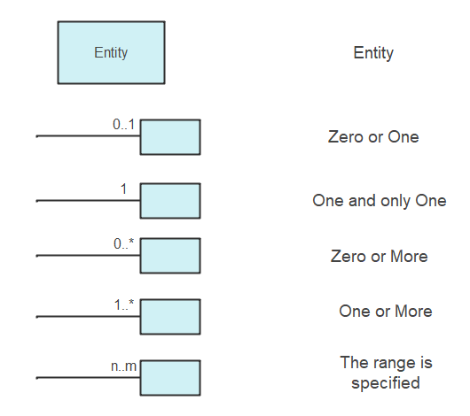

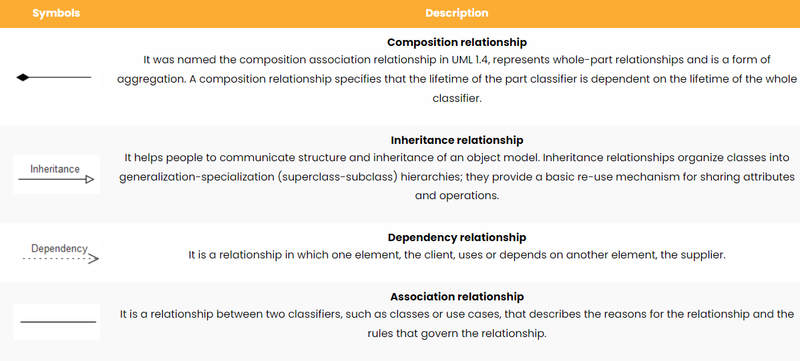

## Baker's notation

UML is well known for documenting, visualizing, and specifying the components of non-software and software systems. Since the UML has many diagrams, it is divided into two representing the behavior and the other structural information.

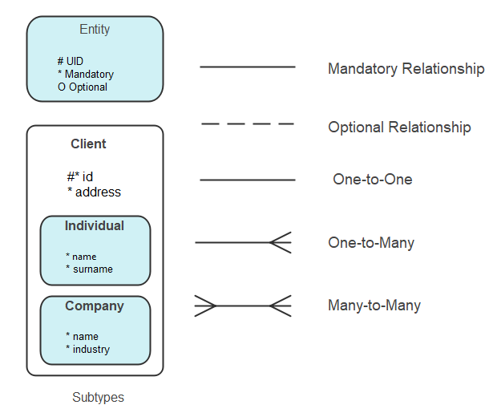 

## Bachman Notation

Charles Bachman was responsible for the creation of this notation. He was a computer scientist and developed the Chen notation to make another set of notations. He was also one of the database pioneers.

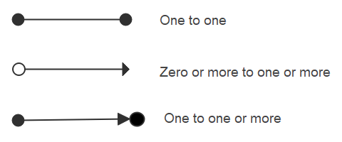 

## IDEF1X Notation

It is known as the Integration definition for Information Modelling. In the 1970s, the US Air Force required semantic data models. This gave rise to ICAM programs that later developed into IDEF1X. This used syntax to create relational databases.

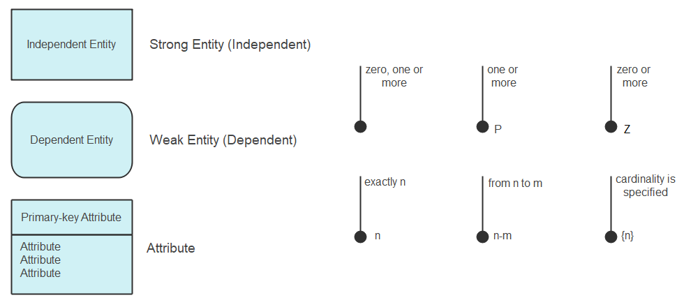 

## Min-Max Notation/ISO Notation

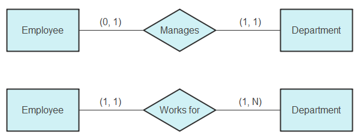 

## Object Relationship Symbols

The following picture is the object relationship symbols including entity, relationship, view, parent to category, category to child, table inheritance, type, type inheritance and dynamic connector.

* **Type of a relationship** is created depends upon how related objects are defined.

* **Type inheritance** is an additional property offered by hierarchy within structured complex data.

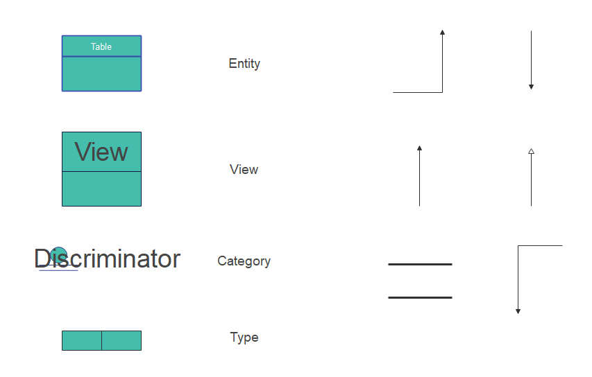 

## Express-G Symbols

The following picture is the object relationship symbols including entity, relationship, view, parent to category, category to child, table inheritance, type, type inheritance and dynamic connector.

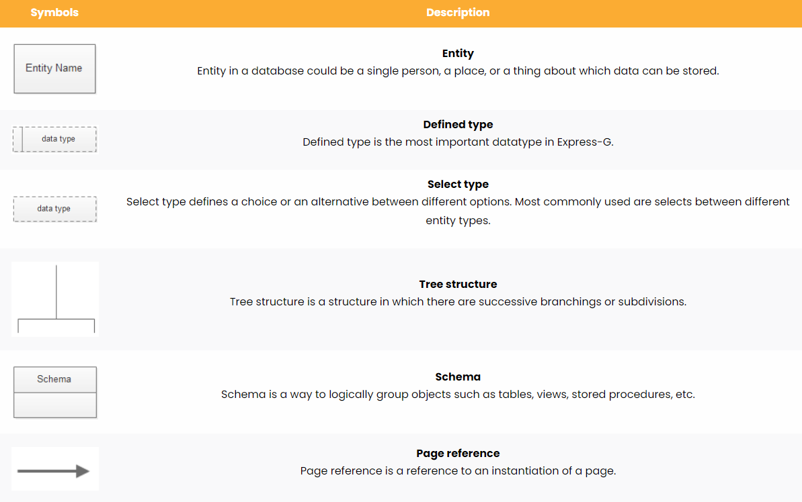

## Martin ERD Symbols

The following picture is the object relationship symbols including entity, relationship, view, parent to category, category to child, table inheritance, type, type inheritance and dynamic connector.

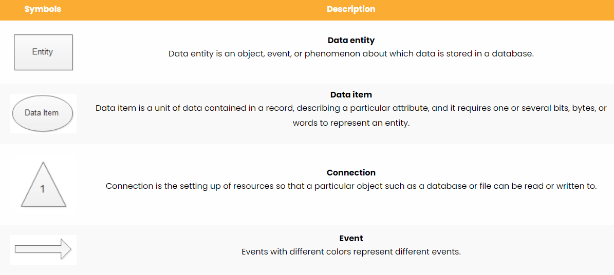

## ORM Diagram Symbols

The following picture is the object relationship symbols including entity, relationship, view, parent to category, category to child, table inheritance, type, type inheritance and dynamic connector.

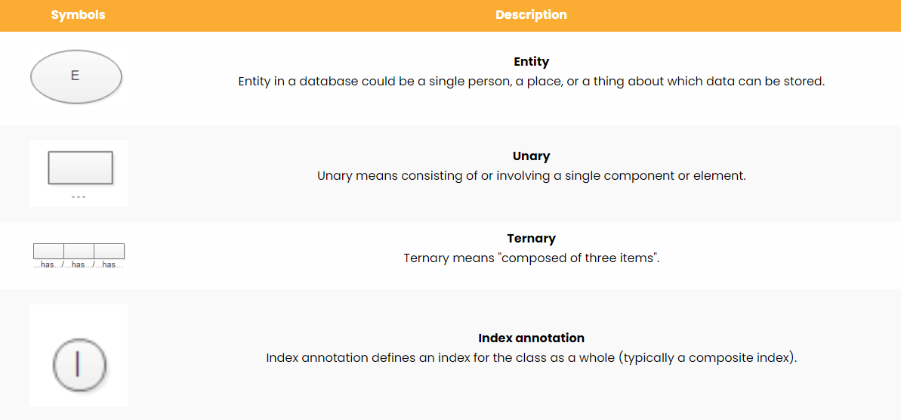

## Ref and Disclaimer

- https://www.edrawsoft.com/er-diagram-symbols.html

## Database Design Process

* ER Diagram is the draft that is similar to when you draw a construction idea of a building a house.
* It is part of the process and file you need to submit to your architecture group to discuss based on your business needs
  which is coming from your stake-holder, a PM or PO.
* Once the ER Diagram is solidly designed, we would create SQL Syntax to create databases, and tables.
* Hence, this is the whole process of Database built. Then you could save hospital data, car dealership data with a simple UI software connecting to your database server and ...etc.
* Of course, to properly design a database system, we would need the theory of normalization rules to help us and guide us. For more information please wait till we talk about normalizations of relational databases.

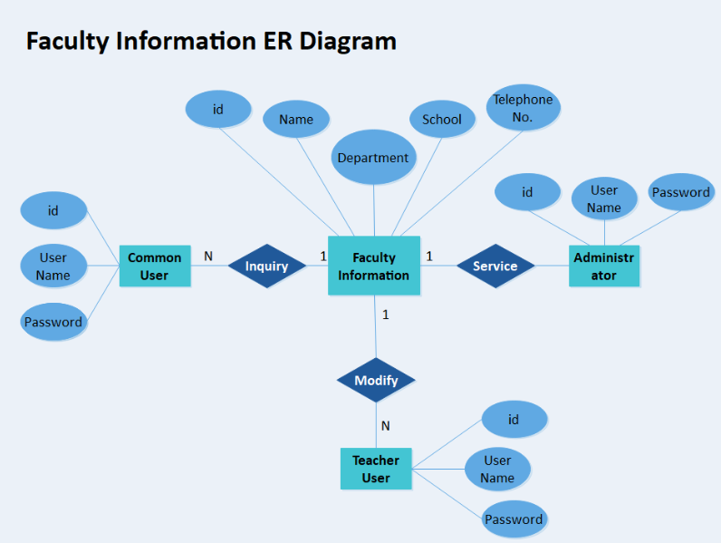

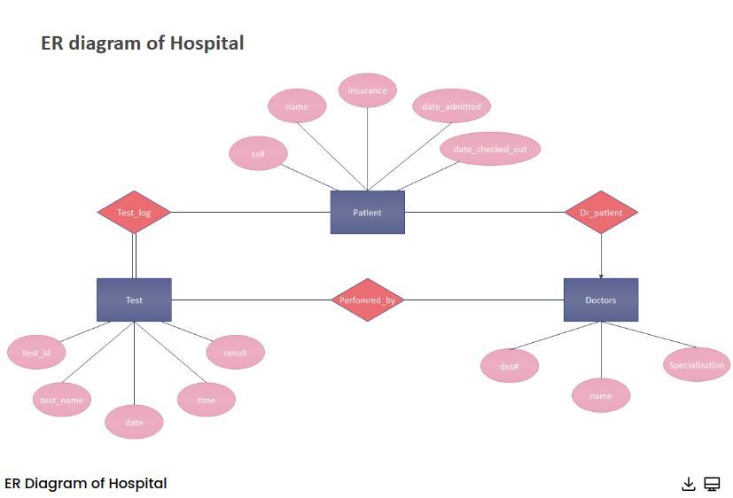

## Software to draw

There are a lot of softwares online, such as,

* free open-souce software
* commercial softwares
    * Microsoft Visio
    * Draw.io
* Software plugins or tools of some IDE like eclipse, Dbeaver, MySQLWorkbench and ..etc.
