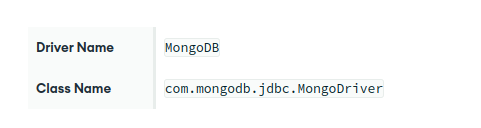

# MongoDB

## Installation of Mongo

## Installation of Dbeaver
Skipped

## Connect to Mongo with DBeaver

**Connect from DBeaver**

This page describes how to connect to your federated database instance with DBeaver.

**Prerequisites**

A federated database instance mapped to one or more data stores.

**Note**

>If some or all of your data comes from an Atlas cluster, you must use MongoDB version 5.0 or greater for that cluster to take advantage of Atlas SQL.

* DBeaver (Community Edition).

* The MongoDB JDBC Driver.

**Procedure**

To connect to your federated database instance from DBeaver:

1. In Atlas, go to to your federated database instance for your project.
If it's not already displayed, select the organization that contains your project from the  Organizations menu in the navigation bar.

If it's not already displayed, select your project from the Projects menu in the navigation bar.

In the sidebar, click Data Federation under the Services heading.

The Data Federation page displays.

2. Click Connect to open the federated database instance connection modal.

3. Select Atlas SQL.

4. Select JDBC Driver.

**Note**
>This tutorial uses the JDBC Driver to connect. See Connect Using the Atlas SQL Interface for alternative connection methods.

5. Copy your connection information.
Atlas Data Federation provides a connection string to connect to your federated database instance. You'll need this in a later step.

6. Connect from DBeaver.

* Launch DBeaver.

* Add a new driver.
>In DBeaver, click Database and select Driver Manager from the dropdown menu.

>Click New to open the Create new driver modal.

>In the Settings tab, enter the following information:

* Driver Name
  MongoDB

* Class Name
    com.mongodb.jdbc.MongoDriver

In the Libraries tab, click Add File and add your JDBC driver `all.jar` file.

* Click Find Class.

* Click OK. The Create new driver modal closes.

* Create a database connection.

  a. In DBeaver, click Database and select New Database Connection from the dropdown menu to open the Connect to a database modal.

  b. From the list of databases, select the MongoDB database driver that you created in the previous step.

**Tip**
>If you don't see MongoDB, select the All category inside the modal.

   Click Next.

  c. In the Main tab, enter the following information:
  
 

  d. In the Driver properties tab, expand User Properties. Add the following key-value properties:

  

* Click Finish.

## Run Atlas SQL Queries

To run Atlas SQL queries in DBeaver:

1. Expand your MongoDB connection.
The DBeaver Database Navigator displays your virtual databases.

2. Open a SQL console.
  a. Right-click the virtual database you want to query.

  b. Select SQL Editor.

  c. Select Open SQL console.

    A new SQL console window that is connected to the virtual database you selected opens.

3. Enter a SQL query in the console.

For example queries, see Query with Atlas SQL Statements.

4. Click Execute SQL Statement to run your SQL query.

If the query is successful, the results are displayed in a table view below your query.

## Ref

- https://www.mongodb.com/docs/manual/tutorial/
- https://www.w3schools.com/mongodb/
- https://www.tutorialspoint.com/mongodb/index.htm