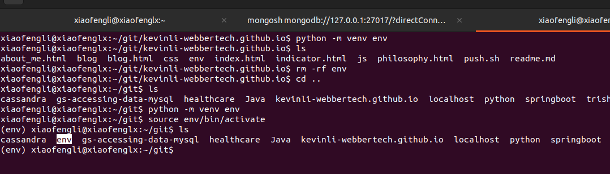
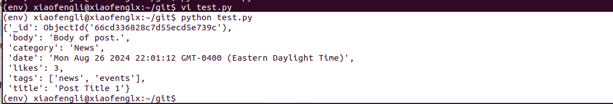
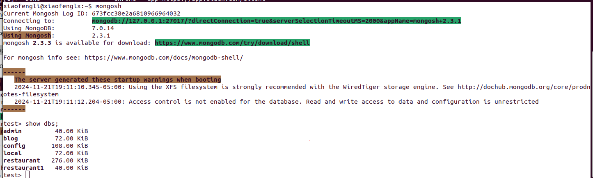
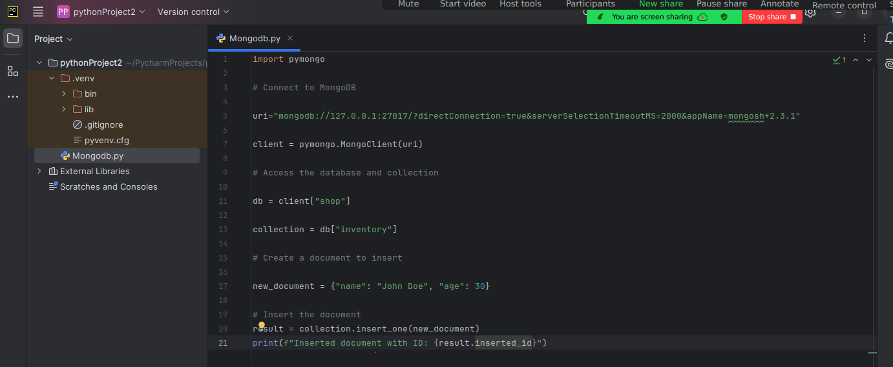
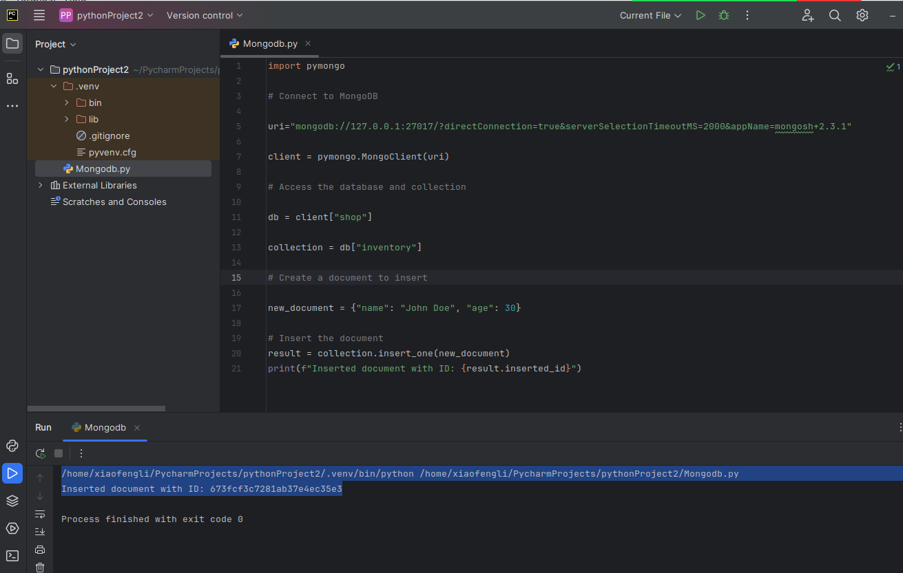
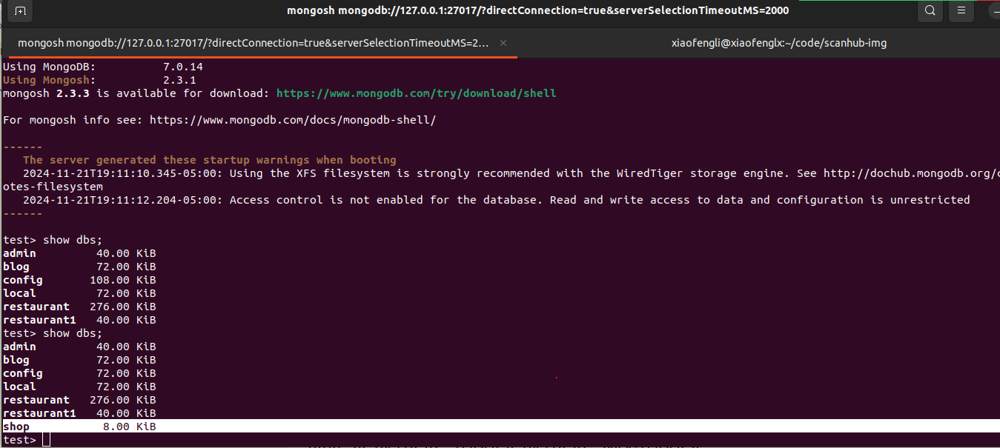
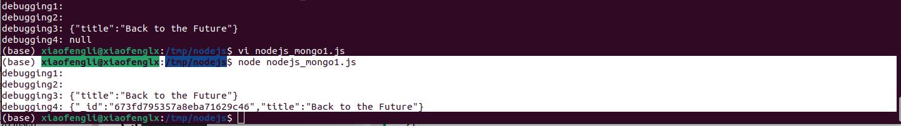

# MongoDB programming with Python

This is a lab that we will write some python code with PyCharm and try to access the data from MongoDB via Python code.
Python code will help us do data analysis easier in advanced financial analysis.

This lab is optional and if you could reproduce it, it is a *bonus*.

## Prerequisites

* Install PyCharm (community version)
* Understand MongoDB document from our earlier class.

MongoDB stores data in JSON-like documents:

***Mongodb document (JSON-style)***

```json
document_1 = {
  "_id" : "BF00001CFOOD",
  "item_name" : "Bread",
  "quantity" : 2,
  "ingredients" : "all-purpose flour"
}
```

* Understand Python dictionary

The following `dict_1` is a dictionary.

```pythons
dict_1 = {
  "item_name" : "blender",
  "max_discount" : "10%",
  "batch_number" : "RR450020FRG",
  "price" : 340
}
```

* Understand how to start MongoDB server and how to connect to it successfully


* Understand that we could either use terminal to run and test python code or we could use PyCharm to do it.
In the following sections we will show you these two methods.

## Method 1: Connecting Python and MongoDB Using Terminals

For the following tutorial, start by creating a virtual environment, and activate it.
If you use IDE such as "Visual Studio Code", or Window|Linux|Mac Terminal, you could do the following,

**Step 1**. It will create a python virtual environment, so the package will be installed in a directory for you and it will avoid collisions with other Python versions.

`python -m venv env`

> `-m` is to specify a python module. Here we specify the module called `venv`. 
> `env` is a folder in your current directly. Once you execute it, please check if you can see this folder.

**Step 2**. Start and activate the virtual environment.

`source env/bin/activate`

After you execute the above two steps, you will see something like below,



**Installation Python Packages**

Now that you are in your virtual environment, you can install PyMongo. In your terminal, type:

`python -m pip install "pymongo[srv]"`

`python -m pip install python-dateutil`

After you execute the above two installation, you will see something similar to this,


### Lab Work

**Creating a MongoDB database in Python**

```python
from pymongo import MongoClient
import pprint

def get_database():

   # Provide the mongodb atlas url to connect python to mongodb using pymongo
   CONNECTION_STRING = "mongodb://127.0.0.1:27017"

   # Create a connection using MongoClient. You can import MongoClient or use pymongo.MongoClient
   client = MongoClient(CONNECTION_STRING)

   # Create the database for our example (we will use the same database throughout the tutorial
   return client['blog']

# This is added so that many files can reuse the function get_database()
if __name__ == "__main__":

   # Get the database
   db= get_database()
   posts=db.posts
   pprint.pprint(posts.find_one())
```

To run it, we can see the following,



## Method2: Use Run Python code with PyCharm

If you use PyCharm, just create a new Python project and it will create the above virtual environment.

Image skipped. Please use PyCharm community version for practice.

## Programming with Python

```python

import pymongo

# Connect to MongoDB

uri="mongodb://127.0.0.1:27017/?directConnection=true&serverSelectionTimeoutMS=2000&appName=mongosh+2.3.1"

client = pymongo.MongoClient(uri) 

# Access the database and collection

db = client["shop"] 

collection = db["inventory"] 

# Create a document to insert

new_document = {"name": "John Doe", "age": 30}


# Insert the document
result = collection.insert_one(new_document) 
print(f"Inserted document with ID: {result.inserted_id}") 
```

Try to get the above string from the `mongosh` connection.



Copy the above code to the `pycharm` editor like the following,



Run the code,



Checking in `mongosh`,



## Programming with NodeJS

```shell
(base) xiaofengli@xiaofenglx:/tmp/nodejs$ nvm install 22
Downloading and installing node v22.11.0...
Downloading https://nodejs.org/dist/v22.11.0/node-v22.11.0-linux-x64.tar.xz...
######################################################################################################################################################## 100.0%
Computing checksum with sha256sum
Checksums matched!
Now using node v22.11.0 (npm v10.9.0)
Creating default alias: default -> 22 (-> v22.11.0)
(base) xiaofengli@xiaofenglx:/tmp/nodejs$ node -v 
v22.11.0
(base) xiaofengli@xiaofenglx:/tmp/nodejs$ nvm -v
0.40.0
(base) xiaofengli@xiaofenglx:/tmp/nodejs$ npm install mongodb

added 12 packages in 4s
npm notice
npm notice New patch version of npm available! 10.9.0 -> 10.9.1
npm notice Changelog: https://github.com/npm/cli/releases/tag/v10.9.1
npm notice To update run: npm install -g npm@10.9.1
npm notice
```

Let us paste the following code into a new file called `mongodb_nodejs.js`,

```nodejs
const { MongoClient } = require("mongodb");
// Replace the uri string with your connection string.
const url = "mongodb://127.0.0.1:27017/?directConnection=true&serverSelectionTimeoutMS=2000&appName=mongosh+2.3.1";
const client = new MongoClient(url);

async function run() {
  try {
    const database = client.db('sample_mflix');
    console.log("debugging1: ");
    const movies = database.collection('movies');
    console.log("debugging2: ");
    // Query for a movie that has the title 'Back to the Future'
    const query = { title: 'Back to the Future' };
    console.log("debugging3: " + JSON.stringify(query));

    await movies.insertOne(query, function(err, res) {
       if (err) throw err;
        console.log("1 document inserted");
       db.close();
    });
    const movie = await movies.findOne(query);
    console.log("debugging4: " + JSON.stringify(movie));
  } finally {
    // Ensures that the client will close when you finish/error
    await client.close();
  }
}
run().catch(console.dir);

```

Run the code,

```shell
(base) xiaofengli@xiaofenglx:/tmp/nodejs$ node nodejs_mongo1.js 
debugging1: 
debugging2: 
debugging3: {"title":"Back to the Future"}
debugging4: {"_id":"673fd795357a8eba71629c46","title":"Back to the Future"}
```

Also in the screenshot like the following,



### Ref

- https://pymongo.readthedocs.io/en/stable/tutorial.html
- https://www.mongodb.com/resources/languages/python
- https://www.mongodb.com/resources/languages/mongodb-with-nodejs
- https://nodejs.org/en/download/package-manager
- https://www.w3schools.com/mongodb/mongodb_nodejs_connect_database.php
- https://www.mongodb.com/docs/drivers/java/sync/v4.3/usage-examples/command/