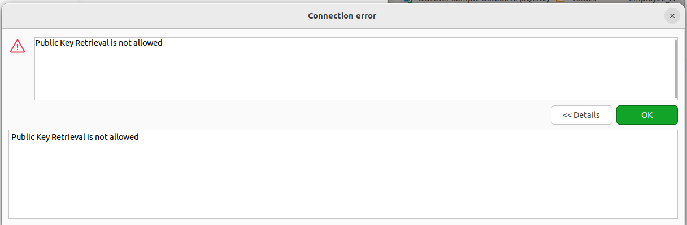
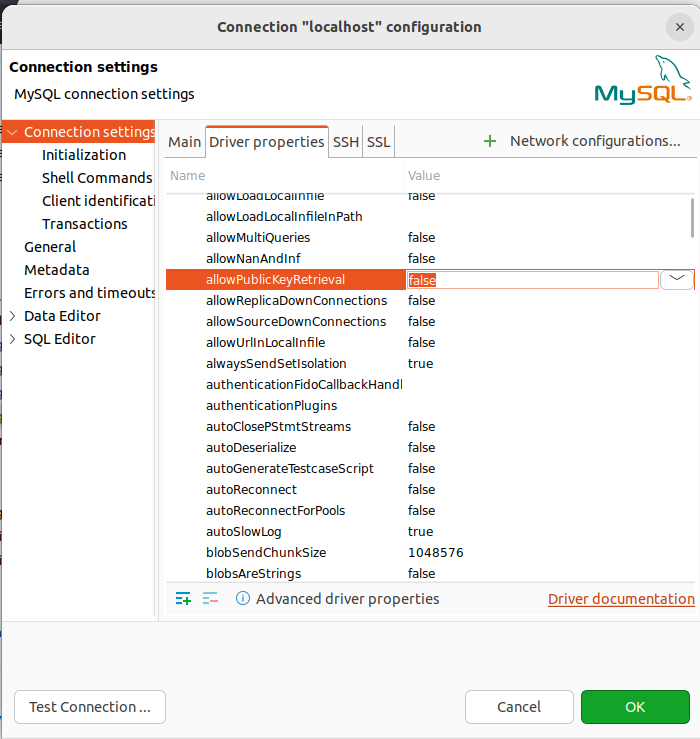
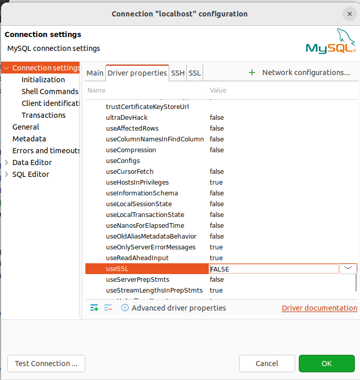

# MySQL Troubleshooting

## Outline

* Troubleshooting

Issue: Public

Solution:

## Reset root password in Ubuntu

***Note:*** If you forget the password for the MySQL root user, you can reset it using the following steps:

1. Stop the MySQL Server

`sudo /etc/init.d/mysql stop`

(In some cases, if /var/run/mysqld doesn't exist, you have to create it at first:

    `sudo mkdir -v /var/run/mysqld && sudo chown mysql /var/run/mysqld`

2. Start the mysqld configuration:

`sudo mysqld --skip-grant-tables &`

3. Login to MySQL as root:

`mysql -u root`

4. Update Root Password: Once connected to MySQL, use the following SQL query to update the root password.

`FLUSH PRIVILEGES;`
`ALTER USER 'root'@'localhost' IDENTIFIED BY 'new_password'; `
`FLUSH PRIVILEGES;`

5. Exit MySQL

`exit;`

7. Stop MySQL Safe Mode: Stop the server started in safe mode by using one of the following command:

`sudo service mysql stop` : For systems using systemd

or

`sudo /etc/init.d/mysql stop`

8. Start MySQL: Start the MySQL server as normal then enter the new password you just reset
