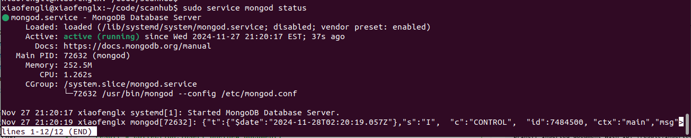

# Python Data Programming - Database Access

## Mongo DB connection from Python

The following code will create a new document into the mongo db.

For instance, we start the mongodb from the following command,

`xiaofengli@xiaofenglx:~/code/scanhub$ sudo service mongod start`



Type `mongosh`, the shell CLI to connect to your mongodb, then you can find the url,

```shell
xiaofengli@xiaofenglx:~/code/scanhub$ mongosh
Current Mongosh Log ID:	6747d3d7841b5c4a7a964032
Connecting to:		mongodb://127.0.0.1:27017/?directConnection=true&serverSelectionTimeoutMS=2000&appName=mongosh+2.3.1
Using MongoDB:		7.0.14
Using Mongosh:		2.3.1
mongosh 2.3.3 is available for download: https://www.mongodb.com/try/download/shell

For mongosh info see: https://www.mongodb.com/docs/mongodb-shell/

------
   The server generated these startup warnings when booting
   2024-11-27T21:20:19.334-05:00: Using the XFS filesystem is strongly recommended with the WiredTiger storage engine. See http://dochub.mongodb.org/core/prodnotes-filesystem
   2024-11-27T21:20:21.087-05:00: Access control is not enabled for the database. Read and write access to data and configuration is unrestricted
------

```

Let us take that `mongodb://127.0.0.1:27017/?directConnection=true&serverSelectionTimeoutMS=2000&appName=mongosh+2.3.1` and put it into our python code in the following,

```python
import pymongo

# Connect to MongoDB

uri="mongodb://127.0.0.1:27017/?directConnection=true&serverSelectionTimeoutMS=2000&appName=mongosh+2.3.1"
client = pymongo.MongoClient(uri)

# Access the database and collection

db = client["shop"]
collection = db["inventory"]

# Create a document to insert
new_document = {"name": "John Doe", "age": 30}

# Insert the document
result = collection.insert_one(new_document)
print(f"Inserted document with ID: {result.inserted_id}")
```

