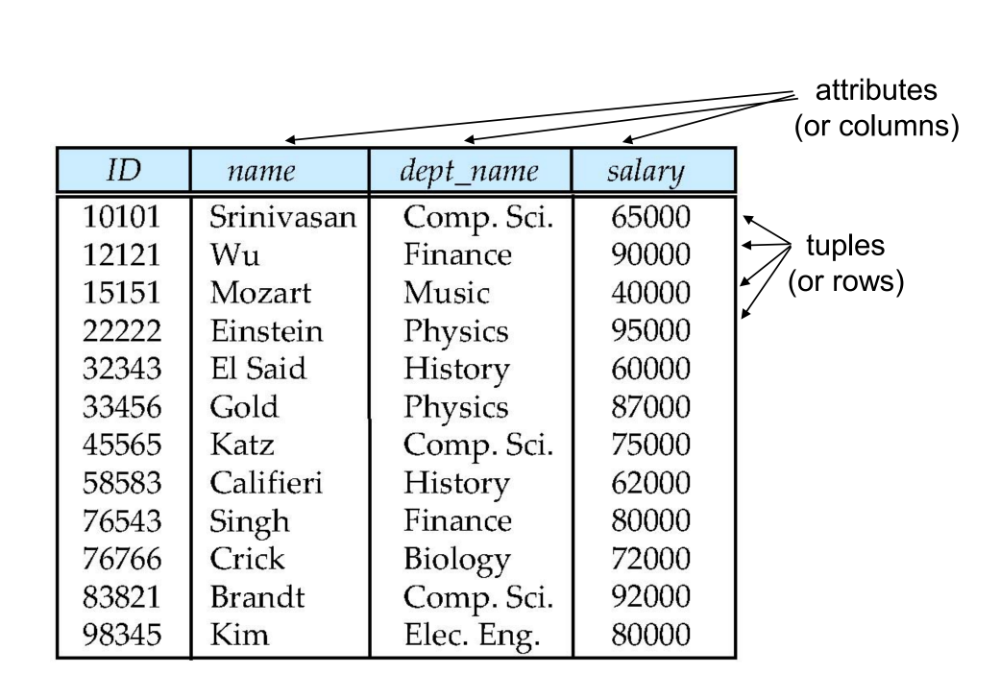
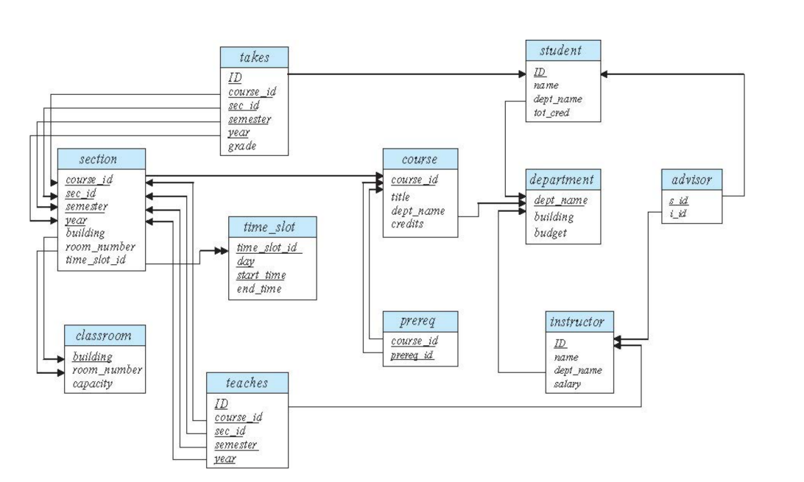
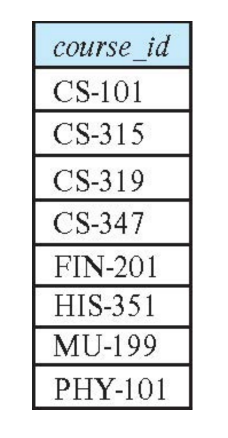
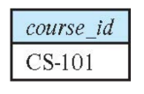
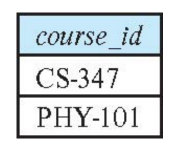

# Intro to Relational Model

## Outline
* Structure of Relational Databases
* Database Schema
* Keys
* Schema Diagrams
* Relational Query Languages
* The Relational Algebra

## Example of an Instructor Model

 

> Order of tuples is irrelevant (tuples may be stored in an arbitrary order)

## Relation Schema and Instance

* A1, A2, …, An are attributes
* R = (A1, A2, …, An ) is a relation schema

Example:
    `instructor  = (ID,  name, dept_name, salary)`

* A relation instance r defined over schema R is denoted  by r (R).
* The current values of a relation are specified by a table
* An element t of relation r is called a  tuple and is represented by a row in a table

## Attributes

* The set of allowed values for each attribute is called the domain of the attribute
* Attribute values are (normally) required to be atomic; that is, indivisible
* The special value `null` is a member of every domain. Indicated that the value is “unknown”
* The null value causes complications in the definition of many operations

## Database Schema

* Database schema -- is the logical structure of the database.
* Database instance -- is a snapshot of the data in the database at a given instant in time.

Example:
  * schema:   instructor (ID, name, dept_name, salary)
  * Instance

## Keys

* Let K , R
* K is a superkey of R if values for K are sufficient to identify a unique tuple of each possible relation r(R)
  * Example:  {ID} and {ID,name} are both superkeys of instructor.
* Superkey K is a candidate key if K is minimal
  * Example:  {ID} is a candidate key for Instructor
* One of the candidate keys is selected to be the primary key.
  Which one?
* Foreign key constraint: Value in one relation must appear in another
  * Referencing relation
  * Referenced relation

    Example: dept_name in instructor  is a foreign key from instructor referencing department

## Schema Diagram for University Database

## Relational Query Languages

* Procedural versus non-procedural, or declarative
* “Pure” languages:
  * Relational algebra
  * Tuple relational calculus
  * Domain relational calculus
* The above 3 pure languages are equivalent in computing power 
* We will concentrate in this chapter on relational algebra
  * Not Turing-machine equivalent
  * Consists of 6 basic operations

## Relational Algebra

* A  procedural language consisting  of a set of operations that take one or two relations as input and produce a new relation as their result.
* Six basic operators
  * select: $\delta$
  * project: $\pi$
  * union: U
  * set difference: –
  * Cartesian product: $\chi$
  * rename: $\rho$

## Select Operation

The  select operation selects tuples that satisfy a given predicate.

Notation:   

$\delta$c(R)

* $\delta$ is called the selection predicate.
* R is the relations.
* ‘c’ is the selection condition which is a boolean
Example: select those tuples of the instructor  relation where the instructor is in the “Physics” department.

**Query**

$\delta$dept_name="Physics"(instructor)
  
**Result**

We allow comparisons using
**=,  >,  <** in the selection predicate.

We can combine several predicates into a larger predicate by using the connectives:

**(and), (or), (not)**

Example: Find the instructors in Physics with a salary greater $90,000, we write:

$\delta$dept_name="Physics" and salary>90,000(instructor)

* The select predicate may  include comparisons between two attributes.
  
  Example, find all departments whose name is the same as their building name:
  $\delta$dept_name="building"(department)

Nested queries could be like,

$\delta$Department="Analytics"($\delta$Location = 'NewYork'(Manager))

## Project Operation

Notation:

   $\pi$A(R) or $\pi$A1,A2,...Ak(R) 

* A unary operation that returns its argument relation, with certain attributes left out.
* The result is defined as the relation of k columns obtained by erasing the columns that are not listed
* Duplicate rows removed from result, since relations are sets

### Project Operation Example

<b>Query</b>

$\pi$ID, name, salary(instructor)

## Composition of Relational Operations

* The result of a relational-algebra operation is relation  and therefore of relational-algebra operations can be composed together into a relational-algebra expression.

* Consider  the query -- Find the names of all instructors in the Physics department.

$\pi$name($\delta$dept_name =“Physics”(instructor))

* Instead of giving the name of a relation as the argument of the projection operation, we give an expression that evaluates to a relation.

## Cartesian-Product Operation
* The Cartesian-product operation (denoted by X)  allows us to combine information from any two relations.  

  Example: the Cartesian product of the relations instructor and teaches is written  as:
     `instructor  X  teaches`

* We construct a tuple of the result out of each possible pair of tuples: one from the instructor relation and one from the teaches relation
* Since the instructor ID appears in both relations we distinguish between these attribute by attaching to the attribute the name of the relation from which the attribute originally came.
instructor.ID
teaches.ID

**The  instructor  $\chi$  teaches  table**

## Join Operation

The Cartesian-Product

`instructor  X  teaches`

associates every tuple of  instructor with every tuple of teaches. That are all the combinations
of cross-product.

* Most of the resulting rows have information about instructors who did NOT teach a particular course.

* To get only those tuples of  “instructor  X  teaches “ that pertain to instructors and the courses that they taught, 
  we write a condition to join them:

   `instructor.id =  teaches.id  (instructor  x teaches ))`

We get only those tuples of “instructor  X  teaches” that pertain to instructors and the courses that they taught.

**Example**

Consider two relations STUDENT(SNO, FNAME, LNAME) and 
DETAIL(ROLLNO, AGE) below:

|SNO	|FNAME|	LNAME|
|--|--|--|
|1|	Albert|	Singh|
|2|	Nora|	Fatehi|

|ROLLNO|	AGE|
|--|--|
|5|	18|
|9|	21|

On applying CROSS PRODUCT on STUDENT and DETAIL:

|SNO|	FNAME|	LNAME|	ROLLNO|	AGE|
|--|--|--|--|--|
|1|	Albert|	Singh|	5|	18|
|1|	Albert|	Singh|	9|	21|
|2|	Nora|	Fatehi|	5|	18|
|2|	Nora|	Fatehi|	9|	21|

SNO	FNAME	LNAME	ROLLNO	AGE
1	Albert	Singh	5	18
1	Albert	Singh	9	21
2	Nora	Fatehi	5	18
2	Nora	Fatehi	9	21

We can observe that the number of tuples in STUDENT relation is 2, and the number of tuples in DETAIL is 2. So the number of tuples in the resulting relation on performing CROSS PRODUCT is 2*2 = 4.

Important points on CARTESIAN PRODUCT(CROSS PRODUCT) Operation:

1. The cardinality (number of tuples) of resulting relation from a Cross Product operation is equal to the number of attributes(say m) in the first relation multiplied by the number of attributes in the second relation(say n).
   
`Cardinality = m*n` 

2. The Cross Product of two relation A(R1, R2, R3, …, Rp) with degree p, and B(S1, S2, S3, …, Sn) with degree n, is a relation C(R1, R2, R3, …, Rp, S1, S2, S3, …, Sn) with degree p + n attributes.

`Degree = p+n`

3. In SQL, CARTESIAN PRODUCT(CROSS PRODUCT) can be applied using CROSS JOIN.

4. In general, we don’t use cartesian Product unnecessarily, which means without proper meaning we don’t use Cartesian Product. Generally, we use Cartesian Product followed by a Selection operation and comparison on the operators as shown below :

$\delta$A=D(A ✕ B)

The above query gives meaningful results.

And this combination of Select and Cross Product operation is so popular that JOIN operation is inspired by this combination.

CROSS PRODUCT is a binary set operation means, at a time we can apply the operation on two relations.

Coming back with the university data,

**The  instructor  X  teaches  table (cross product)**

## Join Operation

  $\delta$instructor.id =  teaches.id (instructor  x teaches)) 
  
The data are much smaller,

The join operation allows us to combine  a select operation and a   Cartesian-Product  operation into a single operation.
Consider relations r (R) and s (S)
Let  “theta” be a predicate on attributes in the schema R “union” S. The join operation  r  s is defined as follows:

Thus

$\delta$instructor.id = teaches.id (instructor x teaches ) 

is equivalent to,

`instructor Instructor.id = teaches.id teaches.`

## Union Operation

The union operation allows us to combine two relations.

Notation:  `r U s`    

For r  U s to be valid.
1.   r, s must have the same arity (same number of attributes)
2.   The attribute domains must be compatible (example: 2nd
3. column of r deals with the same type of values as does the 2nd column of s)

Example: to find all courses taught in the Fall 2017 semester, or in the Spring 2018 semester, or in both
 $\pi$course_id ($\delta$ semester=“Fall”  Λ year=2017 (section))  U
$\pi$course_id($\delta$ semester=“Spring”  Λ year=2018 (section))

**Result**

## Set-Intersection Operation

The  set-intersection  operation  allows us to find tuples that are in both the input relations.

Notation: r $\cap$ s

Assume:
r, s have the same arity
attributes of r and s are compatible

Example: Find the set of all courses taught in both the Fall 2017 and the Spring 2018 semesters.
$\pi$course_id ($\delta$ semester=“Fall”  Λ year=2017 (section))  $\cap$
$\pi$course_id($\delta$ semester=“Spring”  Λ year=2018 (section))

**Result**

 

## Set Difference Operation

The set-difference operation allows us to find tuples that are in one relation but are not in another.

Notation 

`r – s`

* Set differences must be taken between compatible relations.
* r and s must have the same arity
* attribute domains of r and s must be compatible

Example: to find all courses taught in the Fall 2017 semester, but not in the Spring 2018 semester

$\pi$course_id ($\delta$ semester=“Fall”  Λ year=2017 (section))  -
$\pi$course_id($\delta$ semester=“Spring”  Λ year=2018 (section))

**result**

## The Rename Operation 

Notation:

ρ X (R)

where the symbol ‘ρ’ is used to denote the RENAME operator and ,
R is the result of the sequence of operation or expression which is saved with the name X.

The RENAME operation is used to rename the output of a relation.

Sometimes it is simple and suitable to break a complicated sequence of operations and rename it as a relation with different names. Reasons to rename a relation can be many, like –

* We may want to save the result of a relational algebra expression as a relation so that we can use it later.
* We may want to join a relation with itself, in that case, it becomes too confusing to specify which one of the tables we are talking about, in that case, we rename one of the tables and perform join operations on them

Example-1:  

Query to rename the relation Student as Male Student and the attributes of Student – RollNo, SName as (Sno, Name).

|Sno|	Name|
|2600|	Ronny|
|2655|	Raja|

ρ MaleStudent(Sno, Name) πRollNo, SName(σCondition(Student))

Example-2:  

Query to rename the attributes Name, Age of table Department to A,B.

`ρ (A, B) (Department)`

Example-3: 

Query to rename the table name Project to Pro and its attributes to P, Q, R.

`ρ Pro(P, Q, R) (Project)`

Example-4: 

Query to rename the first attribute of the table Student with attributes A, B, C to P.

`ρ (P, B, C) (Student)`
