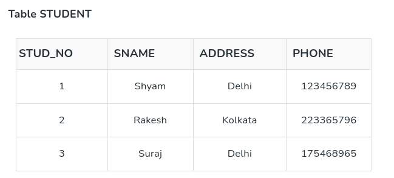
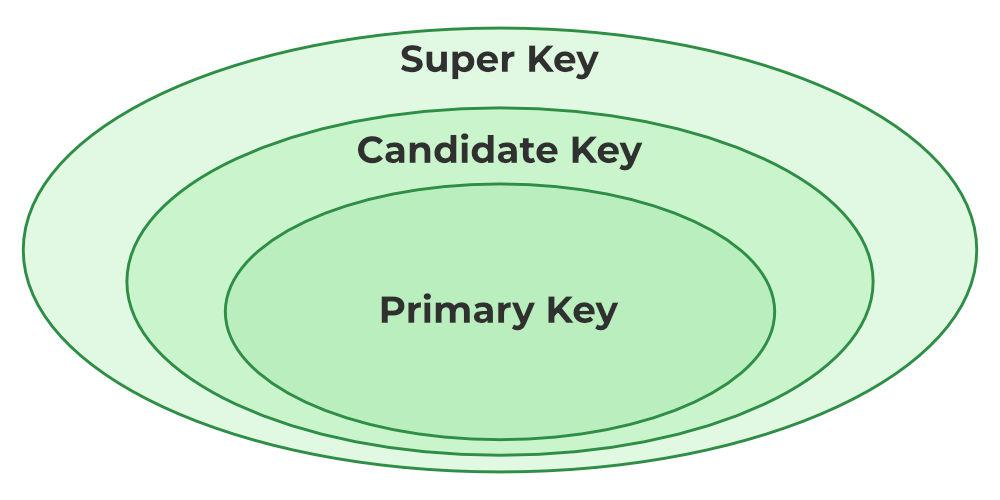
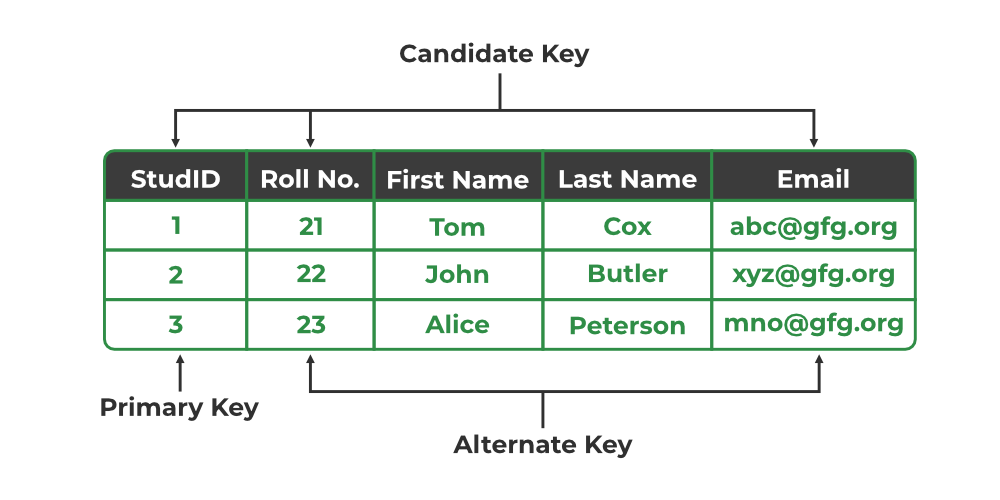
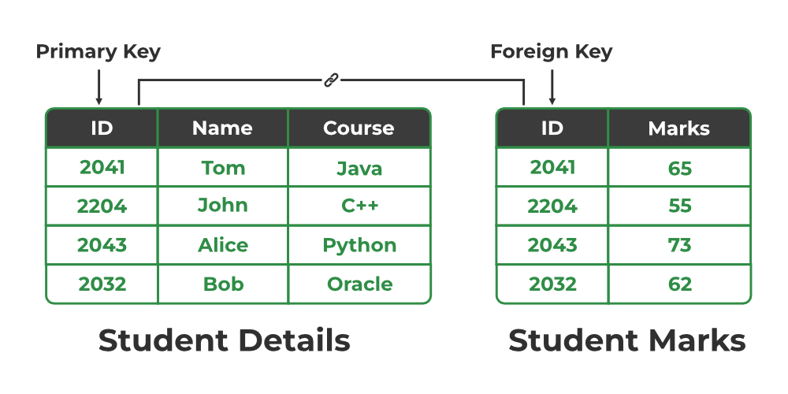
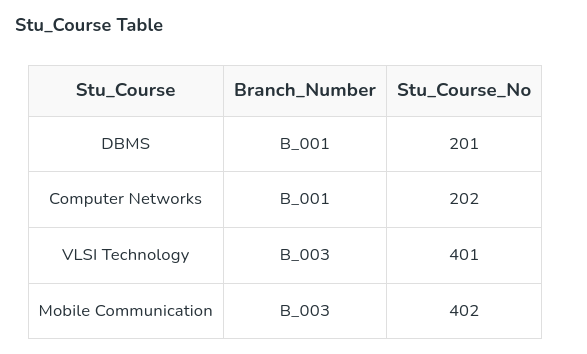
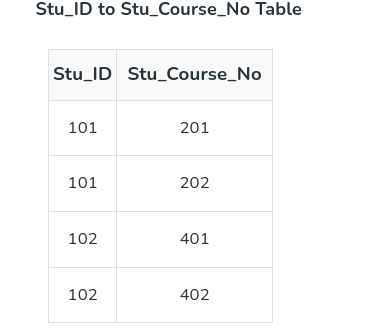

# Relational Database Normalization 

## Outline

* Features of Good Relational Design
* Decomposition
* Functional Dependencies
* Keys
* Normalization

## Features of Good Relational Design 

**Duplication of data (Bad Database Design)**

Suppose we combine instructor and department into in_dep, which represents the natural join on the relations instructor and department

 

* There is repetition of information, for example note the "building" and "dept_name" columns in the above big table.
* Need to use null values (if we add a new department with no instructors). `null` is like holes in this big flat table.

while in the other case when we combine two tables into one, there is no repetition.

Not all combined schemas result in repetition of information,

* Consider combining relations
  * sec_class(sec_id, building, room_number) and
  * section(course_id, sec_id, semester, year)

   into one relation

  * section(course_id, sec_id, semester, year, building, room_number)
* No repetition in this case

## Decomposition

The only way to avoid the repetition-of-information problem in the in_dep schema is to decompose it into two schemas – instructor and department schemas.
Not all decompositions are good.  Suppose we decompose,

`employee(ID, name, street, city, salary)`

 into

```sql
employee1 (ID, name)
employee2 (name, street, city, salary)
```

The problem arises when we have two employees with the same name.

The next slide shows how we lose information 

* -- we cannot reconstruct the original employee relation 
* -- and so, this is a **lossy decomposition**.

### A Lossy Decomposition

  

### Lossless Decomposition

* Let R be a relation schema and let R1 and R2 form a decomposition of R . That is R = R1  U R2
* We say that the decomposition is a lossless decomposition.
if there is no loss of information by replacing R with the two relation schemas R1 U R2. 

**Example of Lossless Decomposition** 

Decomposition of R = (A, B, C)
R1 = (A, B)	
R2 = (B, C)

Here the $\pi$ and $\Pi$ is the same symbol of projection.
? is the join|merge symbol.


## Normalization Theory

* Decide whether a particular relation R is in “good” form.
* In the case that a relation R is not in “good” form, decompose it into  set of relations {R1, R2, ..., Rn} such that
  * Each relation is in good form
  * The decomposition is a lossless decomposition
* Our theory is based on:
  * Functional dependencies
  * Multivalued dependencies
  
## Functional dependencies

In a relational database management, functional dependency is a concept that specifies the relationship between two sets of attributes where one attribute determines the value of another attribute. It is denoted as **X** → **Y**, where the attribute set on the left side of the arrow, X is called `Determinant`, and Y is called the `Dependent`.

Functional dependencies are used to mathematically express relations among database entities and are very important to understand advanced concepts in Relational Database System and understanding problems in competitive exams like Gate.

Example:


**From the above table we can conclude some valid functional dependencies:**

* `roll_no → { name, dept_name, dept_building}`, Here, roll_no can determine values of fields name, dept_name and dept_building, hence a valid Functional dependency.
* `roll_no → dept_name`, Since roll_no can determine whole set of {name, dept_name, dept_building}, it can determine its subset dept_name also.
* `dept_name → dept_building`,  Dept_name can identify the dept_building accurately, since departments with different dept_name will also have a different dept_building.
* More valid functional dependencies: `roll_no → name`, `{roll_no, name} → {dept_name, dept_building}`, etc.

**Here are some invalid functional dependencies:**

* `name → dept_name`   Students with the same name can have different dept_name, hence this is not a valid functional dependency.
* `dept_building → dept_name`    There can be multiple departments in the same building. Example, in the above table departments ME and EC are in the same building B2, hence dept_building → dept_name is an invalid functional dependency.
* More invalid functional dependencies: 
  `name → roll_no`, `{name, dept_name} → roll_no`, `dept_building → roll_no`, etc.

### Armstrong’s axioms/properties of functional dependencies:

* Reflexivity: If Y is a subset of X, then X→Y holds by reflexivity rule
Example, {roll_no, name} → name is valid.

* Augmentation: If X → Y is a valid dependency, then XZ → YZ is also valid by the augmentation rule.
Example, {roll_no, name} → dept_building is valid, hence {roll_no, name, dept_name} → {dept_building, dept_name} is also valid.

* Transitivity: If X → Y and Y → Z are both valid dependencies, then X→Z is also valid by the Transitivity rule.
Example, roll_no → dept_name & dept_name → dept_building, then roll_no → dept_building is also valid.

### Types of Functional Dependencies in DBMS

* Trivial functional dependency
* Non-Trivial functional dependency
* Multivalued functional dependency
* Transitive functional dependency

1. **Trivial Functional Dependency**

In Trivial Functional Dependency, a dependent is always a subset of the determinant. 
   i.e. If X → Y and Y is the subset of X, then it is called trivial functional dependency.
   
 **Example:**

 

Here, {roll_no, name} → name is a trivial functional dependency, since the dependent name is a subset of determinant set {roll_no, name}. Similarly, roll_no → roll_no is also an example of trivial functional dependency.

2. **Non-trivial Functional Dependency**

In Non-trivial functional dependency, the dependent is strictly not a subset of the determinant. i.e. If X → Y and Y is not a subset of X, then it is called Non-trivial functional dependency.


**Example:**


Here, roll_no → name is a non-trivial functional dependency, since the dependent name is not a subset of determinant roll_no. Similarly, {roll_no, name} → age is also a non-trivial functional dependency, since age is not a subset of {roll_no, name}

3. Multivalued Functional Dependency
      In Multivalued functional dependency, entities of the dependent set are not dependent on each other. i.e. If a → {b, c} and there exists no functional dependency between b and c, then it is called a multivalued functional dependency.

For example,


Here, roll_no → {name, age} is a multivalued functional dependency, since the dependents name & age are not dependent on each other(i.e. name → age or age → name doesn’t exist !)

4. Transitive Functional Dependency

In transitive functional dependency, dependent is indirectly dependent on determinant. i.e. If a → b & b → c, then according to axiom of transitivity, a → c. This is a transitive functional dependency.


Here, enrol_no → dept and dept → building_no. Hence, according to the axiom of transitivity, enrol_no → building_no is a valid functional dependency. This is an indirect functional dependency, hence called Transitive functional dependency.

### Fully Functional Dependency

In full functional dependency an attribute or a set of attributes uniquely determines another attribute or set of attributes. If a relation R has attributes X, Y, Z with the dependencies X->Y and X->Z which states that those dependencies are fully functional.

### Partial Functional Dependency

In partial functional dependency a non key attribute depends on a part of the composite key, rather than the whole key. If a relation R has attributes X, Y, Z where X and Y are the composite key and Z is non key attribute. Then X->Z is a partial functional dependency in RBDMS.

## Keys of Databases

After the above 1NF to BCNF you might be still confused about the keys we are talking about. Hopefully the following would explain it better.

* **Candidate Key**
* **Primary Key**
* **Super Key**
* **Prime attributes**
* **Non-prime attributes**

### Candidate Key
The minimal set of attributes that can uniquely identify a tuple is known as a candidate key. For Example, STUD_NO in STUDENT relation.

* It is a minimal super key.
* It is a super key with no repeated data is called a candidate key.
* The minimal set of attributes that can uniquely identify a record.
* It must contain unique values.
* It can contain NULL values.
* Every table must have at least a single candidate key.
* A table can have multiple candidate keys but only one primary key.
* The value of the Candidate Key is unique and may be null for a tuple.
* There can be more than one candidate key in a relationship.
* The candidate key can be simple (having only one attribute) or composite as well.



`STUD_NO` is the candidate key for relation STUDENT.


`{STUD_NO, COURSE_NO}` is a composite
candidate key for relation STUDENT_COURSE.

### Primary Key

There can be more than one candidate key in relation out of which one can be chosen as the primary key.
For Example, STUD_NO or STUD_PHONE are candidate key for relation STUDENT but STUD_NO can be chosen as the primary key (only one out of many candidate keys).

* It is a unique key.
* It can identify only one tuple (a record) at a time.
* It has no duplicate values, it has unique values.
* It cannot be NULL.
* Primary keys are not necessarily to be a single column; more than one column can also be a primary key for a table.

### Super Key

The set of attributes that can uniquely identify a tuple is known as Super Key. For Example, STUD_NO, (STUD_NO, STUD_NAME), etc. A super key is a group of single or multiple keys that identifies rows in a table. It supports NULL values.

* Adding zero or more attributes to the candidate key generates the super key.
* A candidate key is a super key but vice versa is not true.
* Super Key values may also be NULL.



## Alternate Key

The candidate key other than the primary key is called an alternate key.

* All the keys which are not primary keys are called alternate keys.
* It is a secondary key.
* It contains two or more fields to identify two or more records.
* These values are repeated.

* Eg:- SNAME, and ADDRESS is Alternate keys

* Example:

Consider the table shown above.

`STUD_NO`, as well as `PHONE` both,
are candidate keys for relation STUDENT but
`PHONE` will be an alternate key
(only one out of many candidate keys).



### Foreign Key
If an attribute can only take the values which are present as values of some other attribute, it will be a foreign key to the attribute to which it refers. The relation which is being referenced is called referenced relation and the corresponding attribute is called referenced attribute. The referenced attribute of the referenced relation should be the primary key to it.

* It is a key it acts as a primary key in one table, and it acts as secondary key in another table.
* It combines two or more relations (tables) at a time.
* They act as a cross-reference between the tables.

* For example, DNO is a primary key in the DEPT table and a non-key in EMP

**Example:**

>Refer Table STUDENT shown above.
STUD_NO in STUDENT_COURSE is a
foreign key to STUD_NO in STUDENT relation.


It may be worth noting that, unlike the Primary Key of any given relation, Foreign Key can be NULL as well as may contain duplicate tuples i.e. it need not follow uniqueness constraint. For Example, STUD_NO in the STUDENT_COURSE relation is not unique. It has been repeated for the first and third tuples. However, the STUD_NO in STUDENT relation is a primary key and it needs to be always unique, and it cannot be null.



### Composite Key

Sometimes, a table might not have a single column/attribute that uniquely identifies all the records of a table. To uniquely identify rows of a table, a combination of two or more columns/attributes can be used.  It still can give duplicate values in rare cases. So, we need to find the optimal set of attributes that can uniquely identify rows in a table.

* It acts as a primary key if there is no primary key in a table
* Two or more attributes are used together to make a composite key.
* Different combinations of attributes may give different accuracy in terms of identifying the rows uniquely.

**Example:**

>FULLNAME + DOB can be combined
together to access the details of a student.


ref: [https://www.geeksforgeeks.org/types-of-keys-in-relational-model-candidate-super-primary-alternate-and-foreign/]

## Normalizations

Normalization is the process of minimizing redundancy from a relation or set of relations. Redundancy in relation may cause insertion, deletion and update anomalies. So, it helps to minimize the redundancy in relations. Normal forms are used to eliminate or reduce redundancy in database tables.

If a table has data redundancy and is not properly normalized, then it will be difficult to handle and update the database, without facing data loss. It will also eat up extra memory space and Insertion, Update and Deletion Anomalies are very frequent if database is not normalized.

There are various level of normalization. These are some of them:
1. First Normal Form (1NF)
2. Second Normal Form (2NF)
3. Third Normal Form (3NF)
4. Boyce-Codd Normal Form (BCNF)
5. Fourth Normal Form (4NF) - skipped
6. Fifth Normal Form (5NF) - skipped

### First Normal Form (1NF)

If a relation contains a composite or multivalued attribute, it violates the first normal form, or the relation is in first normal form if it does not contain any composite or multivalued attribute.

A table is in 1NF if:
1. There are only Single Valued Attributes.
2. Attribute Domain does not change.
3. There is a unique name for every Attribute/Column.
4. The order in which data is stored does not matter.


In the above table, Course is a multivalued attribute so it is not 1NF.

Below table is in 1NF as there is no multivalued attribute:


First Normal Form (1NF) does not eliminate redundancy, but rather, it’s that it eliminates repeating groups. 
Instead of having multiple columns of the same kind of data in a record, (0NF or Unnormalized form) you remove the repeated information into a separate relation and represent them as rows. 
This is what constitutes 1NF.

### Second Normal Form (2NF)

A relation that is in First Normal Form and every non-primary-key attribute is fully functionally dependent on the primary key, then the relation is in Second Normal Form (2NF).

**partial dependency**

If the proper subset of candidate key determines non-prime attribute, it is called partial dependency.

The normalization of 1NF relations to 2NF involves the removal of partial dependencies. If a partial dependency exists, we remove the partially dependent attribute(s) from the relation by placing them in a new relation along with a copy of their determinant.


The above table should be partitioned into the following two tables,


The above table should be partitioned into the following two tables. 2NF tries to reduce the redundant data getting stored in memory. For instance, if there are 100 students taking C1 course, we dont need to store its Fee as 1000 for all the 100 records, instead once we can store it in the second table as the course fee for C1 is 1000.

Although Second Normal Form (2NF) relations have less redundancy than those in 1NF, they may still suffer from update anomalies. If we update only one tuple and not the other, the database would be in an inconsistent state. This update anomaly is caused by a transitive dependency. We need to remove such dependencies by progressing to Third Normal Form (3NF).

### Third Normal Form (3NF)

A relation is in third normal form, if there is no transitive dependency for non-prime attributes as well as it is in second normal form. 
A relation that is in First and Second Normal Form and in which no non-primary-key attribute is transitively dependent on the primary key, then it is in Third Normal Form (3NF).

A relation is in 3NF if at least one of the following condition holds in every non-trivial function dependency X –> Y:
1. X is a super key.
2. Y is a prime attribute (each element of Y is part of some candidate key).

**Transitive dependency**

FD: stands for functional dependencies.

If A->B and B->C are two FDs then A->C is called transitive dependency.

** Example 1**

`FD set:`

{STUD_NO -> STUD_NAME, STUD_NO -> STUD_STATE, STUD_STATE -> STUD_COUNTRY, STUD_NO -> STUD_AGE}

`Candidate Key:`

{STUD_NO}

For this relation, STUD_NO -> STUD_STATE and STUD_STATE -> STUD_COUNTRY are true. So STUD_COUNTRY is transitively dependent on STUD_NO. 
It violates the third normal form. To convert it in third normal form,
we will decompose the relation

`STUDENT (STUD_NO, STUD_NAME, STUD_PHONE, STUD_STATE, STUD_COUNTRY_STUD_AGE)` as:

`STUDENT (STUD_NO, STUD_NAME, STUD_PHONE, STUD_STATE, STUD_AGE)`

and 

`STATE_COUNTRY (STATE, COUNTRY)`

**Note –**
Third Normal Form (3NF) is considered adequate for normal relational database design because most of the 3NF tables are free of insertion, update, and deletion anomalies. Moreover, 3NF always ensures functional dependency preserving and lossless.

## Boyce-Codd Normal Form (BCNF)

**Boyce-Codd Normal Form (Codd, 1974)**

Although, 3NF is an adequate normal form for relational databases, still, this (3NF) normal form may not remove 100% redundancy because of X−>Y functional dependency if X is not a candidate key of the given relation. This can be solved by Boyce-Codd Normal Form (BCNF).

Rules for BCNF,

* Rule 1: The table should be in the 3rd Normal Form.
* Rule 2: X should be a superkey for every functional dependency (FD) X−>Y in a given relation.

Note: To test whether a relation is in BCNF, we identify all the determinants and make sure that they are candidate keys.

* The 1NF has the least restrictive constraint – it only requires a relation R to have atomic values in each tuple.
* The 2NF has a slightly more restrictive constraint.
* The 3NF has a more restrictive constraint than the first two normal forms but is less restrictive than the BCNF. In this manner, the restriction increases as we traverse down the hierarchy.

**Example**


Functional Dependency of the above as mentioned should be the following relations:

```
Stu_ID −> Stu_Branch
{Branch_Number, Stu_Course_No} −> Stu_Course 
```

It is not BCNF, reasons,

* the {Branch_Number, Stu_Course_No} are super key to define Stu_Course
* Stu_ID should decide Stu_Branch, so Stu_ID should be a super key

But the above flat table does not indicate the X -> Y, X is the super key.

However, the following partitions of the above table into the following will be BCNF.


Candidate Key for this table: Stu_ID.



Candidate Key for this table: Stu_Course.



Candidate Key for this table: {Stu_ID, Stu_Course_No}.

## Quick Cheatsheet of Norm Rules

| Rule Name | What problem it solves              |
|-----------|-------------------------------------|
| 1NF       | Single value, no multiple values    |
| 2NF       | No transitive dependencies          |
| 3NF       | No partial dependencies             |
| BCNF      | same as 3NF, x->y, x is a super key |
