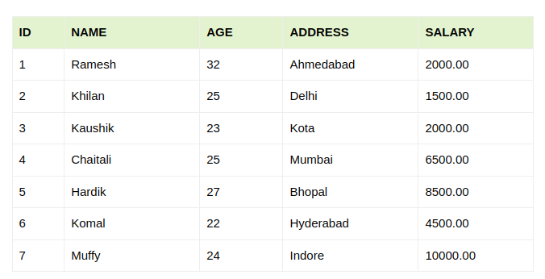
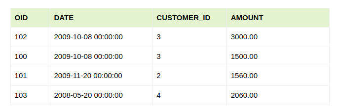
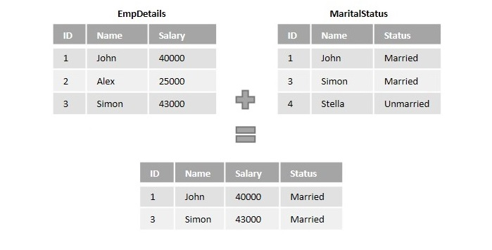
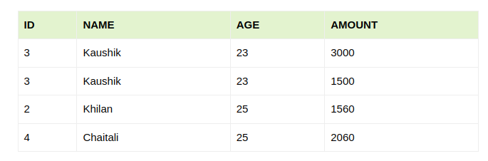
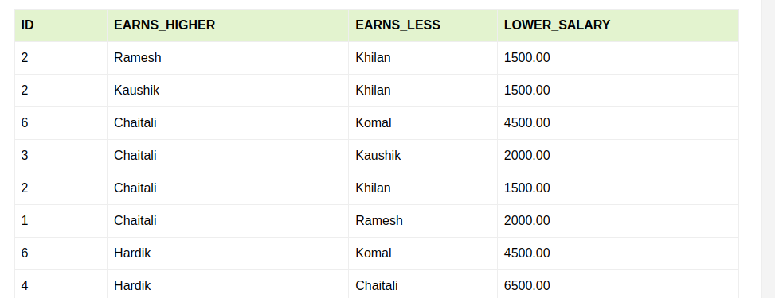
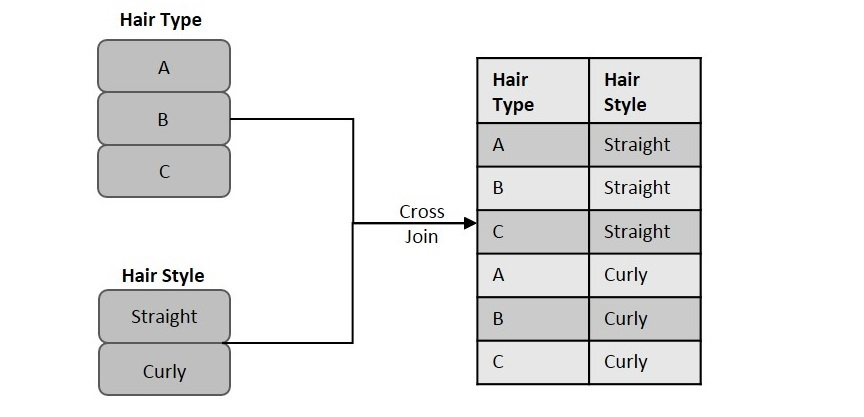

# SQL Programming - Select and Joins

## Outline

**Part I**
* `Insert`, `Select`, `Update`, `Delete` records (**CURD operations** )
* Where clause and operators (part of `select`)

**Part II**
* SQL Join and Join clause
  * Inner Join
     * Self Join
     * Cross Join
  * Outer Join
    * Left Join
    * Right Join
    * Full Join
    
* Complex queries

**Part III**
    
* Glossary and takeaway

# Part I

## The MySQL INSERT INTO Statement

The `INSERT INTO` statement is used to insert new records in a table.

### INSERT INTO Syntax

It is possible to write the `INSERT INTO` statement in two ways:

- Specify both the column names and the values to be inserted:

```
INSERT INTO table_name (column1, column2, column3, ...)
VALUES (value1, value2, value3, ...);
```

- If you are adding values for all the columns of the table, you do not need to specify the column names in the SQL query. However, make sure the order of the values is in the same order as the columns in the table. Here, the `INSERT INTO` syntax would be as follows:

```
INSERT INTO table_name
VALUES (value1, value2, value3, ...);
```

### Demo Database

Below is a selection from the "Customers" table in the Northwind sample database:

| CustomerID | CustomerName                        | ContactName         | Address                              | City           | PostalCode | Country    |
|------------|-------------------------------------|---------------------|--------------------------------------|----------------|------------|------------|
| 89         | White Clover Markets                | Karl Jablonski      | 305 - 14th Ave. S. Suite 3B          | Seattle        | 98128      | USA        |
| 90         | Wilman Kala                         | Matti Karttunen     | Keskuskatu 45                        | Helsinki       | 21240      | Finland    |
| 91         | Wolski                              | Zbyszek             | ul. Filtrowa 68                      | Walla          | 01-012     | Poland     |


### INSERT INTO Example

The following SQL statement inserts a new record in the "Customers" table:

***Example***

```
INSERT INTO Customers (CustomerName, ContactName, Address, City, PostalCode, Country)
VALUES ('Cardinal', 'Tom B. Erichsen', 'Skagen 21', 'Stavanger', '4006', 'Norway');
```

The selection from the "Customers" table will now look like this:

| CustomerID | CustomerName         | ContactName     | Address                     | City      | PostalCode | Country |
|------------|----------------------|-----------------|-----------------------------|-----------|------------|---------|
| 89         | White Clover Markets | Karl Jablonski  | 305 - 14th Ave. S. Suite 3B | Seattle   | 98128      | USA     |
| 90         | Wilman Kala          | Matti Karttunen | Keskuskatu 45               | Helsinki  | 21240      | Finland |
| 91         | Wolski               | Zbyszek         | ul. Filtrowa 68             | Walla     | 01-012     | Poland  |
| 92         | Cardinal             | Tom B. Erichsen | Skagen 21                   | Stavanger | 4006       | Norway  |


***Did you notice that we did not insert any number into the CustomerID field?***
The CustomerID column is an auto-increment field and will be generated automatically when a new record is inserted into the table.

### Insert Data Only in Specified Columns

It is also possible to only insert data in specific columns.

The following SQL statement will insert a new record, but only insert data in the "CustomerName", "City", and "Country" columns (CustomerID will be updated automatically):

***Example***

```
INSERT INTO Customers (CustomerName, City, Country)
VALUES ('Cardinal', 'Stavanger', 'Norway');
```

The selection from the "Customers" table will now look like this:

| CustomerID | CustomerName         | ContactName     | Address                     | City      | PostalCode | Country |
|------------|----------------------|-----------------|-----------------------------|-----------|------------|---------|
| 89         | White Clover Markets | Karl Jablonski  | 305 - 14th Ave. S. Suite 3B | Seattle   | 98128      | USA     |
| 90         | Wilman Kala          | Matti Karttunen | Keskuskatu 45               | Helsinki  | 21240      | Finland |
| 91         | Wolski               | Zbyszek         | ul. Filtrowa 68             | Walla     | 01-012     | Poland  |
| 92         | Cardinal             | null            | null                        | Stavanger | null       | Norway  |

## MySQL NULL Values

A field with a NULL value is a field with no value.

If a field in a table is optional, it is possible to insert a new record or update a record without adding a value to this field. Then, the field will be saved with a NULL value.

***Note:*** A NULL value is different from a zero value or a field that contains spaces. A field with a NULL value is one that has been left blank during record creation!

### How to Test for NULL Values?
It is not possible to test for NULL values with comparison operators, such as =, <, or <>.

We will have to use the IS `NULL` and IS `NOT NULL` operators instead.

### IS NULL Syntax

```
SELECT column_names
FROM table_name
WHERE column_name IS NULL;
```

### IS NOT NULL Syntax

```
SELECT column_names
FROM table_name
WHERE column_name IS NOT NULL;
```

### Demo Database

Below is a selection from the "Customers" table in the Northwind sample database:

| CustomerID | CustomerName                        | ContactName        | Address                       | City         | PostalCode | Country  |
|------------|-------------------------------------|--------------------|-------------------------------|--------------|------------|----------|
| 1          | Alfreds Futterkiste                 | Maria Anders       | Obere Str. 57                 | Berlin       | 12209      | Germany  |
| 2          | Ana Trujillo Emparedados y helados  | Ana Trujillo       | Avda. de la Constitución 2222 | México D.F.  | 05021      | Mexico   |
| 3          | Antonio Moreno Taquería             | Antonio Moreno     | Mataderos 2312                | México D.F.  | 05023      | Mexico   |
| 4          | Around the Horn                     | Thomas Hardy       | 120 Hanover Sq.               | London       | WA1 1DP    | UK       |
| 5          | Berglunds snabbköp                  | Christina Berglund | Berguvsvägen 8                | Luleå        | S-958 22   | Sweden   |


## MySQL SELECT STATEMENT

The `SELECT` statement is used to select data from a database.

The data returned is stored in a result table, called the result-set.

### SELECT Syntax

```
SELECT column1, column2, ...
FROM table_name;
```

Here, column1, column2, ... are the field names of the table you want to select data from. If you want to select all the fields available in the table, use the following syntax:

`SELECT * FROM table_name;`


### Demo Database
In this tutorial we will use the well-known Northwind sample database.

Below is a selection from the "Customers" table in the Northwind sample database:

| CustomerID | CustomerName                       | ContactName        | Address                       | City         | PostalCode | Country  |
|------------|------------------------------------|--------------------|-------------------------------|--------------|------------|----------|
| 1          | Alfreds Futterkiste                | Maria Anders       | Obere Str. 57                 | Berlin       | 12209      | Germany  |
| 2          | Ana Trujillo Emparedados y helados | Ana Trujillo       | Avda. de la Constitución 2222 | México D.F.  | 05021      | Mexico   |
| 3          | Antonio Moreno Taquería            | Antonio Moreno     | Mataderos 2312                | México D.F.  | 05023      | Mexico   |
| 4          | Around the Horn                    | Thomas Hardy       | 120 Hanover Sq.               | London       | WA1 1DP    | UK       |
| 5          | Berglunds snabbköp                 | Christina Berglund | Berguvsvägen 8                | Luleå        | S-958 22   | Sweden   |

### SELECT Columns Example

The following SQL statement selects the "CustomerName", "City", and "Country" columns from the "Customers" table:

***Example***
`SELECT CustomerName, City, Country FROM Customers;`


### SELECT * Example

The following SQL statement selects ALL the columns from the "Customers" table:

***Example***

```SELECT * FROM Customers;```

# The MySQL SELECT DISTINCT Statement

The `SELECT DISTINCT` statement is used to return only distinct (different) values.

Inside a table, a column often contains many duplicate values; and sometimes you only want to list the different (distinct) values.

### SELECT DISTINCT Syntax

```
SELECT DISTINCT column1, column2, ...
FROM table_name;
```

### SELECT Example Without DISTINCT
The following SQL statement selects all (including the duplicates) values from the "Country" column in the "Customers" table:

***Example***

`SELECT Country FROM Customers;`

Now, let us use the `SELECT DISTINCT` statement and see the result.

### SELECT DISTINCT Examples

The following SQL statement selects only the DISTINCT values from the "Country" column in the "Customers" table:

***Example***

`SELECT DISTINCT Country FROM Customers;`

The following SQL statement counts and returns the number of different (distinct) countries in the "Customers" table:

***Example***

`SELECT COUNT(DISTINCT Country) FROM Customers;`


## The MySQL WHERE Clause

The `WHERE` clause is used to filter records.

It is used to extract only those records that fulfill a specified condition.

### WHERE Syntax

```
SELECT column1, column2, ...
FROM table_name
WHERE condition;
```

***Note:*** The `WHERE` clause is not only used in `SELECT` statements, it is also used in `UPDATE`, `DELETE`, etc.!

### Demo Database
Below is a selection from the "Customers" table in the Northwind sample database:

| CustomerID | CustomerName                       | ContactName        | Address                       | City         | PostalCode | Country  |
|------------|------------------------------------|--------------------|-------------------------------|--------------|------------|----------|
| 1          | Alfreds Futterkiste                | Maria Anders       | Obere Str. 57                 | Berlin       | 12209      | Germany  |
| 2          | Ana Trujillo Emparedados y helados | Ana Trujillo       | Avda. de la Constitución 2222 | México D.F.  | 05021      | Mexico   |
| 3          | Antonio Moreno Taquería            | Antonio Moreno     | Mataderos 2312                | México D.F.  | 05023      | Mexico   |
| 4          | Around the Horn                    | Thomas Hardy       | 120 Hanover Sq.               | London       | WA1 1DP    | UK       |
| 5          | Berglunds snabbköp                 | Christina Berglund | Berguvsvägen 8                | Luleå        | S-958 22   | Sweden   |

### WHERE Clause Example

The following SQL statement selects all the customers from "Mexico":

***Example***

```
SELECT * FROM Customers
WHERE Country = 'Mexico';
```

### Text Fields vs. Numeric Fields


SQL requires single quotes around text values (most database systems will also allow double quotes).

However, numeric fields should not be enclosed in quotes:

***Example***

```
SELECT * FROM Customers
WHERE CustomerID = 1;
```

### Operators in The WHERE Clause

The following operators can be used in the `WHERE` clause:

| Operator | Description                                                                  |
|--------|------------------------------------------------------------------------------|
| `=`      | Equal                                                                        |
| `>`      | Greater than                                                                 |
| `<`      | Less than                                                                    |
| `>=`     | Greater than or equal                                                        |
| `<=`     | Less than or equal                                                           |
| `<>`     | Not equal. Note: In some versions of SQL this operator may be written as !=  |
| BETWEEN | Between a certain range                                                      |
| LIKE   | Search for a pattern                                                         |
| IN     | To specify multiple possible values for a column                             |


## The MySQL AND, OR and NOT Operators

The `WHERE` clause can be combined with `AND`, `OR`, and `NOT` operators.

The `AND` and `OR` operators are used to filter records based on more than one condition:

- The `AND` operator displays a record if all the conditions separated by `AND` are TRUE.
- The `OR` operator displays a record if any of the conditions separated by `OR` is TRUE.
- The `NOT` operator displays a record if the condition(s) is `NOT` TRUE.

### AND Syntax

```
SELECT column1, column2, ...
FROM table_name
WHERE condition1 AND condition2 AND condition3 ...;
```

### OR Syntax

```
SELECT column1, column2, ...
FROM table_name
WHERE condition1 OR condition2 OR condition3 ...;
```

### NOT Syntax

```
SELECT column1, column2, ...
FROM table_name
WHERE NOT condition;
```

### Demo Database
The table below shows the complete "Customers" table from the Northwind sample database:

| CustomerID | CustomerName                         | ContactName          | Address                              | City            | PostalCode | Country     |
|------------|--------------------------------------|----------------------|--------------------------------------|-----------------|------------|-------------|
| 1          | Alfreds Futterkiste                  | Maria Anders         | Obere Str. 57                        | Berlin          | 12209      | Germany     |
| 2          | Ana Trujillo Emparedados y helados   | Ana Trujillo         | Avda. de la Constitución 2222        | México D.F.     | 05021      | Mexico      |
| 3          | Antonio Moreno Taquería              | Antonio Moreno       | Mataderos 2312                       | México D.F.     | 05023      | Mexico      |
| 4          | Around the Horn                      | Thomas Hardy         | 120 Hanover Sq.                      | London          | WA1 1DP    | UK          |


### AND Example

The following SQL statement selects all fields from "Customers" where country is "Germany" AND city is "Berlin":

***Example***

```
SELECT * FROM Customers
WHERE Country = 'Germany' AND City = 'Berlin';
```

### OR Example

The following SQL statement selects all fields from "Customers" where city is "Berlin" OR "Stuttgart":

***Example***

```
SELECT * FROM Customers
WHERE City = 'Berlin' OR City = 'Stuttgart';
```

The following SQL statement selects all fields from "Customers" where country is "Germany" OR "Spain":

***Example***

```
SELECT * FROM Customers
WHERE Country = 'Germany' OR Country = 'Spain';
```

### NOT Example

The following SQL statement selects all fields from "Customers" where country is NOT "Germany":

***Example***

```
SELECT * FROM Customers
WHERE NOT Country = 'Germany';
```

### Combining AND, OR and NOT

You can also combine the `AND`, `OR` and `NOT` operators.

The following SQL statement selects all fields from "Customers" where country is "Germany" AND city must be "Berlin" OR "Stuttgart" (use parenthesis to form complex expressions):

***Example***

```
SELECT * FROM Customers
WHERE Country = 'Germany' AND (City = 'Berlin' OR City = 'Stuttgart');
```

The following SQL statement selects all fields from "Customers" where country is NOT "Germany" and NOT "USA":

***Example***

```
SELECT * FROM Customers
WHERE NOT Country = 'Germany' AND NOT Country = 'USA';
```

## The MySQL ORDER BY Keyword

The `ORDER BY` keyword is used to sort the result-set in ascending or descending order.

The `ORDER BY` keyword sorts the records in ascending order by default. To sort the records in descending order, use the `DESC` keyword.

### ORDER BY Syntax

```
SELECT column1, column2, ...
FROM table_name
ORDER BY column1, column2, ... ASC|DESC;
```

### Demo Database

Below is a selection from the "Customers" table in the Northwind sample database:

| CustomerID | CustomerName                        | ContactName         | Address                              | City           | PostalCode | Country    |
|------------|-------------------------------------|---------------------|--------------------------------------|----------------|------------|------------|
| 1          | Alfreds Futterkiste                 | Maria Anders        | Obere Str. 57                        | Berlin         | 12209      | Germany    |
| 2          | Ana Trujillo Emparedados y helados  | Ana Trujillo        | Avda. de la Constitución 2222        | México D.F.    | 05021      | Mexico     |
| 3          | Antonio Moreno Taquería             | Antonio Moreno      | Mataderos 2312                       | México D.F.    | 05023      | Mexico     |
| 4          | Around the Horn                     | Thomas Hardy        | 120 Hanover Sq.                      | London         | WA1 1DP    | UK         |
| 5          | Berglunds snabbköp                  | Christina Berglund  | Berguvsvägen 8                       | Luleå          | S-958 22   | Sweden     |


### ORDER BY Example

The following SQL statement selects all customers from the "Customers" table, sorted by the "Country" column:

***Example***

```
SELECT * FROM Customers
ORDER BY Country;
```

### ORDER BY DESC Example

The following SQL statement selects all customers from the "Customers" table, sorted DESCENDING by the "Country" column:

***Example***

```
SELECT * FROM Customers
ORDER BY Country DESC;
```

### ORDER BY Several Columns Example

The following SQL statement selects all customers from the "Customers" table, sorted by the "Country" and the "CustomerName" column. This means that it orders by Country, but if some rows have the same Country, it orders them by CustomerName:

***Example***

```
SELECT * FROM Customers
ORDER BY Country, CustomerName;
```

### ORDER BY Several Columns Example 2

The following SQL statement selects all customers from the "Customers" table, sorted ascending by the "Country" and descending by the "CustomerName" column:

***Example***

```
SELECT * FROM Customers
ORDER BY Country ASC, CustomerName DESC;
```

## MySQL UPDATE Statement

The `UPDATE` statement is used to modify the existing records in a table.

### UPDATE Syntax

```
UPDATE table_name
SET column1 = value1, column2 = value2, ...
WHERE condition;
```

***Note:*** Be careful when updating records in a table! Notice the WHERE clause in the `UPDATE` statement. The `WHERE` clause specifies which record(s) that should be updated. If you omit the `WHERE` clause, all records in the table will be updated!

### Demo Database

Below is a selection from the "Customers" table in the Northwind sample database:

| CustomerID | CustomerName                       | ContactName    | Address                       | City         | PostalCode | Country  |
|------------|------------------------------------|----------------|-------------------------------|--------------|------------|----------|
| 1          | Alfreds Futterkiste                | Maria Anders   | Obere Str. 57                 | Berlin       | 12209      | Germany  |
| 2          | Ana Trujillo Emparedados y helados | Ana Trujillo   | Avda. de la Constitución 2222 | México D.F.  | 05021      | Mexico   |
| 3          | Antonio Moreno Taquería            | Antonio Moreno | Mataderos 2312                | México D.F.  | 05023      | Mexico   |
| 4          | Around the Horn                    | Thomas Hardy   | 120 Hanover Sq.               | London       | WA1 1DP    | UK       |

### UPDATE Table

The following SQL statement updates the first customer (CustomerID = 1) with a new contact person and a new city.

***Example***

```
UPDATE Customers
SET ContactName = 'Alfred Schmidt', City = 'Frankfurt'
WHERE CustomerID = 1;
```

The selection from the "Customers" table will now look like this:

| CustomerID | CustomerName                       | ContactName    | Address                       | City         | PostalCode | Country  |
|------------|------------------------------------|----------------|-------------------------------|--------------|------------|----------|
| 1          | Alfreds Futterkiste                | Alfred Schmidt | Obere Str. 57                 | Frankfurt    | 12209      | Germany  |
| 2          | Ana Trujillo Emparedados y helados | Ana Trujillo   | Avda. de la Constitución 2222 | México D.F.  | 05021      | Mexico   |
| 3          | Antonio Moreno Taquería            | Antonio Moreno | Mataderos 2312                | México D.F.  | 05023      | Mexico   |
| 4          | Around the Horn                    | Thomas Hardy   | 120 Hanover Sq.               | London       | WA1 1DP    | UK       |


### UPDATE Multiple Records

It is the `WHERE` clause that determines how many records will be updated.

The following SQL statement will update the PostalCode to 00000 for all records where country is "Mexico":

***Example***

```
UPDATE Customers
SET PostalCode = 00000
WHERE Country = 'Mexico';
```

The selection from the "Customers" table will now look like this:

| CustomerID | CustomerName                       | ContactName    | Address                       | City         | PostalCode | Country  |
|------------|------------------------------------|----------------|-------------------------------|--------------|------------|----------|
| 1          | Alfreds Futterkiste                | Alfred Schmidt | Obere Str. 57                 | Frankfurt    | 12209      | Germany  |
| 2          | Ana Trujillo Emparedados y helados | Ana Trujillo   | Avda. de la Constitución 2222 | México D.F.  | 00000      | Mexico   |
| 3          | Antonio Moreno Taquería            | Antonio Moreno | Mataderos 2312                | México D.F.  | 00000      | Mexico   |
| 4          | Around the Horn                    | Thomas Hardy   | 120 Hanover Sq.               | London       | WA1 1DP    | UK       |

## Update Warning!
Be careful when updating records. If you omit the `WHERE` clause, ALL records will be updated!

***Example***

```
UPDATE Customers
SET PostalCode = 00000;
```

The selection from the "Customers" table will now look like this:

| CustomerID | CustomerName                       | ContactName    | Address                       | City         | PostalCode | Country  |
|------------|------------------------------------|----------------|-------------------------------|--------------|------------|----------|
| 1          | Alfreds Futterkiste                | Alfred Schmidt | Obere Str. 57                 | Frankfurt    | 00000      | Germany  |
| 2          | Ana Trujillo Emparedados y helados | Ana Trujillo   | Avda. de la Constitución 2222 | México D.F.  | 00000      | Mexico   |
| 3          | Antonio Moreno Taquería            | Antonio Moreno | Mataderos 2312                | México D.F.  | 00000      | Mexico   |
| 4          | Around the Horn                    | Thomas Hardy   | 120 Hanover Sq.               | London       | 00000      | UK       |

# MySQL DELETE Statement
The `DELETE` statement is used to delete existing records in a table.

### DELETE Syntax

`DELETE FROM table_name WHERE condition;`

***Note:*** Be careful when deleting records in a table! Notice the `WHERE` clause in the `DELETE` statement. The `WHERE` clause specifies which record(s) should be deleted. If you omit the `WHERE` clause, all records in the table will be deleted!

### Demo Database

Below is a selection from the "Customers" table in the Northwind sample database:

| CustomerID | CustomerName                       | ContactName        | Address                       | City         | PostalCode | Country  |
|------------|------------------------------------|--------------------|-------------------------------|--------------|------------|----------|
| 1          | Alfreds Futterkiste                | Maria Anders       | Obere Str. 57                 | Berlin       | 12209      | Germany  |
| 2          | Ana Trujillo Emparedados y helados | Ana Trujillo       | Avda. de la Constitución 2222 | México D.F.  | 05021      | Mexico   |
| 3          | Antonio Moreno Taquería            | Antonio Moreno     | Mataderos 2312                | México D.F.  | 05023      | Mexico   |
| 4          | Around the Horn                    | Thomas Hardy       | 120 Hanover Sq.               | London       | WA1 1DP    | UK       |
| 5          | Berglunds snabbköp                 | Christina Berglund | Berguvsvägen 8                | Luleå        | S-958 22   | Sweden   |


### SQL DELETE Example

The following SQL statement deletes the customer "Alfreds Futterkiste" from the "Customers" table:

***Example***

`DELETE FROM Customers WHERE CustomerName='Alfreds Futterkiste';`

The "Customers" table will now look like this:

| CustomerID | CustomerName                       | ContactName        | Address                       | City         | PostalCode | Country  |
|------------|------------------------------------|--------------------|-------------------------------|--------------|------------|----------|
| 2          | Ana Trujillo Emparedados y helados | Ana Trujillo       | Avda. de la Constitución 2222 | México D.F.  | 05021      | Mexico   |
| 3          | Antonio Moreno Taquería            | Antonio Moreno     | Mataderos 2312                | México D.F.  | 05023      | Mexico   |
| 4          | Around the Horn                    | Thomas Hardy       | 120 Hanover Sq.               | London       | WA1 1DP    | UK       |
| 5          | Berglunds snabbköp                 | Christina Berglund | Berguvsvägen 8                | Luleå        | S-958 22   | Sweden   |

### Delete All Records

It is possible to delete all rows in a table without deleting the table. This means that the table structure, attributes, and indexes will be intact:

`DELETE FROM table_name;`

The following SQL statement deletes all rows in the "Customers" table, without deleting the table:

***Example***

`DELETE FROM Customers;`

# Part II Joins

## MySQL Joining Tables

A `JOIN` clause is used to combine rows from two or more tables, based on a related column between them.

### Supported Types of Joins in MySQL

- **INNER JOIN**: Returns records that have matching values in both tables
- LEFT JOIN: Returns all records from the left table, and the matched records from the right table
- RIGHT JOIN: Returns all records from the right table, and the matched records from the left table
- CROSS JOIN: Returns all records from both tables

**Syntax**

Following is the basic syntax of the SQL JOIN CLAUSE −

```sql
SELECT column_name(s)
FROM table1
JOIN table2;
```

**Example**

Let us first create a table

```sql
CREATE TABLE CUSTOMERS (
    ID INT NOT NULL,
    NAME VARCHAR (20) NOT NULL,
    AGE INT NOT NULL,
    ADDRESS CHAR (25),
    SALARY DECIMAL (18, 2),       
    PRIMARY KEY (ID)
);
```

Now insert values into this table using the INSERT statement as follows −

```sql
INSERT INTO CUSTOMERS VALUES
(1, 'Ramesh', 32, 'Ahmedabad', 2000.00 ),
(2, 'Khilan', 25, 'Delhi', 1500.00 ),
(3, 'Kaushik', 23, 'Kota', 2000.00 ),
(4, 'Chaitali', 25, 'Mumbai', 6500.00 ),
(5, 'Hardik', 27, 'Bhopal', 8500.00 ),
(6, 'Komal', 22, 'Hyderabad', 4500.00 ),
(7, 'Muffy', 24, 'Indore', 10000.00 );
```

The CUSTOMERS table will be created as follows −

Following is another table ORDERS which contains the order details made by the customers.



```sql
CREATE TABLE ORDERS (
    OID INT NOT NULL,
    DATE VARCHAR (20) NOT NULL,
    CUSTOMER_ID INT NOT NULL,
    AMOUNT DECIMAL (18, 2)
);
```

Using the INSERT statement, insert values into this table as follows −

```sql
INSERT INTO ORDERS VALUES
(102, '2009-10-08 00:00:00', 3, 3000.00),
(100, '2009-10-08 00:00:00', 3, 1500.00),
(101, '2009-11-20 00:00:00', 2, 1560.00),
(103, '2008-05-20 00:00:00', 4, 2060.00);
```

The ORDERS table will be created as follows −



### INNER JOIN

The following images show how the inner join works. 
It is trying to get the intersected area.  




Following query performs the join operation on the tables CUSTMERS and ORDERS −

```sql
SELECT ID, NAME, AGE, AMOUNT
FROM CUSTOMERS
JOIN ORDERS
ON CUSTOMERS.ID = ORDERS.CUSTOMER_ID;
```

**Output**

By executing the query above, the resultant table is displayed and contains the values present in ID, NAME, AGE fields of CUSTOMERS table and AMOUNT field of ORDERS table.



### Self Join

The SQL Self Join is used to join a table to itself as if the table were two tables. To carry this out, alias of the tables should be used at least once.

* Self Join is a type of inner join, which is performed in cases where the comparison between two columns of a same table is required; probably to establish a relationship between them. In other words, a table is joined with itself when it contains both Foreign Key and Primary Key in it.

* Unlike queries of other joins, we use WHERE clause to specify the condition for the table to combine with itself; instead of the ON clause.

**Syntax**

```sql
SELECT column_name(s)
FROM table1 a, table1 b
WHERE a.common_field = b.common_field;
```

**Example**

Self Join only requires one table, so, let us create a CUSTOMERS table containing the customer details like their names, age, address and the salary they earn.

```sql
SELECT a.ID, b.NAME as EARNS_HIGHER, a.NAME
as EARNS_LESS, a.SALARY as LOWER_SALARY
FROM CUSTOMERS a, CUSTOMERS b
WHERE a.SALARY < b.SALARY;
```



### Cross Join

* An SQL Cross Join is a basic type of inner join that is used to retrieve the Cartesian product (or cross product) of two individual tables. That means, this join will combine each row of the first table with each row of second table (i.e. permutations).
* A Cartesian product, or a cross product, is the result achieved from multiplication of two sets. This is done by multiplying all the possible pairs from both the sets.



## OUTER JOIN

JOIN in general is about set operations. Logically there are only two types of joins,

* Inner join
* Outer join

As we can see that inner join is about getting the records of the **intersection* of the two sets.

While outer join can be the "intersected" with something else. And we categorize them into three parts,

* Left join
* Right join
* Full join

The following is the full definition,

* Left (Outer) Join: Retrieves all the records from the first table, Matching records from the second table and NULL values in the unmatched rows.
* Right (Outer) Join: Retrieves all the records from the second table, Matching records from the first table and NULL values in the unmatched rows.
* Full (Outer) Join: Retrieves records from both the tables and fills the unmatched values with NULL.

The following diagram will help you understand better,

Left join


Right join


Full join


Please write some query using the same dataset we used in the above and try left, right and full joins.