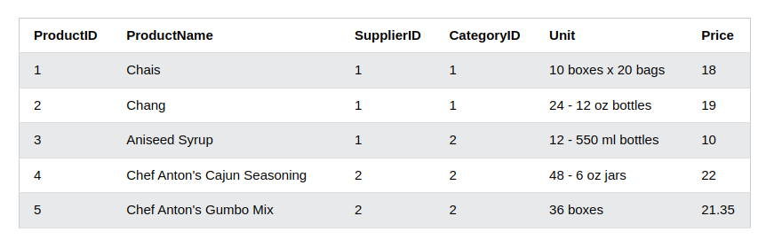

# SQL Programming - Aggregation Function and Views

## Outline

* Aggregation Function
* Views
* Other SQL Programming Usage

## Part I Aggregation Function

* An aggregate function is a function that performs a calculation on a set of values, and returns a single value.
* Aggregate functions are often used with the GROUP BY clause of the SELECT statement. 
* The **GROUP BY** clause splits the result-set into groups of values and the aggregate function can be used to return a single value for each group.

The most commonly used SQL aggregate functions are:

MIN() - returns the smallest value within the selected column
MAX() - returns the largest value within the selected column
COUNT() - returns the number of rows in a set
SUM() - returns the total sum of a numerical column
AVG() - returns the average value of a numerical column

### MIN() and MAX()

Assuming the table `Products` already exists with the following structure, please execute it from DBeaver,

```sql
CREATE TABLE Products (
    ProductID INT PRIMARY KEY,
    ProductName VARCHAR(255),
    SupplierID INT,
    CategoryID INT,
    Unit VARCHAR(255),
    Price DECIMAL(10, 2)
);
```

```sql
INSERT INTO Products (ProductID, ProductName, SupplierID, CategoryID, Unit, Price)
VALUES
(1, 'Chais', 1, 1, '10 boxes x 20 bags', 18.00),
(2, 'Chang', 1, 1, '24 - 12 oz bottles', 19.00),
(3, 'Aniseed Syrup', 1, 2, '12 - 550 ml bottles', 10.00),
(4, 'Chef Anton''s Cajun Seasoning', 2, 2, '48 - 6 oz jars', 22.00),
(5, 'Chef Anton''s Gumbo Mix', 2, 2, '36 boxes', 21.35);
```

**Set Column Name (Alias)**

When you use MIN() or MAX(), the returned column will not have a descriptive name. 
To give the column a descriptive name, use the AS keyword:

```sql
SELECT MIN(Price) AS SmallestPrice
FROM Products;
```

**Use MIN() with GROUP BY**
Here we use the MIN() function and the GROUP BY clause, to return the smallest price for each category in the Products table:

```sql
SELECT MIN(Price) AS SmallestPrice, CategoryID
FROM Products
GROUP BY CategoryID;
```

### Count()

***Syntax***

```sql
SELECT COUNT(column_name)
FROM table_name
WHERE condition;
```

***Example***
```sql
SELECT COUNT(*)
FROM Products;
```



***Specify Column***

```sql
SELECT COUNT(ProductName)
FROM Products;
```

***Add a WHERE Clause***

```sql
SELECT COUNT(ProductID)
FROM Products
WHERE Price > 20;
```

***Ignore Duplicates***

```sql
SELECT COUNT(DISTINCT Price)
FROM Products
```

***Use an Alias***

```sql
SELECT COUNT(*) AS [Number of records]
FROM Products;
```

***Use COUNT() with GROUP BY***

```sql
SELECT COUNT(*) AS [Number of records], CategoryID
FROM Products
GROUP BY CategoryID;
```

### SUM()

Let us run the following code in DBeaver to prepare for some data to play with,

-- Assuming the table `OrderDetails` already exists with the following structure:
```sql

CREATE TABLE OrderDetails (
    OrderDetailID INT PRIMARY KEY,
    OrderID INT,
    ProductID INT,
    Quantity INT
);
```

```sql
INSERT INTO OrderDetails (OrderDetailID, OrderID, ProductID, Quantity)
VALUES
(1, 10248, 11, 12),
(2, 10248, 42, 10),
(3, 10248, 72, 5),
(4, 10249, 14, 9),
(5, 10249, 51, 40);
```

***Syntax***
```sql
SELECT SUM(column_name)
FROM table_name
WHERE condition;
```

***Example***
Return the sum of all Quantity fields in the OrderDetails table:

```sql
SELECT SUM(Quantity)
FROM OrderDetails;
```

***Add a WHERE Clause***
```sql
SELECT SUM(Quantity)
FROM OrderDetails
WHERE ProductId = 11;
```

***Use an Alias***

Name the column "total" using `AS` keyword,

```sql
SELECT SUM(Quantity) AS total
FROM OrderDetails;
```

***Use SUM() with GROUP BY***
Here we use the SUM() function and the GROUP BY clause, to return the Quantity for each OrderID in the OrderDetails table:

```sql
SELECT OrderID, SUM(Quantity) AS [Total Quantity]
FROM OrderDetails
GROUP BY OrderID;
```

***SUM() With an Expression***
The parameter inside the SUM() function can also be an expression.

If we assume that each product in the OrderDetails column costs 10 dollars, we can find the total earnings in dollars by multiply each quantity with 10:

Use an expression inside the SUM() function:

```sql
SELECT SUM(Quantity * 10)
FROM OrderDetails;
```
We can also join the OrderDetails table to the Products table to find the actual amount, instead of assuming it is 10 dollars:

Join OrderDetails with Products, and use SUM() to find the total amount:

```sql
SELECT SUM(Price * Quantity)
FROM OrderDetails
LEFT JOIN Products ON OrderDetails.ProductID = Products.ProductID;
```

### Average()

The following examples, we will be using the same Products table above.

***Syntax***

```sql
SELECT AVG(column_name)
FROM table_name
WHERE condition;
```

***Add a WHERE Clause***

You can add a WHERE clause to specify conditions:

Return the average price of products in category 1:

```sql
SELECT AVG(Price)
FROM Products
WHERE CategoryID = 1;
```

***Use an Alias***

Give the AVG column a name by using the AS keyword.

Name the column "average price":

```sql
SELECT AVG(Price) AS [average price]
FROM Products;
```

***Higher Than Average***
To list all records with a higher price than average, we can use the AVG() function in a sub query:

Return all products with a higher price than the average price:

```sql
SELECT * FROM Products
WHERE price > (SELECT AVG(price) FROM Products);
```

***Use AVG() with GROUP BY***

Here we use the AVG() function and the GROUP BY clause, to return the average price for each category in the Products table:

Example

```sql
SELECT AVG(Price) AS AveragePrice, CategoryID
FROM Products
GROUP BY CategoryID;
```

## Part II Views

https://www.w3schools.com/sql/sql_view.asp

## Part III Others

* In, Between, Alias


### Ref

- https://www.w3schools.com/sql/sql_min_max.asp
- https://www.w3schools.com/sql/sql_view.asp