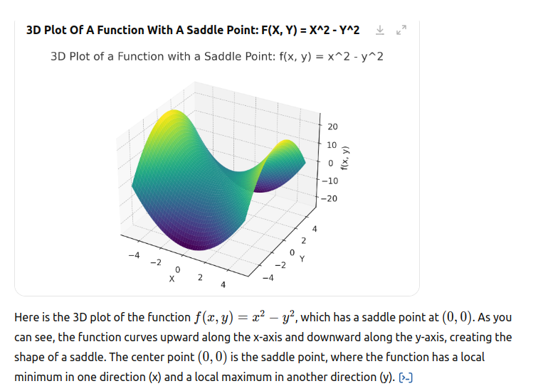
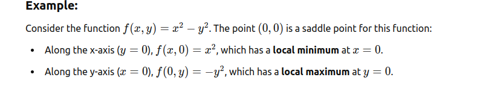
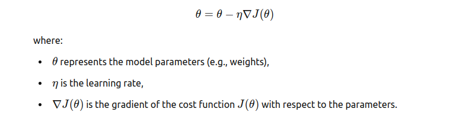

# Deep Learning

## What is a (Neural Network) NN?

* Single neuron == linear regression

* RELU stands for rectified linear unit is the most popular activation function right now that makes deep NNs train faster now.

* Hidden layers predicts connection between inputs automatically, thats what deep learning is good at.

* Deep NN consists of more hidden layers (Deeper layers)

* Each Input will be connected to the hidden layer and the NN will decide the connections.

* Supervised learning means we have the (X,Y) and we need to get the function that maps X to Y.

## Supervised learning with neural networks

Different types of neural networks for supervised learning which includes:

* CNN or convolutional neural networks (Useful in computer vision)
* RNN or Recurrent neural networks (Useful in Speech recognition or NLP)
* Standard NN (Useful for Structured data)
* Hybrid/custom NN or a Collection of NNs types

>Hint: 1/ Structured data is like the databases and tables.2/ Unstructured data is like images, video, audio, and text.Structured data gives more money because companies relies on prediction on its big data.

## Data and Algorithm

* For small data NN can perform as Linear regression or SVM (Support vector machine)

* For big data a small NN is better that SVM

* For big data a big NN is better that a medium NN is better that small NN.

* using RELU function is so much better than using SIGMOID function in training a NN because it helps with the vanishing gradient problem.

## Neural Networks Basics

* **Binary classification**

Use a logistic regression to make a binary classifier.

Here are some notations:

* M is the number of training vectors
* Nx is the size of the input vector
* Ny is the size of the output vector
* X(1) is the first input vector
* Y(1) is the first output vector
* X = [x(1) x(2).. x(M)]
* Y = (y(1) y(2).. y(M))

* **Logistic regression**

Algorithm is used for classification algorithm of 2 classes.
Equations:

`Simple equation: y = wx + b`

* If x is a vector: y = w(transpose)x + b
* If we need y to be in between 0 and 1 (probability): y = sigmoid(w(transpose)x + b)
* In some notations this might be used: y = sigmoid(w(transpose)x)
>While b is w0 of w and we add x0 = 1. but we won't use this notation in the course (Andrew said that the first notation is better).
* In binary classification Y has to be between 0 and 1.
* In the last equation w is a vector of Nx and b is a real number

## CNN Cost/Loss function

In Convolutional Neural Networks (CNNs), the cost function (also called the loss function) is used to measure the error between the network's predicted output and the actual target values. The goal is to minimize this error during training, so the network learns to make better predictions.


* **How the Cost Function Works in CNN Training:**

Forward Pass: During the forward pass, the CNN takes input data (e.g., an image), passes it through multiple layers (convolutional, pooling, fully connected, etc.), and computes the predicted output.

Compute Loss: Once the output is generated, the cost function computes the difference between the predicted output and the actual target (ground truth) value.

Backward Pass (Backpropagation): The computed loss is then propagated back through the network to **adjust the weights** using optimization algorithms like `Gradient Descent`. This process involves **calculating the gradient** (the partial derivative of the loss with respect to each weight) and adjusting the weights to **minimize the loss**.

Optimization: The weights are updated iteratively based on the calculated gradients, using an optimizer like `Stochastic Gradient Descent (SGD)` or `Adam`.

The cost function is crucial in training CNNs as it quantifies how far off the model's predictions are from the true labels, guiding the network toward more accurate results through repeated optimization steps.

* **Logistic regression cost function**

First loss function would be the square root error:

`L(y',y) = 1/2 (y' - y)^2`

But we won't use this notation because it leads us to optimization problem which is `non convex`, means it contains `local optimum points`.

This is the function that we will use:

`L(y',y) = - (y*log(y') + (1-y)*log(1-y'))`

To explain the last function lets see:

If y = 1 ==> L(y',1) = -log(y') ==> we want y' to be the largest ==> y' biggest value is 1

If y = 0 ==> L(y',0) = -log(1-y') ==> we want 1-y' to be the largest ==> y' to be smaller as possible because it can only has 1 value.

Then the Cost function will be:

`J(w,b) = (1/m) * Sum(L(y'[i],y[i]))`

The loss function computes the error for a single training example; the cost function is the average of the loss functions of the entire training set. So it is a little different than The Root Mean Squared Error (RMSE).

* **Convex cost function**

In machine learning, the cost function (or loss function) ideally needs to be convex to ensure that the optimization process used to minimize it is straightforward and effective. Here's why convexity matters:

1. Single Global Minimum:

A convex function has only one global minimum and no local minima or maxima. This property makes optimization more reliable because if the cost function is convex, any optimization algorithm, such as Gradient Descent, will eventually converge to the global minimum, where the model's parameters are optimal.

In contrast, if the cost function is non-convex, there might be multiple local minima or saddle points. This can make the optimization process trickier because the gradient descent algorithm could get stuck in a local minimum instead of finding the best possible (global) minimum.

2. Efficient Optimization:

Convex functions guarantee that optimization algorithms like Gradient Descent will progress in the right direction. For convex functions, the gradient always points towards the direction of steepest descent. As a result, the learning process becomes stable, and you don’t have to worry about the optimization being misled by unwanted local minima.

For non-convex functions, the optimization process could become unstable, as the gradient might sometimes point in the wrong direction, making it harder for the algorithm to find the optimal solution.

3. Clear Convergence Behavior:

When using convex cost functions, it’s easier to predict how the optimization process will behave. The absence of local minima ensures that as long as the algorithm is set up properly, it will make steady progress toward the global minimum, leading to more reliable convergence.

For non-convex functions, the behavior might be unpredictable, with multiple iterations possibly leading to different local minima based on the initialization of the model’s parameters.

Here is the plot of a convex function,


`f(x)=x^2`

As you can see, it has a single global minimum at x=0 and curves upwards on both sides, illustrating the characteristic shape of a convex function.

**saddle point**

A saddle point refers to a point in a function's domain that is neither a local maximum nor a local minimum, but instead has a unique characteristic of being a minimum along one direction and a maximum along another direction. It resembles the shape of a saddle, which is higher in the middle and slopes downward on both sides.

* Characteristics of a Saddle Point:

1/ Local Maximum and Minimum: At a saddle point, the function might have a minimum in one direction and a maximum in another.
For example, if you move along one axis (say, the x-axis), the function might decrease, creating a local minimum. If you move along another axis (say, the y-axis), the function might increase, creating a local maximum.

2/ Gradient at a Saddle Point: In a multivariable function, a saddle point often occurs where the gradient (the vector of partial derivatives) is zero, meaning there is no slope in any direction. However, the point is still not a local minimum or maximum because the curvature is different in different directions.





Saddle points can significantly affect optimization, especially in the context of machine learning and deep learning models, where the optimization landscape is often non-convex. Here's a breakdown of how saddle points impact the optimization process:

1. Zero Gradient Issue

At a saddle point, the gradient (or derivative) of the cost function is zero. In gradient-based optimization algorithms, such as Gradient Descent, this can cause the algorithm to get stuck at the saddle point.
Since the gradient is zero at a saddle point, the optimizer might interpret this as a point where no further changes are needed. As a result, it may fail to move away from the saddle point, even though the function could be improving in other directions.

2. Stagnation in Optimization

Local Minima and Saddle Points: In non-convex functions, the optimization algorithm may find a saddle point and incorrectly treat it as an optimum, causing stagnation in the training process.

This can result in slower convergence or even complete halting of the optimization if the algorithm doesn't have mechanisms to escape the saddle point.

3. Optimization Challenges in High Dimensions

High-dimensional landscapes: In complex models, such as deep neural networks, the number of parameters can be very high. The loss landscape in these models often contains a large number of saddle points.

As the number of dimensions increases, the probability of encountering a saddle point increases. This makes it even harder for traditional optimization techniques to converge efficiently, especially if the algorithm cannot easily distinguish between saddle points and minima.

4. Difficulty in Finding Global Minima

Local Minima vs. Saddle Points: Unlike local minima, where the function is strictly lower than the surrounding points, a saddle point only has a local minimum or maximum in specific directions. Optimization algorithms that get stuck in saddle points may miss out on better solutions, including the global minimum.
If the model's optimization algorithm doesn't properly escape saddle points, it might never reach the optimal solution.

5. Escape Mechanisms

Stochastic Gradient Descent (SGD): One advantage of SGD (and its variants, like Adam) is that they introduce some randomness (due to mini-batches or the noisy nature of gradient computation) into the gradient updates. This randomness helps the algorithm escape saddle points by allowing it to "jump" over shallow regions of the cost function that may correspond to saddle points.

Momentum: Momentum-based methods (like Nesterov's Accelerated Gradient Descent) can also help escape saddle points by continuing to move in a direction based on past gradients, even if the gradient at the saddle point is zero.

Hessian-based methods: Some more advanced optimization techniques, like those using the Hessian matrix (second-order derivatives), can better handle saddle points by analyzing the curvature of the function to determine if a point is truly a minimum, maximum, or saddle.

6. Practical Solutions to Overcome Saddle Points

Initialization Techniques: Proper initialization of the weights in neural networks can reduce the likelihood of starting near a saddle point. For example, methods like Xavier or He initialization ensure that the network starts with weights that are more likely to lead to better optimization paths.

Adaptive Learning Rates: Techniques like Adam use adaptive learning rates, allowing the model to adjust its step size during optimization. This can help escape saddle points by making larger updates when stuck in less favorable areas.

* Summary:

Saddle points are points where the **gradient is zero**, but they are **neither local minima nor maxima**.

They can slow down or stall optimization, as gradient-based methods might get "stuck" at these points.

`Stochastic methods`, `momentum`, and advanced optimizers like `Adam` are often used to help avoid or escape saddle points, allowing the optimization process to continue toward better solutions.

## Gradient Descent

Gradient Descent is an optimization algorithm used to minimize (or maximize) a function by iteratively adjusting the parameters of the function in the direction of the steepest descent, which is opposite to the gradient. It is commonly used to train machine learning models, including deep learning networks, by minimizing a loss function.

**Key Concepts:**

Objective:

The goal of gradient descent is to find the minimum of a function (typically the loss function in machine learning), which represents the best model parameters that lead to the best performance (e.g., lowest error in predictions).
Gradient:

The gradient is a vector that points in the direction of the steepest increase in the function. The negative gradient (the opposite direction) is the direction of the steepest decrease, which is what we want to follow in gradient descent.
Learning Rate:

The learning rate (η) is a hyperparameter that controls the size of the steps taken in the direction of the negative gradient. It determines how much the parameters should be adjusted after each iteration.
A learning rate that is too large might cause the algorithm to overshoot the minimum, while a learning rate that is too small can make the convergence process slow.

**How Gradient Descent Works:**

1. Start with Initial Parameters:

Initialize the model parameters (weights) randomly or based on some strategy.

2. Compute the Gradient:

Calculate the gradient of the loss function with respect to each parameter (i.e., the derivative of the function). This tells us how much change in each parameter will decrease the loss.

3. Update the Parameters:

Adjust the parameters by moving in the direction opposite to the gradient (i.e., descending the slope). The size of the step is determined by the learning rate:



**Gradient Descent in CNN**

* We want to predict w and b that minimize the cost function.

* Our cost function is convex.

* First we initialize w and b to 0,0 or initialize them to a random value in the convex function and then try to improve the values the reach minimum value.

* In Logistic regression people always use 0,0 instead of random.

* The gradient decent algorithm repeats: w = w - alpha * dw where alpha is the learning rate and dw is the derivative of w (Change to w). The derivative is also the slope of w.

* Looks like greedy algorithms. the derivative give us the direction to improve our parameters.

**The actual equations we will implement:**

`w = w - alpha * d(J(w,b) / dw) (how much the function slopes in the w direction)`

`b = b - alpha * d(J(w,b) / db) (how much the function slopes in the d direction)`

**Derivative**

* Derivative of a linear line is its slope.

```
ex. f(a) = 3a 

d(f(a))/d(a) = 3
```

If a = 2 then f(a) = 6

If we move a a little bit a = 2.001 then f(a) = 6.003 means that we multiplied the derivative (Slope) to the moved area and added it to the last result.

* f(a) = a^2 ==> d(f(a))/d(a) = 2a

```
a = 2 ==> f(a) = 4
a = 2.0001 ==> f(a) = 4.0004 approx.
```

* f(a) = a^3 ==> d(f(a))/d(a) = 3a^2

* f(a) = log(a) ==> d(f(a))/d(a) = 1/a

**Algorithm**

Gradient Descent on m examples,

Lets say we have these variables:

```
	X1					Feature
	X2                  Feature
	W1                  Weight of the first feature.
	W2                  Weight of the second feature.
	B                   Logistic Regression parameter.
	M                   Number of training examples
	Y(i)				Expected output of i
```

Then from right to left we will calculate derivations compared to the result:

```
	d(a)  = d(l)/d(a) = -(y/a) + ((1-y)/(1-a))
	d(z)  = d(l)/d(z) = a - y
	d(W1) = X1 * d(z)
	d(W2) = X2 * d(z)
	d(B) = d(z)
```

From the above we can conclude the logistic regression pseudo code:

```
	J = 0; dw1 = 0; dw2 =0; db = 0;                 # Devs.
	w1 = 0; w2 = 0; b=0;							# Weights
	for i = 1 to m
		# Forward pass
		z(i) = W1*x1(i) + W2*x2(i) + b
		a(i) = Sigmoid(z(i))
		J += (Y(i)*log(a(i)) + (1-Y(i))*log(1-a(i)))
		
		# Backward pass
		dz(i) = a(i) - Y(i)
		dw1 += dz(i) * x1(i)
		dw2 += dz(i) * x2(i)
		db  += dz(i)
	J /= m
	dw1/= m
	dw2/= m
	db/= m
	
	# Gradient descent
	w1 = w1 - alpa * dw1
	w2 = w2 - alpa * dw2
	b = b - alpa * db
```

The above code should run for some iterations to minimize error.

So there will be two inner loops to implement the logistic regression.

Vectorization is so important on deep learning to reduce loops. In the last code we can make the whole loop in one step using vectorization!

**Vectorizing Logistic Regression**

We will implement Logistic Regression using one for loop then without any for loop.

As an input we have a matrix X and its [Nx, m] and a matrix Y and its [Ny, m].

We will then compute at instance `[z1,z2...zm] = W' * X + [b,b,...b]`. This can be written in python as:

```
  	Z = np.dot(W.T,X) + b    # Vectorization, then broadcasting, Z shape is (1, m)
  	A = 1 / (1 + np.exp(-Z))   # Vectorization, A shape is (1, m)
```

Vectorizing Logistic Regression's Gradient Output:

```
  	dz = A - Y                  # Vectorization, dz shape is (1, m)
  	dw = np.dot(X, dz.T) / m    # Vectorization, dw shape is (Nx, 1)
  	db = dz.sum() / m           # Vectorization, db shape is (1, 1)
```

## Pooling Layer

In Convolutional Neural Networks (CNNs), the **pooling layer** is used to reduce the spatial dimensions (height and width) of the input volume. It helps reduce the number of parameters and computational cost, while also controlling overfitting and providing translation invariance. There are two primary types of pooling operations:

1. **Max Pooling**:
   - In **max pooling**, the output is the maximum value in a rectangular region (or "window") of the input.
   - This operation selects the most prominent feature in a localized region, preserving important spatial hierarchies.
   - For example, a 2x2 max-pooling operation would take a 2x2 patch of the input and return the maximum value in that patch.

2. **Average Pooling**:
   - In **average pooling**, the output is the average of all the values in the pooling window.
   - This operation is used less frequently than max pooling, but it can also help reduce the size of the feature map.

### Key Parameters:
- **Pool size**: The size of the window, e.g., 2x2, 3x3, etc.
- **Stride**: The step size by which the pooling window moves across the input.
- **Padding**: Sometimes padding is added to ensure that the pooling operation fits the input evenly, but in most cases, padding is not used for pooling layers.

### Benefits of Pooling:
- **Dimensionality Reduction**: By reducing the height and width of the input, the pooling layer makes the network computationally more efficient.
- **Translation Invariance**: Pooling helps the network become less sensitive to small translations or distortions in the input image. For example, if an object shifts slightly, max pooling will still pick out the dominant features.
- **Prevention of Overfitting**: By summarizing information, pooling helps reduce overfitting, especially in larger networks.

### Example:

Suppose you have a 4x4 input matrix and you apply a 2x2 max pooling operation with a stride of 2:

Input matrix (4x4):

```
1 3 2 4
5 6 7 8
9 10 11 12
13 14 15 16
```

After applying max pooling with a 2x2 window and a stride of 2, the output would be:

```
6 8
14 16
```

In this case, the pooling operation selects the maximum value from each 2x2 window.

In summary, pooling layers are an essential part of CNNs, helping to reduce the computational load, speed up training, and allow the network to learn more abstract features in a robust way.

## Sequential Model

In a Convolutional Neural Network (CNN), a **sequential model** refers to a linear stack of layers, where each layer has exactly one input and one output. This model is typically used when the architecture of the network is a simple stack of layers, such as convolutional layers followed by pooling layers and then fully connected layers (or dense layers).

### Key Characteristics of a CNN Sequential Model:
1. **Layer-by-layer structure**: The model is built by stacking layers in a sequence, where the output of one layer becomes the input for the next.
2. **Simplicity**: This is the simplest type of neural network architecture. It assumes that the connections between layers are straightforward and sequential.
3. **Flexibility**: It’s easy to add or remove layers in this kind of architecture.

### Components of a CNN Sequential Model:
1. **Input Layer**: The input layer typically consists of image data (height, width, channels).
2. **Convolutional Layers (Conv2D)**: These layers apply convolutional filters to the input data to detect spatial features like edges, textures, etc.
3. **Activation Function**: After each convolution operation, an activation function like ReLU (Rectified Linear Unit) is used to introduce non-linearity.
4. **Pooling Layers (MaxPooling2D, AveragePooling2D)**: These layers down-sample the feature maps to reduce their dimensions and computational load.
5. **Flatten Layer**: This layer flattens the multidimensional input into a one-dimensional vector, preparing it for the fully connected layers.
6. **Fully Connected Layers (Dense)**: These are regular neural network layers that are typically used near the end of the model to perform classification or regression.
7. **Output Layer**: The final layer of the model, which depends on the task (e.g., a softmax activation for multi-class classification).

### Example of a Simple CNN Sequential Model in Keras:

```python
from tensorflow.keras.models import Sequential
from tensorflow.keras.layers import Conv2D, MaxPooling2D, Flatten, Dense

# Initialize the model
model = Sequential()

# Add the first convolutional layer with 32 filters, a 3x3 kernel, and ReLU activation
model.add(Conv2D(32, (3, 3), activation='relu', input_shape=(64, 64, 3)))

# Add a pooling layer to down-sample the feature maps
model.add(MaxPooling2D(pool_size=(2, 2)))

# Add a second convolutional layer with 64 filters and a 3x3 kernel
model.add(Conv2D(64, (3, 3), activation='relu'))

# Add another pooling layer
model.add(MaxPooling2D(pool_size=(2, 2)))

# Flatten the 2D matrices into a 1D vector
model.add(Flatten())

# Add a fully connected layer with 128 neurons
model.add(Dense(128, activation='relu'))

# Output layer for classification (e.g., for 10 classes)
model.add(Dense(10, activation='softmax'))

# Compile the model with categorical crossentropy loss and Adam optimizer
model.compile(optimizer='adam', loss='categorical_crossentropy', metrics=['accuracy'])

# Model summary
model.summary()
```

### Explanation of the Model:

- **Conv2D(32, (3, 3), activation='relu')**: This layer performs a 2D convolution with 32 filters of size 3x3, followed by a ReLU activation function. It operates on 64x64 RGB images (input_shape=(64, 64, 3)).
- **MaxPooling2D(pool_size=(2, 2))**: A max-pooling layer that reduces the spatial size of the feature map.
- **Flatten()**: Converts the 2D feature map into a 1D vector to prepare it for the fully connected layer.
- **Dense(128, activation='relu')**: A fully connected layer with 128 neurons.
- **Dense(10, activation='softmax')**: An output layer with 10 neurons for multi-class classification (e.g., 10 different classes), using the softmax activation function for probabilistic output.

### Advantages of Using a Sequential Model:

- **Simplicity**: The structure is easy to understand and implement. Layers are stacked one by one.
- **Ease of Modification**: You can easily add, remove, or modify layers in the sequence.
- **Popular Frameworks**: Libraries like Keras make defining sequential models quick and convenient.

### Limitations:

- **Inflexibility for Complex Architectures**: If the model requires non-linear connections between layers or shared weights, a more advanced model (e.g., a functional API in Keras) might be needed.
  
### Summary:

A **CNN Sequential Model** is a simple way to define a neural network, especially for problems where the layers are applied one after another. It's ideal for straightforward tasks like image classification, where the input data flows through a series of layers, each performing different operations (convolution, pooling, and fully connected layers).

## Activation Function

The **ReLU (Rectified Linear Unit)** activation function is one of the most commonly used activation functions in neural networks, particularly in Convolutional Neural Networks (CNNs). It introduces non-linearity into the model and helps the network learn complex patterns. ReLU is computationally efficient and has become the default activation function in many modern deep learning architectures.

### Mathematical Definition:

The ReLU activation function is defined as:

`f(x) = max(0, x)`

This means that if the input `x` is positive, the output is `x`, and if the input `x` is negative, the output is 0. Essentially, ReLU sets all negative values to zero and leaves positive values unchanged.

### How the ReLU works

So, applying ReLU to the input,

x=[−3,−1,0,2,5] would yield the output,

`f(x)=[0,0,0,2,5]`

### Visual Representation:
If you plot the ReLU function, it will look like this:
- For `x > 0`, the graph is a straight line with slope 1.
- For `x < 0`, the graph is flat at 0 (i.e., the function is constant).

### Properties of ReLU:

1. **Non-linearity**: Even though ReLU is a piecewise linear function, it introduces non-linearity to the model, allowing neural networks to learn complex patterns.

2. **Sparsity**: ReLU outputs zero for all negative values, creating sparse activations. This sparsity can make the model more efficient.

3. **Computationally Efficient**: ReLU involves simple operations (a comparison with zero) and is computationally inexpensive to calculate, making it suitable for large networks.

4. **Gradient Propagation**: ReLU has a constant gradient of 1 for positive inputs, which helps reduce the vanishing gradient problem, especially in deep networks.

### Advantages of ReLU:
- **Faster Training**: Since the gradient is constant for positive values, ReLU helps speed up training compared to older activation functions like sigmoid or tanh.
- **Less Likelihood of Vanishing Gradients**: Unlike sigmoid and tanh, where gradients can become very small, ReLU does not saturate for positive inputs, which helps with the gradient flow during backpropagation.
- **Sparsity**: ReLU naturally introduces sparsity in the network, as it sets all negative activations to zero, which can help the network focus on more important features.

### Disadvantages of ReLU:
1. **Dying ReLU Problem**:
   - If the input to a neuron is negative during training, the gradient of ReLU is zero, meaning the neuron will not update its weights and effectively "dies" (i.e., it stops learning). This can lead to some neurons being inactive throughout training, which can slow down the learning process.
   
   - This problem can be mitigated with variations of ReLU, such as **Leaky ReLU** or **Parametric ReLU**.

2. **Non-zero centered**:
   - ReLU is not centered around zero. This can cause issues with optimization algorithms like gradient descent, as the output will always be non-negative, leading to non-symmetrical gradients, which could slow down convergence in some cases.

### Variations of ReLU:

Several variations of the ReLU activation function have been developed to address its drawbacks, including:

1. **Leaky ReLU**:
   - In Leaky ReLU, instead of setting all negative values to zero, a small slope \( \alpha \) is used for negative inputs. This ensures that neurons don't "die" completely.
   \[
   f(x) = 
   \begin{cases} 
   x & \text{if } x > 0 \\
   \alpha x & \text{if } x \leq 0
   \end{cases}
   \]
   Typically, \( \alpha \) is a small positive value (like 0.01).

2. **Parametric ReLU (PReLU)**:
   - This is a generalization of Leaky ReLU, where \( \alpha \) is learned during training, allowing the model to decide the slope for negative inputs.

3. **Exponential Linear Unit (ELU)**:
   - ELU tries to smooth the transition between positive and negative values by using an exponential function for negative inputs. ELU can help mitigate the vanishing gradient problem even further.

4. **Scaled Exponential Linear Unit (SELU)**:
   - SELU is a self-normalizing activation function that scales the outputs of the ELU function to help the network maintain a stable mean and variance throughout training.

### When to Use ReLU:

- **Image Classification**: ReLU is widely used in CNNs for tasks like image classification, where fast learning and effective feature extraction are crucial.

- **Deep Networks**: ReLU is preferred in deep neural networks because it mitigates the vanishing gradient problem that occurs with sigmoid or tanh functions.

### Example:

Here's how ReLU is used in Keras (with a CNN model):
```python
from tensorflow.keras.models import Sequential
from tensorflow.keras.layers import Conv2D, MaxPooling2D, Flatten, Dense

model = Sequential()

# Convolutional layer with ReLU activation
model.add(Conv2D(32, (3, 3), activation='relu', input_shape=(64, 64, 3)))

# Pooling layer
model.add(MaxPooling2D(pool_size=(2, 2)))

# Flatten layer
model.add(Flatten())

# Fully connected layer with ReLU activation
model.add(Dense(128, activation='relu'))

# Output layer for classification with softmax activation
model.add(Dense(10, activation='softmax'))

model.compile(optimizer='adam', loss='categorical_crossentropy', metrics=['accuracy'])
```

In this example, ReLU is applied to the convolutional and fully connected layers, allowing the network to learn non-linear patterns effectively.

### Summary:

ReLU is a widely-used, efficient, and simple activation function that helps neural networks learn faster and avoid problems like vanishing gradients. Despite some drawbacks, such as the dying ReLU problem, its advantages in deep learning models, especially in CNNs, have made it the go-to choice for many modern architectures.

## Softmax

The **Softmax activation function** is a generalization of the **sigmoid function** for multi-class classification problems. It is commonly used in the output layer of neural networks when the task is to classify an input into one of several possible classes. The Softmax function converts the raw output of a model (called logits) into a probability distribution, where each class has a probability between 0 and 1, and the sum of all probabilities is 1.

### Mathematical Definition:
Given an input vector \( \mathbf{z} = [z_1, z_2, ..., z_n] \) representing the raw outputs (logits) for each class, the Softmax function computes the probability \( P(y = k | \mathbf{z}) \) of class \( k \) as follows:

\[
P(y = k | \mathbf{z}) = \frac{e^{z_k}}{\sum_{i=1}^{n} e^{z_i}}
\]

Where:
- \( e^{z_k} \) is the exponential of the raw score for class \( k \).
- \( \sum_{i=1}^{n} e^{z_i} \) is the sum of the exponentials of all the raw scores for all classes.

### How Softmax Works:
1. **Exponentiation**: Each logit (raw score) is exponentiated. This operation makes sure that the output values are positive and amplifies the differences between logits.
2. **Normalization**: The exponentiated values are divided by the sum of all the exponentiated logits to ensure that the output values are in the range [0, 1], and they sum to 1. This step converts the logits into probabilities.
3. **Interpretation**: The output of the Softmax function for each class represents the probability of that class being the correct classification, given the input.

### Example:
Consider a classification problem with 3 classes and the following logits (raw outputs) from the network:
\[
\mathbf{z} = [2.0, 1.0, 0.1]
\]

1. **Step 1 - Exponentiate the logits**:
\[
e^{2.0} \approx 7.389, \quad e^{1.0} \approx 2.718, \quad e^{0.1} \approx 1.105
\]

2. **Step 2 - Compute the sum of the exponentials**:

`7.389 + 2.718 + 1.105 \approx 11.212`

3. **Step 3 - Normalize the values to get probabilities**

`P(y = 1) = \frac{7.389}{11.212} \approx 0.659`

`P(y = 2) = \frac{2.718}{11.212} \approx 0.243`

`P(y = 3) = \frac{1.105}{11.212} \approx 0.099`


So, the Softmax output for this input is approximately:

`P = [0.659, 0.243, 0.099]`


This means the model assigns a **65.9%** probability to class 1, a **24.3%** probability to class 2, and a **9.9%** probability to class 3.

### Key Properties of Softmax:

1. **Probability Distribution**: The output values of the Softmax function are between 0 and 1, and they sum to 1. This makes them interpretable as probabilities.
2. **Sensitive to Input Differences**: Small differences in the logits (raw scores) can result in large differences in the output probabilities because of the exponentiation step.
3. **Class Confidence**: The class with the highest probability is the predicted class. However, all the classes contribute to the final prediction, making it possible to have a sense of the network's confidence in the prediction.

### Applications of Softmax:

1. **Multi-Class Classification**: Softmax is commonly used in the output layer of a neural network for multi-class classification problems. It converts the network’s raw output scores into a probability distribution over multiple classes, making it easier to interpret.
   
2. **Probability of Each Class**: It is used in tasks where the network needs to output a probability distribution over a set of possible classes, such as image classification (e.g., recognizing whether an image is a cat, dog, or bird).

### Softmax in Neural Networks:

In practice, the Softmax function is typically applied in the **final layer** of a neural network, particularly when you want to classify inputs into one of several categories. In frameworks like TensorFlow or Keras, you would use the `softmax` activation in the output layer.

Example (Keras code snippet for multi-class classification):

```python
from tensorflow.keras.models import Sequential
from tensorflow.keras.layers import Dense

model = Sequential()

# Add hidden layers (e.g., Dense layers with ReLU activation)
model.add(Dense(64, activation='relu', input_shape=(input_shape,)))
model.add(Dense(32, activation='relu'))

# Output layer with softmax activation for multi-class classification
model.add(Dense(num_classes, activation='softmax'))

model.compile(optimizer='adam', loss='categorical_crossentropy', metrics=['accuracy'])
```

### Advantages of Softmax:
1. **Clear Probabilities**: Softmax provides a clear probabilistic interpretation of the model's output, making it easier to understand how confident the model is in its predictions.
2. **Sum to One**: By outputting a probability distribution, it is easy to compare the likelihood of different classes. The sum of the probabilities is guaranteed to be 1, providing a normalized and interpretable result.

### Disadvantages of Softmax:
1. **Sensitivity to Outliers**: If one logit is much larger than the others, Softmax can be highly sensitive to that outlier, pushing the probabilities toward 1 for that class and away from the others.
2. **Computationally Expensive**: Exponentiating the logits and summing them can be computationally expensive, especially in large models with many classes.

### Summary:
The **Softmax activation function** is widely used in classification problems where the goal is to assign an input to one of several classes. It transforms the raw outputs (logits) from the network into probabilities that sum to 1. The class with the highest probability is typically selected as the network's predicted output.

## Ref

Andrew NG [coursara](https://www.coursera.org/learn/neural-networks-deep-learning)