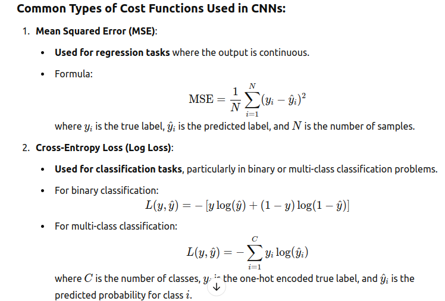
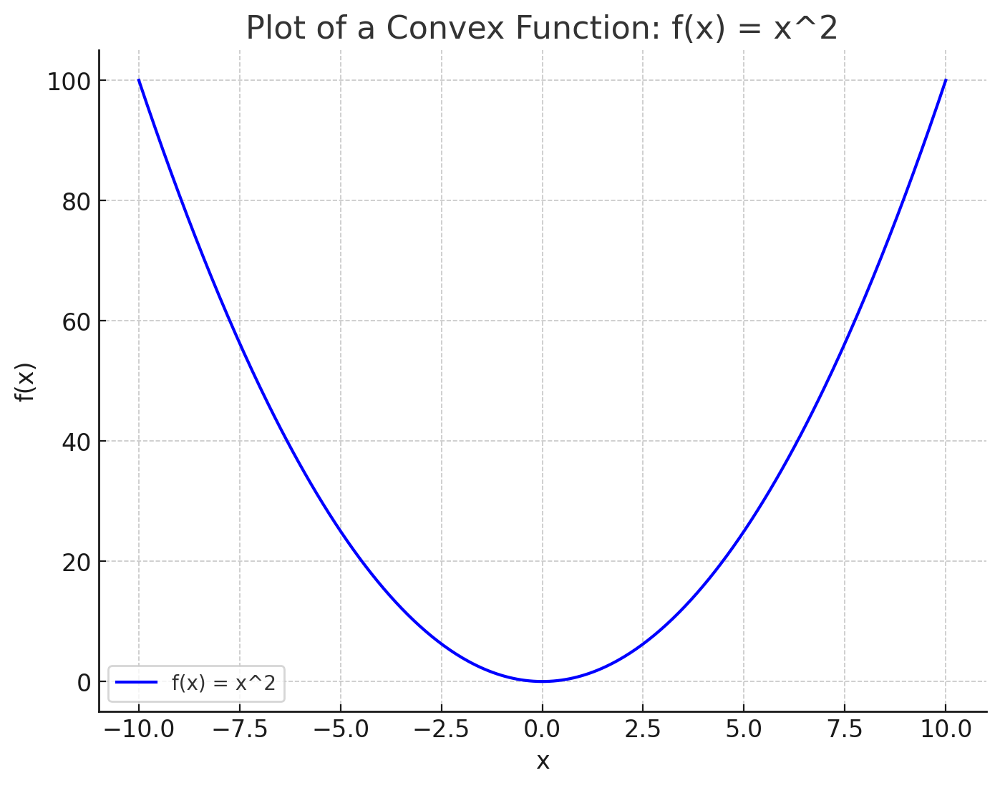

# Deep Learning

## What is a (Neural Network) NN?

* Single neuron == linear regression

* RELU stands for rectified linear unit is the most popular activation function right now that makes deep NNs train faster now.

* Hidden layers predicts connection between inputs automatically, thats what deep learning is good at.

* Deep NN consists of more hidden layers (Deeper layers)

* Each Input will be connected to the hidden layer and the NN will decide the connections.

* Supervised learning means we have the (X,Y) and we need to get the function that maps X to Y.

## Supervised learning with neural networks

Different types of neural networks for supervised learning which includes:

* CNN or convolutional neural networks (Useful in computer vision)
* RNN or Recurrent neural networks (Useful in Speech recognition or NLP)
* Standard NN (Useful for Structured data)
* Hybrid/custom NN or a Collection of NNs types

>Hint: 1/ Structured data is like the databases and tables.2/ Unstructured data is like images, video, audio, and text.Structured data gives more money because companies relies on prediction on its big data.

## Data and Algorithm

* For small data NN can perform as Linear regression or SVM (Support vector machine)

* For big data a small NN is better that SVM

* For big data a big NN is better that a medium NN is better that small NN.

* using RELU function is so much better than using SIGMOID function in training a NN because it helps with the vanishing gradient problem.

## Neural Networks Basics

* **Binary classification**

Use a logistic regression to make a binary classifier.

Here are some notations:

* M is the number of training vectors
* Nx is the size of the input vector
* Ny is the size of the output vector
* X(1) is the first input vector
* Y(1) is the first output vector
* X = [x(1) x(2).. x(M)]
* Y = (y(1) y(2).. y(M))

* **Logistic regression**

Algorithm is used for classification algorithm of 2 classes.
Equations:

`Simple equation: y = wx + b`

* If x is a vector: y = w(transpose)x + b
* If we need y to be in between 0 and 1 (probability): y = sigmoid(w(transpose)x + b)
* In some notations this might be used: y = sigmoid(w(transpose)x)
>While b is w0 of w and we add x0 = 1. but we won't use this notation in the course (Andrew said that the first notation is better).
* In binary classification Y has to be between 0 and 1.
* In the last equation w is a vector of Nx and b is a real number

## CNN Cost/Loss function

In Convolutional Neural Networks (CNNs), the cost function (also called the loss function) is used to measure the error between the network's predicted output and the actual target values. The goal is to minimize this error during training, so the network learns to make better predictions.



* **How the Cost Function Works in CNN Training:**

Forward Pass: During the forward pass, the CNN takes input data (e.g., an image), passes it through multiple layers (convolutional, pooling, fully connected, etc.), and computes the predicted output.

Compute Loss: Once the output is generated, the cost function computes the difference between the predicted output and the actual target (ground truth) value.

Backward Pass (Backpropagation): The computed loss is then propagated back through the network to **adjust the weights** using optimization algorithms like `Gradient Descent`. This process involves **calculating the gradient** (the partial derivative of the loss with respect to each weight) and adjusting the weights to **minimize the loss**.

Optimization: The weights are updated iteratively based on the calculated gradients, using an optimizer like `Stochastic Gradient Descent (SGD)` or `Adam`.

The cost function is crucial in training CNNs as it quantifies how far off the model's predictions are from the true labels, guiding the network toward more accurate results through repeated optimization steps.

* **Logistic regression cost function**

First loss function would be the square root error:

`L(y',y) = 1/2 (y' - y)^2`

But we won't use this notation because it leads us to optimization problem which is `non convex`, means it contains `local optimum points`.

This is the function that we will use:

`L(y',y) = - (y*log(y') + (1-y)*log(1-y'))`

To explain the last function lets see:

If y = 1 ==> L(y',1) = -log(y') ==> we want y' to be the largest ==> y' biggest value is 1

If y = 0 ==> L(y',0) = -log(1-y') ==> we want 1-y' to be the largest ==> y' to be smaller as possible because it can only has 1 value.

Then the Cost function will be:

`J(w,b) = (1/m) * Sum(L(y'[i],y[i]))`

The loss function computes the error for a single training example; the cost function is the average of the loss functions of the entire training set. So it is a little different than The Root Mean Squared Error (RMSE).

* **Convex cost function**

In machine learning, the cost function (or loss function) ideally needs to be convex to ensure that the optimization process used to minimize it is straightforward and effective. Here's why convexity matters:

1. Single Global Minimum:

A convex function has only one global minimum and no local minima or maxima. This property makes optimization more reliable because if the cost function is convex, any optimization algorithm, such as Gradient Descent, will eventually converge to the global minimum, where the model's parameters are optimal.

In contrast, if the cost function is non-convex, there might be multiple local minima or saddle points. This can make the optimization process trickier because the gradient descent algorithm could get stuck in a local minimum instead of finding the best possible (global) minimum.

2. Efficient Optimization:

Convex functions guarantee that optimization algorithms like Gradient Descent will progress in the right direction. For convex functions, the gradient always points towards the direction of steepest descent. As a result, the learning process becomes stable, and you don’t have to worry about the optimization being misled by unwanted local minima.

For non-convex functions, the optimization process could become unstable, as the gradient might sometimes point in the wrong direction, making it harder for the algorithm to find the optimal solution.

3. Clear Convergence Behavior:

When using convex cost functions, it’s easier to predict how the optimization process will behave. The absence of local minima ensures that as long as the algorithm is set up properly, it will make steady progress toward the global minimum, leading to more reliable convergence.

For non-convex functions, the behavior might be unpredictable, with multiple iterations possibly leading to different local minima based on the initialization of the model’s parameters.

Here is the plot of a convex function,



`f(x)=x^2`

As you can see, it has a single global minimum at x=0 and curves upwards on both sides, illustrating the characteristic shape of a convex function.

**saddle point**

A saddle point refers to a point in a function's domain that is neither a local maximum nor a local minimum, but instead has a unique characteristic of being a minimum along one direction and a maximum along another direction. It resembles the shape of a saddle, which is higher in the middle and slopes downward on both sides.

* Characteristics of a Saddle Point:

1/ Local Maximum and Minimum: At a saddle point, the function might have a minimum in one direction and a maximum in another.
For example, if you move along one axis (say, the x-axis), the function might decrease, creating a local minimum. If you move along another axis (say, the y-axis), the function might increase, creating a local maximum.

2/ Gradient at a Saddle Point: In a multivariable function, a saddle point often occurs where the gradient (the vector of partial derivatives) is zero, meaning there is no slope in any direction. However, the point is still not a local minimum or maximum because the curvature is different in different directions.


Saddle points can significantly affect optimization, especially in the context of machine learning and deep learning models, where the optimization landscape is often non-convex. Here's a breakdown of how saddle points impact the optimization process:

1. Zero Gradient Issue

At a saddle point, the gradient (or derivative) of the cost function is zero. In gradient-based optimization algorithms, such as Gradient Descent, this can cause the algorithm to get stuck at the saddle point.
Since the gradient is zero at a saddle point, the optimizer might interpret this as a point where no further changes are needed. As a result, it may fail to move away from the saddle point, even though the function could be improving in other directions.

2. Stagnation in Optimization

Local Minima and Saddle Points: In non-convex functions, the optimization algorithm may find a saddle point and incorrectly treat it as an optimum, causing stagnation in the training process.

This can result in slower convergence or even complete halting of the optimization if the algorithm doesn't have mechanisms to escape the saddle point.

3. Optimization Challenges in High Dimensions

High-dimensional landscapes: In complex models, such as deep neural networks, the number of parameters can be very high. The loss landscape in these models often contains a large number of saddle points.

As the number of dimensions increases, the probability of encountering a saddle point increases. This makes it even harder for traditional optimization techniques to converge efficiently, especially if the algorithm cannot easily distinguish between saddle points and minima.

4. Difficulty in Finding Global Minima

Local Minima vs. Saddle Points: Unlike local minima, where the function is strictly lower than the surrounding points, a saddle point only has a local minimum or maximum in specific directions. Optimization algorithms that get stuck in saddle points may miss out on better solutions, including the global minimum.
If the model's optimization algorithm doesn't properly escape saddle points, it might never reach the optimal solution.

5. Escape Mechanisms

Stochastic Gradient Descent (SGD): One advantage of SGD (and its variants, like Adam) is that they introduce some randomness (due to mini-batches or the noisy nature of gradient computation) into the gradient updates. This randomness helps the algorithm escape saddle points by allowing it to "jump" over shallow regions of the cost function that may correspond to saddle points.

Momentum: Momentum-based methods (like Nesterov's Accelerated Gradient Descent) can also help escape saddle points by continuing to move in a direction based on past gradients, even if the gradient at the saddle point is zero.

Hessian-based methods: Some more advanced optimization techniques, like those using the Hessian matrix (second-order derivatives), can better handle saddle points by analyzing the curvature of the function to determine if a point is truly a minimum, maximum, or saddle.

6. Practical Solutions to Overcome Saddle Points

Initialization Techniques: Proper initialization of the weights in neural networks can reduce the likelihood of starting near a saddle point. For example, methods like Xavier or He initialization ensure that the network starts with weights that are more likely to lead to better optimization paths.

Adaptive Learning Rates: Techniques like Adam use adaptive learning rates, allowing the model to adjust its step size during optimization. This can help escape saddle points by making larger updates when stuck in less favorable areas.

* Summary:

Saddle points are points where the **gradient is zero**, but they are **neither local minima nor maxima**.

They can slow down or stall optimization, as gradient-based methods might get "stuck" at these points.

`Stochastic methods`, `momentum`, and advanced optimizers like `Adam` are often used to help avoid or escape saddle points, allowing the optimization process to continue toward better solutions.

## Gradient Descent

Gradient Descent is an optimization algorithm used to minimize (or maximize) a function by iteratively adjusting the parameters of the function in the direction of the steepest descent, which is opposite to the gradient. It is commonly used to train machine learning models, including deep learning networks, by minimizing a loss function.

**Key Concepts:**

Objective:

The goal of gradient descent is to find the minimum of a function (typically the loss function in machine learning), which represents the best model parameters that lead to the best performance (e.g., lowest error in predictions).
Gradient:

The gradient is a vector that points in the direction of the steepest increase in the function. The negative gradient (the opposite direction) is the direction of the steepest decrease, which is what we want to follow in gradient descent.
Learning Rate:

The learning rate (η) is a hyperparameter that controls the size of the steps taken in the direction of the negative gradient. It determines how much the parameters should be adjusted after each iteration.
A learning rate that is too large might cause the algorithm to overshoot the minimum, while a learning rate that is too small can make the convergence process slow.

**How Gradient Descent Works:**

1. Start with Initial Parameters:

Initialize the model parameters (weights) randomly or based on some strategy.

2. Compute the Gradient:

Calculate the gradient of the loss function with respect to each parameter (i.e., the derivative of the function). This tells us how much change in each parameter will decrease the loss.

3. Update the Parameters:

Adjust the parameters by moving in the direction opposite to the gradient (i.e., descending the slope). The size of the step is determined by the learning rate:


**Gradient Descent in CNN**

* We want to predict w and b that minimize the cost function.

* Our cost function is convex.

* First we initialize w and b to 0,0 or initialize them to a random value in the convex function and then try to improve the values the reach minimum value.

* In Logistic regression people always use 0,0 instead of random.

* The gradient decent algorithm repeats: w = w - alpha * dw where alpha is the learning rate and dw is the derivative of w (Change to w). The derivative is also the slope of w.

* Looks like greedy algorithms. the derivative give us the direction to improve our parameters.

**The actual equations we will implement:**

`w = w - alpha * d(J(w,b) / dw) (how much the function slopes in the w direction)`

`b = b - alpha * d(J(w,b) / db) (how much the function slopes in the d direction)`

**Derivative**

* Derivative of a linear line is its slope.

`ex. f(a) = 3a d(f(a))/d(a) = 3`

If a = 2 then f(a) = 6

If we move a a little bit a = 2.001 then f(a) = 6.003 means that we multiplied the derivative (Slope) to the moved area and added it to the last result.

* f(a) = a^2 ==> d(f(a))/d(a) = 2a

```
a = 2 ==> f(a) = 4
a = 2.0001 ==> f(a) = 4.0004 approx.
```

* f(a) = a^3 ==> d(f(a))/d(a) = 3a^2

* f(a) = log(a) ==> d(f(a))/d(a) = 1/a

**Algorithm**

Gradient Descent on m examples,

Lets say we have these variables:

```
	X1					Feature
	X2                  Feature
	W1                  Weight of the first feature.
	W2                  Weight of the second feature.
	B                   Logistic Regression parameter.
	M                   Number of training examples
	Y(i)				Expected output of i
```

Then from right to left we will calculate derivations compared to the result:

```
	d(a)  = d(l)/d(a) = -(y/a) + ((1-y)/(1-a))
	d(z)  = d(l)/d(z) = a - y
	d(W1) = X1 * d(z)
	d(W2) = X2 * d(z)
	d(B) = d(z)
```

From the above we can conclude the logistic regression pseudo code:

```
	J = 0; dw1 = 0; dw2 =0; db = 0;                 # Devs.
	w1 = 0; w2 = 0; b=0;							# Weights
	for i = 1 to m
		# Forward pass
		z(i) = W1*x1(i) + W2*x2(i) + b
		a(i) = Sigmoid(z(i))
		J += (Y(i)*log(a(i)) + (1-Y(i))*log(1-a(i)))
		
		# Backward pass
		dz(i) = a(i) - Y(i)
		dw1 += dz(i) * x1(i)
		dw2 += dz(i) * x2(i)
		db  += dz(i)
	J /= m
	dw1/= m
	dw2/= m
	db/= m
	
	# Gradient descent
	w1 = w1 - alpa * dw1
	w2 = w2 - alpa * dw2
	b = b - alpa * db
```

The above code should run for some iterations to minimize error.

So there will be two inner loops to implement the logistic regression.

Vectorization is so important on deep learning to reduce loops. In the last code we can make the whole loop in one step using vectorization!

## Ref

Andrew NG [coursara](https://www.coursera.org/learn/neural-networks-deep-learning)

