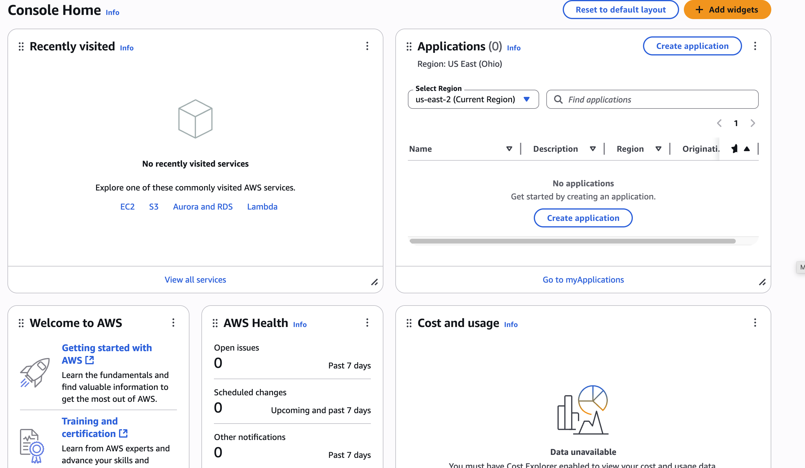
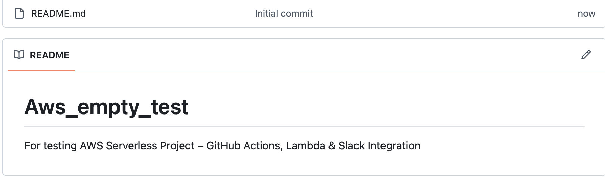
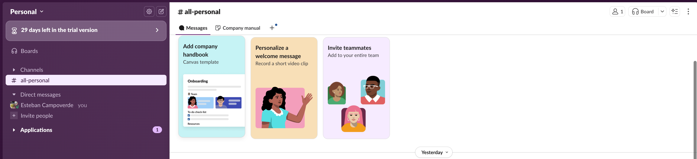
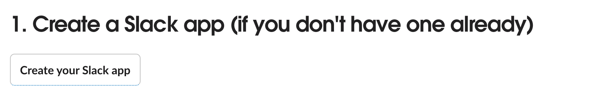
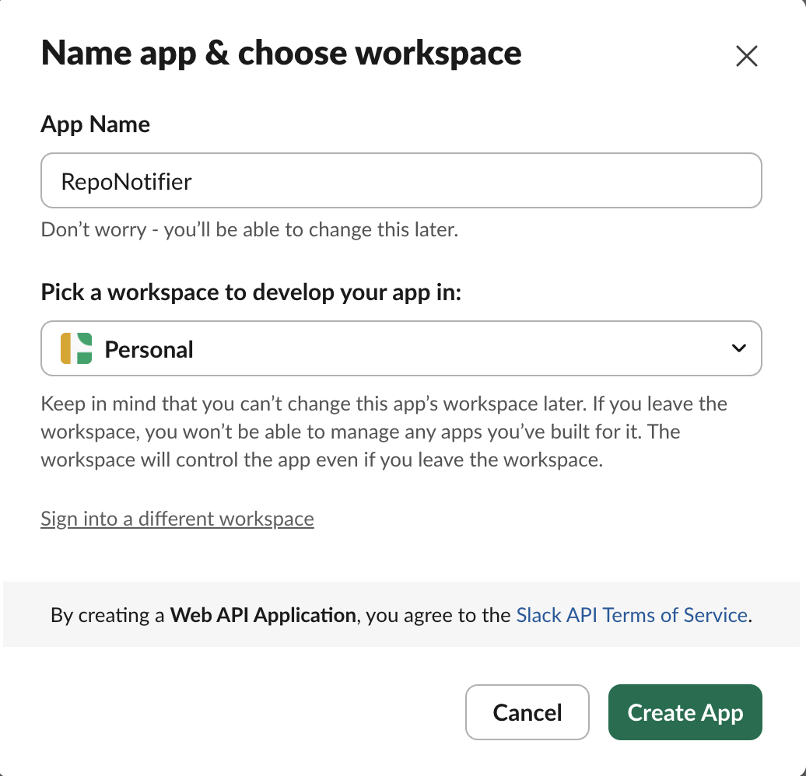
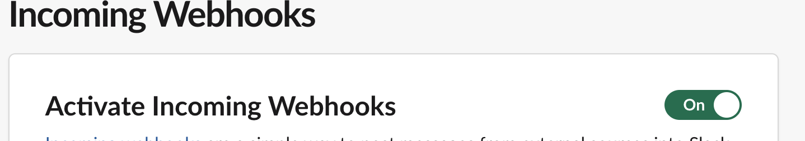
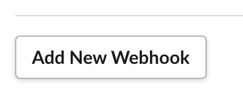
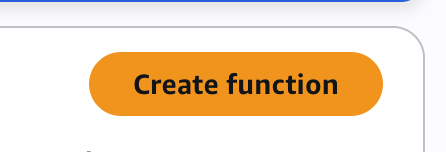
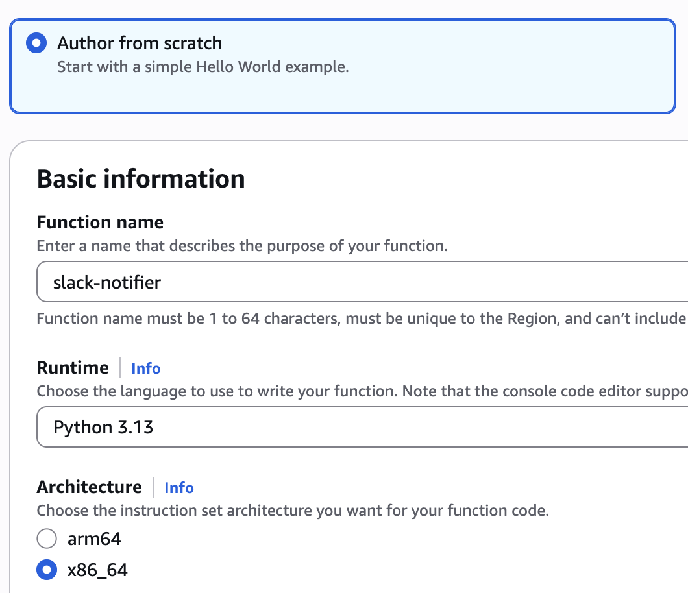
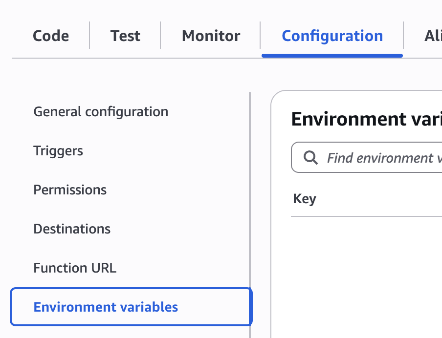

##  AWS Serverless Project – GitHub Actions, Lambda & Slack Integration

### Prerequisites

- An AWS account



- A github repository for testing
  


- Access to a Slack account and workspace where you can create an *Incoming Webhook*.



## Creating an AWS Account

1. Go to [https://aws.amazon.com/](https://aws.amazon.com/) and **Create an AWS Account**.
2. Fill in **contact information** and select account type (Personal is fine).
3. Add a **credit/debit card** for verification (Free Tier is fine).
4. Verify your identity via SMS or automated call
5. Select the **Basic** support plan (free).
6. Log in at [https://console.aws.amazon.com](https://console.aws.amazon.com).

## Setting up a Slack incoming Webhook

1. Go to [Slack Incoming Webhooks](https://api.slack.com/messaging/webhooks).
2. Click **Create your Slack app** → **From scratch**.



3. Give it a name and select your workspace



4. In **Incoming Webhooks**, toggle ON to activate.



5. Scroll down and click **Add New Webhook** then choose a channel, and allow



1. Store the generated Webhook URL for later

## 1 - Create AWS Lambda Function

1. In AWS Console, go to Lambda -> Create Function



2. Select:
   - Author from scratch
   - Give it a Name: `slack-notifier`
   - Runtime: Python 3.13
   - Architecture: x86_64
  


3. Click on **Create function**

4. Add environment variables

   - Choose the Configuration tab, then choose Environment variables.
   - Under Environment variables, choose Edit.
   - Add environment variables and dsave them: 
     - `SLACK_WEBHOOK_URL` = your Slack webhook URL `SHARED_TOKEN` = a simple secret (secret string inveted by you) to validate GitHub requests 
   


5. Paste this code:
   
   ```python
    import os, json, urllib.request
    SLACK_WEBHOOK_URL = os.environ['SLACK_WEBHOOK_URL']
    EXPECTED_TOKEN = os.environ.get('SHARED_TOKEN', "")

    def send_to_slack(message):
    payload={"message": message}
    req = urllib.request.Request(
        SLACK_WEBHOOK_URL,
        data=json.dumps(payload).encode("utf-8"),
        headers={"Content-Type": "application/json"}
        method="POST",
    )
    with urllib.request.urlopen(req) as res:
        return res.read().decode("utf-8")

    def lambda_handler(event, context):
    body = event.get("body", "")
    try:
        data = json.loads(body or "{}")
    except:
        data = {}
    
    token = data.get("token", "")
    if EXPECTED_TOKEN and token != EXPECTED_TOKEN:
        return {
            "statusCode": 401,
            "body": "Invalid token",
        }

    repo = data.get("repo", "unknown")
    branch = data.get("branch", "unknown")
    status =  data.get("status", "unknown")
    commit = data.get("commit", "unknown")

    text = f"Deploy Alert | Repo: `{repo}` | Branch: `{branch}` | Status: `{status}` | Commit: `{commit}`"
    send_to_slack(text)

    return {
        "statusCode": 200,
        "body": "OK",
    }
   ```
## 2 - 