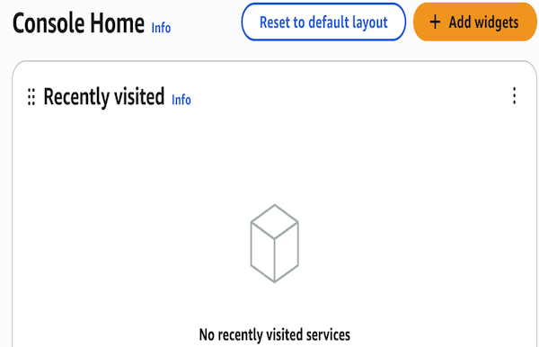
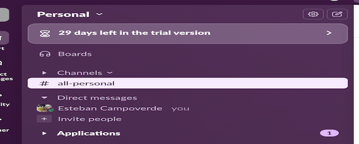

##  AWS Serverless Project – GitHub Actions, Lambda & Slack Integration

### Pre requisites

- An AWS account

- A github repository for testing

- Access to a Slack workspace where you can create an *Incoming Webhook*.

