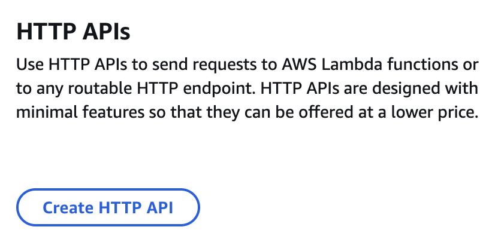
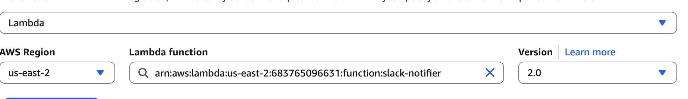
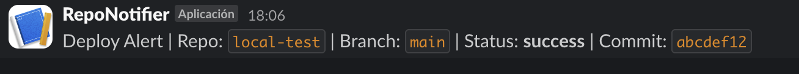

##  AWS Serverless Project – GitHub Actions, Lambda & Slack Integration

### Prerequisites

- An AWS account


- A github repository for testing
  


- Access to a Slack account and workspace where you can create an *Incoming Webhook*.


## Creating an AWS Account

1. Go to [https://aws.amazon.com/](https://aws.amazon.com/) and **Create an AWS Account**.
2. Fill in **contact information** and select account type (Personal is fine).
3. Add a **credit/debit card** for verification (Free Tier is fine).
4. Verify your identity via SMS or automated call
5. Select the **Basic** support plan (free).
6. Log in at [https://console.aws.amazon.com](https://console.aws.amazon.com).

## Setting up a Slack incoming Webhook

1. Go to [Slack Incoming Webhooks](https://api.slack.com/messaging/webhooks).
2. Click **Create your Slack app** → **From scratch**.


3. Give it a name and select your workspace


4. In **Incoming Webhooks**, toggle ON to activate.


5. Scroll down and click **Add New Webhook** then choose a channel, and allow


1. Store the generated Webhook URL for later

## 1 - Create AWS Lambda Function

1. In AWS Console, go to Lambda -> Create Function


2. Select:
   - Author from scratch
   - Give it a Name: `slack-notifier`
   - Runtime: Python 3.13
   - Architecture: x86_64
  


3. Click on **Create function**

4. Add environment variables

   - Choose the Configuration tab, then choose Environment variables.
   - Under Environment variables, choose Edit.
   - Add environment variables and dsave them: 
     - `SLACK_WEBHOOK_URL` = your Slack webhook URL `SHARED_TOKEN` = a simple secret (secret string inveted by you) to validate GitHub requests 
   


5. Paste this code:
   
```python
import os
import json
import urllib.request

SLACK_WEBHOOK_URL = os.environ["SLACK_WEBHOOK_URL"]
EXPECTED_TOKEN = os.environ.get("SHARED_TOKEN", "")


def send_to_slack(message):
    payload = {"text": message}
    req = urllib.request.Request(
        SLACK_WEBHOOK_URL,
        data=json.dumps(payload).encode("utf-8"),
        headers={"Content-Type": "application/json"},
        method="POST",
    )
    with urllib.request.urlopen(req) as res:
        return res.read().decode("utf-8")


def lambda_handler(event, context):
    body = event.get("body", "")
    try:
        data = json.loads(body or "{}")
    except:
        data = {}

    token = data.get("token", "")
    if EXPECTED_TOKEN and token != EXPECTED_TOKEN:
        return {
            "statusCode": 401,
            "body": "Invalid token",
        }

    repo = data.get("repo", "unknown")
    branch = data.get("branch", "unknown")
    status = data.get("status", "unknown")
    commit = data.get("commit", "unknown")[:8]

    text = (
        f" Deploy Alert | Repo: `{repo}` | Branch: `{branch}` "
        f"| Status: *{status}* | Commit: `{commit}`"
    )
    send_to_slack(text)

    return {
        "statusCode": 200,
        "body": "OK",
    }
```

## 2 - Create API Gateway HTTP API

1. Go to API Gateway -> Create API -> HTTP API and Give it a name `slack-deploy-notifier`



2. Add integration: Lambda -> select `slack-notifer`



3. Configure routes -> Select method **POST**

4. Skip define stages -> Click **Create**

5. Go to Deploy/Stages and note the **Invoke URL**


## 3 - Test API Gateway

Run in your Terminal

```bash
curl -X POST "https://<YOUR_INVOKE_URL/ROUTE_NAME>" \
  -H "Content-Type: application/json" \
  -d '{"token":"<SAME_SHARED_TOKEN>","repo":"local-test","branch":"main","status":"success","commit":"abcdef12"}'

```

You should see the message in Slack's channel:



## 4 - Add GitHub Secrets

In your GitHub repo -> Settings -> Secrets and variables -> Actions -> New repository secret:

- `ALERT_ENDPOINT` = API Gateway Invoke URL + route_name `slack-notifier`
- `SLACK_SHARED_TOKEN` = same as Lambda `SHARED_TOKEN`