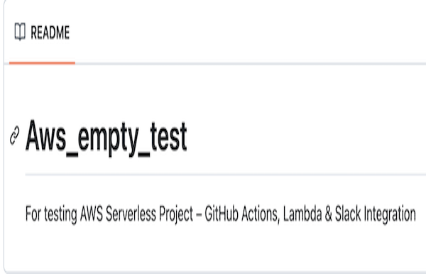

##  AWS Serverless Project – GitHub Actions, Lambda & Slack Integration

### Prerequisites

- An AWS account

- A github repository for testing
  

- Access to a Slack account and workspace where you can create an *Incoming Webhook*.

## Creating an AWS Account

1. Go to [https://aws.amazon.com/](https://aws.amazon.com/) and **Create an AWS Account**.
2. Fill in **contact information** and select account type (Personal is fine).
3. Add a **credit/debit card** for verification (Free Tier is fine).
4. Verify your identity via SMS or automated call
5. Select the **Basic** support plan (free).
6. Log in at [https://console.aws.amazon.com](https://console.aws.amazon.com).

## Setting up a Slack incoming Webhook

1. Go to [Slack Incoming Webhooks](https://api.slack.com/messaging/webhooks).
2. Click **Create your Slack app** → **From scratch**.

3. Give it a name and select your workspace

4. In **Incoming Webhooks**, toggle ON to activate.

5. Scroll down and click **Add New Webhook** then choose a channel, and allow

6. Store the generated Webhook URL for later
