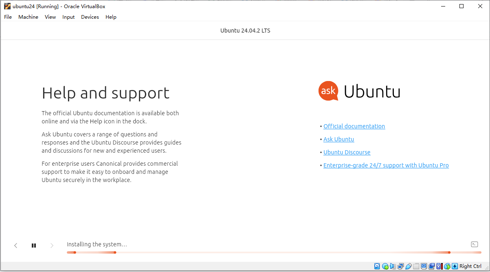
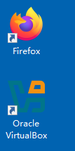
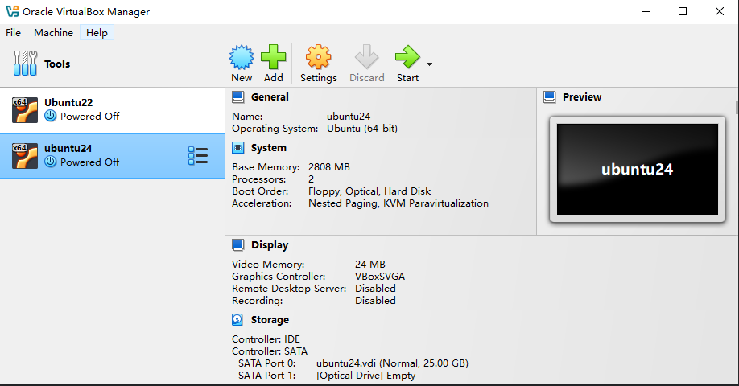
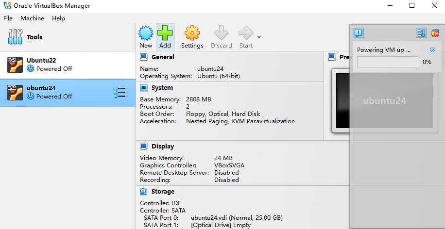
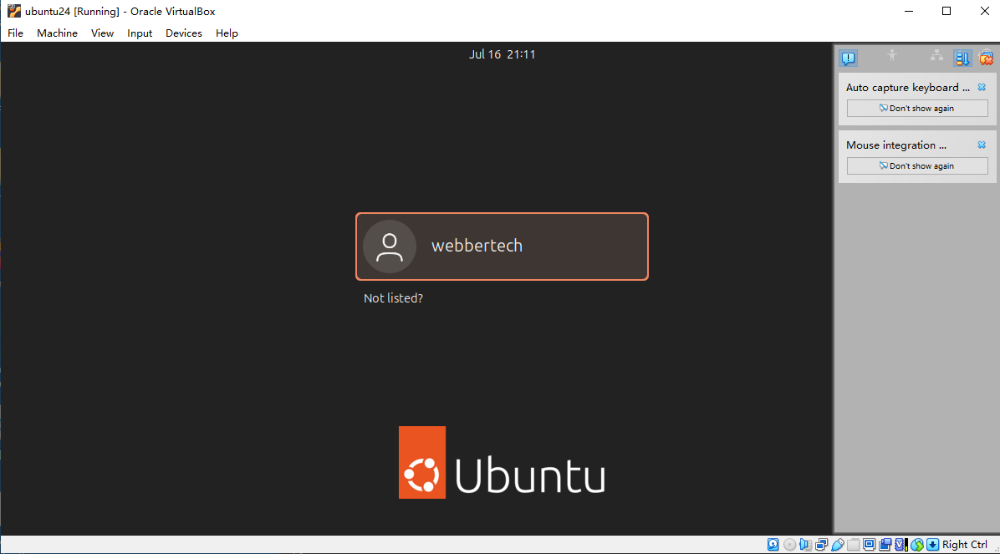
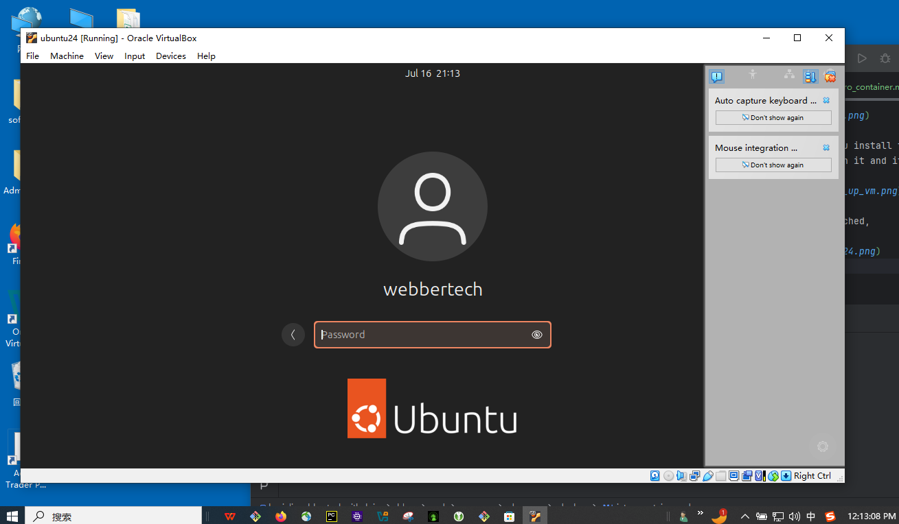

# Container Technologies

This is a document to introduce you the container technology. It is more than or large than just
`Docker`.

## Hyperviser and Virtual Machine

Hyperviser is an emulator software run in your hosting OS, such as windows(version 11), Mac or even linux.
The following is an image of it running on my windows machine.

After the installation of the Oracle VirtualBox, I launched it by clicking the icon on my desktop like the following,

Then I downloaded a bunch of open-source (free) linux ISO files, in this case, you would see that I finished loading and installing two versions of linux operating system.

Then I click one of the vm image I installed. After you install the ISO file it will generate a .vdi or some format of virtual machine image file.
For these images, that is what you see here, I click on it and it will power up. 

Once it is launched you will see my ubuntu 24 was launched,

Now you will see I run an operating system inside of my hosting operating system.

In this case, I am running a ubuntu 24 linux in my Windows 11.

Now, similar commercial products like Oracle virtualbox can be found of the following,

* Citrix Client
* Microsoft AVD

>Hint: So far, everything make sense?

Now we see this linux as a windowing and normal operating system. Nothing is special and all the files you created inside of the linux
would be saved in its data structures and file systems and save as a whole in the .vdi file for instance.
And everything will be packed into that image file.

## What exactly is the container technology

* Smaller and faster OS

Now if we want to deploy a database or a web server, and we do not really need the windowing interface or say the user interface.
We want a stripped-off OS, a linux without UI, then we kind of thinking it is a `headless` mode linux. 
If an OS was stripped off the UI, it would definitely be smaller and light-weight. Not only saving a lot of space but only faster.
In such of an engineering demand, we come up with container technology. Because later on we will hear about certain terms of ``

* Now what is besides the fact of smaller and faster? Why virtual?

The answer is to add security. 

It is to segregate the libraries collisions, vulnerabilities lied in the libraries...etc. 
This adds a layer of security. Because the OS is a light enough unit to run a web service or database service for instance so it is very affordable to run different role and software in its own space.

* Resilience and scalability

Because of the fact that the headless OS is small, so the time to spin up a new one is blazing fast. If for some reason the pod(headless os) dies, it can restart and launch another one very fast.
Later in our study, we will take a look at the Kubernetes(k8s), it is a concept of cluster orchestration, and this container technology was basically providing the foundation for such an engineering model or paradigm.

## Background

It is deceptively simple to get started with Linux Containers. It takes only a few minutes to install a container engine like docker and run your first commands. Within another few minutes, you are building your first container image and sharing it. Next, you begin the familiar process of architecting a production-like container environment, 

Worse, many of the following terms are used interchangeably… often causing quite a bit of confusion for newcomers.

    * Container
    * Image
    * Container Image
    * Image Layer
    * Registry
    * Repository
    * Tag
    * Base Image
    * Platform Image
    * Layer

Understanding the terminology laid out in this technical dictionary will provide you a deeper understanding of the underlying technologies. 
This will help you and your teams speak the same language and also provide insight into how to better architect your container environment for the goals you have. 
As an industry and wider community, this deeper understanding will enable us to build new architectures and solutions. 
Note, this technical dictionary assumes that the reader already has an understanding of how to run containers.

Right now, just learn how to use the docker would be good enough for you to start with. And you can gradually pick up and distinguish the differences of the above jargons but please donot stick your head to play the wording game as of now.
If you need more information about this introduction please refer to the links below in the # Ref section.

## Container 101

To understand container terminology, it’s important to understand exactly what a container is - with technical precision. A container is really two different things. Like a normal Linux program, containers really have two states - rest and running. When at rest, a container is a file (or set of files) that is saved on disk. This is referred to as a Container Image or Container Repository. When you type the command to start a container, the Container Engine unpacks the required files and meta-data, then hands them off to the the Linux kernel. Starting a container is very similar to starting a normal Linux process and requires making an API call to the Linux kernel. This API call typically initiates extra isolation and mounts a copy of the files that were in the container image. Once running, Containers are just a Linux process. The process for starting containers, as well as the image format on disk, are defined and governed by standards.

### Container Image formats

Format or you can say they are competitor technologies, you will find, 
There are several competing Container Image formats (Docker, Appc, LXD), but the industry is moving forward with a standard governed under the Open Container Initiative - sometimes referred to simply as Open Containers or the OCI. The scope of the OCI includes a Container Image Format Specification, which defines the on-disk format for container images as well as the meta-data which defines things like hardware architecture and the operating system (Linux, Windows, etc). An industry wide container image format enables ecosystems of software to flourish - different individual contributors, projects, and vendors are able to build images and tooling, which are interoperable. Users want interoperability between tools for signing, scanning, building, running, moving and managing container images.

### Container Engines

There are also several competing Container Engines including Docker, CRI-O, Railcar, RKT, LXC. These Container Engines take a Container Image and turn it into a Container (aka running processes). How this happens is governed by the scope of the OCI which includes a Container Runtime Specification and a Reference Runtime Implementation called RunC. This reference implementation is open source, governed by a community development model, and commonly used by many container engines to communicate with the host kernel when creating containers.

### Container

Containers have existed within operating systems for quite a long time. A container is the runtime instantiation of a Container Image. A container is a standard Linux process typically created through a clone() system call instead of fork() or exec(). Also, containers are often isolated further through the use of cgroups, SELinux or AppArmor.

### Container Host

The container host is the system that runs the containerized processes, often simply called containers.
This can be bare metal in your data center or just public cloud.

### Registry Server

A registry server is essentially a fancy file server that is used to store docker repositories. 
Typically, the registry server is specified as a normal DNS name and optionally a port number to connect to.
We would touch base on this such as Nexus server or docker registry later in this class.

### Container orchestration

Often teams start with installing a Container Host, then,

* Pulling some Container Images. 
* Then they move on to building some new Container Images and 
* Pushing them to a Registry Server to share with others on their team. 
* After a while they want to wire a few containers together and deploy them as a unit

Normally this happens in a pipeline of some environment (Dev/QA/Prod) leading towards production.

There are many container schedulers being developed in the community and by vendors. Historically, Swarm, Mesos, and Kubernetes were the big three, but recently even Docker and Mesosphere have announced support for Kubernetes - as has almost every major cloud service provider. 
Kubernetes has become the defacto standard in container orchestration, similar to Linux before it. If you are looking at container orchestration, Red Hat recommends our enterprise distribution called OpenShift.

Most commonly seen Kubernetes distributions are Amazon AWS' EKS, Redhat's OpenShift, and google and microsoft counterparts.

## Ref

- https://developers.redhat.com/blog/2018/02/22/container-terminology-practical-introduction#

- https://developers.redhat.com/blog/2014/05/15/practical-introduction-to-docker-containers