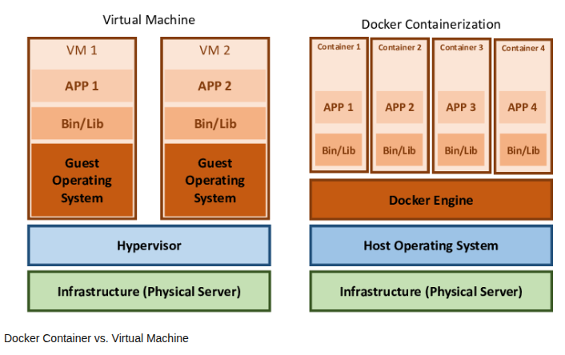
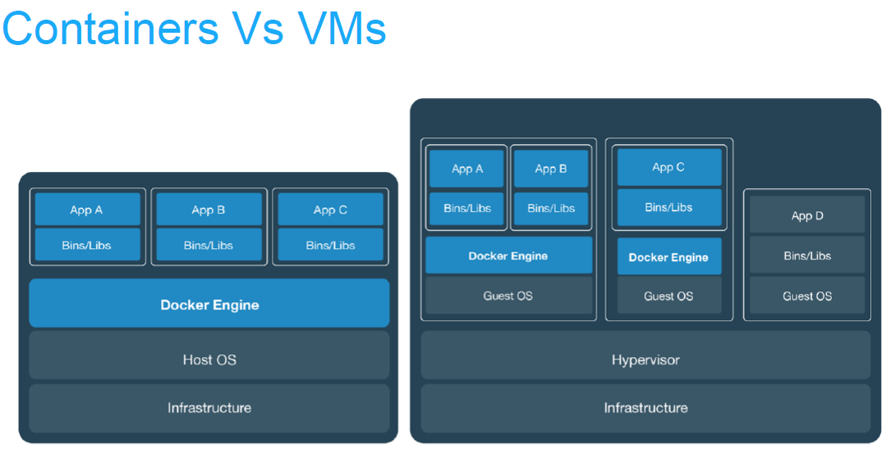
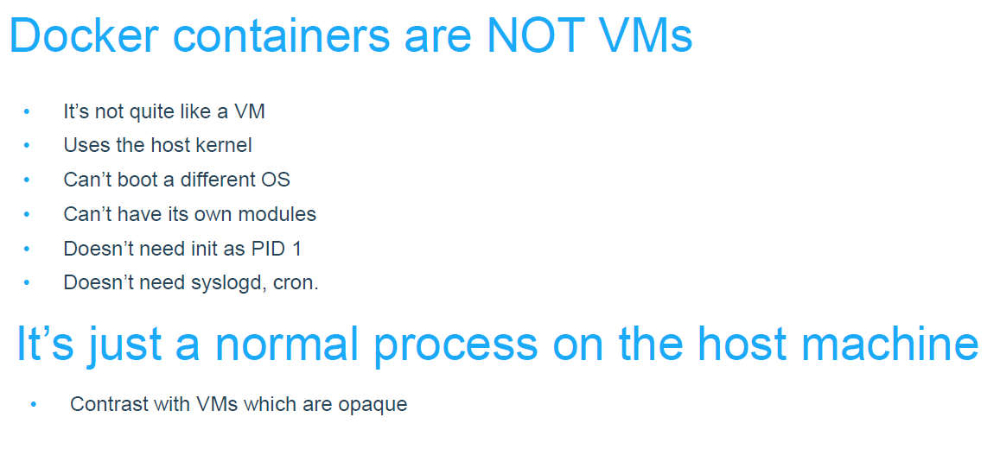
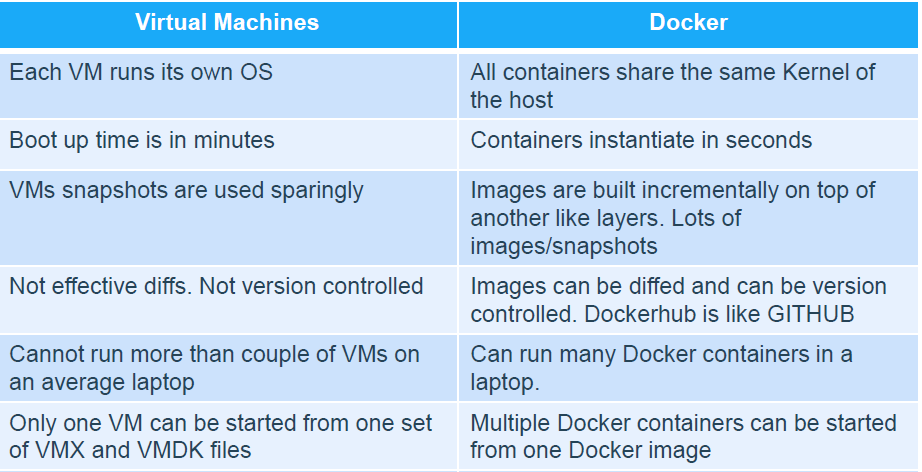

# Introduction to Docker

## What is Docker? The Analogy First

Imagine you need to move a exotic, sensitive fish from one aquarium to another. The water pH, temperature, salinity, and other conditions have to be *exactly* right, or the fish will die.

**The Old Way (Without Docker):** You'd try to meticulously document every single condition and setting from the original tank. Then, you'd go to the new tank and try to replicate it by hand, hoping you didn't forget anything. This is error-prone and often results in "well, it worked on my machine!" problems.

**The Docker Way:** You simply put the fish, the water, the plants, the filter, and the exact rocks from its original tank into a sealed, portable container. You then move this entire container to the new location and place it in the new aquarium. The environment inside the container is identical, so the fish is happy and healthy. You've moved the **entire environment**, not just the fish.

In software terms, the "fish" is your application code, and the "water, plants, and rocks" are the operating system, libraries, and dependencies it needs to run.

---

### The Official Definition

**Docker** is an open-source platform for developing, shipping, and running applications. It enables you to separate your applications from your infrastructure so you can deliver software quickly.

Docker does this by using **containerization**, a form of lightweight operating-system-level virtualization.

### Key Concepts and Terminology

1.  **Docker Image:** A read-only template with instructions for creating a Docker container. It's a snapshot of your application and its environment. Think of it as a **blueprint** or a **recipe**. (e.g., `Dockerfile` -> `my-python-app:V1.0` image).

2.  **Docker Container:** A runnable *instance* of an image. You can create, start, stop, move, or delete a container using the Docker API or CLI. It is **isolated** from other containers and the host machine. Think of it as the **actual running process** built from the image blueprint.

3.  **Dockerfile:** A simple text file that contains a list of commands (instructions) to assemble an image. It defines what goes into your image (e.g., which base OS to use, what code to copy, which commands to run).

4.  **Docker Engine:** The core software that runs on your host machine. It's a client-server application that consists of:
    *   A server with a long-running daemon process (`dockerd`).
    *   A REST API which specifies interfaces that programs can use to talk to the daemon.
    *   A command line interface (CLI) client (`docker`).

5.  **Docker Hub / Registry:** A service for storing and distributing Docker images. It's like **GitHub for Docker images**. You can pull public images (e.g., `nginx`, `python`, `node`) and push your own.

---

### Why is Docker So Popular? The Benefits

*   **Consistency:** The infamous "it works on my machine" problem is eliminated. Your application runs the same way in development, testing, and production because the environment is identical inside the container.
*   **Isolation:** Applications run in separate containers, so their dependencies and libraries don't conflict. You can run Python 2.7 and Python 3.11 on the same machine without any issues.
*   **Portability:** A Docker container can run on any machine that has Docker installed: a developer's laptop, a physical server in a data center, or a cloud provider (AWS, Azure, GCP). This simplifies deployment immensely.
*   **Lightweight & Efficient:** Containers share the host system's OS kernel, so they are much more lightweight than traditional Virtual Machines (VMs). You can run many more containers on a single host than VMs, leading to better resource utilization and cost savings.
*   **Scalability:** It's very easy to spin up multiple instances of a container, which is the foundation for modern microservices architecture and scaling tools like Kubernetes.

---

### Docker vs. Virtual Machines (VMs)

This is a common point of confusion. Here’s the key difference:

| Feature | Virtual Machines (VMs) | Docker Containers |
| :--- | :--- | :--- |
| **Abstraction Level** | Hardware-level | OS-level |
| **Guest OS** | Each VM has its own full OS | Shares the host machine's OS kernel |
| **Size** | Very Large (GBs) | Small (MBs) |
| **Startup Time** | Slow (minutes) | Fast (milliseconds) |
| **Performance** | Lower (has overhead of a full OS) | Near-native |
| **Isolation** | Strong | Process-level (good enough for most cases) |


>>note: image source: https://www.researchgate.net/figure/Docker-Container-vs-Virtual-Machine_fig2_369061128

A better image,



Virtual machines have a full OS with its own memory management installed with the associated overhead of virtual device drivers. In a virtual machine, valuable resources are emulated for the guest OS and hypervisor, which makes it possible to run many instances of one or more operating systems in parallel on a single machine (or host). Every guest OS runs as an individual entity from the host system. Hence, we can look at it an independent full-fledge house where we don’t share any resources as shown below:


In the other hand, Docker containers are executed with the Docker engine rather than the hypervisor. Containers are therefore smaller than Virtual Machines and enable faster start up with better performance, less isolation and greater compatibility possible due to sharing of the host’s kernel. Hence, it looks very similar to residental flats system where we share resources of the building.




### Docker Containers versus Virtual Machines:



When it comes to comparing the two, it could be said that Docker Containers have much more potential than Virtual Machines. It’s evident as Docker Containers are able to share a single kernel and share application libraries. Containers present a lower system overhead than Virtual Machines and performance of the application inside a container is generally same or better as compared to the same application running within a Virtual Machine.

There is one key metric where Docker Containers are weaker than Virtual Machines, and that’s “Isolation”. Intel’s VT-d and VT- x technologies have provided Virtual Machines with ring-1 hardware isolation of which, it takes full advantage. It helps Virtual Machines from breaking down and interfering with each other. Docker Containers yet don’t have any hardware isolation, thus making them receptive to exploits.

>>note: image and web source:
> https://dockerlabs.collabnix.com/beginners/difference-docker-vm.html

---

### A Simple Example: "Hello World" and Beyond

1.  **Install Docker:** Download and install **Docker Desktop** for [Windows](https://docs.docker.com/desktop/install/windows-install/) or [Mac](https://docs.docker.com/desktop/install/mac-install/). For Linux, install the Docker Engine for your distribution.

2.  **Run your first container:**
    ```bash
    # This command downloads the 'hello-world' image (if not present) and runs it in a container.
    docker run hello-world
    ```
    You'll see a welcome message confirming Docker is working.

3.  **Run something more useful:**
    ```bash
    # Run an Nginx web server, map your local port 8080 to the container's port 80, and run it in the background.
    docker run -d -p 8080:80 --name my-webserver nginx
    ```
    Now open your browser and go to `http://localhost:8080`. You'll see the Nginx welcome page running from inside a container!

### How to Get Started

1.  **Learn the basic commands:** `docker run`, `docker ps` (list containers), `docker images` (list images), `docker stop`, `docker rm`.
2.  **Write your first Dockerfile:** Start with a simple Python or Node.js application. The official documentation has excellent guides for every language.
3.  **Build your image:** `docker build -t my-app .`
4.  **Run your container:** `docker run -p 4000:80 my-app`

### Conclusion

Docker revolutionized how we build, package, and ship software by standardizing the unit of deployment: the container. It provides a clean, consistent, and efficient way to manage application dependencies and environments, forming the foundational technology behind modern DevOps and cloud-native development.