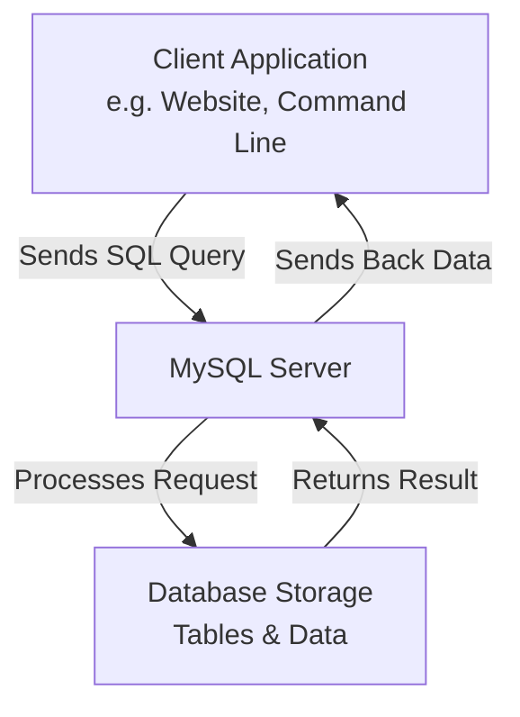

# Docker Lab - Working with dockerized database

In this lab, we will use docker to install a dockerized Mysql image and connects to the database using a shell CLI or Dbeaver (A database client).
If you take a database class before and learned a little bit MySQL database that is awesome, if you haven't that is also fine. We would not dive too deep into what the MySQL database is but
we will focus on the process of practicing the docker commands related/involved in this lab and use this lab content as a basis to extend our knowledge.

For those of you who had learned MySQL before, installing such as database is not very trivial either in Linux, Windows or Mac. In this docker lab, we will show you how easy and convinient it is.
And we will not deal with complex things like the Linux VM we encountered in the earlier few weeks.

## What is MySQL

**MySQL** is a powerful, open-source **Relational Database Management System (RDBMS)**. In simple terms, it's software that stores, organizes, and manages large amounts of data in a structured way, allowing other applications and users to retrieve and manipulate that data efficiently.

The "SQL" part stands for **Structured Query Language**, which is the standard language used to communicate with the database.

---

### The Detailed Breakdown

#### 1. It's a Relational Database (RDBMS)
This is the most important concept. MySQL organizes data into **tables**, which are made up of **rows** and **columns**, much like a spreadsheet.

*   **Table:** Represents a single entity (e.g., `Users`, `Products`, `Orders`).
*   **Column:** Defines a specific attribute or piece of data (e.g., `UserID`, `FirstName`, `Price`).
*   **Row:** A single record or entry in the table (e.g., all the information for one specific user).

The "relational" part means that tables can be linked together based on common columns. For example, an `Orders` table can have a `UserID` column that links back to the `Users` table, establishing a relationship without having to duplicate user information in the orders table.

#### 2. It Uses SQL (Structured Query Language)
You interact with MySQL by writing SQL statements (queries). Some of the most common commands are:

*   **`SELECT`**: Retrieves data from the database.
    ```sql
    SELECT first_name, email FROM Users WHERE country = 'USA';
    ```
*   **`INSERT`**: Adds new data (rows) to a table.
*   **`UPDATE`**: Modifies existing data.
*   **`DELETE`**: Removes data.
*   **`CREATE`**: Makes new tables or databases.

#### 3. It's Open-Source
This means its source code is freely available to view, use, and modify. This led to its massive popularity, especially in the early days of web development (the "LAMP stack": **L**inux, **A**pache, **M**ySQL, **P**HP/Python/Perl).

While it is open-source, it is owned and maintained by **Oracle Corporation**. Oracle offers paid commercial versions with additional features and support, but the core community version remains free.

#### 4. Key Features
*   **Reliability and Performance:** Known for being very fast, reliable, and scalable for everything from small projects to massive, data-heavy applications.
*   **Cross-Platform:** Runs on various operating systems, including Linux, Windows, and macOS.
*   **Security:** Provides robust data security with encrypted passwords and secure access control.
*   **Scalability:** Can handle a vast amount of data, powering some of the world's most visited websites (e.g., Facebook, Twitter, YouTube).
*   **Large Community:** Has a huge community of developers, which means plenty of documentation, tutorials, and third-party tools are available.

---

### How is it Used? (The Client-Server Model)

MySQL operates on a **client-server** model:

1.  **The MySQL Server:** This is the core program that runs on a physical computer (or in the cloud). Its job is to host the databases, manage the files, and execute the requests it receives.
2.  **Clients:** These are programs that connect to the server to ask for data or perform an action. A client could be:
    *   A web application (e.g., built with PHP, Python, or Node.js)
    *   A command-line tool (the `mysql` command)
    *   A graphical user interface (GUI) like MySQL Workbench or phpMyAdmin.

The client sends an **SQL query** to the server. The server processes the query and sends the result back to the client.



---

### Who Uses MySQL?

*   **Web Developers:** To store everything from user accounts and blog posts to product catalogs for dynamic websites.
*   **Large Tech Companies:** Facebook, Twitter, YouTube, and Spotify all use heavily modified versions of MySQL to manage their enormous datasets.
*   **Embedded Applications:** Used in embedded systems and software that requires a lightweight, self-contained database.
*   **Businesses:** For a wide range of applications like data warehousing, e-commerce, and logging.

---

### Popular Alternatives

While MySQL is extremely popular, it's not the only option. Key competitors include:

*   **PostgreSQL:** Another powerful open-source RDBMS known for its advanced features and strict standards compliance.
*   **Microsoft SQL Server:** A commercial RDBMS from Microsoft, tightly integrated with the Windows ecosystem.
*   **SQLite:** A lightweight, serverless database library often used in mobile apps and small desktop applications.
*   **Oracle Database:** A high-end, commercial RDBMS from the same company that owns MySQL, targeted at large enterprises.
*   **NoSQL Databases:** A different category altogether (e.g., **MongoDB**, **Redis**), which are used for unstructured data and don't use SQL as their primary language.

### Summary

| Aspect | Description |
| :--- | :--- |
| **What it is** | An open-source Relational Database Management System (RDBMS). |
| **How it works** | Stores data in related tables and uses SQL to manage it. |
| **Key Strength** | Reliability, speed, and ease of use for structured data. |
| **Primary Use** | The backbone of countless web applications and dynamic websites. |

In essence, if an application needs to remember structured information (like users, posts, or transactions), there's a very high chance it's using a database like MySQL to do it.

## Steps to Install Mysql

### Preferably the dockerized version MySQL

* Download docker image from `docker.io`

`docker pull mysql`

After you succesfully downloaded it, you can see the image has been downloaded in your harddrive, and the way we check it is like this,

```shell
xiaofengli@xiaofenglx:~/git/gs-accessing-data-mysql/complete$ docker image ls |grep mysql
mysql                                                                    latest              2c849dee4ca9   4 weeks ago     859MB
```

* Run the docker image

It actuall run a VM and gives it a name called `docker-mysql`. The root account, uid is `root` by default and the password `my-secret-pw` is set in the runtime like the one below and you can always change it. The `-d` specifies the image we downloaded and the tag. The rest of it are to set character sets which is utf8 and we can save non-English characters in it.

```shell
docker run --name docker-mysql -p 3306:3306 -e MYSQL_ROOT_PASSWORD=hello -d mysql:latest --character-set-server=utf8mb4 --collation-server=utf8mb4_unicode_ci
```

After you successfully run the image, we can see this,

```shell
xiaofengli@xiaofenglx:~/git/gs-accessing-data-mysql/complete$ docker container ls
CONTAINER ID   IMAGE          COMMAND                  CREATED          STATUS          PORTS                 NAMES
c3ba1c6a2486   mysql:latest   "docker-entrypoint.s…"   17 minutes ago   Up 17 minutes   3306/tcp, 33060/tcp   docker-mysql
```

To kill the container you can forcely do it like this,

```shell
xiaofengli@xiaofenglx:~/git/gs-accessing-data-mysql/complete$ docker container rm c3ba1c6a2486 -f
```

You would need to do this, if the container is not working properly. Normally you dont' have to deal it.

* Connect to the mysql server from hosting OS

This is to say that we have a MySQL server instance running inside of a docker VM or `running container`.

The following is to connect to it. However, this is to try to connect to it from our hosting OS like your Mac, Windows or Linux. Make sure you have `mysql` client in your hosting OS.

```shell
xiaofengli@xiaofenglx:~/git/gs-accessing-data-mysql/complete$ mysql -hlocalhost --protocol=TCP -uroot -phello
mysql: [Warning] Using a password on the command line interface can be insecure.
Welcome to the MySQL monitor.  Commands end with ; or \g.
Your MySQL connection id is 10
Server version: 9.3.0 MySQL Community Server - GPL

Copyright (c) 2000, 2025, Oracle and/or its affiliates.

Oracle is a registered trademark of Oracle Corporation and/or its
affiliates. Other names may be trademarks of their respective
owners.

Type 'help;' or '\h' for help. Type '\c' to clear the current input statement.

mysql>
```

* Connect to the mysql server from inside of the container.

First of all, we will have to `ssh` or say login to the docker container like the following,

`docker exec -it docker-mysql bash`

After you do it, you will see the following,

```shell
xiaofengli@xiaofenglx:~/git/gs-accessing-data-mysql/complete$ docker exec -it docker-mysql bash
bash-5.1# ls
afs  boot  docker-entrypoint-initdb.d  home  lib64  mnt  proc  run   srv  tmp  var
bin  dev   etc			       lib   media  opt  root  sbin  sys  usr
```

## Run the app to connect to the database

* First, let create database, user, and user permissions that is set in the springboot project,

```shell
xiaofengli@xiaofenglx:~/git/Webbertech_CMS/out/production/Webbertech_CMS$ mysql -hlocalhost --protocol=TCP -uroot -phello
mysql: [Warning] Using a password on the command line interface can be insecure.
Welcome to the MySQL monitor.  Commands end with ; or \g.
Your MySQL connection id is 11
Server version: 9.3.0 MySQL Community Server - GPL

Copyright (c) 2000, 2025, Oracle and/or its affiliates.

Oracle is a registered trademark of Oracle Corporation and/or its
affiliates. Other names may be trademarks of their respective
owners.

Type 'help;' or '\h' for help. Type '\c' to clear the current input statement.

mysql> create database db_example;
Query OK, 1 row affected (0.14 sec)

mysql> create user 'springuser'@'%' identified by 'ThePassword';
Query OK, 0 rows affected (0.13 sec)

mysql> grant all on db_example.* to 'springuser'@'%';
Query OK, 0 rows affected (0.17 sec)

mysql>
```

* After you set up data source(uid, password),
We build the springboot project like the following,

```shell
  (base) xiaofengli@xiaofenglx:~/git/Webbertech_CMS$ cd backend/
  (base) xiaofengli@xiaofenglx:~/git/Webbertech_CMS/backend$ mvnw clean package
  [INFO] Scanning for projects...
  [INFO]
  [INFO] -------------< com.example:accessing-data-mysql-complete >--------------
  [INFO] Building accessing-data-mysql-complete 0.0.1-SNAPSHOT
  [INFO] --------------------------------[ jar ]---------------------------------
  [INFO]
  [INFO] --- maven-clean-plugin:3.3.2:clean (default-clean) @ accessing-data-mysql-complete ---
  [INFO]
  [INFO] --- maven-resources-plugin:3.3.1:resources (default-resources) @ accessing-data-mysql-complete ---
  [INFO] Copying 1 resource from src/main/resources to target/classes
  [INFO] Copying 0 resource from src/main/resources to target/classes
  [INFO]
  [INFO] --- maven-compiler-plugin:3.11.0:compile (default-compile) @ accessing-data-mysql-complete ---
  [INFO] Changes detected - recompiling the module! :source
  [INFO] Compiling 6 source files with javac [debug release 17] to target/classes
  [INFO] /home/xiaofengli/git/Webbertech_CMS/backend/src/main/java/com/example/accessingdatamysql/controller/UserController.java: /home/xiaofengli/git/Webbertech_CMS/backend/src/main/java/com/example/accessingdatamysql/controller/UserController.java uses unchecked or unsafe operations.
  [INFO] /home/xiaofengli/git/Webbertech_CMS/backend/src/main/java/com/example/accessingdatamysql/controller/UserController.java: Recompile with -Xlint:unchecked for details.
  [INFO]
  [INFO] --- maven-resources-plugin:3.3.1:testResources (default-testResources) @ accessing-data-mysql-complete ---
  [INFO] skip non existing resourceDirectory /home/xiaofengli/git/Webbertech_CMS/backend/src/test/resources
  [INFO]
  [INFO] --- maven-compiler-plugin:3.11.0:testCompile (default-testCompile) @ accessing-data-mysql-complete ---
  [INFO] No sources to compile
  [INFO]
  [INFO] --- maven-surefire-plugin:3.1.2:test (default-test) @ accessing-data-mysql-complete ---
  [INFO] No tests to run.
  [INFO]
  [INFO] --- maven-jar-plugin:3.3.0:jar (default-jar) @ accessing-data-mysql-complete ---
  [INFO] Building jar: /home/xiaofengli/git/Webbertech_CMS/backend/target/accessing-data-mysql-complete-0.0.1-SNAPSHOT.jar
  [INFO]
  [INFO] --- spring-boot-maven-plugin:3.2.0:repackage (repackage) @ accessing-data-mysql-complete ---
  [INFO] Replacing main artifact /home/xiaofengli/git/Webbertech_CMS/backend/target/accessing-data-mysql-complete-0.0.1-SNAPSHOT.jar with repackaged archive, adding nested dependencies in BOOT-INF/.
  [INFO] The original artifact has been renamed to /home/xiaofengli/git/Webbertech_CMS/backend/target/accessing-data-mysql-complete-0.0.1-SNAPSHOT.jar.original
  [INFO] ------------------------------------------------------------------------
  [INFO] BUILD SUCCESS
  [INFO] ------------------------------------------------------------------------
  [INFO] Total time:  4.315 s
  [INFO] Finished at: 2025-05-18T22:19:32-04:00
  [INFO] ------------------------------------------------------------------------
```

* Next, we will run the webapp,
  
`./mvnw spring-boot:run`

In the above `mvnw` this is `maven` and there is another package manager we can use to install, build and run is `gradle.`

For more info, you should refer to the link below,

https://kevinli-webbertech.github.io/blog/html/courses/springboot/springboot_2.html

After you succesfully run the app, you will see something like this,

```shell
....
2025-05-18T22:22:04.009-04:00  INFO 29790 --- [  restartedMain] o.s.b.d.a.OptionalLiveReloadServer       : LiveReload server is running on port 35729
2025-05-18T22:22:04.023-04:00  INFO 29790 --- [  restartedMain] o.s.b.a.e.web.EndpointLinksResolver      : Exposing 1 endpoint(s) beneath base path '/actuator'
2025-05-18T22:22:04.138-04:00  INFO 29790 --- [  restartedMain] o.s.b.w.embedded.tomcat.TomcatWebServer  : Tomcat started on port 8080 (http) with context path ''
2025-05-18T22:22:04.149-04:00  INFO 29790 --- [  restartedMain] c.e.accessingdatamysql.MysqlApplication  : Started MysqlApplication in 9.526 seconds (process running for 10.214)
```

## Testing the app

After we run it, we can test the API is actually working. There are many ways it,

* Use web browser, open localhost:8080

* Use Postman
[skipped]

* Use curl

The following is a http post to add a record to the database,

```shell
xiaofengli@xiaofenglx:~/git/Webbertech_CMS/out/production/Webbertech_CMS$ curl http://localhost:8080/demo/add -d name=Firstxx -d email=someemail@someemailprovider.com
```

The next command is a http get,

```shell
xiaofengli@xiaofenglx:~/git/Webbertech_CMS/out/production/Webbertech_CMS$ curl http://localhost:8080/demo/all
  [{"id":1,"name":"First","email":"someemail@someemailprovider.com"},{"id":2,"name":"Firstxx","email":"someemail@someemailprovider.com"},{"id":3,"name":"Firstxx","email":"someemail@someemailprovider.com"}]
  
xiaofengli@xiaofenglx:~/git/Webbertech_CMS/out/production/Webbertech_CMS$
```

## ref

https://hub.docker.com/_/mysql