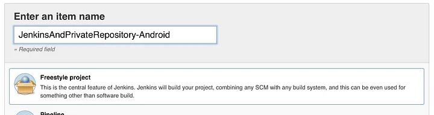
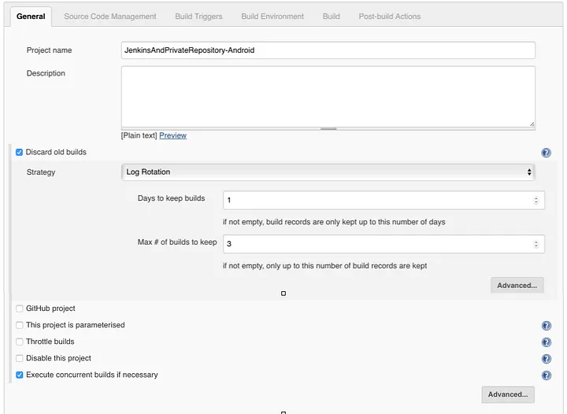
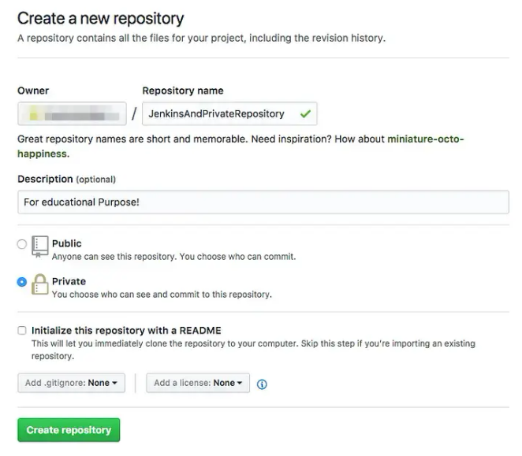
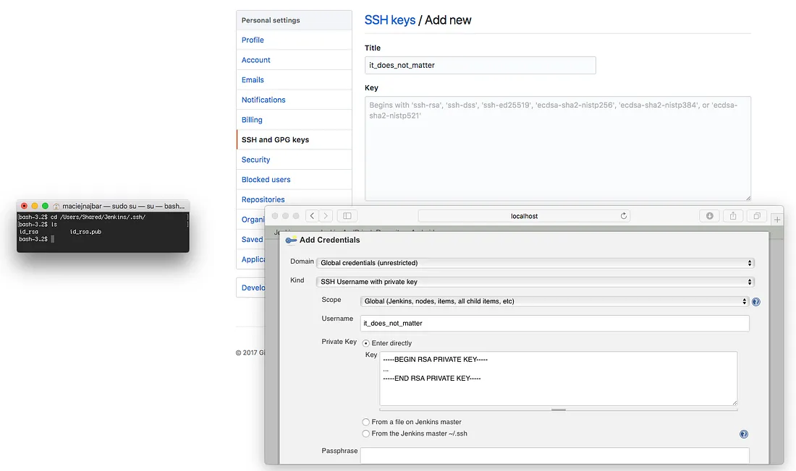
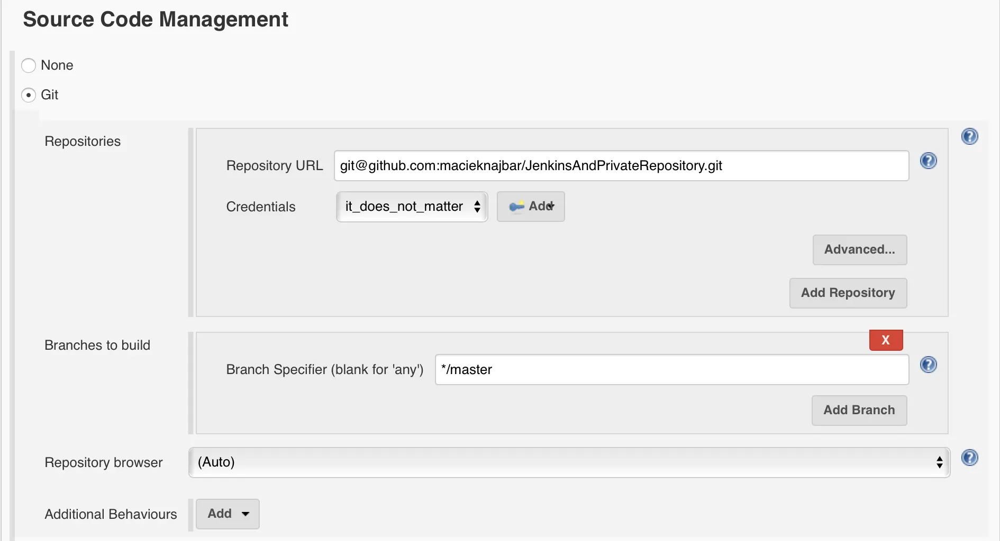
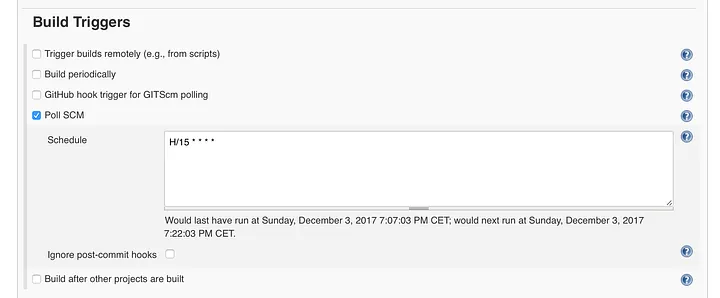

# Setup Jenkins for private GitHub repository

## Goal

This lab deals with both Jenkin configuration and private Github repository.
The goal of this lab is to learn how to configure jenkin environmental variable and create
ssh private/public key and authenticate with Github to checkout its private repo.

### Knowledge

* Private/Public key

You can find some introduction here,

- https://kevinli-webbertech.github.io/blog/html/courses/cybersecurity/public_private_key.html
- https://kevinli-webbertech.github.io/blog/html/courses/cybersecurity/mathematics.html

* Jenkin Environmental variables

* Github Configurations

## Labs

### Generate SSH private&public key

`ssh-keygen -t rsa -b 4096 -C "maciek.najbar+jenkins@gmail.com" # use your email for Jenkins GitHub account`

(Leave file name empty)

(Don't set password, just leave empty) # Jenkins is a service, and it won't be able to enter passphrase when connecting to ssh

### Create a Jenkin Repo



Next step is job configuration. Let’s set only General part. So, we need to set Jenkins to Discard old builds(experiment with your own values) and to Execute concurrent builds if necessary.



>Note: remember the following,

```commandline
 kevin@kevin-li:~$ docker exec e78a71ef7079 cat /var/jenkins_home/secrets/initialAdminPassword
61bace988c00479faead1029783c3780
```

### Create GitHub repository

Login to your daily GitHub account and create new private repository.



### Add ssh keys to Github



When generating SSH key for Jenkins user, two files were created (id_rsa and id_rsa.pub). One of them is public and the other is private. Public key goes to GitHub.

```commandline
whoami # make sure it says 'jenkins'
cd /Users/Shared/Jenkins/.ssh/
more id_rsa.pub
(copy the entire output and paste to GitHub)
```

Let’s leave the private key for now. But let’s establish connection for Jenkins to GitHub server. We need to add GitHub to known hosts. Let’s do it by simply connecting to GitHub server.

```
whoami # make sure it says 'jenkins'
ssh -T git@github.com
(And yes, you're sure you want to continue)
(Result should be a welcome message)
```

### Continue job configuration

Let’s connect Jenkins job to our repository. In job configuration go to Source Code Management section and choose Git.



In the picture you can see I have some credentials already, it’s because I created them in the previous picture. Click Add and you’ll see the same screen. Pick Kind: SSH Username with private key and type username and again, let’s go to terminal.

```commandline
more /Users/Shared/Jenkins/.ssh/id_rsa # This time private key
(space, space, space until you see the entire private key)
```

Copy entire private key as in the picture (including BEGIN and END stuff). Save and choose just created credentials (as in the last screenshot).

Go to Build Triggers and checkoff Poll SCM. Schedule it for every 15mins.

`H/15 * * * *`



When you save here and run the build, it will pass. It will connect via SSH to your repository (and that’s basically all it will do).

## Ref

- https://medium.com/facademy/setup-jenkins-for-private-repository-9060f54eeac9
