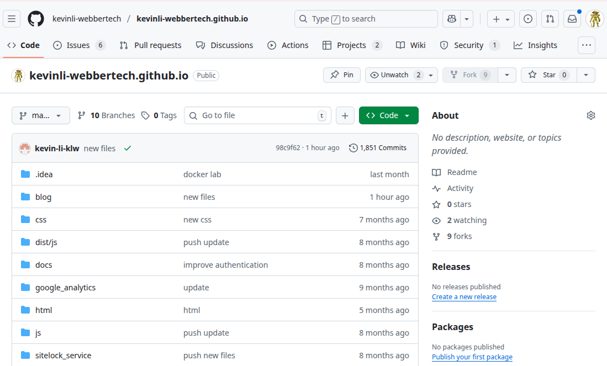

# Github Access - Authentication 

## Goal

* Add the SSH public key to the Git remote server
* Configure the developer token and save into the password manager

## **Authentication and configuration with tokens**

`git config --global credential.helper store`

Save your credentials to a file.

`git config --global user.name "your-username"`

Set your GitHub username.

## Generate Developer Token

Click your avatar, and click on "Settings",

Click the "Developer Settings",

Click "Personal access tokens",

And,

Create a classic token,

## Use Developer Token - (Recommended way)

* Use your developer token in the URL

`git remote set-url origin https://<token>@github.com/username/repo.git`

Set the remote URL with the access token for authentication.

* Store developer token with credential manager

If you want to join someone's project, that project owner has to add your github id as collaborator. Then in the project setting, the project owner will generate a token. For example, a `classic token` and send it to the collaborator. The collaborator will use the above way to set password. The id is your github username, and password is the token.
Or if this is your own repo, then you can also use the developer token and save it in the credential manager.

`git config --global credential.helper store`

Set your credentials to be stored.

`git remote set-url origin https://<token>@github.com/your_username/your_repo.git`

Use the token as the password when prompted.

* Use SSH

Generate a public key and save it to the github ssh to allow the server to know your machine information. 

`ssh-keygen -t rsa -b 4096 -C "your_email@example.com"`

Generate a new SSH key.

`ssh-add ~/.ssh/id_rsa`

Add your SSH key to the SSH agent.

`cat ~/.ssh/id_rsa.pub`

Copy your SSH public key and add it to your GitHub account.

## Trigger github.io to rebuild in the Git server

`git commit -m 'rebuild pages' --allow-empty`

`git push origin <branch_name>`

Once you commit and push the changes, your github will build,

1/ Click into one of your repo

2/ Click on the Actions

The green ones are the successfully built jobs.

