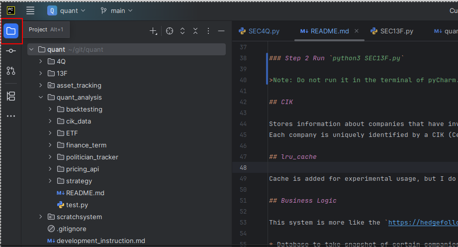
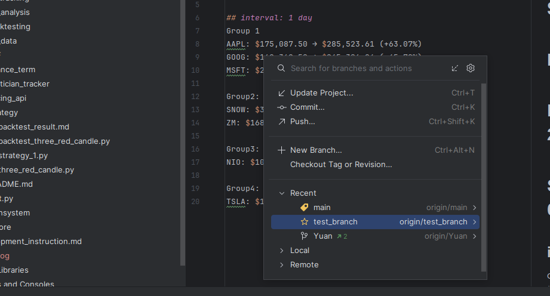
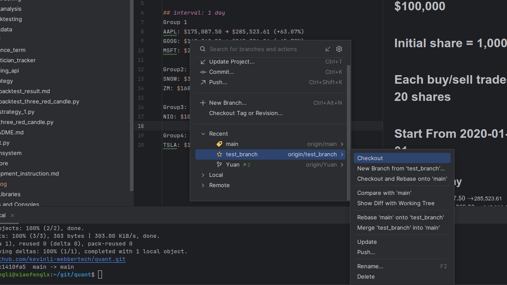
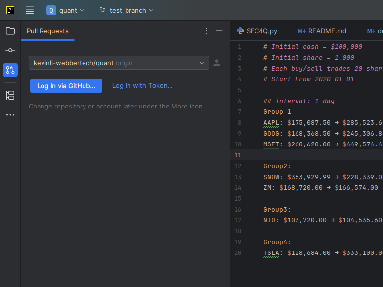

# Using Git with IntelliJ

## Intro to IntelliJ

Right-click on your project to get the contextual menu,

Then go Git>Branches or press `ctrl+shift+`` to see the following context menu. 

Then in the submenu, we select `checkout`.

## Git login (Optional)

You could login first with github, so that you can commit code,

