# Git

## Intro to Git

## Github or bitbucket

Both are code repositories and both use git commands.

## Installation

Please go to the following website to make sure you find an installer for your operating system.

https://git-scm.com/downloads

Once the installation is done, please make sure that you have `git bash` in windows and that will be a little easier to practice the git commands.

## Git Usage Example

Git commands can be handy and there are also a lot of git GUI such as in `Visual tudio Code`, `Eclipse` or `IntelliJ` which could make it even easier.

As a beginner, I think learning some git commands are extremely helpful for you to understand how it works and you can troubleshoot some difficult issues when it comes up.

### Step 1 Git Checkout from Code Repo

In this step, we would like to check out someone's code from their github. In this case, we like to checkout from here,

`git clone https://github.com/kevinli-webbertech/kevinli-webbertech.github.io.git` 


First, let us open the following link,

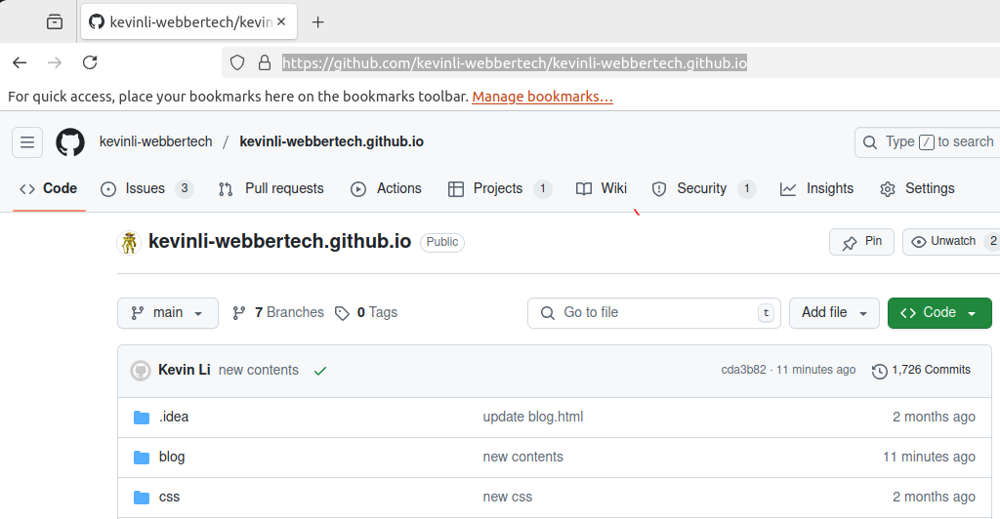

Click the "Code" green button, and we copy the path from the following image,

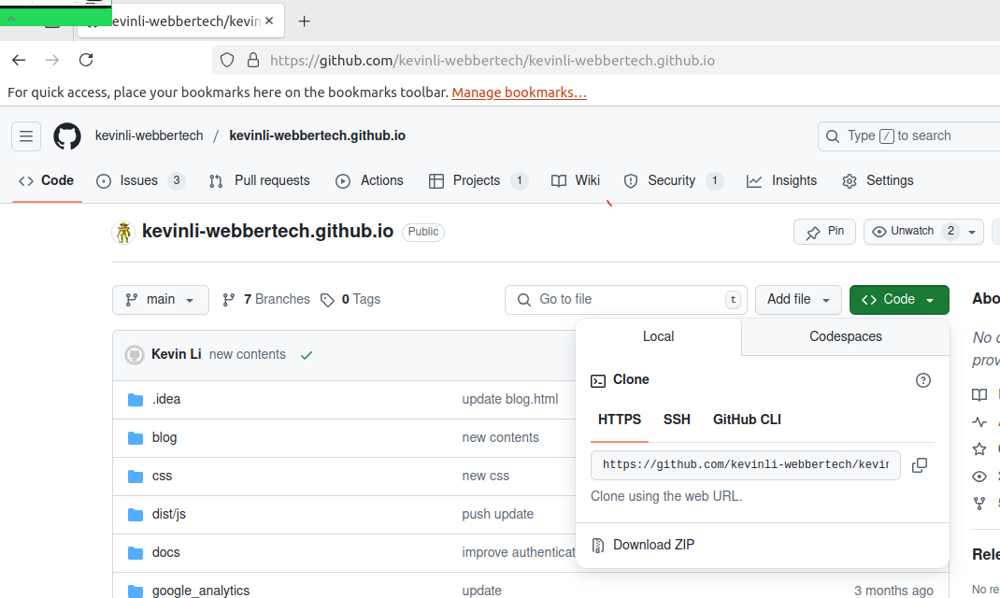

There is a copy button the right,

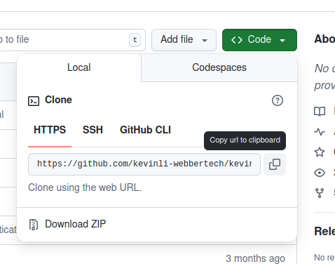

This is the url you get,

`https://github.com/kevinli-webbertech/kevinli-webbertech.github.io.git`

Open your linux shell terminal or if you are in windows, you will use the git bash which is also a linux shell terminal.

Please create directory in your home, for instance,

`~/webbertech`,

then enter into the above directory,

`cd ~/webbertech.com`

In the following image, I created the directory in `/tmp/test`, for yourself, please make a more permanent directory,
Then next, we are going to run the following command,

`git clone https://github.com/kevinli-webbertech/kevinli-webbertech.github.io.git`

Then you will see it is in progress like below,

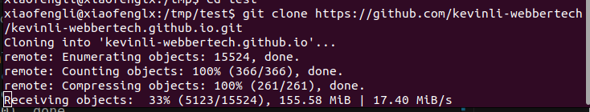

The above process checks out the code from the above repository, and we can see the process is done successfully in the image below.

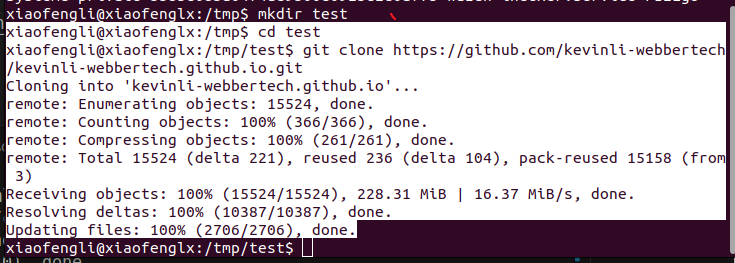

## Make your own development branch

```commandline
xiaofengli@xiaofenglx:/tmp/test$ ls
kevinli-webbertech.github.io
```

Then we cd into it and list what is in there, and we can see a lot of files. 

```commandline
xiaofengli@xiaofenglx:/tmp/test$ cd kevinli-webbertech.github.io/
xiaofengli@xiaofenglx:/tmp/test/kevinli-webbertech.github.io$ ls
blog	   Git.html	     package-lock.json	style.css
blog.html  google_analytics  push.sh		test_broken_links.sh
build.sh   html		     readme.md		test_output.txt
css	   index.html	     requirements.txt
dist	   js		     sitelock_service
docs	   package.json      start_server.sh
```

We run the following command. This is to check the current branch. The asterisk is the current branch.

```commandline
xiaofengli@xiaofenglx:/tmp/test/kevinli-webbertech.github.io$ git branch
* main
```

Now let us see what are the remote branches,

```commandline
xiaofengli@xiaofenglx:/tmp/test/kevinli-webbertech.github.io$ git branch -r
  origin/HEAD -> origin/main
  origin/create_blog_script
  origin/ft/course-load-test
  origin/ft/python-ds
  origin/lenin_lock
  origin/main
  origin/main-restored
  origin/rohini/Java
```

In this case, we need to create our own branch for development of the new contents, and we can run the following command to create a new branch off the `main` branch.

```commandline
xiaofengli@xiaofenglx:/tmp/test/kevinli-webbertech.github.io$ git checkout -b kevin_li_dev
Switched to a new branch 'kevin_li_dev'
xiaofengli@xiaofenglx:/tmp/test/kevinli-webbertech.github.io$ git branch
* kevin_li_dev
  main
```

Explanation:

* the `git checkout -b branch_name` is to create a branch.
* it would switch to the new branch automatically from wherever you were, for instance, we were on `main` branch before, and we always want to do that.
* `git branch` lists out all the branches in our local copy.

Next step is to push our new branch to the git repo.

```commandline
xiaofengli@xiaofenglx:/tmp/test/kevinli-webbertech.github.io$ git push
fatal: The current branch kevin_li_dev has no upstream branch.
To push the current branch and set the remote as upstream, use

    git push --set-upstream origin kevin_li_dev
```

Just simply type `git push` it will tell you the full command.

Next, we copy the above command and rerun it.

```commandline
xiaofengli@xiaofenglx:/tmp/test/kevinli-webbertech.github.io$ git push --set-upstream origin kevin_li_dev
Total 0 (delta 0), reused 0 (delta 0), pack-reused 0
remote: 
remote: Create a pull request for 'kevin_li_dev' on GitHub by visiting:
remote:      https://github.com/kevinli-webbertech/kevinli-webbertech.github.io/pull/new/kevin_li_dev
remote: 
To https://github.com/kevinli-webbertech/kevinli-webbertech.github.io.git
 * [new branch]      kevin_li_dev -> kevin_li_dev
Branch 'kevin_li_dev' set up to track remote branch 'kevin_li_dev' from 'origin'.
```

Now, we say that your branch is actually on the github server in kevin's repo. How do we know?

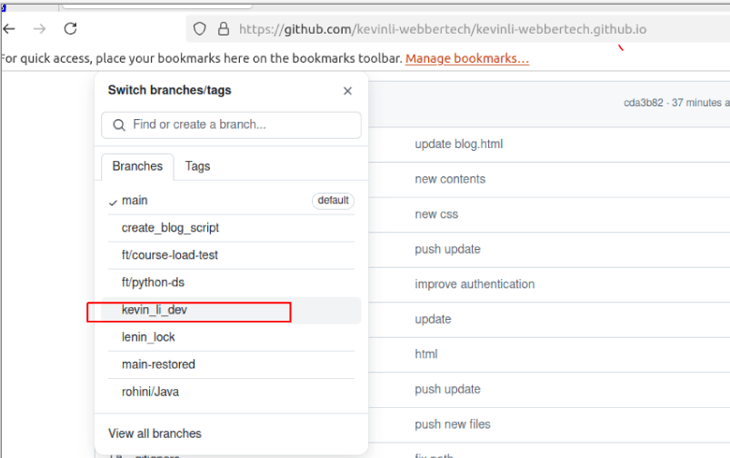

## Edit contents in your development branch

You might want to modify a file, or add a new file. Once you are done you want to push your work back to the remote branch. How do we do that?

Now in my case, I have made many changes as of now in this file. Let us check what we have changed in our branch regarding our work.

In the previous step, I checked out everything into /tmp/test/..., but I actually have two copies, the other git checkout is in the following location.

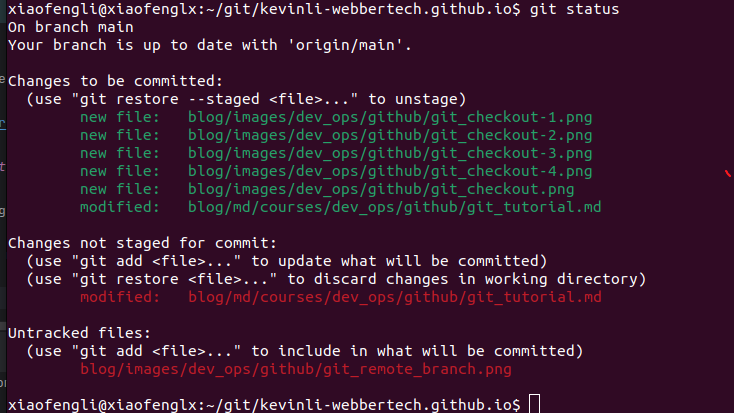

Explanation:

* The green files have been added to the batch of push.
* The red ones are called untracked.

let us add a new file of untracked(red), so that it will become a tracked (green), the following image shows you that, we add one more file,
and `git status` shows us that it becomes green.

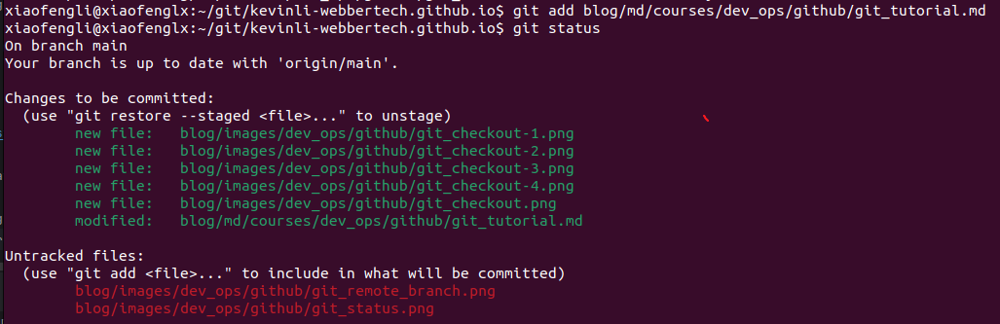

However, we still see two red pngs, and we can add a path, which is parent directories that contains those png images like the following,

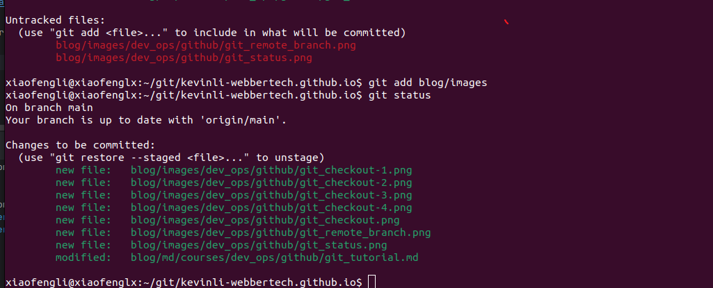

## Push all your tracked changes

Now that, we see everything we want in green, and that is a good sign, and now we want to push them to the remote git server.

* Let us do it! We will commit first.

`git commit -m "adding new files"`

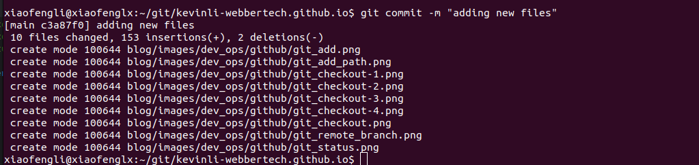

* Next is to push to the remote server

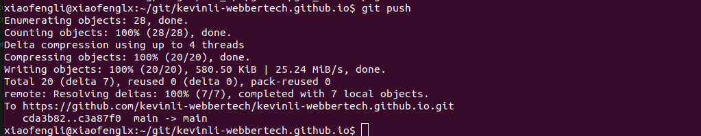

* Next we want to verify that we successfully push our contents(into our branch) to the remote server.

We can go to the website, and find out where we push. In my case, I pushed to `main` branch directly,

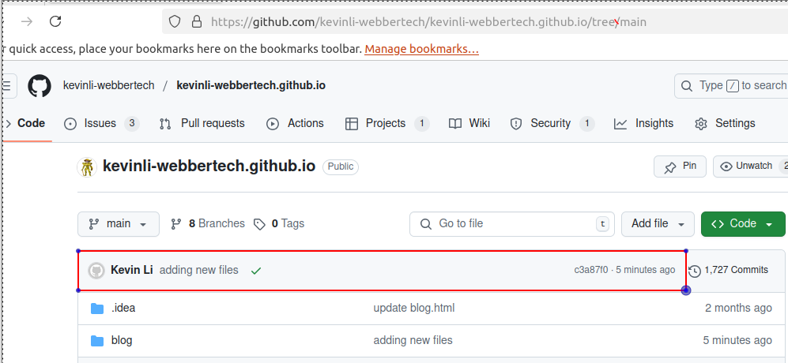

## Send a Pull Request

This is a request that you do on the webpage of github or bitbucket. What it does is to say you want to merge your branch to the destination branch, which could be any branches. In our case, it could be `main` branch.

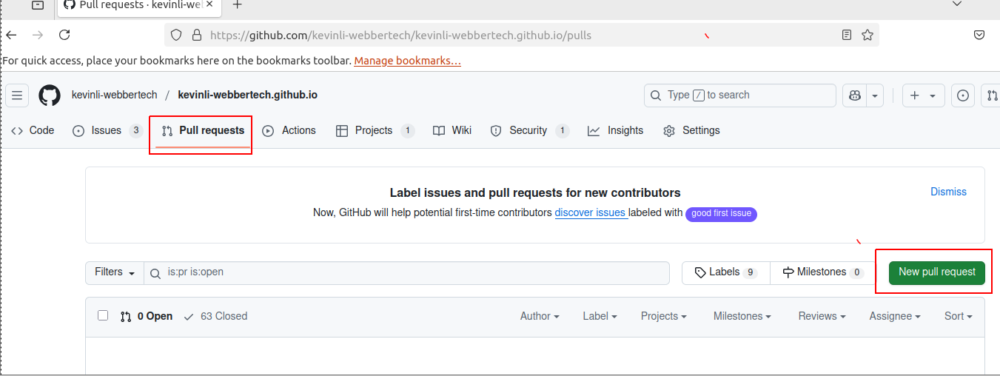
