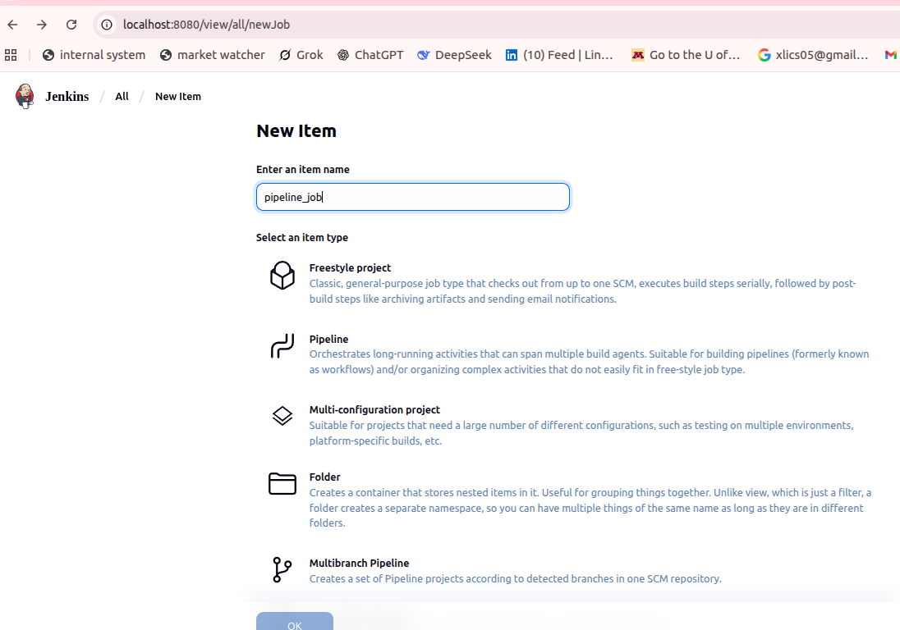
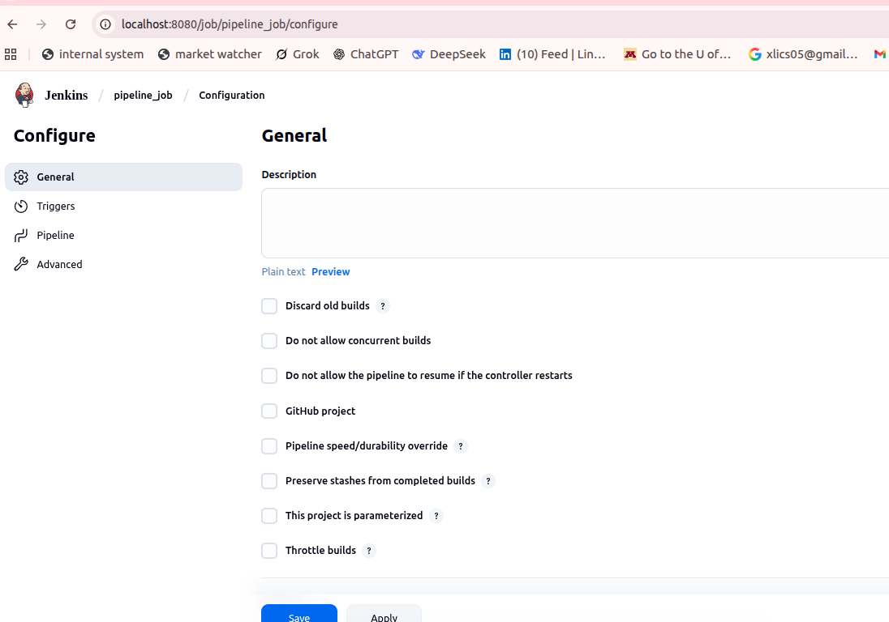
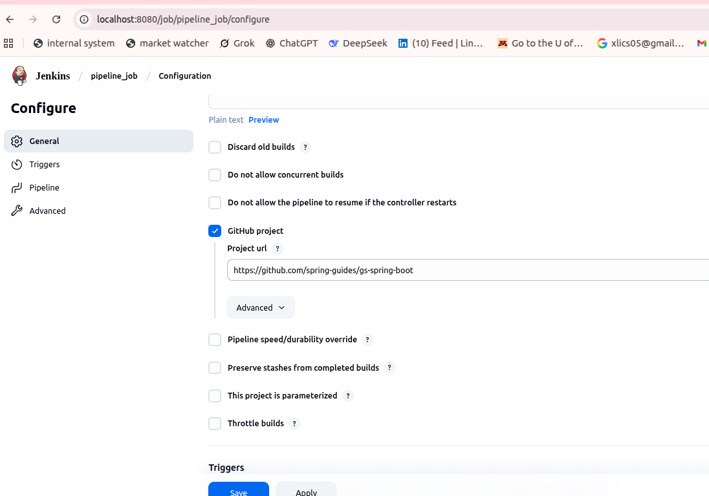
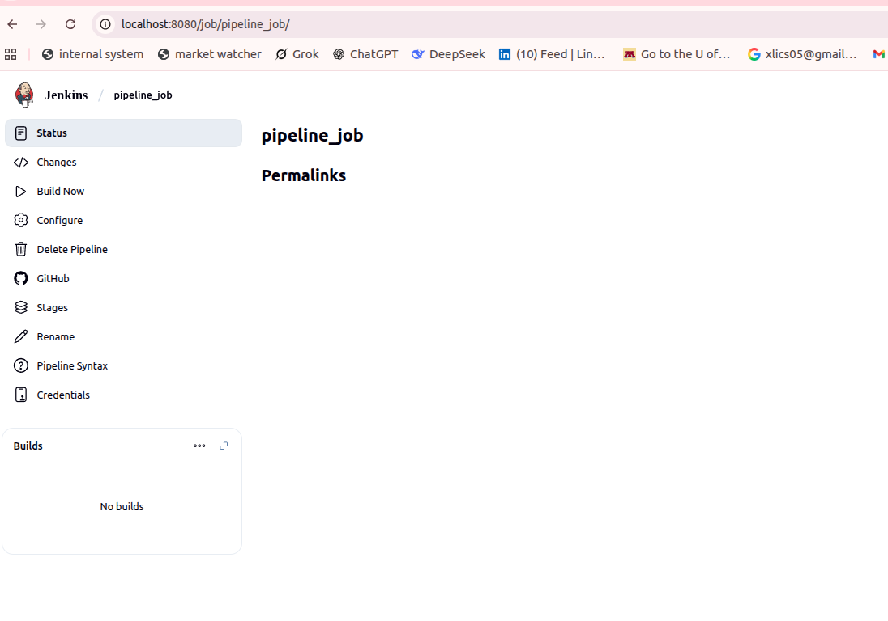
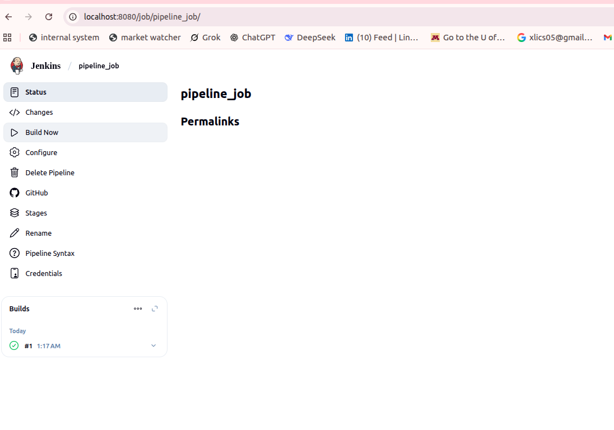
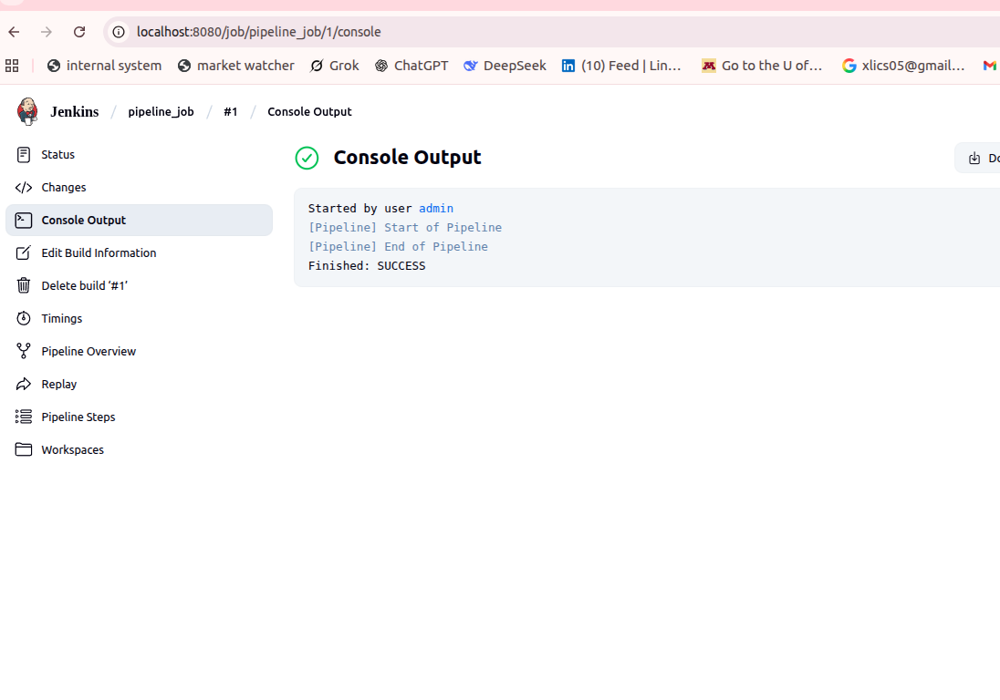
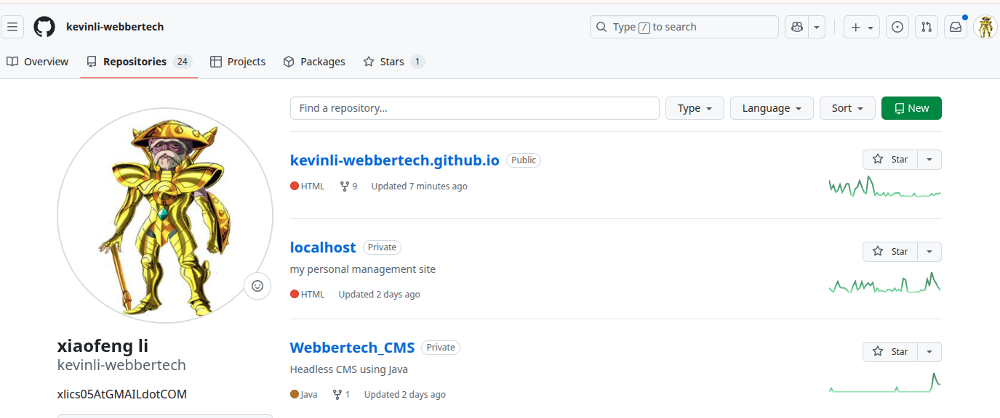

## Maven Pipeline Configuration & GitHub Integration

In this tutorial, we use a Maven-based Java project from GitHub to go from freestyle jobs to scripted pipelines.

# Step 1 Create a Jenkin Job Pipeline

First screen,



Next,



Next,



Next,



Next,



Next,



>Note: In Jenkins, a `Spring Boot Hello World` project was used as the base for creating a Pipeline job.
>GitHub Repo: <https://github.com/spring-guides/gs-spring-boot>

# Step 2 Create a Jenkinsfile

* Create a Github Project (register a github account)

1/ Click on the green `new` button,



2/ Create a new repo,


* Fork the above springboot project from https://github.com/spring-guides/gs-spring-boot

1/ First you need to checkout your own repo,

* Create a Jenkinsfile below in your project layout.

```
pipeline {
agent any

options {
    skipStagesAfterUnstable()
}

tools {
    maven ‘Maven 3.9.6’
}

stages {
    stage(‘Build’) {
        steps {
            sh ‘mvn clean compile’
        }
    }

    stage(‘Test’) {
        steps {
            sh ‘mvn test’
        }
        post {
            always {
                junit ‘target/surefire-reports/*.xml’
            }
        }
    }
    stage(‘Package’) {
        steps {
            sh ‘mvn package’
        }
    }
    stage(‘Deliver’) {
        steps {
            sh ‘./jenkins/scripts/deliver.sh’
        }
    }
}
}
```


It will successfully build the project and produced a .jar file.


## Testing, Debugging & Final Pipeline

Concentrated on incorporating automated testing into the pipeline on day three. There was already a JUnit-written test class in my Maven project. I modified the Jenkinsfile to execute `mvn test` and use the JUnit plugin to report the outcomes.


Here is the test stage I added to my Jenkinsfile:

```commandline
stage(‘Test’) {
    steps {
        sh ‘mvn test’
    }
    post {
        always {
            junit ‘target/surefire-reports/TEST-*.xml’
        }
    }
}
```

After building the pipeline, the test results were collected and displayed under my Jenkins job.


Explored test result locations, checked the contents of `target/surefire-reports`, and validated my XML and TXT outputs.

Confirmed the JUnit plugin was properly installed:


Both test cases passed, and Jenkins displayed a green success badge.

Also double-checked the status and artifacts for each pipeline build.


We are now aware of the connections between builds, tests, artifacts, and outputs. Jenkins has a lot of capability, but learning pipelines and test reporting takes effort. It’s important to consider console output rather than visual tabs for everything. Have patience; most issues are the result of small naming or syntax mistakes.

## Reflections

This three-day trip was both difficult and rewarding, as I went from being a complete newbie to using a Maven project in Jenkins to execute builds and tests.
I asked questions, made mistakes, and gained knowledge at every turn. Jenkins no longer seems so menacing.

I didn’t just learn Jenkins; I gained knowledge about DevOps workflows! Starting with code, testing automatically, and seeing results all in one tool has been eye-opening.