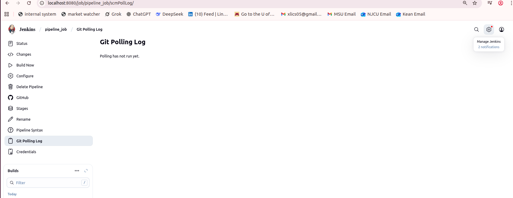
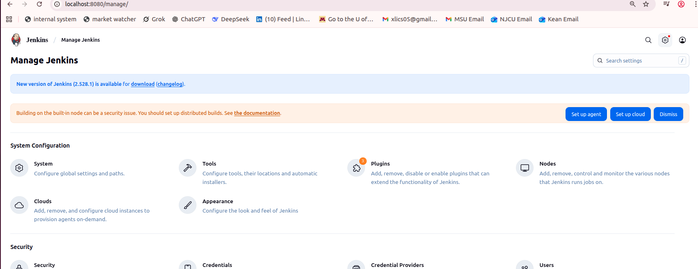
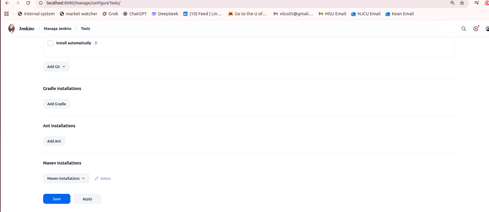
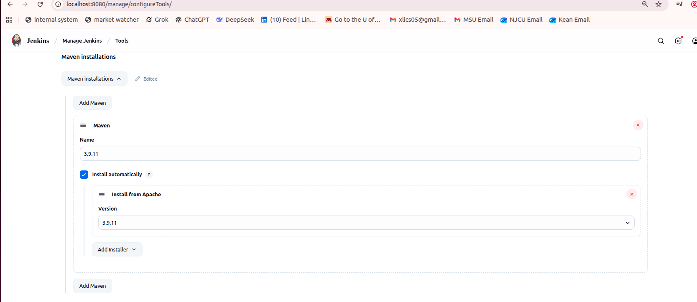
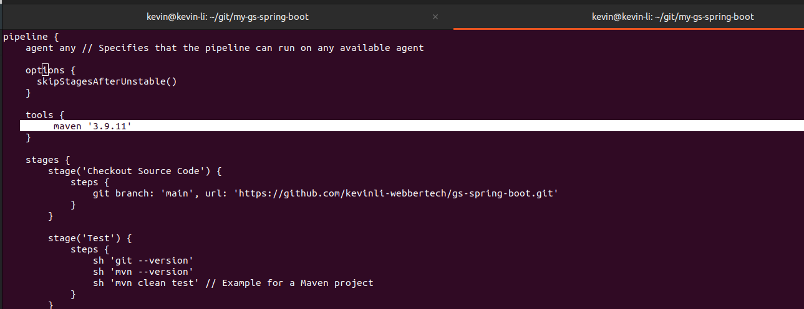
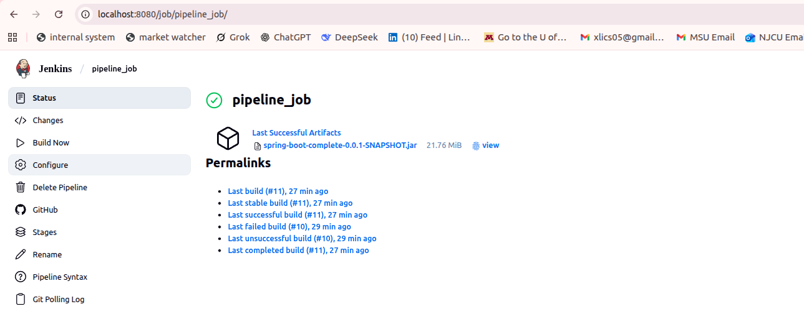
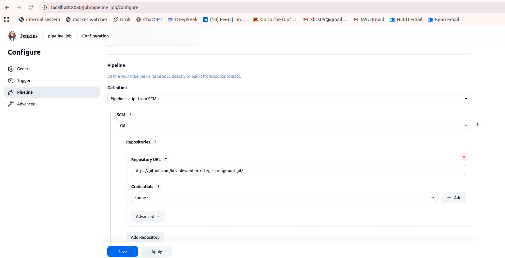
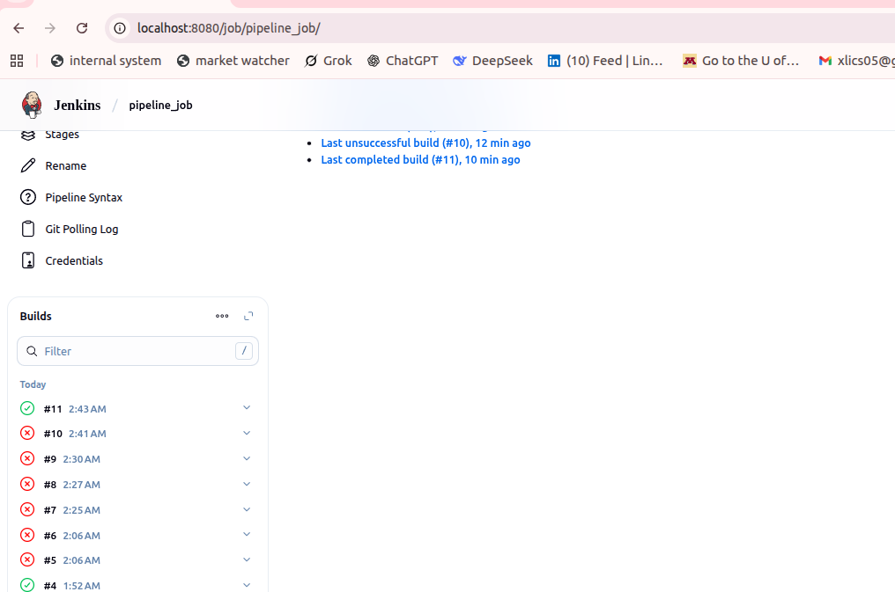
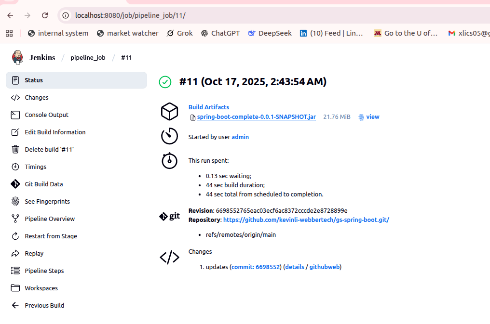

# Maven Pipeline Configuration & GitHub Integration

In this tutorial, we use a Maven-based Java project from GitHub to go from freestyle jobs to scripted pipelines.

# Step 1 Create a Jenkin Job Pipeline

First screen, let us give a name called "pipeline_job", and click the "Pipeline" as an item type,


Once it is created, click to enter into this job type. Please pay attention to the breadcrumb,


Next, click on the "Build Now", and build a job,


Next, click into the green job "#1", and click on "Console Output", this is the log.
Normally, if you job failed, it will tell you the reason, there is no need to do `docker log container_id` to view what happened.


>Note: In Jenkins, a `Spring Boot Hello World` project was used as the base for creating a Pipeline job.
>GitHub Repo: <https://github.com/spring-guides/gs-spring-boot>

## Step 2 Create a Git Repo

* Create a Github Project (register a github account)

1/ **Click on the green `new` button**


2/ **Create a new repo**


3/ **Checkout our new repo to local computer**

Next screen provides the instructions to init and checkout your new repo to your local,


Open a terminal and checkout the repo to your local with the instruction on the left hand side,


4/ Clone the `Hello World` Springboot project from https://github.com/spring-guides/gs-spring-boot

```commandline
kevin@kevin-li:~/git$ git clone https://github.com/spring-guides/gs-spring-boot.git
Cloning into 'gs-spring-boot'...
remote: Enumerating objects: 1745, done.
remote: Counting objects: 100% (41/41), done.
remote: Compressing objects: 100% (24/24), done.
remote: Total 1745 (delta 29), reused 17 (delta 17), pack-reused 1704 (from 2)
Receiving objects: 100% (1745/1745), 1.07 MiB | 4.54 MiB/s, done.
Resolving deltas: 100% (1104/1104), done.
```

5/ **Copy the `Hello World` project to our own repo**

Next, I use the following commands to copy them to my own repo, the new one I created on my own github repo. 
 
`kevin@kevin-li:~/git/gs-spring-boot/complete$ cp -rf * ~/git/my-gs-spring-boot/`

Also make sure you copy the `.mvn` directory,

`kevin@kevin-li:~/git/gs-spring-boot/complete$ cp -rf .mvn ~/git/my-gs-spring-boot/`

And make sure you have everything,

```commandline
kevin@kevin-li:~/git/my-gs-spring-boot$ ls
build.gradle  gradle  gradlew  gradlew.bat  mvnw  mvnw.cmd  pom.xml  settings.gradle  src
```

6/ *Test the Java code is ok*

Then we could test this project is ok by running the following command,

`./mvnw clean package -DskipTests`

>Note: `clean` is to remove the `target` dir, and `package` is to rebuild and generate the /target and created the jar files in it.
> `-DskipTest` is to avoid running test files, sometimes test could fail if we change the code and did not fix the related tests.
> Also running tests would take more itme.

> If you see error, please make sure you copy the `.mvn` dir in the above step.

## Create a Jenkinsfile

Make sure your file layout looks like this,

```commandline
kevin@kevin-li:~/git/my-gs-spring-boot$ tree
.
├── build.gradle
├── Dockerfile
├── gradle
│   └── wrapper
│       ├── gradle-wrapper.jar
│       └── gradle-wrapper.properties
├── gradlew
├── gradlew.bat
├── Jenkinsfile
├── mvnw
├── mvnw.cmd
├── pom.xml
├── settings.gradle
└── src
    ├── main
    │   └── java
    │       └── com
    │           └── example
    │               └── springboot
    │                   ├── Application.java
    │                   └── HelloController.java
    └── test
        └── java
            └── com
                └── example
                    └── springboot
                        ├── HelloControllerITest.java
                        └── HelloControllerTest.java

14 directories, 15 files
```

>Note: You see Jenkinsfile there already, you need to create a file like this for jenkin software to execute on this script. 
> Please follow the step below to create the Jenkinsfile. 

>Warning: Make sure you do not copy everything into this project layout, only everything inside the `complete` dir. *Everything* includes the `.mvn` directory. Please check the steps above for the `cp` commands part.

* Create a Jenkinsfile below in your project layout.

```
pipeline {
    agent any

    options {
        skipStagesAfterUnstable()
    }

    tools {
        maven '3.9.11'
    }

    stages {
        stage('Checkout Source Code') {
            steps {
                git branch: 'main', url: 'https://github.com/kevinli-webbertech/gs-spring-boot.git'
            }
        }

        stage('Test') {
            steps {
                sh 'git --version'
                sh 'mvn --version'
                sh 'mvn clean test' // Example for a Maven project
            }
        }

        stage('Build and Package') {
            steps {
                sh 'mvn clean package -DskipTests'
            }
        }

        stage('Archive Artifacts') {
            steps {
                archiveArtifacts artifacts: 'target/*.jar', fingerprint: true
            }
        }
    }

    post {
        always {
            echo 'Pipeline finished.'
        }
        success {
            echo 'Build successful!'
        }
        failure {
            echo 'Build failed!'
        }
    }
}
```

>Note: Here the most important thing in the Jenkinsfile above is the, of course, #1, the syntax, you can not have any syntax error.
> The #2 important thing is the maven version, and we will talk about that, and how to check that version in our installed Jenkin software in localhost8080.
> It is discussed in the latter part of this tutorial.

>Warning: The caveat here is that some people copy from my pdf or website to their code editor, and during this course, 
> the single quote becomes backtick and it will be considered as a syntax issue and it would not be run. You will see error when you click on the "Console and Output" of the failed jobs.

# Push your code to your Github Repo

Now that, we have everything we need, 

* An example Springboot project
* An Jenkinsfile

>We will need to learn git in detail in next module. But for now, let us try these commands to get familiarized.
> Remember the key to learn new things, to start from scratch and do not try to learn everything.

In this step, we will commit all the code to your remote git repo,

Now use the following command to see what files needs to be committed to the git repo,
The `red` color means the files are new, and not tracked by git, as least git does not know to commit them.

`git status`


Then, we run the following commands to make sure we add all the files, 

`git add *`

> "*" is a wildcards to say I want everything. If there is any hidden directory such as `.mvn` still in red, you might want to add those too.
> explicitly like `git add .mvn`

Next, run `git status` again, you will see these files turned green.

> This means all the green files would be interested by me and I would like to add them to the git reo and push them later.

And then do the following to commit these files,

`git commit  -m "initial commit"`

> Now, the `git commit ....` is really the command to let git to log to its record, and this commit will bundle all the files like in a batch job, and create a hash for it. 

Then, push them to your remote repo by running the following commands,

`git push`

> For the first time, you would need to enter username and password, please use the login credential you use to login to the github.io. 
> For more instruction on this, please refer to my link in the announcement and I will talk about it in the next session. 

## Integrate a pipeline job with Github Repo

Now you have your repo in your Github server. Imagine this Github server is your company's server,
You now want to build a job, build the Java Jar artifact from the Springboot project.


Put your Github url there,

Image 1,


Image 2,


Image 3,


Image 4,


Image 5,


Image 6,


Image 7,


### Configure the github repo in the Jenkin plugin

Click the `Manage` button on the right top corner,



Then you are going to see the following screen,



Click on `Tools`, and then scroll down to the bottom, 



Next to click on `Maven Installations`, and you will the UI looks like the following,



In this pre-built image, we already have this maven version `3.9.11` installed. But here is a caveat,
you need to make sure that 3.9.11 is filled into the `Name`, so you see above image, there are two 3.9.11.

### Double-check the maven plugin and versions in your `Jenkinsfile`

And also make sure that, this version is coded in your `Jenkinsfile` in your springboot project root layout.
For example, it should look like this,



### Jenkins_pipeline_configuration - Configure the github repo

After we created the `pipeline_job`, we will go to the `configure`, it is found on the left panel in the following image,



On your left side, make sure you click on `Pipeline` button,



In the `Definition` dropdown menu, we select `Pipeline script from SCM`,

And in the `SCM` dropdown menu, we select `Git` (see in the image above),

Then copy&paste your new repo where we put the `hello world` example of springboot project, and PLEASE MAKE SURE
your `Jenkinsfile` is in there,

Once you are done, click `Save`.

### Execute a Jenkin job

Click on `Pipeline_job` in the breadcrum,


Then click on `Build Now` on the left panel,  and it will successfully build the project and produced a .jar file.

The following `green` shows the successful jobs, and the `red` shows the failed jobs.



For instance, the Job `#11` was the one I just run, click into it, and check the `Console output`.
Normally the failed job would have some errors in it.



If your run job is `red` and failed, please click into it, and view the 'Console and Output' of the failed Job.

### Appendix 

### Default Admin Password


Retrieve the default admin password, if you lost or forgot the default hash string of password, you could retrieve it like the following,


## Troubleshooting

**Q: Password is not right.**

A: Make sure you did not install Jenkin using other ways, which is not this docker image solution.
If you download the war file or install from installer the solution is different and you have to find the related resource for that password.

For instance, some people would install from War, some installed from Windows installer and someone were using `homebrew` version, and they were
configured or preconfigured differently. For instance, the default git, and maven installed inside of that Jenkin tools. You are liable for
installing them separately which increase the complexity of this lab and scope. We would like to use the docker image for many reasons,

* In reality, most companies use docker image and it is hassle-free.
* No installation of JDK/JRE, GIT and Jenkin, no extra effort in doing some tedious work.
* No compatibility issue. In opensource product, maintenance and cost of fixing compatibility issue is a non-neglectable issue.
 This is probably the pros and cons. You paid for you get. Large corps would buy commercial support and enterprise versions for this reason.
 However, numerous tiny companies are still using opensource.

**Q: How to get password for Jenkin login of the default admin password?**

A: Many solutions, 

1/ Solution 1: if you mount the jenkins_home using `-v` option, please check or search around in the jenkin docker image page from docker.io or its own github repo readme file.
Then the password file would be mounted in your host operating system. The details are skipped here.

2/ Solution 2: you `cat` out the password file seen above in my document. If you saved it before and it does not work, then I would highly recommend you 
cat it out one more time, just in case it got changed every time.

3/ Solution 3: Delete the container and image, and rerun to fetch the image again, upon installation, it will spit out that password on the splash screen.

**Q: How to see my container and preserved my work?**

A: Normally you do not have to reinstall the Jenkin container/image, moreover, if you have configured a job pipeline, and maven configuration, you want to save it.
And you want to poke around the features later in a day. This can still save you some minutes. What you can do with docker image is that, you can stop it before you close the lid of your computer.
And you can restart the docker image, your settings should be preserved provided you saved them in Jenkins UI.

The following commands will help you find the docker image. 

```commandline
kevin@kevin-li:~/git/my-gs-spring-boot$ docker container ls
CONTAINER ID   IMAGE     COMMAND   CREATED   STATUS    PORTS     NAMES
kevin@kevin-li:~/git/my-gs-spring-boot$ docker container ls -al
CONTAINER ID   IMAGE                 COMMAND                  CREATED      STATUS                      PORTS     NAMES
e78a71ef7079   jenkins/jenkins:lts   "/usr/bin/tini -- /u…"   3 days ago   Exited (143) 39 hours ago             nice_murdock
```


